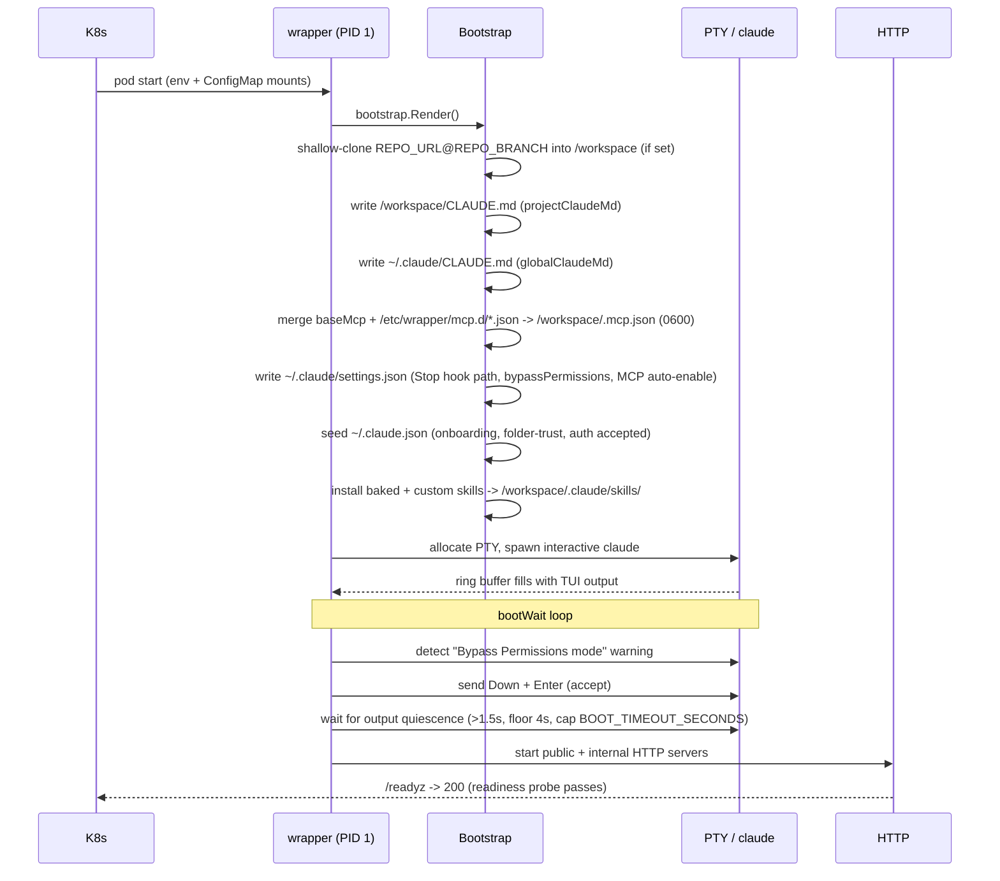
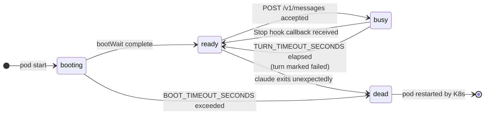

# Agent Execution

Each Task in tatara runs as a dedicated Kubernetes Pod. The pod hosts a single
Go service (`tatara-claude-code-wrapper`) that wraps one persistent, interactive
`claude` process and exposes it to the operator as a turn-based HTTP API. This
page describes the anatomy of that pod, how it boots, how turns flow through it,
and how conversation state is preserved across pod restarts.

---

## Pod anatomy

The wrapper pod has exactly one primary container (the wrapper binary, PID 1).
Optional init containers and sidecars can be injected via `Project.spec.agent`
knobs, but the core model is single-container: one Go service, one `claude`
process, one persistent conversation.

```
+----------------------------------------------------------+
|  wrapper pod (tatara-claude-code-wrapper)                |
|                                                          |
|  [PID 1: wrapper binary]                                 |
|    |                                                      |
|    +-- spawns --> [claude (interactive PTY)]              |
|    |               /workspace (git clone, edits)          |
|    |               ~/.claude/ (settings, skills)          |
|    |                                                      |
|    +-- HTTP :8080  (OIDC-gated public API)                |
|    +-- HTTP :8090  (127.0.0.1 only - Stop hook target)   |
|    +-- HTTP :8080  /healthz /readyz /metrics              |
+----------------------------------------------------------+
```

### Why PTY, not `claude -p`

`claude -p` (print/headless mode) is a divergent codepath: different system
prompt assembly, different skill loading, different hook and permission
behavior. The wrapper's design goal is to run claude in the **same harness a
human gets** - the full interactive TUI, with all skills, hooks, and tool
permissions intact. The wrapper therefore allocates a PTY
(`github.com/creack/pty`), spawns `claude` interactively, and "types" each
message in using bracketed paste. The terminal output stream is never parsed
for turn results; it is only ring-buffered for boot-dialog detection and debug
logging. Results come exclusively from the Stop hook and the on-disk transcript.

`--dangerously-skip-permissions` is also forbidden: it does not suppress boot
dialogs - it adds an extra one.

### OIDC HTTP API

All `/v1/*` endpoints require a valid OIDC JWT with audience
`tatara-claude-code-wrapper` (the issuer/realm is operator-injected via `OIDC_ISSUER`;
the homelab runs it in the `master` realm, but nothing hard-codes that). The operator
holds a `tatara-claude-code-wrapper`-audience client-credentials token and uses it for
every call. The internal loopback port (`127.0.0.1:8090`) is unreachable from outside
the pod and carries no authentication - it is the Stop hook's private channel.

| Port | Interface | Purpose |
|------|-----------|---------|
| `:8080` | pod ClusterIP | `/v1/*` public API (OIDC-gated) + `/healthz` `/readyz` `/metrics` |
| `:8090` | `127.0.0.1` only | `POST /internal/turn-complete` (Stop hook target) |

---

## Boot sequence

The wrapper boots once at pod start and progresses through a deterministic
sequence before accepting any turns.



### Step-by-step

**1. Config load.** Scalar config is read from env vars (injected via the
chart's ConfigMap `envFrom`). File-based config (CLAUDE.md content, MCP
fragments, skill archives) is read from `/etc/wrapper` mounts.

**2. Bootstrap render.** `bootstrap.Render` writes, in order:

- Repository clone: if `REPO_URL` and `REPO_BRANCH` are set, the target repo is
  shallow-cloned into `/workspace`. Pre- and post-clone lifecycle hooks fire
  around this step.
- CLAUDE.md files: `/workspace/CLAUDE.md` (project instructions, from
  `projectClaudeMd`) and `~/.claude/CLAUDE.md` (global instructions, from
  `globalClaudeMd`).
- MCP server config: `/workspace/.mcp.json` assembled by merging the baked
  `tatara-cli` memory server entry with any overlay fragments from
  `/etc/wrapper/mcp.d/*.json`. Written mode 0600.
- `~/.claude/settings.json`: wires the Stop hook binary
  (`/usr/local/bin/cc-stop-hook`), sets `permissions.defaultMode:
  bypassPermissions`, and sets `enableAllProjectMcpServers: true`.
- `~/.claude.json` (mode 0600): the no-dialog seed. Pre-populates
  `hasCompletedOnboarding` and sets `projects["/workspace"].hasTrustDialogAccepted:
  true`, suppressing the seedable interactive dialogs. In the tatara deployment the
  operator injects a **Claude subscription OAuth token** as `CLAUDE_CODE_OAUTH_TOKEN`
  (from the `oauth-token` Secret key), so claude authenticates via subscription and
  there is no "use this API key?" dialog to seed. The `customApiKeyResponses` fingerprint
  (last 20 chars of `ANTHROPIC_API_KEY`) is only written when an `ANTHROPIC_API_KEY` is
  set instead - the alternate, metered-API-key auth path.
- Skills: copies baked skills from `/templates/skills` and custom skills from
  `/etc/wrapper/skills` into `/workspace/.claude/skills/`.

**3. PTY spawn.** `session.Start` allocates a pseudo-terminal and launches
`claude` interactively with no permission flags. Three goroutines start: one
reads PTY output into a thread-safe ring buffer, one `Wait`s on the process
(to detect unexpected exits), and one runs the boot-wait logic.

**4. Boot-wait / dialog acceptance.** The "Bypass Permissions mode" warning
cannot be suppressed via the seed file - it appears on every boot. The wrapper
detects it in the ring buffer (matching with ANSI escape sequences and
whitespace stripped, because the TUI lays out words with cursor-move codes)
and accepts it by sending `Down` then `Enter`. It then waits for PTY output
quiescence - defined as no new bytes for more than 1.5 seconds, with a floor
of approximately 4 seconds, and a hard cap of `BOOT_TIMEOUT_SECONDS` (default
60). A fixed delay is insufficient: claude renders its first frame in roughly
2 seconds but continues initializing after that; submitting a turn too early
causes it to exit.

**5. HTTP servers start.** Once the session is marked `ready`, the public and
internal HTTP servers start. Until this point `/readyz` returns 503, so
Kubernetes readiness probes keep retrying without routing traffic.

!!! warning "Pod restart on unexpected exit"
    If `claude` exits for any reason other than a deliberate `DELETE
    /v1/session`, the session enters the `dead` state, `/readyz` fails, and
    Kubernetes restarts the pod. The `ccw_claude_restarts_total` counter
    increments. In-memory turn history is lost on restart; the on-disk
    transcript in `/workspace` survives if the pod uses a PVC. The last ~800
    bytes of de-ANSI'd PTY output are logged as `pty_tail` - the single most
    diagnostic field for a boot or dialog regression.

---

## Turn loop

Turns are strictly sequential. At most one turn is in flight at a time. A
second `POST /v1/messages` while a turn is running returns `409 Conflict`.

### State machine



### Turn submission (ready -> busy)

The operator calls `POST /v1/messages` with a `text` body and an optional
`callbackUrl`. The wrapper's `session.Submit`:

1. Verifies state is `ready`; returns `409` if busy, booting, or dead.
2. Creates a turn record with a unique ID (`turn-<base36 nanos>`) and state
   `running`.
3. Writes the message into the PTY using bracketed paste:
   ```
   ESC[200~  <text>  ESC[201~
   ```
4. Waits approximately 400 ms (`SubmitDelay`). A single write does not submit -
   the TUI requires a carriage return as a second write.
5. Writes `\r` to submit.
6. Sets session state to `busy`, starts the `TurnTimeout` timer, and returns
   `202 {turnId}`.

### Turn execution

Claude reads CLAUDE.md, invokes MCP tools (tatara-cli, memory server), reads
and edits files under `/workspace`. The wrapper does not observe or parse this
activity. PTY output continues to stream into the ring buffer (for debug
logging), but result extraction does not begin until the Stop hook fires.

### Stop hook (busy -> ready)

When claude ends a turn it runs `/usr/local/bin/cc-stop-hook`. This binary:

1. Reads the hook payload from stdin: `{session_id, transcript_path,
   last_assistant_message, ...}`.
2. Builds a `HookResult`: `FinalText` from `last_assistant_message`
   (authoritative), plus `Usage` and a text fallback parsed from the JSONL
   transcript's last assistant line, and `ResultJSON` if the agent wrote a
   `/workspace/result.json`.
3. POSTs the result to `http://127.0.0.1:<INTERNAL_ADDR>/internal/turn-complete`.
4. **Always exits 0.** A Stop hook must never block or alter claude's behavior.

The wrapper's `session.Complete` handler:

- Cancels the `TurnTimeout` timer (whichever fires first - timeout or complete -
  wins; the other is a no-op).
- Records `transcriptPath`, stores the completed turn result.
- Sets session state back to `ready`.
- Increments `ccw_turns_total`, records `ccw_turn_duration_seconds`.
- Fires `OnTurnDone` outside the lock.

### Result delivery

`OnTurnDone` is wired to `webhook.Deliver`. If `callbackUrl` was supplied on
the original POST (or `DEFAULT_CALLBACK_URL` is configured), the wrapper POSTs
the turn result there, retrying with exponential backoff up to `WEBHOOK_RETRIES`
(default 3). The turn result is always also retrievable by polling `GET
/v1/messages/{turnId}`, regardless of whether the webhook succeeded.

### Inactivity timeout

If the Stop hook callback does not arrive within `TURN_TIMEOUT_SECONDS`
(default 1800 seconds), the turn is marked `failed`, the timeout callback fires
(delivering the failure to `callbackUrl`), and the session returns to `ready`.
The timer/complete race is guarded: the first to fire wins.

!!! note "Interject during a running turn"
    `POST /v1/interject {text}` injects additional text into a turn that is
    already running (`busy` state). It is used by the operator to supply
    mid-turn guidance. It returns `409` if no turn is in flight.

---

## Conversation persistence

By default, each pod starts with an empty claude context. When an S3 bucket is
configured (`s3Bucket` Helm value and `s3SecretName` credentials), conversation
transcripts are persisted and resumed across pod restarts so a follow-up agent
turn continues the prior conversation.

!!! note "Off by default"
    The entire feature is gated on `S3_BUCKET` being set. With no bucket, the
    wrapper behaves identically to the unmodified path: no upload, no restore.
    Every S3 operation is best-effort - a failure logs and falls back to a fresh
    session.

### Transcript upload

After each turn completes (before the operator callback), the wrapper uploads
the current session transcript to `CONVERSATION_OBJECT_KEY` in the configured
S3 bucket. The `SessionID` is included in the callback payload so the operator
can record it on `Task.Status.SessionID`.

### Resume vs. compaction

The operator decides, at the start of each new pod for a given Task, whether to
resume the full transcript or deliver a compacted handover:

- **Full resume** (transcript replay): the operator downloads the transcript to
  `~/.claude/projects/<cwd>/<sessionID>.jsonl` and launches claude with
  `--resume <sessionID>`. The prior conversation is fully in context.
- **Compacted handover**: when the transcript has grown past
  `handoverThresholdPercent` (default 25%) of `contextWindowTokens`, replaying
  the full transcript would crowd out space for the new work. Instead, the pod
  receives the compacted handover text as the first message in an empty session.

These two modes are mutually exclusive: a given pod either resumes or starts
fresh from a handover. This ensures the context window never overflows.

### Fork isolation for brainstorm siblings

When a brainstorm Task generates multiple implementation proposals, each
proposed issue gets its own independent pod. Rather than starting cold, each
sibling pod begins from the brainstorm conversation. The operator uses S3's
copy-object API to fork the brainstorm transcript onto the sibling's own object
key (`CONVERSATION_FORK_FROM_KEY`), and the wrapper resumes from that fork. This
means brainstorm siblings diverge cleanly from the shared starting point without
sharing a live session.

### MR review pods

Every MR - including human-authored MRs - spawns a dedicated review/test agent
pod. The review pod sets `CHECKOUT_BRANCH` (the PR head) and does not set
`TASK_BRANCH`, so it works on the PR code read-only and never pushes commits.

---

## Context guard and handover

For long-running `issueLifecycle` Tasks that iterate through multiple
implement-test-fix cycles, context exhaustion is a risk. The operator implements
a context guard to detect when the agent's context is filling and orchestrate a
clean handover before it overflows.

### Detection

After each turn, the operator reads `lastTurnInputTokens` from the callback
payload. After an iteration that ends with a CI failure routing back to
Implement, the operator computes:

```
pct = (lastTurnInputTokens * 100) / contextWindowTokens
```

If `pct >= handoverThresholdPercent` (default 25%), the context guard trips.

As a defense-in-depth backstop, `lifecycleIterations >= maxLifecycleIterations`
(default 10) forces a terminal `Parked` state regardless of context level.

### Handover procedure

When the context guard trips:

1. **Handover turn**: the operator submits a final "write a handover document"
   turn to the current agent. The `handoff` skill is baked into the wrapper
   image. The agent calls `submit_handover(handover=...)`, which the operator
   stores on `Task.Status.handover`.
2. **Session reset**: the operator calls `DELETE /v1/session`, the pod exits,
   and Kubernetes restarts it.
3. **Resume from handover**: the next Implement turn for the fresh pod injects
   `Status.handover` as the first message in the new session. The fresh agent
   has the distilled context from its predecessor, not a cold start.

This design means a long-running implementation task can span multiple pod
lifetimes without losing the thread of what was accomplished and what remains.

---

## Observability

The wrapper exposes structured JSON logs (`slog`) for every state transition
and business action, tagged with `turn_id` and `duration_ms`. Prometheus
metrics on `/metrics`:

| Metric | Type | Description |
|--------|------|-------------|
| `ccw_turns_total{result}` | Counter | Turn outcomes: `complete` or `failed` |
| `ccw_turn_duration_seconds` | Histogram | End-to-end turn latency |
| `ccw_turn_in_flight` | Gauge | 0 or 1 (exactly one turn at a time) |
| `ccw_claude_restarts_total` | Counter | Unexpected claude process exits |
| `ccw_webhook_delivery_total{result}` | Counter | Callback delivery: `ok` or `dropped` |
| `ccw_hook_received_total` | Counter | Stop hook calls received |
| `ccw_turn_tokens_total{type,model,kind,repo,project}` | Counter | Token spend per type (`input`, `output`, `cache_read`, `cache_creation`) summed across all assistant messages in the turn, attributed to the Task kind, repo, and project |
| `ccw_turn_cost_usd_total{kind,repo,project}` | Counter | Cumulative turn cost in USD (emitted only when `/workspace/result.json` carries `total_cost_usd`), attributed by kind, repo, and project |
| `ccw_lifecycle_hook_total{result,hook}` | Counter | Lifecycle hook executions |
