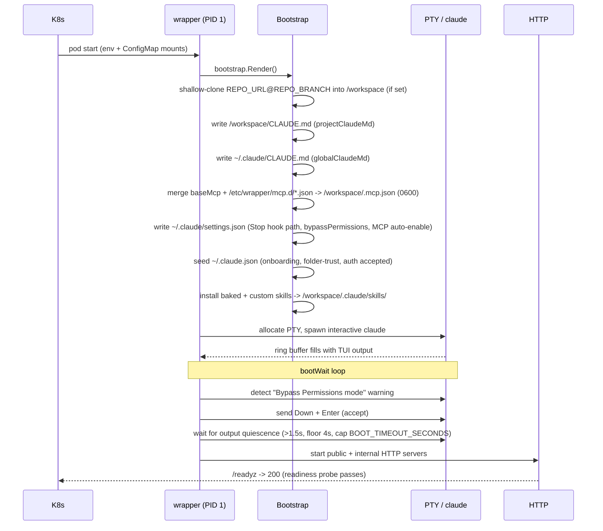
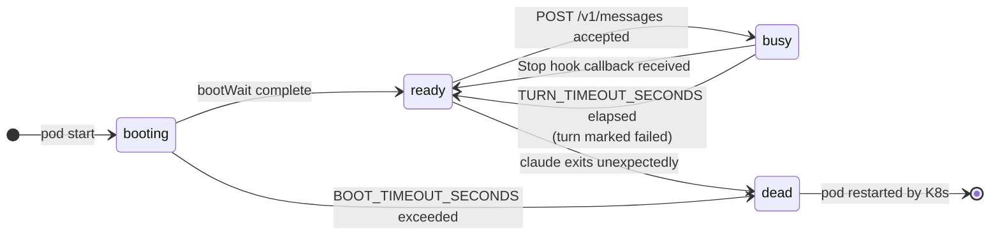

# Agent Execution

Every pod-spawning stage of a `Task` runs a dedicated Kubernetes Pod named
`<task-name>-<agent-kind>` (`status.agentKind`: `brainstorm`, `incident`, `clarify`,
`refine`, `implement`, `review`, or `documentation`). The pod hosts a single Go
service (`tatara-claude-code-wrapper`) that wraps one persistent, interactive
`claude` process and exposes it to the operator as a turn-based HTTP API.

**The Task persists; the pod does not.** A pod's life is bounded by a TTL
(`Project.spec.agentPodTTLSeconds`), and when it stops - on TTL, on a
`maxTurnsPerPod` cap, or on a crash - the Task simply gets a new pod for the same
stage, continuing from `Task.status.notes`, not from a resumed conversation. This
page describes the pod's anatomy, how it boots, how turns flow through it, and how
that handoff-and-continuity mechanism works.

---

## Pod anatomy

The wrapper pod has exactly one primary container (the wrapper binary, PID 1).
Optional init containers and sidecars can be injected via `Project.spec.agent`
knobs, but the core model is single-container: one Go service, one `claude`
process, one persistent conversation.

```
+----------------------------------------------------------+
|  wrapper pod (tatara-claude-code-wrapper)                |
|                                                          |
|  [PID 1: wrapper binary]                                 |
|    |                                                      |
|    +-- spawns --> [claude (interactive PTY)]              |
|    |               /workspace (git clone, edits)          |
|    |               ~/.claude/ (settings, skills)          |
|    |                                                      |
|    +-- HTTP :8080  (OIDC-gated public API)                |
|    +-- HTTP :8090  (127.0.0.1 only - Stop hook target)   |
|    +-- HTTP :8080  /healthz /readyz /metrics              |
+----------------------------------------------------------+
```

### Why PTY, not `claude -p`

`claude -p` (print/headless mode) is a divergent codepath: different system
prompt assembly, different skill loading, different hook and permission
behavior. The wrapper's design goal is to run claude in the **same harness a
human gets** - the full interactive TUI, with all skills, hooks, and tool
permissions intact. The wrapper therefore allocates a PTY
(`github.com/creack/pty`), spawns `claude` interactively, and "types" each
message in using bracketed paste. The terminal output stream is never parsed
for turn results; it is only ring-buffered for boot-dialog detection and debug
logging. Results come exclusively from the Stop hook and the on-disk transcript.

`--dangerously-skip-permissions` is also forbidden: it does not suppress boot
dialogs - it adds an extra one.

### OIDC HTTP API

All `/v1/*` endpoints require a valid OIDC JWT with audience
`tatara-claude-code-wrapper` (the issuer/realm is operator-injected via `OIDC_ISSUER`;
the homelab runs it in the `master` realm, but nothing hard-codes that). The operator
holds a `tatara-claude-code-wrapper`-audience client-credentials token and uses it for
every call. The internal loopback port (`127.0.0.1:8090`) is unreachable from outside
the pod and carries no authentication - it is the Stop hook's private channel.

| Port | Interface | Purpose |
|------|-----------|---------|
| `:8080` | pod ClusterIP | `/v1/*` public API (OIDC-gated) + `/healthz` `/readyz` `/metrics` |
| `:8090` | `127.0.0.1` only | `POST /internal/turn-complete` (Stop hook target) |

The operator is the only client of the public API. The full endpoint surface:

| Method + path | Request | Response |
|---|---|---|
| `POST /v1/messages` | `{"text":"...","callbackUrl":"...","handoff":false}` | `202 {"turnId":"..."}`; `409` turn in flight; `410 Gone` past the pod's TTL deadline |
| `GET /v1/messages/{turnID}` | - | `200 turn.Record` |
| `GET /v1/messages` | - | `200 [turn.Summary]` |
| `GET /v1/session` | - | `200` - the six existing fields, plus `contractVersion` |
| `DELETE /v1/session` | - | `204` (the TTL stop path) |
| `GET /v1/transcript` | - | `200` |

`POST /v1/interject` is **deleted**, not merely deprecated - it was live in the
pre-redesign wrapper. It let the operator inject text into a turn that was already
running (`busy` state). It is gone because it raced the Stop hook and the transcript
tailer: mid-turn PTY injection is exactly the kind of concurrent write into a live
`claude` session the redesign forbids. There is no replacement mid-turn channel;
guidance for the next turn goes in the next `POST /v1/messages`, or - past the pod's
TTL - in the one `handoff:true` turn described below.

---

## Boot sequence

The wrapper boots once at pod start and progresses through a deterministic
sequence before accepting any turns.



### Step-by-step

**1. Config load.** Scalar config is read from env vars (injected via the
chart's ConfigMap `envFrom`). File-based config (CLAUDE.md content, MCP
fragments, skill archives) is read from `/etc/wrapper` mounts.

**2. Bootstrap render.** `bootstrap.Render` writes, in order:

- Repository clone: if `REPO_URL` and `REPO_BRANCH` are set, the target repo is
  shallow-cloned into `/workspace`. Pre- and post-clone lifecycle hooks fire
  around this step.
- CLAUDE.md files: `/workspace/CLAUDE.md` (project instructions, from
  `projectClaudeMd`) and `~/.claude/CLAUDE.md` (global instructions, from
  `globalClaudeMd`).
- MCP server config: `/workspace/.mcp.json` assembled by merging the baked
  `tatara-cli` memory server entry with any overlay fragments from
  `/etc/wrapper/mcp.d/*.json`. Written mode 0600.
- `~/.claude/settings.json`: wires the Stop hook binary
  (`/usr/local/bin/cc-stop-hook`), sets `permissions.defaultMode:
  bypassPermissions`, and sets `enableAllProjectMcpServers: true`.
- `~/.claude.json` (mode 0600): the no-dialog seed. Pre-populates
  `hasCompletedOnboarding` and sets `projects["/workspace"].hasTrustDialogAccepted:
  true`, suppressing the seedable interactive dialogs. In the tatara deployment the
  operator injects a **Claude subscription OAuth token** as `CLAUDE_CODE_OAUTH_TOKEN`
  (from the `oauth-token` Secret key), so claude authenticates via subscription and
  there is no "use this API key?" dialog to seed. The `customApiKeyResponses` fingerprint
  (last 20 chars of `ANTHROPIC_API_KEY`) is only written when an `ANTHROPIC_API_KEY` is
  set instead - the alternate, metered-API-key auth path.
- Skills: copies baked skills from `/templates/skills` and custom skills from
  `/etc/wrapper/skills` into `/workspace/.claude/skills/`.

**3. PTY spawn.** `session.Start` allocates a pseudo-terminal and launches
`claude` interactively with no permission flags. Three goroutines start: one
reads PTY output into a thread-safe ring buffer, one `Wait`s on the process
(to detect unexpected exits), and one runs the boot-wait logic.

**4. Boot-wait / dialog acceptance.** The "Bypass Permissions mode" warning
cannot be suppressed via the seed file - it appears on every boot. The wrapper
detects it in the ring buffer (matching with ANSI escape sequences and
whitespace stripped, because the TUI lays out words with cursor-move codes)
and accepts it by sending `Down` then `Enter`. It then waits for PTY output
quiescence - defined as no new bytes for more than 1.5 seconds, with a floor
of approximately 4 seconds, and a hard cap of `BOOT_TIMEOUT_SECONDS` (default
60). A fixed delay is insufficient: claude renders its first frame in roughly
2 seconds but continues initializing after that; submitting a turn too early
causes it to exit.

**5. HTTP servers start.** Once the session is marked `ready`, the public and
internal HTTP servers start. Until this point `/readyz` returns 503, so
Kubernetes readiness probes keep retrying without routing traffic.

!!! warning "Pod restart on unexpected exit"
    If `claude` exits for any reason other than a deliberate `DELETE
    /v1/session`, the session enters the `dead` state, `/readyz` fails, and
    Kubernetes restarts the pod. The `ccw_claude_restarts_total` counter
    increments. In-memory turn history is lost on restart; the on-disk
    transcript in `/workspace` survives if the pod uses a PVC. The last ~800
    bytes of de-ANSI'd PTY output are logged as `pty_tail` - the single most
    diagnostic field for a boot or dialog regression.

---

## Turn loop

Turns are strictly sequential. At most one turn is in flight at a time. A
second `POST /v1/messages` while a turn is running returns `409 Conflict`.

### State machine



### Turn submission (ready -> busy)

The operator calls `POST /v1/messages` with a `text` body, an optional
`callbackUrl`, and a `handoff` bool. `handoff` matters only past the pod's TTL
deadline `t0` (see [Pod TTL](#pod-ttl-the-stop-sequence) below): before `t0` it is
treated as an ordinary turn, and past `t0` it admits exactly one further turn -
the handoff-note turn - after which every further normal turn 410s. The wrapper's
`session.Submit`:

1. Verifies state is `ready`; returns `409` if busy, booting, or dead. Past `t0`,
   a non-handoff turn returns `410 Gone` instead.
2. Creates a turn record with a unique ID (`turn-<base36 nanos>`) and state
   `running`.
3. Writes the message into the PTY using bracketed paste:
   ```
   ESC[200~  <text>  ESC[201~
   ```
4. Waits approximately 400 ms (`SubmitDelay`). A single write does not submit -
   the TUI requires a carriage return as a second write.
5. Writes `\r` to submit.
6. Sets session state to `busy`, starts the `TurnTimeout` timer, and returns
   `202 {turnId}`.

### Turn execution

Claude reads CLAUDE.md, invokes MCP tools (tatara-cli, memory server), reads
and edits files under `/workspace`. The wrapper does not observe or parse this
activity. PTY output continues to stream into the ring buffer (for debug
logging), but result extraction does not begin until the Stop hook fires.

### Stop hook (busy -> ready)

When claude ends a turn it runs `/usr/local/bin/cc-stop-hook`. This binary:

1. Reads the hook payload from stdin: `{session_id, transcript_path,
   last_assistant_message, ...}`.
2. Builds a `HookResult`: `FinalText` from `last_assistant_message`
   (authoritative), plus `Usage` and a text fallback parsed from the JSONL
   transcript's last assistant line, and `ResultJSON` if the agent wrote a
   `/workspace/result.json`.
3. POSTs the result to `http://127.0.0.1:<INTERNAL_ADDR>/internal/turn-complete`.
4. **Always exits 0.** A Stop hook must never block or alter claude's behavior.

The wrapper's `session.Complete` handler:

- Cancels the `TurnTimeout` timer (whichever fires first - timeout or complete -
  wins; the other is a no-op).
- Records `transcriptPath`, stores the completed turn result.
- Sets session state back to `ready`.
- Increments `ccw_turns_total`, records `ccw_turn_duration_seconds`.
- Fires `OnTurnDone` outside the lock.

### Result delivery

`OnTurnDone` is wired to `webhook.Deliver`. If `callbackUrl` was supplied on
the original POST (or `DEFAULT_CALLBACK_URL` is configured), the wrapper POSTs
the turn result there, retrying with exponential backoff up to `WEBHOOK_RETRIES`
(default 3). The turn result is always also retrievable by polling `GET
/v1/messages/{turnId}`, regardless of whether the webhook succeeded.

### Inactivity timeout

If the Stop hook callback does not arrive within `TURN_TIMEOUT_SECONDS`
(default 1800 seconds), the turn is marked `failed`, the timeout callback fires
(delivering the failure to `callbackUrl`), and the session returns to `ready`.
The timer/complete race is guarded: the first to fire wins.

---

## Pod TTL: the stop sequence

There is no session-resume mode: `--resume`, a stored session ID
(`CONVERSATION_SESSION_ID`), a stored S3 transcript object key
(`CONVERSATION_OBJECT_KEY`), and a fork-from-conversation key
(`HANDOFF_KEY`) are all deleted. <!-- stale-ok: CONVERSATION_SESSION_ID, CONVERSATION_OBJECT_KEY, HANDOFF_KEY -->
Every pod's turn-0 gets an identical context bundle, rendered fresh by the
operator from current CR state (the Issue, the MergeRequest, comments, events,
notes - escaped and XML-ish, delivered as the `text` of the first
`POST /v1/messages`). The bundle **is** the continuation state; there is nothing
else to resume.

A pod's own lifetime is bounded by a TTL, independent of the Task's stage
deadline (see [Task Stages](../reference/task-stages.md#the-deadline-invariant)
for the stage-level clocks). Both a wall-clock TTL and a per-pod turn cap
(`maxTurnsPerPod`, default 40, the `implement` agent kind exempt) drive the same
stop sequence, anchored at:

```
t0 = podStartedAt + agentPodTTLSeconds
```

1. **Stop admitting normal turns.** Past `t0` the wrapper refuses any
   `POST /v1/messages` with `handoff:false` with `410 Gone`. It still accepts
   exactly one turn with `handoff:true`.
2. **Wait for the in-flight turn.** A pod is mid-turn at TTL expiry essentially
   always, and `POST /v1/messages` already 409s while a turn is running - so the
   handoff turn cannot simply be submitted immediately. The operator waits for
   the in-flight turn's callback, bounded by `turnTimeoutSeconds`.
3. **Submit the one handoff turn:**
   ```
   POST /v1/messages {"text": "Your pod is being stopped. Call
        task_note(kind=handoff) with everything the next pod needs, then
        stop.", "callbackUrl": ..., "handoff": true}
   ```
   bounded by `turnTimeoutSeconds`.
4. **Hard cap at `t0 + 2*turnTimeoutSeconds + 60s` grace.** On that cap, or on
   any `410`/`409`/5xx from the handoff turn, the operator writes a synthetic
   note in-process instead - `agent: "operator"`, `kind: "handoff"`,
   summarizing the last turn's final text and which repos were pushed - and
   force-deletes the pod (`DELETE /v1/session` is the same stop path when the
   pod is still reachable).

`Task.status.notes` is therefore **never** empty after a TTL stop: either the
agent wrote its own handoff note, or the operator wrote a synthetic one. The pod
slot frees, `stats.podRecreations` increments if the stage did not change, and
the Task's next pod for that stage picks up the journal at turn 0.

## Task continuity: the notes journal

`Task.status.notes` is an append-only journal every pod reads at turn 0 - Go-side
capped at 50 entries, oldest entries spilled to `tatara-memory` beyond that (see
[Memory Architecture](memory-architecture.md#task-continuity-spill)) and readable
back through the `task_context(notes=all)` MCP tool. It is the only thing that
carries forward between pods of the same Task; there is no live session to
reconnect to.

One consequence: a brainstorm Task's proposals each become their own new
`clarify` Task (one per proposal), each starting cold at its own turn 0 with its
own context bundle - not a forked live conversation. Continuity for a sibling
comes from what the operator renders into its bundle from the originating
Issue/Task state, not from a shared session.

## Agent-pod environment contract

The operator injects a fixed set of env vars into every agent pod. `TATARA_KIND`,
`TATARA_TOOL_PROFILE`, and `TATARA_SKILL_PROFILE` all carry the **agent kind**
(`status.agentKind`) - the pod that is running right now, not the Task's origin
`spec.kind`. This is a deliberate, load-bearing change from the pre-redesign
contract, where these carried the Task's origin kind.

| env | value | change |
|---|---|---|
| `TATARA_TASK` | Task CR name | unchanged |
| `TATARA_PROJECT` | Project CR name | unchanged |
| `TATARA_KIND` | agent kind (`status.agentKind`) | changed semantics |
| `TATARA_TOOL_PROFILE` | agent kind (7 values) | changed key |
| `TATARA_SKILL_PROFILE` | agent kind (7 values) | changed key |
| `TATARA_REPO` | Repository CR name; empty except on `documentation` Tasks | narrowed |
| `TASK_BRANCH` | `task/<task-name>` | unchanged form |
| `TATARA_OPERATOR_URL` / `TATARA_MEMORY_URL` | operator / memory service endpoints | unchanged |
| `AGENT_POD_TTL_SECONDS` | `Project.spec.agentPodTTLSeconds` | new |
| `TATARA_CONTRACT_VERSION` | `2` | new |

!!! warning "The tool-profile rekey is a day-one fleet wedge if missed"
    Both the operator's and `tatara-cli`'s `kindProfiles` maps are keyed on the
    agent kind now, not the old Task-origin kind. The map fails **closed** on an
    unknown key: a pod whose kind is absent from the map gets only the always-on
    tool set and no `submit_outcome` registered. A `clarify` pod mapped under its
    old key, for example, would wedge on day one with no terminal tool at all.

Two env vars are removed outright, not merely deprecated: `TATARA_CHAT_URL` (the chat service is archived/decommissioned; the inter-agent chat room that used to exist is gone, and continuity is the notes journal above, not a chat room) and the whole resume-mode triplet `HANDOFF_KEY` / `CONVERSATION_SESSION_ID` / `CONVERSATION_OBJECT_KEY`. <!-- stale-ok: TATARA_CHAT_URL, tatara-chat, chat room, HANDOFF_KEY, CONVERSATION_SESSION_ID, CONVERSATION_OBJECT_KEY -->

## The contract-version handshake

The wrapper image and the operator image ship in **different** Helm releases
(`tatara-claude-code-wrapper` vs `tatara-operator`), applied concurrently by
`tatara-helmfile`. A moment where a new operator pairs with an old agent image -
old `tatara-cli`, no `submit_outcome`, every new endpoint 404ing - is therefore
reachable, and would otherwise silently burn a pod's entire turn budget producing
nothing, repeated across every Task in flight. Three defenses, all mandatory:

1. The operator injects `TATARA_CONTRACT_VERSION=2` into every agent pod (above).
2. `tatara-cli`'s MCP server refuses to start if `TATARA_CONTRACT_VERSION` is set
   and does not match its own compiled contract version - a fatal exit. An
   *unset* value (a workstation, a test) is allowed through, which then simply
   has no MCP server at all - loud, not silent.
3. The operator reads `GET /v1/session`'s `contractVersion` field at pod-ready
   and asserts it **before** submitting turn-0. On a mismatch, or on a response
   with no `contractVersion` field at all (an old wrapper):

   ```
   Task.status.stage       = failed
   Task.status.stageReason = agent-contract-mismatch
   metric:                   operator_agent_contract_mismatch_total{expected,got,image}
   ```

   The Task fails instantly, before a single turn is submitted - zero tokens
   burned. Any nonzero rate of this metric is a critical alert.

---

## Observability

The wrapper exposes structured JSON logs (`slog`) for every state transition
and business action, tagged with `turn_id` and `duration_ms`. Prometheus
metrics on `/metrics`:

| Metric | Type | Description |
|--------|------|-------------|
| `ccw_turns_total{result}` | Counter | Turn outcomes: `complete` or `failed` |
| `ccw_turn_duration_seconds` | Histogram | End-to-end turn latency |
| `ccw_turn_in_flight` | Gauge | 0 or 1 (exactly one turn at a time) |
| `ccw_claude_restarts_total` | Counter | Unexpected claude process exits |
| `ccw_webhook_delivery_total{result}` | Counter | Callback delivery: `ok` or `dropped` |
| `ccw_hook_received_total` | Counter | Stop hook calls received |
| `ccw_turn_tokens_total{type,model,kind,repo,project}` | Counter | Token spend per type (`input`, `output`, `cache_read`, `cache_creation`) summed across all assistant messages in the turn, attributed to the Task kind, repo, and project |
| `ccw_turn_cost_usd_total{kind,repo,project}` | Counter | Cumulative turn cost in USD (emitted only when `/workspace/result.json` carries `total_cost_usd`), attributed by kind, repo, and project |
| `ccw_lifecycle_hook_total{result,hook}` | Counter | Lifecycle hook executions |
