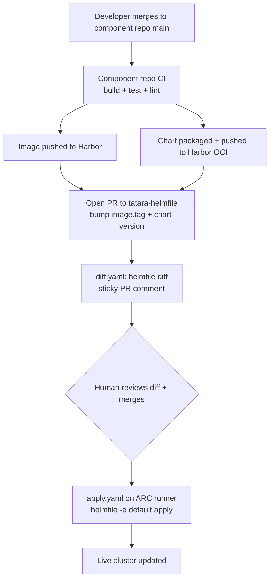

# CI/CD & Deploy Model

Tatara enforces a strict GitOps-only deploy model. No component is ever deployed by running `helm upgrade`, `kubectl set image`, or `kubectl apply` by hand. Every deploy is auditable, reversible, and runs through a CI pipeline.

## The deploy chain



## Two-change rule

Every deploy requires two changes to `tatara-helmfile`:

1. **Chart version** in `helmfile.yaml.gotmpl` (format: `0.0.0-g<shortSHA>`)
2. **Image tag** in `values/tatara-operator/common.yaml` (format: bare short SHA)

Both must point to the same `main` commit SHA. A chart-only bump leaves the old image running. An image-only bump fails because the chart version won't match the published chart in Harbor.

!!! warning "Keep chart pins recent"
    Harbor retains only a bounded number of chart tags. A pin pointing to a chart published months ago fails `helmfile apply` with "chart not found". Always track main HEAD.

## Component CI

Component repos build via per-repo CI triggered by GitHub webhook on push to `main` or PR. `tatara-argo-workflows` was decommissioned (2026-07-05); it was homelab GitLab CI, never part of the tatara platform runtime. The in-cluster `argo-workflows` Helm release remains as separate, unrelated homelab infrastructure.

**Image build:** rootless `buildkitd` on a Ceph PVC (durable). TCP probes (not exec probes) on the buildkitd Service. Single-arch builds for the homelab cluster.

**Chart packaging:** `helm package --version 0.0.0-g<shortSHA>` then `helm push` to Harbor OCI. The `g` prefix is required because Helm semver validation rejects pre-release segments starting with a digit (e.g. `0707870` is invalid; `g0707870` is valid).

## ARC runner

The `tatara-helmfile apply.yaml` workflow runs on an in-cluster Argo CD ARC scale set. The runner SA has `cluster-admin` binding (bounded to the tatara namespace). It has no KUBECONFIG - it uses the in-cluster ServiceAccount token directly.

**Runner failure modes:**
- A stale `AutoscalingListener` (deleted ERS ref) crash-loops and queues jobs forever. Fix: delete the stale `AutoscalingListener`.
- Control-plane-pinned runners: a flapping control-plane node evicts in-flight jobs at a uniform ~18 min mark (appears as "operation was canceled" across all concurrent jobs).

## tatara-project chart for enrollment CRs

`Project` and `Repository` CRs are managed by the `tatara-project` Helm chart rather than raw presync manifests. This keeps enrollment CRs under Helm ownership:

- `helm diff` shows CR changes before apply
- `helm rollback` reverts enrollment changes
- Clean ownership metadata on the CRs

The `project-tatara` and `project-infrastructure` releases use `needs: [tatara-operator]` so CRDs exist before CR application.

## Why live patches are forbidden

`kubectl set image` or `kubectl patch` bypasses:

- The diff review step (no human sees the change before it lands)
- The rollback-on-failure safety net (`helmDefaults.rollbackOnFailure: true`)
- The git audit trail

**Exception:** incident response. A `kubectl patch` is permitted to unblock a down service, but it must be immediately re-asserted through a tatara-helmfile PR so live state matches the repo. Never use live patches as a deploy path.

## CRD upgrade

CRDs are bundled in `charts/tatara-operator/templates/crds.yaml` and applied by `helm upgrade`. Pre-existing CRDs need a one-time ownership annotation before the chart can adopt them:

```bash
kubectl annotate crd projects.tatara.dev \
  meta.helm.sh/release-name=tatara-operator \
  meta.helm.sh/release-namespace=tatara \
  --overwrite
kubectl label crd projects.tatara.dev \
  app.kubernetes.io/managed-by=Helm \
  --overwrite
```

## Rollback

`helmDefaults.rollbackOnFailure: true` in `helmfile.yaml.gotmpl` instructs Helm to roll back all releases on any apply failure. This is automatic; no manual intervention is needed on a bad deploy.

Manual rollback:
```bash
helm rollback tatara-operator -n tatara  # roll back to previous revision
helmfile -e default diff               # verify the rollback matches expectation
```
