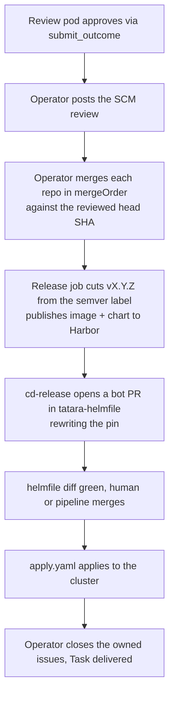

# CI/CD & Deploy Model

Tatara enforces a strict GitOps-only deploy model. No component is ever deployed by running `helm upgrade`, `kubectl set image`, or `kubectl apply` by hand. Every deploy is a git-recorded semver release that a pipeline applies.

What has changed is **who merges the component PR**. The forge does not merge it on a green check. The **operator** merges it: once, deliberately, against the exact head SHA a review agent approved, one repo at a time in `Task.spec.mergeOrder`. Nothing on the forge is armed to merge a tatara-opened PR, and no MCP tool exposes merge to an agent. The full sequence, including the head-moved path, is in [Merge and deploy](../workflows/merge-and-deploy.md#the-merge-sequence).

Past the merge, the pipeline is unchanged and author-agnostic: merging to a component repo's `main` cuts a version tag, publishes the image and charts under that version, and propagates the bump into `tatara-helmfile`, which applies it to the cluster.

## The deploy chain



The operator merge is the platform's only gate on the component PR. Downstream of it, the `tatara-helmfile` pin-bump PR is an ordinary CI-authored PR governed by that repo's own branch rules: `diff.yaml` posts a sticky `helmfile diff` comment for auditability, and the PR lands either by a human or by the repo's own pipeline. The operator neither opens nor merges it.

## Semver release and the version label

The release is driven by a `semver:{major|minor|patch}` label on the merged component PR. `release.yml` reads that label, cuts the next tag off `main`, and refuses to tag if no `semver:` label is present. The tag drives both the published image tag and the chart version.

The level itself is **implement-owned**: it comes from the implementing agent's `submit_outcome(change_significance=...)`, and a review outcome may only escalate it, never lower it. A human sets the equivalent by hand-labelling their own PR. See [semver push-CD](../workflows/merge-and-deploy.md#semver-push-cd).

A single release publishes, for the operator:

- **Image** `harbor.szymonrichert.pl/containers/tatara-operator:vX.Y.Z`. The per-commit `:SHORT_SHA` traceability image is pushed separately by the shared CI job on every commit; the release job publishes only `:vX.Y.Z`. Harbor's `containers` project has tag immutability, so a tag is published exactly once.
- **Charts** `tatara-operator` and `tatara-project`, both versioned as the bare semver `X.Y.Z` (no `v`, no SHA). The version bump into `tatara-helmfile` is gated on BOTH charts publishing, so a partial publish (operator chart up, `tatara-project` chart missing) can never ship a half release into the helmfile.

!!! warning "Never re-run a green release job"
    Tag mode is not idempotent. Re-running a release job that already cut and pushed its tag does not converge, it collides. A wedged release is recovered forward, by cutting the next version.

## Version pins in tatara-helmfile

The operator's deploy pin in `tatara-helmfile` is the **chart version** in `helmfile.yaml.gotmpl` - bare semver, e.g. `version: 0.15.0`. There is no separate operator image tag pin. `values/tatara-operator/common.yaml` carries no `image.tag` override, so the chart's `templates/deployment.yaml` renders `image: "{{ .Values.image.repository }}:{{ .Values.image.tag | default .Chart.AppVersion }}"` and the running image tag rides the chart's `.Chart.AppVersion`. Bumping the chart version moves the chart and its image together. The `cd-release` bot rewrites this pin in the version-bump PR.

Never hand-edit a deploy pin. A pin edited by hand is a pin the next bump will overwrite, and it is invisible to the release that is supposed to own it.

!!! warning "Keep chart pins recent"
    Harbor retains a bounded number of chart tags. A pin pointing to a chart version that has since been garbage-collected fails `helmfile apply` with "chart not found". The pipeline keeps pins current automatically; hand-authored pins should track a live released version.

## Component CI

Component repos build via per-repo CI triggered by GitHub webhook on push to `main` or PR. `tatara-argo-workflows` was decommissioned (2026-07-05); it was homelab GitLab CI, never part of the tatara platform runtime. The in-cluster `argo-workflows` Helm release remains as separate, unrelated homelab infrastructure.

**Image build:** rootless `buildkitd` on a Ceph PVC (durable). TCP probes (not exec probes) on the buildkitd Service. Single-arch builds for the homelab cluster.

**Chart packaging:** release charts are packaged with the bare semver version (`helm package --version X.Y.Z`) and `helm push`ed to Harbor OCI. Any SHA-suffixed pre-release chart version must use a `g` prefix (e.g. `0.0.0-g0707870`) because Helm's semver validation rejects a pre-release segment that starts with a digit; a bare `0.0.0-0707870` is invalid.

Harbor chart tags are immutable too, same as image tags. If the tag `cut tag` computes has already been published (e.g. the git tag sequence was realigned below an already-released chart version), `helm push` fails with `412 precondition: '<chart>:<version>' configured as immutable`. `release.yml` treats that specific error as a benign no-op - immutability guarantees the existing artifact is identical - and continues to the `tatara-helmfile` version-bump step rather than hard-failing the release and wedging the chain. Any other push failure (auth, network) still fails the release.

## ARC runner

The `tatara-helmfile` `apply.yaml` and `diff.yaml` workflows run on an in-cluster GitHub Actions Runner Controller (ARC, `actions-runner-controller`) scale set (`runs-on: arc-runner-tatara-helmfile`). ARC is the GitHub self-hosted runner autoscaler; it is unrelated to Argo CD. The runner ServiceAccount has a `cluster-admin` binding (bounded to the tatara namespace). It has no KUBECONFIG - it uses the in-cluster ServiceAccount token directly.

**Runner failure modes:**

- A stale `AutoscalingListener` (deleted ERS ref) crash-loops and queues jobs forever. Fix: delete the stale `AutoscalingListener`.
- Control-plane-pinned runners: a flapping control-plane node evicts in-flight jobs at a uniform ~18 min mark (appears as "operation was canceled" across all concurrent jobs).

Applies are serialized by a non-cancelling concurrency group (`tatara-helmfile-apply`), so coalesced pin bumps queue rather than racing; at most one `helmfile apply` is in flight.

## tatara-project chart for enrollment CRs

`Project` and `Repository` CRs are managed by the `tatara-project` Helm chart rather than raw presync manifests. This keeps enrollment CRs under Helm ownership:

- `helm diff` shows CR changes before apply
- `helm rollback` reverts enrollment changes
- Clean ownership metadata on the CRs

The `project-tatara` and `project-infrastructure` releases use `needs: [tatara-operator]` so CRDs exist before CR application. The `tatara-project` chart is versioned and pinned in lockstep with `tatara-operator` (same `X.Y.Z`), so the CRs a release renders always match the operator's CRDs.

## Why live patches are forbidden

`kubectl set image` or `kubectl patch` bypasses:

- The diff review step (no sticky diff is posted before the change lands)
- The rollback-on-failure safety net (`helmDefaults.rollbackOnFailure: true`)
- The git audit trail

It also leaves an orphan field-manager on a helm-managed resource, which then blocks helm's server-side apply on the next release.

**Exception:** incident response. A `kubectl patch` is permitted to unblock a down service, but it must be immediately re-asserted through a `tatara-helmfile` PR so live state matches the repo. Never use live patches as a deploy path.

## CRD upgrade

CRDs are bundled in `charts/tatara-operator/templates/crds.yaml` and applied by `helm upgrade`. Pre-existing CRDs need a one-time ownership annotation before the chart can adopt them:

```bash
kubectl annotate crd projects.tatara.dev \
  meta.helm.sh/release-name=tatara-operator \
  meta.helm.sh/release-namespace=tatara \
  --overwrite
kubectl label crd projects.tatara.dev \
  app.kubernetes.io/managed-by=Helm \
  --overwrite
```

## Rollback

`helmDefaults.rollbackOnFailure: true` in `helmfile.yaml.gotmpl` instructs Helm to roll back all releases on any apply failure. This is automatic; no manual intervention is needed on a bad deploy.

Manual rollback is a revert of the version-bump commit in `tatara-helmfile` (which the pipeline re-applies), or, for a live emergency:

```bash
helm rollback tatara-operator -n tatara  # roll back to previous revision
helmfile -e default diff                 # verify live state; then re-assert via a tatara-helmfile PR
```
