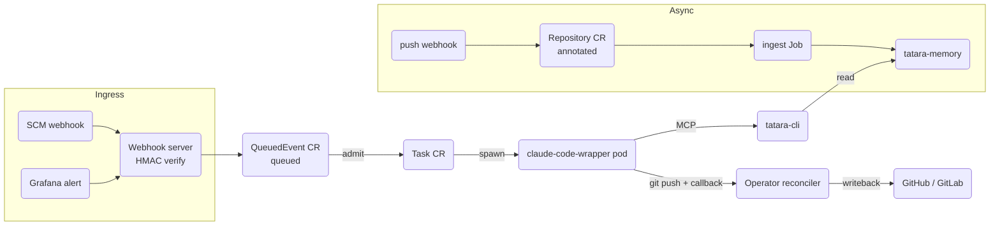
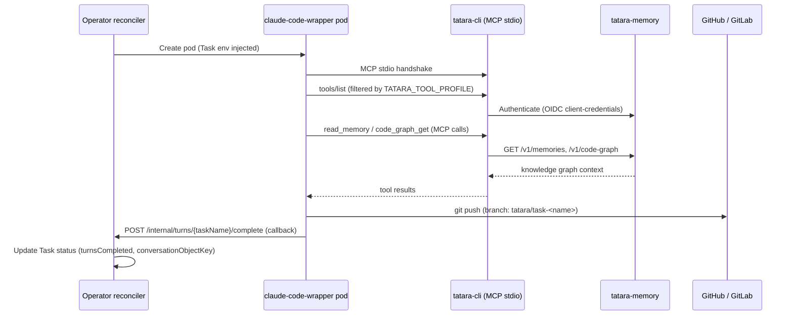
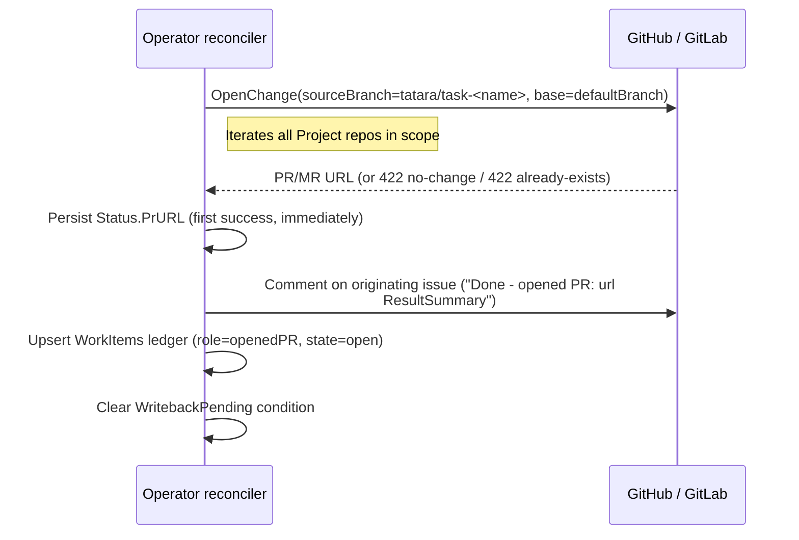
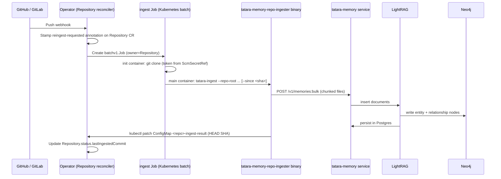

# Data & Control Flow

This page traces the life of a single SCM event from the moment it arrives at the
operator's webhook endpoint to a merged pull/merge request in the source repository.
A second, independent path - the async memory ingest pipeline - runs in parallel
and keeps the knowledge graph fresh.

---

## Overview



---

## 1. Ingress - from SCM event to QueuedEvent

The operator exposes two webhook routes on a shared HTTP listener:

| Route | Source | Auth |
|---|---|---|
| `POST /operator/webhooks/{project}` | GitHub or GitLab | HMAC-SHA256 over request body |
| `POST /operator/webhooks/{project}/grafana` | Grafana Alertmanager | Bearer token, constant-time compare |

### SCM webhook processing

1. **Body read** - capped at 5 MiB; oversized payloads are rejected `413`.
2. **Provider detection** - header inspection selects the GitHub or GitLab parser.
   A mismatched provider (e.g. a GitHub delivery to a GitLab-configured Project) returns `400`
   before any signature work.
3. **HMAC verification** - the `webhookSecret` key is read from the `spec.scmSecretRef` Secret.
   The signature is verified with `crypto/subtle.ConstantTimeCompare`; failure returns `401`.
4. **Event routing** - the parsed `WebhookEvent.Kind` field selects the handler:

| Kind | Handler |
|---|---|
| `push` | stamps `tatara.dev/reingest-requested` annotation on the matching Repository |
| `issue` or `mr` (not a comment) | [admission path](#2-admission-queuedevent-to-task-cr) |
| `issue_comment` / note | re-activate or interject on an existing Task |
| anything else | `202 Accepted`, ignored |

#### Reporter intake gate

Before a webhook event can create a Task the operator applies two security checks:

- **Provider mismatch guard** - rejects deliveries routed to the wrong SCM provider.
- **Reporter allowlist** - `issueLifecycle` tasks and issue comments are only
  processed when the event author appears in `spec.allowedReporters` (Project-level)
  or the Repository-level override. An empty allowlist is open (default).

!!! note "Bot comment suppression"
    Comments authored by `spec.scm.botLogin` are silently discarded at the intake
    gate to prevent self-trigger loops. The check uses `ev.ActorLogin` (the event
    sender), not the issue author.

### Grafana alert processing

Grafana delivers a JSON alert payload via bearer token. The handler:

1. Verifies the bearer token against `spec.grafana.secretRef`.
2. Ignores non-`firing` alerts (e.g. `resolved`).
3. Computes a **group hash** from the alert labels - this is the dedup key.
4. Creates a `QueuedEvent` with `class=alert` and `kind=incident`.

---

## 2. Admission - QueuedEvent to Task CR

### The QueuedEvent buffer

A `QueuedEvent` CR is the durable, ordered buffer between the webhook handler and
the Task controller. The webhook handler calls `queue.EnqueueEvent` which:

1. Checks for an existing non-terminal `QueuedEvent` or `Task` with the same `dedupKey`
   label. If one exists, the call returns `created=false` and the webhook responds `202`.
2. Allocates the next monotonic sequence number from a per-Project ConfigMap (CAS
   operation so any operator replica is safe to call this).
3. Creates the `QueuedEvent` CR in `state=Queued`, owned by the Project.

```yaml
# Example QueuedEvent fields
spec:
  seq: 42                     # monotonic, Project-scoped
  class: normal               # or "alert" for incidents
  kind: issueLifecycle        # same as the resulting Task kind
  projectRef: my-project
  repositoryRef: tatara-cli   # empty for project-scoped kinds
  dedupKey: "owner/repo#17"   # raw; stored as sha256-truncated label value
  payload:
    kind: issueLifecycle
    goal: "..."
    source:
      provider: github
      issueRef: "owner/repo#17"
      isPR: false
      number: 17
status:
  state: Queued               # -> Admitted when a slot opens
```

### Dedup key design

| Task kind | Dedup key |
|---|---|
| `issueLifecycle` (issue) | `SHA256(projectName + issueRef + "0")[:16]`, used as deterministic Task name (`lc-<hex16>`) |
| `issueLifecycle` (bot PR closing #N) | Same hash for issue #N, not the PR, so a bot MR and its linked issue share one slot |
| `review` | None - multiple review Tasks per PR are intentional |
| `incident` | Alert group hash (from Grafana `commonLabels`) |
| `brainstorm`, cron kinds | Caller-supplied key (e.g. `brainstorm-<project>`) |

### Queue classes and capacity gating

The dispatcher runs as part of the operator reconcile loop and admits events
in FIFO sequence order within each class:

- **normal** class: up to `spec.queue.capacity` concurrent admitted events
  (default tracks `maxConcurrentTasks`; minimum 3).
- **alert** class: a separate reserved pool (`spec.queue.alertCapacity`, default 1).
  Alert slots are never consumed by normal events, so an incident Task is admitted
  even when the normal queue is saturated.

Once a slot is available, the dispatcher calls `queue.BuildTaskFromQueuedEvent` to
reconstruct the Task from the payload verbatim, then creates the Task CR. The
`QueuedEvent` is GC-deleted when the Task reaches a terminal state (it is never
transitioned to `Done` - the reconciler deletes it directly).

---

## 3. Execution - agent turn loop

### Pod lifecycle

The Task reconciler spawns a `tatara-claude-code-wrapper` Pod when the Task
transitions to `Phase=Running`. The Pod:

- Receives the Task context via environment variables (`TASK_KIND`, `TASK_GOAL`,
  `TASK_BRANCH`, `OPERATOR_PUSH_URL`, etc.).
- Optionally receives conversation replay pointers (`CONVERSATION_OBJECT_KEY`,
  `CONVERSATION_SESSION_ID`) when S3 conversation persistence is configured.
- Runs `claude --mcp-server tatara-cli` as the main process; `tatara-cli` acts as
  the local MCP server.



### MCP tool surface

`tatara-cli` exposes different tool profiles depending on the Task kind:

| Profile (TATARA_TOOL_PROFILE) | Task kinds | Approximate tool count |
|---|---|---|
| `brainstorm` | brainstorm, healthCheck | ~45 tools |
| `lifecycle` | issueLifecycle (non-implement phases) | ~50 tools |
| `implement` | issueLifecycle (Implement/MRCI), implement | ~60 tools |
| `incident` | incident | ~55 tools |
| `review` | review | ~40 tools |
| `full` | default / unset | ~63 tools |

The profile is set by the operator in the Pod environment; `tatara-cli` filters
`tools/list` responses accordingly and fails open (returns all tools) when the
profile is unrecognized.

### Comment interjections

If a human posts a comment on the linked issue while a turn is in flight, the
webhook handler appends the comment body to `Task.status.pendingInterjections`
(capped at 20 entries). The reconciler injects each queued interjection into the
live wrapper session as mid-session user input, then clears the field.

### Conversation persistence

When `s3Bucket` is configured in the operator Helm values, the wrapper persists the
full Claude conversation transcript to S3 after each turn. The operator records
`Status.ConversationObjectKey` and `Status.SessionID` from the turn-complete callback
and replays them to the next pod. Handover policy:

- Below `handoverThresholdPercent` (default 25%) of the context window: the pod
  resumes the full transcript (`claude --resume <sessionID>`).
- At or above the threshold: the pod starts fresh with a compacted text handover,
  never exceeding the window.

When `s3Bucket` is unset the feature is entirely inactive; no S3 env vars are injected.

---

## 4. Writeback - results back to the SCM

Writeback is triggered when the agent completes a turn and the Task reconciler
observes `Condition[WritebackPending]=True`. The behavior is kind-specific:

### Implement / issueLifecycle writeback



For `issueLifecycle` tasks whose source is a plain issue (not a PR), the writeback
appends `Closes #N` to the MR body on the primary repo so the issue auto-closes on
merge.

If the agent submitted a `change_summary` MCP call, its `prTitle` and `prBody`
override the operator-derived defaults. The `tatara-authored` HTML comment marker
(`<!-- tatara-authored -->`) is always appended so downstream merge-gate logic can
identify bot-authored changes.

#### 4xx error budget

Permanent 4xx responses (404, 403, unrecoverable 422) per repo are logged and
skipped. If every repo in scope returns a 4xx and no PR is opened, the operator
increments `Status.WritebackSkip4xxAttempts`. After 3 consecutive sweeps with zero
PRs opened the operator records a terminal `WritebackFailed` condition and stops
re-sweeping, preventing indefinite SCM API churn.

### Review writeback

The agent's `ReviewVerdict` (`approve`, `request_changes`, or `comment`) is posted
as a single atomic verb. If the verb reaches the SCM but the subsequent
`WritebackPending` clear fails, the operator detects the already-sent state on
requeue and does not re-post.

### Brainstorm / incident writeback

These are project-scoped kinds and never open a PR. The agent calls `propose_issue`
(an MCP tool) which creates child Tasks; the operator records
`Status.DiscoveredIssues` and clears `WritebackPending` with reason `BrainstormProposed`
or `ProposalFiled`.

### Work-item ledger

`Task.status.workItems` is a structured ledger of every SCM artifact the Task has
touched. Each entry is a `WorkItemRef`:

| Field | Description |
|---|---|
| `provider` | `github` or `gitlab` |
| `repo` | `owner/repo` slug |
| `number` | issue or PR number |
| `kind` | `issue` or `pr` |
| `role` | `source`, `openedPR`, `proposal`, etc. |
| `state` | `open`, `closed`, `merged` |

The ledger is the single source of truth for dedup, stall-recovery backstops, and
agent prompt construction. It is seeded from `Spec.Source` on the first reconcile
and maintained by the operator as the agent drives SCM actions via MCP tools.

---

## 5. Async ingest path

Repository content is kept fresh independently of the agent turn loop. Two triggers
kick off an ingest:

- **Push webhook**: the webhook handler stamps the `tatara.dev/reingest-requested`
  annotation on the matching Repository CR; the Repository reconciler picks this up
  within seconds.
- **Scheduled scan**: the operator's `issueScan` cron rescans each Repository
  periodically and triggers a full ingest when the last-ingested commit is stale.



### Incremental vs. full ingest

| Mode | Trigger | `--since` flag | BackoffLimit |
|---|---|---|---|
| Incremental | push webhook (known lastIngestedCommit) | `<lastIngestedCommit SHA>` | 0 (deterministic failure; escalates immediately to full) |
| Full | first ingest, or incremental failure | none | 2 (transient clone/network failures self-heal) |

The ingest Job clones into a namespaced path (`/workspace/owner/.../repo`) so
concurrent ingest Jobs for different repos never collide. The HTTP timeout for
memory API calls is set to 300 seconds (overriding the ingester's 60 s default)
to accommodate semantic extraction round-trips to OpenAI during large bulk ingests.

!!! warning "Semantic ingest requires an OpenAI key"
    When `openAISecretName` is configured in the operator Helm values, the ingest
    Job runs a second-pass semantic extraction (entity relationship inference via
    `gpt-4o-mini` by default) in addition to AST-based code graph construction.
    If no OpenAI secret is provided, the ingester runs AST-only and does not fail.

---

## Key data stores and their roles

| Store | Technology | Contents | Updated by |
|---|---|---|---|
| Task CR | Kubernetes etcd | Per-task lifecycle state, phase, PR URL, work-item ledger | Operator reconciler, webhook handler |
| QueuedEvent CR | Kubernetes etcd | Ordered admission queue | Webhook handler (produce), dispatcher (consume) |
| Repository CR | Kubernetes etcd | Last-ingested commit SHA, reingest annotation | Operator reconciler, webhook handler |
| Project ConfigMap (seq) | Kubernetes etcd | Monotonic per-project sequence counter | `queue.SeqSource` (CAS) |
| ingest-result ConfigMap | Kubernetes etcd | HEAD SHA written by the ingest Job | ingest Job (kubectl patch) |
| tatara-memory (LightRAG + Neo4j + Postgres) | In-cluster | Code entity graph, text chunks | ingest Job via memory service |
| S3 (optional) | Object store | Claude conversation transcripts | claude-code-wrapper pod |
