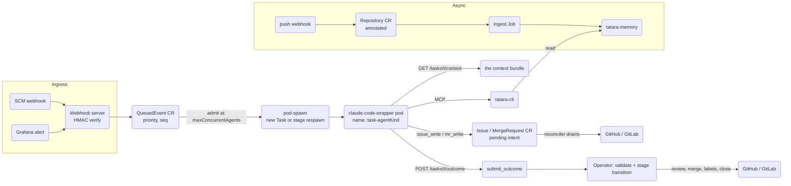
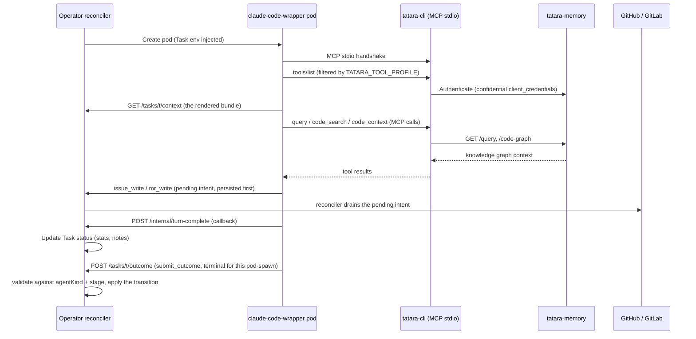
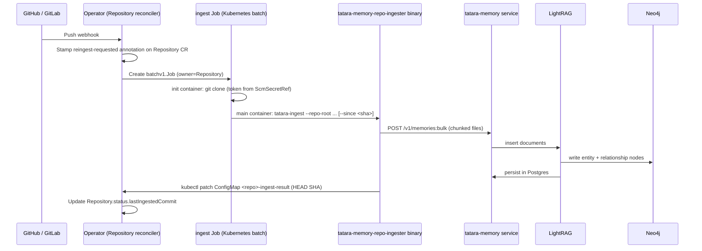

# Data & Control Flow

This page traces the life of a single SCM event from the moment it arrives at the
operator's webhook endpoint to a merged pull/merge request in the source repository.
A second, independent path - the async memory ingest pipeline - runs in parallel
and keeps the knowledge graph fresh.

!!! note "The one-writer rule"
    The agent writes **conversation** (`issue_write`, `mr_write(comment|reply)`) and **notes**. The operator writes reviews, merges, labels, `Issue.status.status`, `MergeRequest.status.status`, and every stage transition. No agent ever writes `Task.status.stage`.

---

## Overview



---

## 1. Ingress - from SCM event to QueuedEvent

The operator exposes two webhook routes on a shared HTTP listener:

| Route | Source | Auth |
|---|---|---|
| `POST /operator/webhooks/{project}` | GitHub or GitLab | HMAC-SHA256 over request body |
| `POST /operator/webhooks/{project}/grafana` | Grafana Alertmanager | Bearer token, constant-time compare |

### SCM webhook processing

1. **Body read** - capped at 5 MiB; oversized payloads are rejected `413`.
2. **Provider detection** - header inspection selects the GitHub or GitLab parser.
   A mismatched provider (e.g. a GitHub delivery to a GitLab-configured Project) returns `400`
   before any signature work.
3. **HMAC verification** - the `webhookSecret` key is read from the `spec.scmSecretRef` Secret.
   The signature is verified with `crypto/subtle.ConstantTimeCompare`; failure returns `401`.
4. **Event routing** - the parsed `WebhookEvent.Kind` field selects the handler:

| Kind | Handler |
|---|---|
| `push` | stamps `tatara.dev/reingest-requested` annotation on the matching Repository |
| `issue` or `mr` (not a comment) | [admission path](#2-admission-queuedevent-to-a-pod-spawn) |
| `issue_comment` / note | mirrored into the `Issue`/`MergeRequest` CR, then queued as a [mid-flight event](#mid-flight-events-into-a-live-pod) if a Task is watching |
| anything else | `202 Accepted`, ignored |

#### Reporter intake gate

Before a webhook event can mint a new Task the operator applies two security checks:

- **Provider mismatch guard** - rejects deliveries routed to the wrong SCM provider.
- **Reporter allowlist** - a new `clarify` Task is only minted when the event author is a
  maintainer (`spec.scm.maintainerLogins`) or an account in `spec.scm.reporterLogins`
  (Project-level, overridable per-Repository via `RepositorySpec.reporterLogins`). An empty
  allowlist is open (default). This is the prompt-injection intake gate: with it set, unknown
  third parties cannot drive the lifecycle by opening or commenting on an issue.

### Grafana alert processing

Grafana delivers a JSON alert payload via bearer token. The handler:

1. Verifies the bearer token against `spec.grafana.secretRef`.
2. Ignores non-`firing` alerts (e.g. `resolved`).
3. Computes the dedup key as the first 16 hex chars of `sha256(groupKey)`, where
   `groupKey` is Grafana's alert-group field (not the labels/commonLabels).
4. Creates a `QueuedEvent` with `class=alert`, `priority=0` (redundant with the reserved alert
   pool, kept for clarity), and `payload.agentKind=incident`.

---

## 2. Admission - QueuedEvent to a pod-spawn

### The QueuedEvent buffer

A `QueuedEvent` CR is the durable, ordered buffer between the webhook handler and
the dispatcher. **The admission unit is one agent pod-spawn, not one Task**: a Task
advancing from one pod-spawning stage to the next enqueues a fresh `QueuedEvent`, so every
pod-spawn - whether it mints a new Task or respawns a pod on an existing one - passes the same
chokepoint. `spec.maxConcurrentAgents == 0` freezes the whole project mid-flight, including a
Task already in progress.

```yaml
# Example QueuedEvent fields
spec:
  seq: 42                       # monotonic, Project-scoped
  class: normal                 # or "alert" for incidents
  priority: 1                   # 0=incident, 1=webhook-originated, 2=cron/sweep-originated
  projectRef: my-project
  repositoryRef: tatara-cli     # empty except documentation
  dedupKey: "iss:tatara-cli#17" # a FIELD, never a label - see below
  payload:
    agentKind: clarify          # the pod to spawn
    newTask:                    # exactly one of newTask / taskRef is set
      name: my-project-clarify-2026-07-12-a1b2c
      kind: clarify              # the ORIGIN kind
      goal: "..."
      projectRef: my-project
      issueKeys: ["tatara-cli#17"]
status:
  state: Queued                 # -> Admitted when a slot opens
```

### Dedup: a field, never a label

`QueuedEvent.spec.dedupKey` holds the natural key (`iss:<repo>#<number>`, `mr:<repo>!<number>`,
or an alert-group hash for incidents) as a **field**, not a Kubernetes label - label values
cannot contain `:` or `#`, so a label-based "natural key" would have been silently hashed back
into an opaque digest, exactly the failure this design exists to avoid. The authoritative lookup
is the `issueKey`/`mrKey` field index on `Issue`/`MergeRequest` (see [Custom Resource
Reference](../reference/index.md#api-group-and-version)): "is this issue already being worked?"
is answered by "does the `Issue` CR for `(repo, number)` have a controller owner?", the same
question the sweep's orphan predicate asks, answered by the same index. The QueuedEvent's own
in-flight dedup ("is an identical event already `Queued` but not yet `Admitted`?") is a separate
field-indexed lookup on `queuedEventDedupKey`.

| Origin kind | Dedup key |
|---|---|
| `clarify` (new issue) | `iss:<repo>#<number>`, and a deterministic Task name so a redelivered webhook collides on `Create` (`AlreadyExists`) |
| `implement` (agent kind, not an origin) | No separate `QueuedEvent` - the handoff is a stage-driven respawn (`taskRef`) on the same Task the `clarify` dedup key already admitted |
| `review` | None - multiple review Tasks per PR are intentional |
| `incident` | `sha256(Grafana groupKey)[:16]` |
| `brainstorm`, `documentation`, `refine` | Caller-supplied key (e.g. `brainstorm-<project>`, `documentation-<project>`) |

### Queue classes, priority, and capacity gating

The dispatcher runs as part of the operator reconcile loop and admits events in ascending
**`(priority, seq)`** order within each class - FIFO is preserved within a priority tier:

- **normal** class, ordered `(priority, seq)`: up to `Project.spec.maxConcurrentAgents`
  concurrent admitted pod-spawns (`Queue.Capacity()` overrides it when `spec.queue.capacity` is
  set; the fallback when neither is set is `3`). `maxConcurrentAgents: 0` fully pauses admission
  - a direct check at the top of `admit()`, never routed through `QueueCapacity()`, which floors
  at `3` and would silently un-pause a `0`.
- **alert** class: a separate reserved pool (`spec.queue.alertCapacity`, default `1`). Alert
  slots are never consumed by normal-class events, so an incident pod-spawn is admitted even
  when the normal queue is saturated.
- Priority 2 (cron/sweep-originated work, e.g. the nightly documentation batch) gets one
  reserved slot in the normal pool whenever a priority-2 event has been `Queued` for more than an
  hour, so a busy project's webhook traffic (priority 1) can never starve it indefinitely.

Once a slot is available, the dispatcher either creates a new Task from `payload.newTask` (a
mint, idempotent on the deterministic name) or resumes an existing one named by `payload.taskRef`
(a stage-driven respawn). The `QueuedEvent` is GC-deleted once its pod is gone **and** the Task
has left the stage that requested it (or is terminal) - it is never transitioned to a terminal
state itself.

---

## 3. Execution - agent turn loop

### Pod lifecycle

The dispatcher spawns a `tatara-claude-code-wrapper` Pod (plus a Service) named
`<task-name>-<agent-kind>` on admission. One pod is created per pod-spawn and is reused across
every turn within that spawn; the operator submits each turn to the existing pod and only
re-creates it when it has crashed or failed its readiness probe, bounded by
`agent.maxPodRecreations` (default `3`, reset to `0` on every stage transition) after which the
Task fails at `pod-recreation-exhausted`. A pod that never becomes Ready within the fixed 5-minute
readiness window is a respawn, not an immediate failure.

The Pod receives Task identity and context via environment variables:

| env | value |
|---|---|
| `TATARA_TASK` | Task CR name |
| `TATARA_PROJECT` | Project CR name |
| `TATARA_KIND` | the **agent** kind (`Task.status.agentKind`) |
| `TATARA_TOOL_PROFILE` / `TATARA_SKILL_PROFILE` | the agent kind, one of seven |
| `TATARA_REPO` | Repository CR name; empty except for `documentation` |
| `TASK_BRANCH` | `task/<task-name>`, the branch the wrapper checks out and pushes |
| `TATARA_OPERATOR_URL` / `TATARA_MEMORY_URL` | per-Project service URLs |
| `AGENT_POD_TTL_SECONDS` | `Project.spec.agentPodTTLSeconds` |
| `TATARA_CONTRACT_VERSION` | the wire-contract version the pod was built against |

There is no `TASK_GOAL` env var: the goal is delivered as part of the [context
bundle](../reference/context-bundle.md) text, not an env var. `OPERATOR_PUSH_URL` is the
Prometheus remote-write / metrics-push endpoint (`.../internal/metrics/push`) the wrapper pushes
turn token/cost series to - it is not a git-push or task-context var. `TATARA_CHAT_URL` and every
conversation-resume var (`HANDOFF_KEY`, `CONVERSATION_SESSION_ID`, `CONVERSATION_OBJECT_KEY`) are
gone: there is no resume mode, and what carries forward between pods is
[`Task.status.notes`](../reference/task-notes.md), not a replayed transcript.

Runs one persistent interactive `claude` process; `tatara-cli` (baked into the wrapper image)
acts as the local stdio MCP server.



### MCP tool surface

`tatara-cli` gates its `tools/list` by the `TATARA_TOOL_PROFILE` env var, keyed on the
**agent** kind (seven values). The gate is the platform's sole authz boundary: all agent pods
share one OIDC identity (see [Identity & OIDC](identity-and-oidc.md)), so authorization cannot
key on who the caller is - only on which tools the profile allows. `resolveProfile` **fails
closed uniformly**: an empty `TATARA_TOOL_PROFILE` and an unrecognized non-empty value are
treated identically, serving only the always-on set with no `submit_outcome` - a pod with a
profile the server does not understand gets six tools and cannot terminate its Task. Twenty
tools total, five groups (Platform, SCM, code graph, memory, the one-name
seven-schema `submit_outcome`); see [MCP tools by agent kind](../reference/mcp-tools.md#the-profile-gating-table)
for the authoritative per-kind grant table.

### Mid-flight events into a live pod

If a human comments while a turn is in flight, the webhook handler mirrors the comment onto the
`Issue`/`MergeRequest` CR and, **unless the author is `spec.scm.botLogin`**, appends it to
`Task.status.pendingEvents` (Go-side cap 20, drop-oldest). Without the bot-author filter, the
operator's own park comment would land back in the queue and un-park the Task the operator just
parked - a fully autonomous hallucinated-approval-to-prod path. Delivered at the next turn
boundary: rendered as an `<events>` block **before** the bundle (the delta first, then the
refreshed baseline) - see [Mid-flight events](../reference/context-bundle.md#mid-flight-events).
If no pod is running, one spawns and the events ride in turn-0. The field is cleared only after
the wrapper's submit for that turn returns `202`, as a set-difference against what was actually
delivered - never a blind `nil` assignment, which would silently drop an event that arrived
between render and clear.

---

## 4. Writeback - results back to the SCM

Writeback splits along the one-writer rule stated above, and both halves are driven by durable,
persist-first intents rather than a single post-turn reconcile sweep.

### The agent's half: conversation

`issue_write` and `mr_write(comment|reply)` persist a `PendingComment` (or, for a review verdict,
`PendingReview`) on the `Issue`/`MergeRequest` CR **before** any forge call, and return
immediately; the Issue/MergeRequest reconciler drains the intent to the forge and clears it on a
verified append. This crash-safety ordering means a wrapper pod that dies mid-write never leaves
an ambiguous state: the intent either was not yet posted (retry) or was posted and mirrored
(idempotent skip). `mr_write(action=open)` is idempotent on the Task's `task/<task-name>` head
branch - an existing open MR on that branch returns `{"existing":true}` without a forge call - and
is refused with `409` once the Task already owns a *merged* MR for that repo.

### The operator's half: reviews, merges, labels, status

Everything triggered by an **accepted** `submit_outcome` and not reachable from any MCP tool:

| Origin kind (accepted outcome) | Operator action |
|---|---|
| `clarify` (`decision=implement`) | Runs the [approval grammar](../operations/security/approval-gates.md#the-approval-grammar); on success, advances `stage=approved` and hands the Task to an `implement` pod |
| `implement` / `documentation` (`action=submitted`) | Resolves `mergeOrder` (fix C2: auto-filled for the single-repo case, required and validated otherwise); stage advances to `reviewing` |
| `review` (`verdict=approve`) | Reads the **live** PR head, posts a `COMMENT`-event SCM review under the bot identity (never `APPROVE` - the platform's one bot identity means GitHub 422s a self-approve), then walks `mergeOrder` and merges - see [Merge and deploy](../workflows/merge-and-deploy.md#the-merge-sequence) |
| `review` (`verdict=request_changes`) | Posts the findings as a `COMMENT`-event review with inline comments; stage returns to `implementing` (or, for a `kind=review` Task on a human PR, parks at `awaiting-human`, bounded by `maxHumanReviewRounds`) |
| `brainstorm` / `incident` (`action=propose`/`file_issue`) | Creates the proposed `Issue` CR(s), scoped to the alert rule for incidents |
| `refine` | Applies folds (adopts a member Task's Issues/MRs, deletes the member), closes, and links directly - no PR, no proposal |
| `deploying` -> `delivered` (pod-less) | Closes every owned Issue still open, citing the release, and only then stamps `deliveredAt` |

No agent writes `Issue.status.status`, `MergeRequest.status.status`, a label, or
`Task.status.stage` directly - every one of those is an operator write, gated by an accepted
`submit_outcome` or by the pod-less `merging`/`deploying` stage logic.

### The mirror is the ledger

There is no separate work-item ledger on the Task. The `Issue` and `MergeRequest` CRs **are** the
ledger: each carries its own `status.state`/`status.status`, its comment history, and an owner-ref
list naming every Task that has ever touched it (with exactly one `controller=true` owner at a
time - see [Ownership, GC, and admission](ownership.md)).

---

## SCM egress and rate limiting

A per-project token bucket, **~20 requests/second**, is shared by every reader and writer the
operator drives against the forge - the last line of defence against a sweep, a reconcile storm,
and an agent poll loop coinciding. Rate-limit handling (honour `Retry-After`, then
`X-RateLimit-Reset`, then exponential backoff, bounded retries) is wired into the **read** path as
well as the write path; a caller that exhausts retries sees a typed rate-limited error and
requeues rather than failing the Task outright. GitHub's secondary limit (80 content-creating
requests/minute, 500/hour) returns `403`, not `429`, and carries no `X-RateLimit-Remaining` header
- detection keys on the response body's `secondary rate limit` marker as well as the status.

The budget holds because of the mirror: **the steady-state agent read cost of the platform is
zero forge requests**, except `scm_read(kind=ci)`. `scm_read(issues|mr|comments)` is served
entirely from the `Issue`/`MergeRequest` CR mirror - see [`scm_read(kind=ci)` is the only live
forge read](../reference/mcp-tools.md#scm_readkindci-is-the-only-live-forge-read).

---

## 5. Async ingest path

Repository content is kept fresh independently of the agent turn loop. Two triggers
kick off an ingest:

- **Push webhook**: the webhook handler stamps the `tatara.dev/reingest-requested`
  annotation on the matching Repository CR; the Repository reconciler picks this up
  within seconds.
- **Scheduled re-ingest**: the Repository reconciler's `scheduleNextReingest` parses
  the per-Repository `spec.reingestSchedule` cron and, when a fire is due, stamps the
  same `tatara.dev/reingest-requested` annotation. For an already-ingested repo that
  annotation yields an **incremental** ingest (`--since <lastIngestedCommit>`), not a
  full one - it guards against missed push webhooks, not a periodic full rebuild. (The
  separate `issueScan` cron scans issue/PR lifecycle state and does not drive ingest.)



### Incremental vs. full ingest

| Mode | Trigger | `--since` flag | BackoffLimit |
|---|---|---|---|
| Incremental | push webhook (known lastIngestedCommit) | `<lastIngestedCommit SHA>` | 0 (deterministic failure; escalates immediately to full) |
| Full | first ingest, or incremental failure | none | 2 (transient clone/network failures self-heal) |

The ingest Job clones into a namespaced path (`/workspace/owner/.../repo`) so
concurrent ingest Jobs for different repos never collide. The HTTP timeout for
memory API calls is set to 300 seconds (overriding the ingester's 60 s default)
to accommodate semantic extraction round-trips to OpenAI during large bulk ingests.

!!! warning "Semantic ingest requires an OpenAI key"
    When `openAISecretName` is configured in the operator Helm values, the ingest
    Job runs a second-pass semantic extraction (entity relationship inference via
    `gpt-4o-mini` by default) in addition to AST-based code graph construction.
    If no OpenAI secret is provided, the ingester runs AST-only and does not fail.

---

## Key data stores and their roles

| Store | Technology | Contents | Updated by |
|---|---|---|---|
| Task CR | Kubernetes etcd | Stage, agent kind, notes journal, merge order/cursor, stats | Operator reconciler, webhook handler |
| Issue / MergeRequest CR | Kubernetes etcd | Mirrored SCM title/body/comments, platform status, pending write intents | Operator reconciler (mirror sync + pending-intent drain) |
| QueuedEvent CR | Kubernetes etcd | Ordered, prioritized admission queue | Webhook handler (produce), dispatcher (consume) |
| Repository CR | Kubernetes etcd | Last-ingested commit SHA, reingest annotation | Operator reconciler, webhook handler |
| Project ConfigMap (seq) | Kubernetes etcd | Monotonic per-project sequence counter | `queue.SeqSource` (CAS) |
| ingest-result ConfigMap | Kubernetes etcd | HEAD SHA written by the ingest Job | ingest Job (kubectl patch) |
| tatara-memory (LightRAG + Neo4j + Postgres) | In-cluster | Code entity graph, text chunks, spilled notes | ingest Job via memory service, operator (note spill) |
