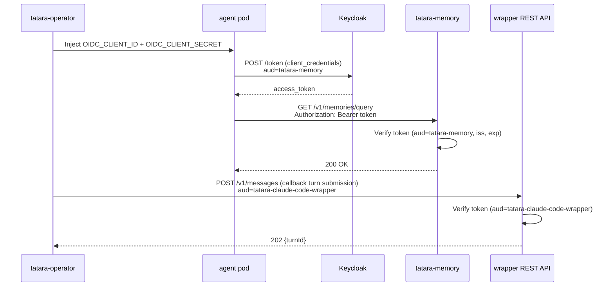

# Identity & OIDC

All tatara API endpoints require OIDC bearer tokens. The platform uses Keycloak as the identity provider. Every service validates tokens independently - there is no shared session state.

## Keycloak realm

**Realm:** `master` (or a dedicated realm of your choice)

**Issuer:** `https://<keycloak-host>/realms/<realm>`

## Clients

Five Keycloak clients are required. The table below is the authoritative inventory; prerequisites.md and installation.md reference it.

| Client ID | Type | Grant | Used by | Audience (`aud`) |
|---|---|---|---|---|
| `tatara-operator` | confidential | client_credentials | operator (outbound SCM/API calls); validates inbound tokens from agent pods | `tatara-operator` |
| `tatara-memory` | confidential | client_credentials | tatara-memory (resource server); agent pods call memory REST API | `tatara-memory` |
| `tatara-cli` | public | device_authorization | CLI device-flow login; tatara-cli MCP server in agent pods | `tatara-memory` (via audience mapper on `tatara` scope) |
| `tatara-claude-code-wrapper` | confidential | client_credentials | operator calls wrapper REST API; agent pods hold these credentials | `tatara-claude-code-wrapper` |
| `tatara-chat` | confidential | client_credentials | tatara-chat service validates tokens from browser clients and agent pods | `tatara-chat` |

### tatara-operator client

Confidential, service-accounts enabled. The operator uses this client for outbound client-credentials grants (SCM API calls, OIDC introspection). Inbound requests to the operator from agent pods must carry `aud: tatara-operator`. Audience mapper: add `tatara-operator` to the `aud` claim.

### tatara-memory client

Confidential, service-accounts enabled. Has an audience mapper that adds `tatara-memory` to the `aud` claim. Agent pods acquire a `tatara-memory`-audience token via client credentials and use it to call the memory REST API.

### tatara-cli client

Public client, device authorization grant enabled. Default scope `tatara` carries an audience mapper that adds `tatara-memory` to `aud`. This is the client used by `tatara login` on developer machines and by the tatara-cli MCP server when it calls tatara-memory on behalf of an agent.

### tatara-claude-code-wrapper client

Confidential, service-accounts enabled. The wrapper REST API validates inbound requests from the operator against this client's audience. Client credentials are injected into agent pods as `OIDC_CLIENT_ID` / `OIDC_CLIENT_SECRET` env vars.

### tatara-chat client

Confidential, service-accounts enabled. The tatara-chat service validates tokens against `aud: tatara-chat`. Agent pods that participate in chat rooms receive credentials for this client. Audience mapper: add `tatara-chat` to the `aud` claim.

## Token validation

Each service validates on every request:

1. Discover JWKS via `/.well-known/openid-configuration`
2. Verify RS256 signature against current keys
3. Verify `iss` matches configured issuer
4. Verify `exp` not expired
5. Verify `aud` contains the service's expected audience

Token verification uses `coreos/go-oidc` which automatically fetches and caches JWKS. No manual key distribution or service restart is needed on Keycloak key rotation.

## Agent pod token flow



## Agent pod identity

All agent pods authenticate using the **same** OIDC client credentials (the `tatara-claude-code-wrapper` client). The `sub` claim is the service account UUID and is identical across all pods.

Per-task authorization cannot rely on OIDC identity. It relies instead on the task context embedded in the pod env (`TATARA_TASK`, `TATARA_PROJECT`) and the operator REST API validating that the token's task scope matches the request.

## Keycloak Terraform configuration

The five clients are defined in `infra/terraform/keycloak/tatara_clients.tf` in the homelab infra repo. For a new deployment:

```hcl
resource "keycloak_openid_client" "tatara_memory" {
  realm_id              = keycloak_realm.master.id
  client_id             = "tatara-memory"
  access_type           = "CONFIDENTIAL"
  service_accounts_enabled = true
}

resource "keycloak_openid_client" "tatara_cli" {
  realm_id              = keycloak_realm.master.id
  client_id             = "tatara-cli"
  access_type           = "PUBLIC"
  oauth2_device_authorization_grant_enabled = true
  standard_flow_enabled = false
}
```

## Security notes

- Tokens are short-lived (Keycloak default: 5 minutes). The operator and agent pods use client credentials grant which handles automatic token refresh.
- No long-lived tokens are stored in the cluster outside of the client secret Kubernetes Secrets.
- All client secrets are stored SOPS-encrypted in `tatara-helmfile` values files, never in plaintext.
- The `tatara-cli` client is public (no secret) - it relies on the device flow and short-lived authorization codes.
- The bot PAT (GitHub/GitLab) is a separate credential stored in the `scmSecretRef` Secret, distinct from the OIDC client secrets.
