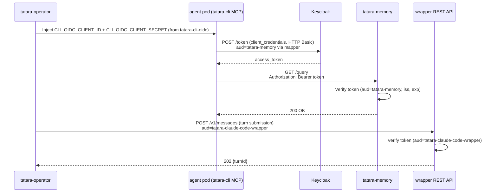

# Identity & OIDC

Every tatara service-to-service call is an OIDC bearer token, validated independently by
the receiver against a per-service expected `aud` claim. There is no shared session state
and no per-user identity in the machine-to-machine plane. The load-bearing detail is not
the JWT mechanics (standard OIDC discovery + RS256, covered in one line below) but the
**client topology**: which client mints which audience, and why per-task authorization
cannot key on OIDC identity.

## Keycloak realm

The platform uses Keycloak as the identity provider. The homelab deployment runs the
clients in the `master` realm (`OIDC_ISSUER` is operator-injected, so the realm is a
deployment config, not a hard-coded value). Putting application clients in `master` is a
homelab shortcut; a production deployment should use a dedicated realm. Nothing in the
code assumes `master`.

**Issuer:** `https://<keycloak-host>/realms/<realm>`

## Clients and audiences

Five Keycloak clients carry the service plane. What matters is the direction each token
flows and the audience it must carry.

| Client ID | Type | Grant | Mints tokens for (`aud`) | Used by |
|---|---|---|---|---|
| `tatara-operator` | confidential | client_credentials | `tatara-operator` (inbound validation) | operator: validates inbound calls from agent pods; outbound SCM/API |
| `tatara-memory` | confidential (resource server) | - | `tatara-memory` | memory REST API: validates inbound tokens |
| `tatara-cli` | confidential | client_credentials | `tatara-memory` (+ operator/chat via mappers) | the in-pod MCP server, outbound to memory/operator/chat |
| `tatara-claude-code-wrapper` | confidential | client_credentials | `tatara-claude-code-wrapper` | the operator, calling the wrapper REST API inbound |
| `tatara-chat` | confidential | client_credentials | `tatara-chat` | chat service: validates inbound tokens |

Two subtleties the topology hides if you read it as a flat list:

- **The in-pod identity is a confidential `tatara-cli` client, not the wrapper client.**
  The in-pod MCP server (`tatara-cli`) calls memory, operator, and chat using a
  **confidential** `client_credentials` grant: it sends a client id + secret via HTTP
  Basic auth (Keycloak's `client_secret_basic`; `client_secret_post` 401s). Those
  credentials are `CLI_OIDC_CLIENT_ID` / `CLI_OIDC_CLIENT_SECRET`, injected from the
  `tatara-cli-oidc` Secret. This is not a public client - a public client cannot mint a
  `client_credentials` token. Do not confuse this with the public device-flow client a
  human developer uses for `tatara login` on a workstation; that is a separate, public
  concern and never the identity the pods use outbound.
- **The `tatara-claude-code-wrapper` client is an inbound audience, not an outbound
  identity.** The operator holds a `tatara-claude-code-wrapper`-audience token and uses
  it to call the wrapper's REST API. The pod's `OIDC_AUDIENCE=tatara-claude-code-wrapper`
  env var is only the audience the wrapper *validates* on those inbound operator calls.
  Agent pods never present the wrapper client outbound to memory.

### Audience mappers are mandatory

A `client_credentials` token from Keycloak carries no `aud` claim by default. Every
resource server here rejects a token whose `aud` does not contain its own audience, so
each client that calls a resource server MUST have an audience (protocol) mapper adding
the target audience to `aud`. In particular the `tatara-cli` client (or its `tatara`
scope) needs a mapper adding `tatara-memory` - without it, memory returns 401 for every
agent call. This is the single most common reproduction failure when standing up
identity from scratch.

## Token validation

Each service validates every request the standard way: discover JWKS via
`/.well-known/openid-configuration`, verify the RS256 signature, `iss`, `exp`, and that
`aud` contains the service's own audience. Verification uses `coreos/go-oidc`, which
fetches and caches JWKS automatically, so Keycloak key rotation needs no restart or
manual key distribution.

## Agent pod token flow



Note the two directions: the pod is the client for memory/operator/chat (confidential
`tatara-cli` creds), and the operator is the client for the wrapper. These are different
credentials for different audiences.

## Agent pod identity and why authz cannot key on it

All agent pods authenticate to memory/operator/chat with the **same** confidential
`tatara-cli` client credentials (from `tatara-cli-oidc`). The `sub` claim is that one
client's service-account UUID and is identical across every pod, regardless of Task,
Project, or kind. There is therefore no OIDC-identity distinction between a brainstorm
pod and an incident pod.

Per-task authorization consequently cannot rely on the token. It relies instead on:

- **Tool-surface gating** in `tatara-cli`, keyed on the operator-set `TATARA_TOOL_PROFILE`
  (see [Data & Control Flow](data-flow.md#mcp-tool-surface)). This is the real authz
  boundary. An unknown profile fails closed to a 4-tool `alwaysOn` set.
- **Task context in the pod env** (`TATARA_TASK`, `TATARA_PROJECT`) plus the operator
  REST API validating that a request's task scope matches the pod it came from.

## Keycloak Terraform configuration

The homelab's five clients live in `infra/terraform/keycloak/tatara_clients.tf` in the
maintainer's private infra repo - that path is not portable and is referenced only as
the authoritative source, not something to copy verbatim. The example below is the shape
you actually need, including the audience mapper that the toy two-client snippets omit
(and without which memory rejects every agent token):

```hcl
resource "keycloak_openid_client" "tatara_cli" {
  realm_id                 = var.realm_id
  client_id                = "tatara-cli"
  access_type              = "CONFIDENTIAL"     # pods use client_credentials + secret
  service_accounts_enabled = true               # enables client_credentials
}

# MANDATORY: without this, tatara-cli tokens have no `aud` and memory returns 401.
resource "keycloak_openid_audience_protocol_mapper" "cli_to_memory" {
  realm_id                  = var.realm_id
  client_id                 = keycloak_openid_client.tatara_cli.id
  name                      = "aud-tatara-memory"
  included_client_audience  = "tatara-memory"
}

resource "keycloak_openid_client" "tatara_memory" {
  realm_id    = var.realm_id
  client_id   = "tatara-memory"
  access_type = "CONFIDENTIAL"                   # resource server
}
```

Repeat the client-plus-audience-mapper pair for `tatara-operator`, `tatara-chat`, and the
`tatara-claude-code-wrapper` inbound audience. Every resource server the CLI client calls
needs its audience added to the CLI client's `aud`.

## Security notes

- Tokens are short-lived (Keycloak default: 5 minutes). The operator and agent pods use
  the client-credentials grant, which mints a fresh token as needed.
- No long-lived tokens are stored in the cluster outside the client-secret Kubernetes
  Secrets (`tatara-cli-oidc` and the per-service client secrets).
- All client secrets are stored SOPS-encrypted in `tatara-helmfile` values files, never
  in plaintext.
- The in-pod `tatara-cli` client is **confidential** (it holds a secret in
  `tatara-cli-oidc`). Only the developer `tatara login` device-flow client is public.
- The bot PAT (GitHub/GitLab) is a separate credential in the `scmSecretRef` Secret,
  distinct from every OIDC client secret, and is what agents use to act on the SCM - not
  an OIDC token.
