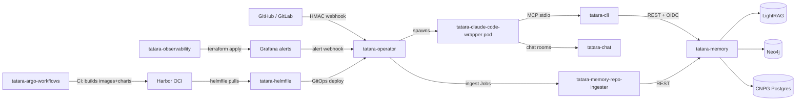

# Architecture

How the nine tatara components fit together, how data flows through the system, and the key design decisions that shape the platform.

-   :material-arrow-decision: **Data & Control Flow**

    ---

    From GitHub webhook to merged PR: request paths, state transitions, and the full lifecycle of a task.

    [:octicons-arrow-right-24: Data Flow](data-flow.md)

-   :material-shield-key: **Identity & OIDC**

    ---

    Keycloak realm, OIDC clients, token validation, and the agent pod authentication flow.

    [:octicons-arrow-right-24: Identity & OIDC](identity-and-oidc.md)

-   :material-brain: **Memory Architecture**

    ---

    LightRAG + Neo4j + Postgres: how the knowledge graph is built, queried, and kept durable.

    [:octicons-arrow-right-24: Memory Architecture](memory-architecture.md)

-   :material-robot: **Agent Execution**

    ---

    How the operator spawns and drives Claude Code wrapper pods, and how turns flow.

    [:octicons-arrow-right-24: Agent Execution](agent-execution.md)

-   :material-git: **CI/CD & Deploy Model**

    ---

    tatara-helmfile, Argo Workflows, ARC runners, and why `kubectl set-image` is forbidden.

    [:octicons-arrow-right-24: CI/CD & Deploy](ci-cd.md)

## Component overview

For per-component detail, see the [Components](../components/index.md) section.
