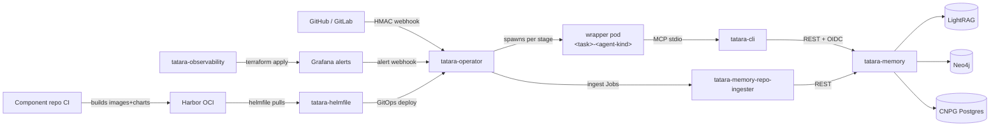

# Architecture

How the seven tatara components fit together, how a `Task` moves through its stage
machine, and the key design decisions that shape the platform. (Two further repos -
`tatara-agent-skills` and this documentation site - support the platform without being
runtime components; see [Components](../components/index.md).)

-   :material-arrow-decision: **Data & Control Flow**

    ---

    From GitHub/GitLab webhook to merged PR: request paths, admission, and the full
    Task lifecycle.

    [:octicons-arrow-right-24: Data Flow](data-flow.md)

-   :material-shield-key: **Identity & OIDC**

    ---

    Keycloak realm, OIDC clients, token validation, and the agent pod authentication flow.

    [:octicons-arrow-right-24: Identity & OIDC](identity-and-oidc.md)

-   :material-brain: **Memory Architecture**

    ---

    LightRAG + Neo4j + Postgres: how the knowledge graph is built, queried, and kept durable.

    [:octicons-arrow-right-24: Memory Architecture](memory-architecture.md)

-   :material-robot: **Agent Execution**

    ---

    How the operator spawns per-stage agent pods, how turns flow through the wrapper,
    and how a Task survives its pod's TTL.

    [:octicons-arrow-right-24: Agent Execution](agent-execution.md)

-   :material-git: **CI/CD & Deploy Model**

    ---

    tatara-helmfile, component CI, ARC runners, and why `kubectl set-image` is forbidden.

    [:octicons-arrow-right-24: CI/CD & Deploy](ci-cd.md)

## Six CRDs, one namespace

Every custom resource is `tatara.dev/v1alpha1`, namespaced: `Project`, `Repository`, `Task`, `QueuedEvent`, `Issue`, and `MergeRequest`. There is no `Subtask` CRD and no `WorkItem` type - `WorkItem` was never a CRD to begin with (it was an embedded Go slice on `Task.Status`), and the whole notion is gone along with `Subtask`. <!-- stale-ok: Subtask, WorkItem -->

`Task` is the unit of work: `spec.kind` is its immutable origin (`brainstorm`,
`incident`, `clarify`, `refine`, `review`, or `documentation`), and `status.stage` is
where it currently sits in a 15-member state machine that only the operator ever
writes. See [Ownership & GC](ownership.md) for how the six CRDs own and release each
other, and [Task Stages](../reference/task-stages.md#the-transition-table) for the
full enum and transition table.

## Component overview

The pod's lifetime is bounded by a TTL, not by the Task: when `AGENT_POD_TTL_SECONDS`
elapses the operator collects a final handoff note and stops the pod, but the Task
itself persists in whatever `status.stage` it reached, ready for its next pod. See
[Agent Execution](agent-execution.md) for that sequence.

For per-component detail, see the [Components](../components/index.md) section.
