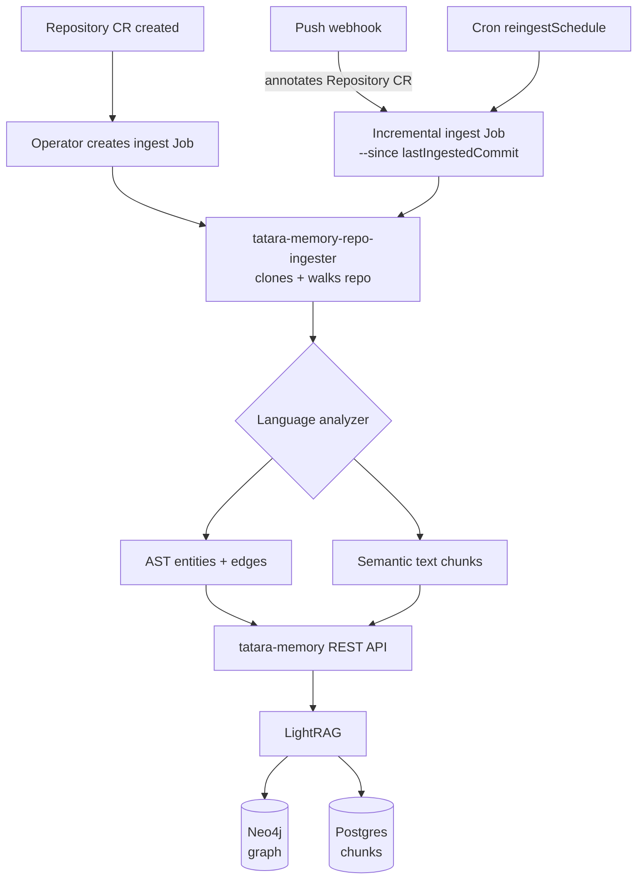

# Memory Architecture

The tatara memory system is a persistent knowledge graph of your codebase. It replaces the cold-read pattern (agent reads files from scratch on every turn) with a queryable graph that survives session boundaries, pod restarts, and code changes.

The name alludes to the platform metaphor: the tatara forge's permanent substrate that every ephemeral agent session works against.

## Stack

```
tatara-memory (REST service, Go)
        |
        v
    LightRAG (Python, upstream library)
        |              |
        v              v
     Neo4j          CNPG Postgres
   (graph store)   (chunks, job state,
                    conversation pointers)
```

One stack is provisioned per `Project` CR by the operator. Sizes are tunable via `spec.memory`:

```yaml
spec:
  memory:
    pgInstances: 3       # CNPG replicas (1=dev, 3=HA)
    pgStorage: 20Gi
    neo4jStorage: 10Gi
```

## How memory is populated



1. **Initial ingest:** Repository CR created -> operator creates an ingest `Job` -> `tatara-memory-repo-ingester` clones + bulk-posts chunks and graph entities.
2. **Incremental ingest:** push webhook annotates the Repository CR; the operator creates a new ingest Job running `--since <lastIngestedCommit>` (delta only).
3. **Scheduled re-ingest:** `spec.reingestSchedule` (cron expression on the Repository CR) triggers periodic full catch-up, guarding against missed webhooks.
4. **Semantic extraction:** when `spec.semanticIngest: true` (default), each changed file is also processed by Claude for LLM-powered entity and relationship extraction. This enriches the Neo4j graph beyond what AST analysis alone produces.

## How agents query memory

Inside agent pods, `tatara-cli mcp` exposes memory query tools over MCP:

| MCP tool | What it does |
|---|---|
| `memory_query` | Semantic search over the knowledge graph |
| `code_graph_list` | List entities (files, functions, classes) |
| `code_graph_get` | Get a specific entity with its relationships |
| `code_graph_explain` | Narrative explanation of a code path |

The LightRAG query mode (naive, local, global, hybrid) is chosen by the tool implementation based on query type. Hybrid mode (vector + graph traversal) is the default.

## Conversation persistence

When S3 is configured (`spec.s3Bucket` on the Project), the wrapper stores the full Claude conversation transcript in S3 after each turn. The operator records the S3 object key and session ID in `Task.status` and injects them as env vars into the next pod.

**Resume vs. compaction:**

- If last-turn input tokens are below `handoverThresholdPercent` (default 25%) of the context window: the next pod replays the full transcript (full resume via `claude --resume <sessionId>`).
- At or above the threshold: the pod starts fresh with a compacted text handover.

The two paths are mutually exclusive - the context window never overflows regardless of session length.

**Forked conversations:** brainstorm-derived issues get a forked S3 copy of the brainstorm conversation, so sibling implementation tasks start from the same context but diverge independently.

**GC:** the reaper deletes S3 objects for a brainstorm batch once all sibling issues are closed (grace period: `s3ConversationRetentionHours`, default 72h).

The feature is off and fully backward-compatible until `s3Bucket` is set. No S3 env is injected and pods behave exactly as before.

## Durability considerations

| Concern | Mitigation |
|---|---|
| CNPG pod restart | CNPG manages HA; use `pgInstances: 3` for production |
| Neo4j pod restart | Graph is rebuilt from CNPG on restart; Neo4j is a read projection |
| CephFS write-cap leak | Known fragile under unclean probe-kill restarts (CNPG `io_method=sync`); consider RBD for CNPG PVCs in Ceph environments |
| LightRAG `duplicated` response | Treated as success; re-ingesting the same chunk is idempotent |
| LightRAG `busy` response | Treated as transient; controller retries with exponential backoff |
| Stale page cache (Neo4j EIO) | Restart the Neo4j pod; the error is poisoned page-cache from Ceph OSD crashes, not data loss |
