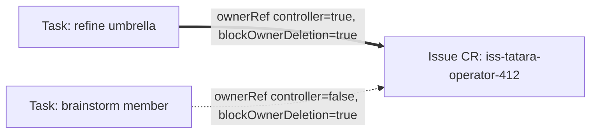

# Ownership

Every SCM artifact the platform touches is mirrored into the cluster as a CR: an
[`Issue`](../reference/issue.md) or a [`MergeRequest`](../reference/merge-request.md).
Nothing in the operator walks those CRs and deletes them. Kubernetes' garbage
collector does, and the operator's only job is to keep the owner references
honest.

That is not a stylistic preference. It is the mechanism the whole redesign rests
on. The refine fold, the reaper, the delivery cleanup and the invariant that no
SCM artifact may exist without a Task responsible for it are all consequences of
one three-line property of the GC - and there is not a single line of cascade
code anywhere in the operator.

---

## The GC invariant

The Kubernetes garbage collector deletes a dependent object **only when every
owner reference resolves to gone** (`attemptToDeleteItem` deletes only once
`len(solid) == 0`). And an object with **zero** owner references is **never**
collected.

Both halves are load-bearing, and they pull in opposite directions:

- **Zero owners means it leaks forever.** So "no SCM artifact without a Task" is
  not a rule the operator enforces in code - it is *structural*. An `Issue` CR
  that no Task owns would sit in etcd until a human deleted it. The sweep's job
  is to make sure one always does own it.
- **All-owners-gone means delete.** So the refine fold and the delivery cleanup
  need **no cascade code at all**. The operator drops an owner reference, or
  deletes a Task, and the API server does the rest.

!!! warning "`blockOwnerDeletion` is not free"

    A custom controller must set `blockOwnerDeletion: true` **explicitly** on
    every owner reference it writes. The operator holds `tasks/finalizers`
    `update` RBAC precisely so that it is allowed to. Without the flag, a Task
    can be deleted out from under an artifact that is still being worked.

---

## Who owns what

| Object | Owners | `controller=true` | Set by |
|---|---|---|---|
| `Task` | `Project` | `Project` | operator, at Task creation |
| `QueuedEvent` | `Project` | `Project` | operator, at enqueue |
| `Issue` | 1..N `Task` | the Task responsible **right now** | operator |
| `MergeRequest` | 1..N `Task` | the Task responsible **right now** | operator |
| agent `Pod` / `Service` | its `Task` | its `Task` | operator, at pod spawn |
| `Repository` | `Project` | `Project` | unchanged |

An `Issue` and a `MergeRequest` are the only objects with more than one owner,
and that is the entire point: a refine umbrella and the member Task it folded in
can both hold a reference to the same issue while exactly one of them is
responsible for it.



Five rules follow, and each one exists because something breaks without it.

**1. Exactly one owner carries `controller=true`.** It is the `TASK` print column
on `kubectl get iss`, it is the anti-race lock, and - the part that is easy to
miss - it is **the authorization for every SCM write against that artifact.** The
`issue_write` and `mr_write` MCP tools refuse with `409 task does not own this
issue` when the calling Task is not the controller owner. Without that check, two
Tasks that both own an issue could each spawn a pod and hold a conversation with
**each other** on a human's thread.

**2. Every owner reference sets `blockOwnerDeletion: true`.** Explicitly, on
every write, including the plain ones.

**3. Non-controller owners are plain references.** `controller` unset or false,
`blockOwnerDeletion` still true. Their only job is to hold GC open.

**4. A Task never owns a Task.** A Task-owns-Task edge would cascade-delete
exactly the artifacts a refine fold exists to preserve. The umbrella adopts the
members' artifacts and then deletes the member Tasks; if it owned them, deleting
the members would take their issues with them.

**5. An `Issue` or `MergeRequest` must never have zero controller owners.** Every
path that removes one - the fold, the reap - hands the flag to a survivor
*first*. An artifact with plain owners and no controller owner is worked by
nobody and re-minted by nobody: the sweep's orphan predicate looks for an issue
with no controller owner, but it also sees an issue that is owned, and the two
conditions are not the same. A reconcile guard detects the state, logs at ERROR,
increments `operator_orphan_no_controller_total`, and repairs it by promoting the
oldest surviving owner.

---

## The refine fold

A `refine` Task groups several existing Tasks under one umbrella. It does not
adopt the Tasks - rule 4 forbids that - it adopts their **artifacts**, and then
deletes the Tasks. The sequence is **adopt, verify, then delete**.

Before anything is written, `/outcome` checks that every named member exists, is
in the same project, and is **not live**: a member with a running pod
(`status.podName != ""`) or a live post-`approved` stage is refused with `409
fold target has work in flight`. That is the same liveness gate the `closes[]`
directive gets.

```
1. status.foldInFlight = [M1..Mn]                       (one Status().Update)

2. for each artifact A owned by Mi:
     ONE Update on A that atomically:
       - APPENDS U's ownerRef   (controller=false, blockOwnerDeletion=true)
       - REWRITES Mi's ownerRef to controller=false
       - REWRITES U's ownerRef  to controller=true

3. RE-LIST every named artifact; VERIFY U is a solid owner with controller=true
   on each. On ANY mismatch: stage -> failed(fold-adoption-unverified),
   foldInFlight cleared, members NOT deleted. Nothing is lost; a human sees a
   failed umbrella.

4. only then: delete M1..Mn

5. foldInFlight = []
```

Step 2 must be **one PUT**. The API server rejects an object carrying two
`controller=true` references, so the swap cannot be done as two writes: there is
no ordering of "add the new controller" and "demote the old one" that does not
either transit through an illegal object or through a window with no controller
owner at all.

A crash between steps 2 and 4 is safe and idempotent - the artifacts have both
owners, the umbrella is already the controller, and the next reconcile finishes
the job. A crash after step 4 leaves `foldInFlight` set, and the reconciler
clears it once the members are gone.

!!! danger "The reaper skips any Task named in a live umbrella's `foldInFlight`"

    Without the skip, the reaper could delete a member Task in the middle of its
    adoption - between the umbrella stamping `foldInFlight` and the artifact
    Update that appends its reference - and the artifact would go with it.

---

## Reaping

Terminal Tasks age out. Before the reaper deletes **any** Task, it settles that
Task's controller ownership, for every `Issue` and `MergeRequest` the Task
controller-owns:

```
if the artifact has >= 1 SURVIVING plain owner:
    hand controller=true to the OLDEST surviving owner
    (the same atomic single-PUT swap as the fold), THEN delete the Task.
else:
    delete the Task; the artifact cascades with it.
```

This is a routine consequence of multi-owner GC - a folded umbrella reaped while
a sibling still holds a plain reference - not an exotic race. Rule 5's repair
guard is the belt; this is the braces.

### Every terminal stage ages out

| stage | reaped when | notes |
|---|---|---|
| `delivered` | `now > deliveredAt + 48h` AND (`status.documentedBy != ""` OR the Task had zero merged MRs) | the TTL is **48h, not 24h** |
| `rejected` | `now > stageEnteredAt + 24h` | the SCM issue is already closed by the operator; nothing to re-mint |
| `failed` | `now > stageEnteredAt + 7d`, but it **releases its Issues immediately on entering `failed`** | the CR survives as a debugging artifact, owning nothing |
| `parked`, any reason except `backlog-sweep` | `now > stageEnteredAt + parkRetention` (default 7d) AND no re-entry rule fires AND **the bot park comment has landed** | the reaper BLOCKS on the comment: a 403 requeues the reap, it does not proceed without it |
| `parked(backlog-sweep)` | **never on age.** Reaped only when every owned Issue has `state == closed` | the durable mirror anchor, not a stalled work item |
| `documenting` stuck | `now > stageEnteredAt + docStageBudget` (2h) | force-moved to `delivered(doc-timeout)` |
| documentation Task `parked` | same budget | force-moved to `delivered(doc-timeout)` |

Two of those rows are the ones readers get wrong.

**`delivered` is reaped at 48h, not 24h**, and only once `status.documentedBy` is
stamped or the Task provably had zero merged MRs. The nightly documentation batch
runs once a day, so a Task delivered at 23:30 would have had thirty minutes of
margin against a 24h TTL. The margin should not be decorative. A stuck
documentation batch cannot pin its parents either: it is force-moved to
`delivered` at `docStageBudget` and stamps `documentedBy` on every Task in its
`spec.documentsTasks` on the way out - unless it never ran a pod at all, in which
case it stamps nothing and the next night's batch picks the same Tasks up.

**`parked(backlog-sweep)` is never reaped on age.** It is exempt from
`parkRetention` and is reaped only when every Issue it owns has `state ==
closed`. It is the anchor that holds the mirror open for a backlog issue nobody
is working; ageing it out would churn mint and reap forever. See
[Task stages](../reference/task-stages.md) for the full set of park reasons and
which of them have a re-entry path.

### `failed` releases its Issues immediately

A `failed` Task that kept controller-ownership of its issues for seven days would
hold them hostage: the orphan predicate would not re-mint them, no bot comment
would explain why, and nothing would move. So the terminal path runs in a fixed
order, and the ordering is the load-bearing part:

```
on entering failed / rejected, or being reaped from parked:

  1. post a bot comment on every owned OPEN Issue naming stageReason
     (BLOCKING: a 403 requeues the reap)

  2. stamp the tatara-parked label on the SCM issue
     (BLOCKING TOO - the sweep's mint-stage predicate READS this label)

  3. RELEASE controller-ownership FIRST:
       - hand it to the oldest SURVIVING plain owner, if any
       - else DROP the ownerRef entirely, so the next sweep re-mints the issue
         as parked(backlog-sweep) and ADOPTS the ownerless CR

  4. ONLY NOW, and ONLY for MRs WE CREATED: see below.

  5. the Task CR itself survives 7 days as a DEBUGGING ARTIFACT - owning
     nothing, blocking nothing.
```

Step 3 leaves an `Issue` CR with **zero** owners when there is no survivor, and
per the GC invariant a zero-owner object is never collected. That is deliberate:
the CR is still there, with its mirrored thread intact, waiting for the next
sweep to adopt it.

The reaper skips any Task named in a live Task's `status.foldInFlight`.

---

## Closing what the platform created

Step 4 above is the cleanup of open merge requests, and it runs **after** the
ownership hand-off, never before. Getting the order backwards means closing a
merge request and then handing the corpse to the survivor that is still working
it.

On a Task entering `failed` or `rejected`, or being reaped from `parked`, the
operator closes an owned open `MergeRequest` and deletes its head branch **only
when all four of these hold**:

1. the merge request is **bot-authored** (`mr.status.author` equals
   `Project.spec.scm.botLogin`)
2. its head branch (`mr.status.headBranch`) is `task/<this-task-name>` <!-- stale-ok: headBranch -->
3. this Task is (or was) the **controller** owner
4. **no surviving plain owner** remains

Otherwise it is left completely alone. No close, no branch delete, no comment.

!!! danger "The platform never closes or deletes what it did not create"

    A `review`-kind Task controller-owns a **human's** `MergeRequest` CR by
    construction - every review Task is non-bot-authored, because a bot-authored
    PR that cannot be adopted is ignored outright and never becomes a Task at
    all. Its only terminal is `parked(awaiting-human)`, and a non-backlog park is
    reaped at 7 days. An unconditional "close every owned open MR" rule would
    therefore close a contributor's pull request and delete their branch. Clause
    1 stops it.

    On a fork, the branch delete would 403 anyway - the bot has no write access
    there - and the step is blocking, so the reap would requeue forever and
    hammer the forge. Clauses 1 and 2 stop the call being made at all.

The branch delete is retained only under all four clauses: only for a branch this
Task itself pushed and that nobody else now owns. Where the four clauses do not
hold, the branch is preserved so a human can reopen the merge request and retry.

---

## The sweep

The sweep is what keeps the structural invariant true. It runs hourly and
nightly, over the same one predicate, in one function.

### The orphan predicate

```
ISSUE ORPHAN (mint a Task) iff ALL of:
    a. issue.state == "open"                          (SCM truth)
    b. no Issue CR for (repo, number) has a controller=true owner
    c. IsAllowedReporter(project, repo, issue.author)
```

Clause b is answered by the `issueKey` field index (`<repositoryRef>#<number>`),
never by a hashed name and never by a label selector. It is the same index, and
the same question, that the `QueuedEvent` producer uses to decide whether an
issue is already being worked. One source of truth.

Clause c is the reporter intake gate. It is closed-by-default when configured: an
empty allowlist preserves the open default, and an empty login fails closed under
an active gate. Its entire purpose is that **an issue injected by an untrusted
reporter never becomes a Task.**

### Two mint stages, and the cost decision

The orphan predicate says *whether* to mint. The mint **stage** says what it
costs.

- **`stage = triaging`** (active: this spawns a pod) when the Task is
  webhook-originated, or the thread's last comment is human-authored. A human is
  waiting on us.
- **`stage = parked`, `stageReason = backlog-sweep`** (spawns **zero** pods)
  otherwise. That is every cron-discovered backlog issue, and every re-mint of an
  issue whose previous Task the operator parked and the reaper collected.

A `parked(backlog-sweep)` Task **owns its Issue CRs and spends no agent time.**
It preserves "no SCM artifact without a Task" at zero pod cost, and it is what
makes the ownership invariant affordable across a 150-issue backlog. Without it,
the post-cutover sweep would mint 150 active Tasks queueing against three agent
slots and spend somewhere between 17 and 100 pod-hours re-triaging a backlog that
was already triaged.

It also breaks what would otherwise be an infinite re-mint loop: a re-minted
backlog Task **owns** the issue, so on the next sweep the issue is no longer an
orphan. **Ownership breaks the loop, not a comment heuristic.**

!!! info "The `tatara-parked` label decides cost, never authority"

    The mint-stage decision must not depend on a best-effort forge write. If it
    keyed on "does the bot have the last word", a park comment that 403s on a
    secondary rate limit would leave a human's comment last, the sweep would mint
    an active Task, the pod would re-triage, and it would park again - forever.

    So there are two independent stops. The reaper **blocks** on the park comment
    landing, and the mint-stage predicate reads durable Task history: the
    operator stamps a `tatara-parked` label on the SCM issue when it reaps a
    terminal Task, and the sweep mints `parked(backlog-sweep)` for any issue
    carrying it, regardless of who commented last, until a human removes the
    label or the operator does on promotion.

    This label **read** is safe where the approval one is forbidden, and the
    distinction is the whole point. This read decides **cost** - do we spend a pod
    on this issue now? It does not decide **authority** - may this issue be
    implemented? Forging the label buys an attacker a Task that stays parked: it
    fails safe. A label that could grant approval would buy them production. The
    approval gate is comment text, verified by the operator, and no label ever
    feeds it.

### `parked(backlog-sweep)` is not free

Its `Issue` CRs are mirrored, and a mirror costs forge requests: 150 backlog
issues plus their threads is several hundred requests per sweep. So the mirror
cadence is keyed on the Task's stage:

| Task stage | mirror cadence |
|---|---|
| active (any pod-eligible stage) | hourly incremental sync |
| `parked(backlog-sweep)` | daily sync, plus webhook-driven updates |
| every other `parked` reason | daily sync, plus webhook-driven updates, **plus** an on-demand sync of that issue's comments whenever a non-bot pending event arrives |

The on-demand sync is not an optimisation. The approval grammar that releases a
`parked(identity-unverified)` Task needs the approving comment **in the mirror,
with its external id**, because single-use evidence is enforced against it. A
`TaskEvent` carries no external id. Without the sync, the grammar would re-run
against a thread that does not contain the comment that triggered it, and fail
silently.

### The mint adopts, it never blindly creates

Because a `failed` Task drops its owner reference, a **zero-owner `Issue` CR** is
a normal, expected state - and per the GC invariant it is still there. So the
mint is adopt-or-create:

```
mintTaskForIssue(repo, number):
    task := create the Task
    iss  := GET iss-<repo>-<number>
    if iss EXISTS:                      // the ownerless survivor of a failed Task
        APPEND task as its controller=true owner   (an UPDATE)
    else:
        CREATE it with task as controller owner
```

A blind Create would `AlreadyExists` on **every** re-mint of every previously
failed Task, which is exactly the recovery path the immediate release exists to
enable.

### Creation budgets

```
per sweep pass:
    mint at most Project.spec.maxNewTasksPerSweep (default 5) Tasks
    AND never let ACTIVE Tasks exceed Project.spec.maxOpenTasks (default 6)
        ACTIVE = stage NOT IN (parked, delivered, rejected, failed)
        parked(backlog-sweep) Tasks are NOT active and do not count
```

Remaining orphans are minted on the next pass. The predicate is stateless, so
nothing is lost. The operator records
`operator_tasks_minted_per_sweep{project,stage}` on every pass and
`operator_sweep_mint_cap_hit_total{project,cap}` with a WARN when either cap
binds.

Backlog Tasks minted at `parked(backlog-sweep)` enqueue nothing, because they
spawn no pod. Admission is per pod-spawn, not per Task - a `QueuedEvent` holds a
pod slot, `maxConcurrentAgents` is its capacity, and `maxConcurrentAgents: 0` is
the whole-project kill switch. A backlog of parked Tasks never crowds that queue
at all.

### Pull requests: adopt, ignore, or review

An open pull request the sweep finds gets exactly one of four dispositions.

```
1. ADOPT into an existing Task's mrRefs iff ALL of:
       a. author       == Project.spec.scm.botLogin
       b. head branch  == "task/<owning-task-name>"
       c. head.repo    == base.repo               (NO forks, ever)

2. BOT-AUTHORED and NOT ADOPTABLE  ->  IGNORE. FULL STOP.
       No Task. No pod. No tokens. Never a review Task.

3. HUMAN-AUTHORED  ->  mint a review-kind Task iff the PR is in reaction scope:
       the author is a trusted insider, OR Scm.PRReactionScope is not
       "labeledOrMentioned", OR the PR carries the trigger label, OR it
       @-mentions the bot.

4. Everything else is IGNORED.
```

A fork pull request may name its head branch anything it likes, **including
`task/<a-real-task>`**. Clause c is what stops an outside contributor injecting a
merge request into a trusted Task's merge stream. It is the only clause of the
three that an attacker fully controls.

Clause 2 is what keeps the review population honest, and it closes two real
holes. An **orphaned agent PR** - one whose Task failed and was reaped, leaving
the pull request open on the forge - would otherwise be minted as a `review` Task,
approved by the documented-flaky review agent, and merged by the operator:
push-CD would ship an abandoned change that no gate ever approved. And a **CI
pin-bump PR** - the bot bump PR that `tatara-helmfile` opens on every release, and
the daily one the wrapper opens to refresh its pinned Claude Code version - would
have minted a review Task, eaten the `maxOpenTasks` budget, and raced the forge's
own merge automation on a pull request the platform has no business touching.

Both are ignored, and the orphaned PR is closed by the four-clause rule above
rather than adopted. The consequence is a simplification worth stating: **every
`review`-kind Task is now, by construction, non-bot-authored.** That is what makes
"never close what we did not create" enforceable, and it is why a `review` Task
has no edge into `implementing` or `merging` at all. Merging a human's pull
request is a human's job.

---

## An unwritable Task pins its artifacts forever

Ownership is what makes one otherwise-unremarkable failure mode the worst in the
design. A `Task` CR that grows past etcd's object ceiling cannot be written. A 413
is not retried on conflict, so every writer fails, the stage never advances, the
Task never goes terminal, the reaper never runs - and the issues and merge
requests it controller-owns stay pinned by that ownership **forever.**

So the operator runs a **byte-exact guard before every write**, budgeted at
800,000 bytes, half the ceiling. The headroom is for `metadata.managedFields`,
which grows without bound under repeated server-side-apply status patches and
counts against the same limit. Oldest comments and oldest notes are spilled to
`tatara-memory` **first**, and dropped from the CR **only on spill success** - and
the spill runs outside the retry closure, so a conflict cannot re-fire it.

When even that cannot win - an enormous goal, a wall of conditions, nothing left
to evict - the Task fails **loudly**: `stage = failed`, `stageReason =
object-too-large`, written as a minimal JSON merge patch that carries only the two
status fields, so the escape hatch itself cannot 413. And because `failed` releases
its issues immediately, the artifacts are freed rather than pinned.

A count cap would not do this job. Two hundred notes of 4 KB is 800 KB; two
hundred notes of 40 KB is 8 MB. Only bytes are bytes.

---

## Where to go next

- [Issue](../reference/issue.md) and [MergeRequest](../reference/merge-request.md)
  are the owned artifacts: their fields, their mirror, and the write path.
- [Task stages](../reference/task-stages.md) covers the stage machine, the park
  reasons, and which of them have a re-entry path.
- [Task](../reference/task.md) covers `foldInFlight`, `documentedBy`, and the
  rest of the status surface this page relies on.
