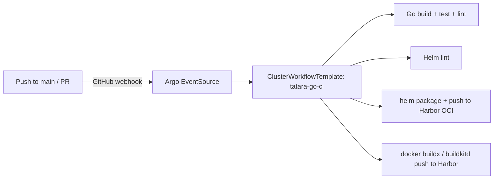

# tatara-argo-workflows

The CI/CD substrate for the tatara platform. Ships `ClusterWorkflowTemplate` resources and ns-scoped Secrets that every component repo's CI uses to build, test, lint, push container images, and publish Helm charts.

**Repository:** [`github.com/szymonrychu/tatara-argo-workflows`](https://github.com/szymonrychu/tatara-argo-workflows)

## What it provides

- `ClusterWorkflowTemplate` resources for Go CI (build, test, lint, chart package + push)
- ns-scoped Secrets in the `tatara` namespace for Harbor credentials and signing keys
- Onboarding driven from the infra repo's `events.github.repos` registry

## How CI works

Every component repo's `.github/workflows/` triggers Argo Workflows on push to main and on PR. The Argo EventSource listens for GitHub webhooks and fires the corresponding `ClusterWorkflowTemplate`:



## Build tooling

Images build via rootless `buildkitd` on a Ceph PVC (durable across restarts). The `--root` flag points buildkitd at the Ceph-backed PVC, avoiding the transient EIO errors that plagued the prior kaniko approach. TCP probes on the buildkitd Service (not exec probes).

## Chart versioning

Charts are packaged with `helm package --version 0.0.0-g<shortSHA>` (the `g` prefix avoids the "version segment starts with 0" semver validation error on all-digit leading-zero SHAs). Image tags stay as bare SHA strings. `tatara-helmfile` pins both the chart version and the image tag.

## Smoke test

```bash
argo submit -n tatara \
  --from clusterworkflowtemplate/tatara-go-ci \
  --parameter repo=szymonrychu/tatara-cli \
  --parameter ref=refs/heads/main \
  --parameter sha=<a-commit-sha>
```

## Deploy model

This chart owns its own Helm release, defined in the infra helmfile (`~/Documents/infra/helmfile/helmfiles/coding/`) - same separation as the upstream `argo-workflows` and `argo-events` substrate releases. It does not self-deploy via tatara-helmfile.

!!! note
    ARC runner flap: a newly added ARC runner can leave a stale `AutoscalingListener` (deleted ERS ref) that crash-loops and queues jobs forever. Fix: delete the stale `AutoscalingListener`.
    CI runners are control-plane-pinned; a flapping control-plane node evicts in-flight jobs (appears as a uniform ~18min "operation was canceled" failure across all jobs).
