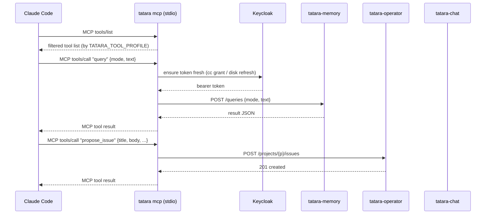

# tatara-cli

**Repository:** [`github.com/szymonrychu/tatara-cli`](https://github.com/szymonrychu/tatara-cli)

tatara-cli is a single Go binary with two distinct operational roles: a
human-facing CLI for authentication and REST exploration, and a headless MCP
server that every agent pod uses as its entire tool surface. The same binary
serves both roles; the mode is determined by the subcommand.

```
                        +-----------+
  human (device flow)   |           |   tatara-memory REST
  ─────────────────────>|  tatara   |───────────────────────>
                        |           |
  Claude Code / agent   |   (cli)   |   tatara-operator REST
  ─────────────────────>|           |───────────────────────>
    MCP over stdio      |  mcp sub  |
                        |           |   tatara-chat REST
                        +-----------+───────────────────────>
```

---

## Two roles

### Human CLI

For a developer or operator on their workstation the CLI provides:

- **OIDC device-flow login.** Opens a browser URL, waits for the Keycloak
  authorization, and writes a token to disk. No service account credentials
  required.
- **REST passthrough.** `tatara raw` calls any tatara backend endpoint with
  the stored token - useful for debugging or scripting.
- **Status inspection.** `tatara status` shows auth state and all resolved
  backend URLs without making any network calls.

### Agent MCP server

Inside every agent pod `tatara mcp` runs as a subprocess of Claude Code over
`stdio`. The wrapper bootstrap writes `/workspace/.mcp.json` pointing at
`tatara mcp` before the agent session starts. From that point, every MCP tool
call Claude Code makes is translated by the CLI into an authenticated REST
request against one of the three tatara backends (memory, operator, chat) and
the response is returned as the MCP tool result.

The MCP server:

- starts without valid credentials (serves `tools/list` unauthenticated; actual
  backend calls fail until credentials are available),
- automatically refreshes device-flow tokens from disk,
- automatically remints client-credentials tokens before expiry,
- writes structured JSON logs to `~/.local/state/tatara/mcp.log`,
- optionally exposes a Prometheus `/metrics` endpoint.



---

## Commands

### `tatara login`

Authenticates via OIDC device flow against Keycloak. Prints a URL and a user
code; after the browser authorization completes the token is saved to disk.

```sh
tatara login
# Open this URL in your browser to authorize:
#   https://auth.szymonrichert.pl/realms/master/device?user_code=ABCD-1234
# User code: ABCD-1234
# Waiting for authorization...
# Logged in. Token saved to /home/you/.config/tatara/token.json
```

OIDC parameters (defaults match the hosted platform; override for self-hosted):

| Parameter | Default |
|---|---|
| Issuer | `https://auth.szymonrichert.pl/realms/master` (override: `OIDC_ISSUER`) |
| Client ID | `tatara-cli` |
| Scope | `tatara` |

### `tatara logout`

Deletes the stored token file. Subsequent calls that require auth will fail
until `tatara login` is run again.

### `tatara status`

Shows auth state, the resolved project, the token file path, and all three
resolved backend base URLs. Makes no network calls.

```
Auth:     logged in (token valid for 14m23s)
Project:  tatara
Token:    /home/you/.config/tatara/token.json
Memory:   https://tatara.szymonrichert.pl/api/v1/memory/tatara
Operator: https://tatara.szymonrichert.pl/api/v1/operator
Chat:     https://tatara.szymonrichert.pl/api/v1/chat
```

### `tatara raw`

Authenticated REST passthrough. Sends a request to a tatara backend and prints
the response body to stdout, the HTTP status to stderr.

```sh
# default target is memory
tatara raw GET /memories

# explicit target
tatara raw --target operator GET /projects

# POST with a body
tatara raw --target operator POST /projects/tatara/issues \
  -d '{"repositoryRef":"szymonrychu/tatara-cli","title":"test","body":"...","kind":"improvement"}'

# read body from a file
tatara raw --target memory POST /memories -d @payload.json
```

| Flag | Description |
|---|---|
| `--target` | Backend: `memory` (default), `operator`, or `chat` |
| `-d` / `--data` | Request body: literal JSON, `@file`, or `-` for stdin |
| `--base-url` | Override memory base URL (see URL resolution below) |
| `--operator-base-url` | Override operator base URL |
| `--chat-base-url` | Override chat base URL |

### `tatara mcp`

Starts the MCP server over stdio. Intended to be launched by Claude Code, not
directly by a human.

```sh
tatara mcp
tatara mcp --tool-profile implement
tatara mcp --metrics-addr 127.0.0.1:9090
```

| Flag | Env | Description |
|---|---|---|
| `--tool-profile` | `TATARA_TOOL_PROFILE` | Restrict the exposed tool set to a named profile (see below). Empty = full set (fail-open). |
| `--metrics-addr` | `TATARA_MCP_METRICS_ADDR` | TCP address for the `/metrics` Prometheus endpoint. Empty disables it. |
| `--base-url` | `TATARA_MEMORY_URL` | tatara-memory base URL |
| `--operator-base-url` | `TATARA_OPERATOR_URL` | tatara-operator REST base URL |
| `--chat-base-url` | `TATARA_CHAT_URL` | tatara-chat REST base URL |

### `tatara mcp-config`

Writes (or merges) a `tatara` entry into `.mcp.json` in the given directory.
Points the entry at the current binary path so the config stays valid after the
binary is moved.

```sh
# register tatara for the current project
tatara mcp-config ~/.config/claude

# overwrite an existing entry that points at a different binary
tatara mcp-config --force ~/.config/claude
```

The generated entry:

```json
{
  "mcpServers": {
    "tatara": {
      "command": "/usr/local/bin/tatara",
      "args": ["mcp"]
    }
  }
}
```

`mcp-config` merges into an existing `.mcp.json` rather than overwriting it,
preserving any other `mcpServers` entries and any extra fields (env, cwd,
timeout) on an existing `tatara` entry. Only `command` and `args` are updated.

---

## MCP tool surface

The server registers tools from four groups, assembled at startup based on the
active profile.

### Memory tools (13)

Target: `tatara-memory`. Cover the knowledge graph CRUD and query surface.

| Tool | Operation |
|---|---|
| `create_memory` | Insert a text memory, returns `track_id` |
| `get_memory` | Retrieve by `track_id` |
| `delete_memory` | Delete by `track_id` |
| `bulk_create_memories` | Async batch ingest (supports reconcile mode) |
| `get_ingest_job` | Poll a bulk ingest job's status |
| `query` | Semantic search (`local`, `global`, `hybrid`, `naive`) |
| `describe` | Generative answer with source citations |
| `get_entity` | Entity by name |
| `search_entities` | Search entities by query string |
| `patch_entity` | Partial entity update |
| `list_edges` | All edges in the knowledge graph |
| `create_edge` | New edge between two entities |
| `delete_edge` | Delete edge by opaque ID |

### Code-graph tools (19)

Target: `tatara-memory` (code-graph endpoints). Expose the repository code
graph built by tatara-memory-repo-ingester.

| Tool | Operation |
|---|---|
| `code_search` | Search code entities by name/description, optional type filter |
| `code_entity` | Single entity with immediate edges |
| `code_neighbors` | Traverse along a relation |
| `code_callers` / `code_callees` | Reverse/forward call graph to depth N |
| `code_dependents` / `code_dependencies` | Reverse/forward import/dependency graph |
| `code_file_imports` | Imports from a file's package |
| `code_resource_graph` | Terraform/Helm subgraph for a resource |
| `code_cross_repo` | Cross-repo symbol links (provides/requires) |
| `code_path` | Shortest path between two entities |
| `code_important` | Top entities by degree or betweenness centrality |
| `code_stats` | Entity/edge counts, isolated nodes, import cycles |
| `code_ambiguous_edges` | Low-confidence edges for review |
| `code_explain` | Full context: detail, in/out neighbors, file locations |
| `code_related` | Semantic neighbors over conceptual/rationale edges |
| `code_hyperedges` | N-ary group relations (list or single fetch) |
| `code_communities` | Detected communities; optionally list members |
| `code_bridges` | High-betweenness bridge entities between communities |

### Operator tools (~30)

Target: `tatara-operator`. Cover project/task lifecycle, issue management, and
agent self-reporting. A selection of these appears in each profile (see gating
below). The four `alwaysOn` tools are present in every profile:

| Tool | Always available |
|---|---|
| `report_internal_issue` | Emit a structured log + metric for a platform issue |
| `project_get` | Read the current project |
| `repo_list` | List repositories in a project |
| `task_get` | Read the current task |

Additional operator tools (profile-gated):

| Tool | Description |
|---|---|
| `task_list` | List tasks in a project |
| `task_update` | Update task notes/status |
| `subtask_list` / `subtask_create` / `subtask_update` | Agent self-planning subtask ledger |
| `propose_issue` | File a new improvement proposal (brainstorm) |
| `comment_on_issue` | Post a comment on an existing issue |
| `comment` | Post a comment on the current task's linked issue |
| `issue_outcome` | Triage outcome: implement, close, or discuss |
| `change_summary` | Submit a structured PR/MR change summary |
| `review_verdict` | Post approve/request-changes/comment review on a PR |
| `pr_outcome` | Decide to merge or close a tatara-authored PR |
| `decline_implementation` | Explicit refusal with a reason (parks the task) |
| `already_done` | Declare the change is already present (parks the task) |
| `skip_research` | End a brainstorm with no proposal |
| `submit_handover` | Submit a handover document for the next agent |
| `list_issues` | List open/closed issues across project repos |
| `list_commits` | Recent default-branch commits across project repos |
| `close_issue` | Close an issue with a mandatory explanatory comment |
| `edit_issue` | Patch issue title, body, or labels |
| `create_issue` | Create an issue directly (splits, followups) |

### Chat tools (10)

Target: `tatara-chat`. Enable agent-to-agent communication rooms.

| Tool | Description |
|---|---|
| `chat_create_room` | Create a room, returns id |
| `chat_list_rooms` | List rooms (optionally by status) |
| `chat_get_room` | Get room + participants |
| `chat_close_room` | Archive a room |
| `chat_add_participant` | Join as a participant (orchestrator/implementer/reviewer/human) |
| `chat_list_participants` | List participants |
| `chat_remove_participant` | Remove a participant |
| `chat_send_message` | Send a message, optionally DM to a target participant |
| `chat_poll_messages` | Poll for new messages (advances cursor) |
| `chat_get_log` | Paginated full room log |

### Per-phase tool gating

The operator sets `TATARA_TOOL_PROFILE` in the agent pod env. The CLI reads
this at startup and filters the tool registry. Memory and code-graph tools are
always included in every named profile. Chat tools are included only for phases
where multi-agent coordination is expected. An empty or unknown profile is
fail-open: the full tool set is served with a WARN log.

| Profile | Task kind(s) | Chat | Operator tools included |
|---|---|---|---|
| `implement` | `implement` | No | `task_update`, subtask tools, `change_summary`, `decline_implementation`, `already_done`, `submit_handover` |
| `review` | `review` | No | `task_update`, `subtask_list`, `review_verdict`, `submit_handover` |
| `brainstorm` | `brainstorm`, `healthCheck` | Yes | `task_list`, subtask tools, `propose_issue`, `comment_on_issue`, `skip_research` |
| `triage` | `triageIssue` | No | `task_list`, `task_update`, subtask tools, `issue_outcome`, `comment`, `comment_on_issue` |
| `lifecycle` | `issueLifecycle` | Yes | All of: `task_list`, `task_update`, subtask tools, `issue_outcome`, `comment`, `comment_on_issue`, `change_summary`, `decline_implementation`, `already_done`, `pr_outcome`, `review_verdict`, `submit_handover` |
| `incident` | `incident` | Yes | `task_list`, `task_update`, subtask tools, `propose_issue`, `comment_on_issue`, `change_summary`, `decline_implementation`, `submit_handover` |
| `selfImprove` | `selfImprove` | No | `task_update`, subtask tools, `change_summary`, `pr_outcome`, `decline_implementation`, `already_done`, `submit_handover` |
| `refine` | `refine` | No | `task_list`, `list_issues`, `list_commits`, `close_issue`, `edit_issue`, `create_issue`, `comment_on_issue` |

!!! note "Security intent"
    Profile gating limits the blast radius of a prompt-injection attack. A
    `review` agent has no tool to push commits or open issues. A `brainstorm`
    agent cannot call `change_summary` or `pr_outcome`. This is a defense-in-
    depth measure, not a hard security boundary - the tool profile is set by the
    operator pod, not by the agent itself.

---

## URL and credential resolution

Backend URLs are resolved in this order for each backend:

1. CLI flag (`--base-url`, `--operator-base-url`, `--chat-base-url`)
2. Environment variable (`TATARA_MEMORY_URL`, `TATARA_OPERATOR_URL`, `TATARA_CHAT_URL`)
3. Config file (`~/.config/tatara/config.yaml`, fields `baseUrl`, `operatorBaseUrl`, `chatBaseUrl`)
4. Default (`https://tatara.szymonrichert.pl/api/v1/{memory|operator|chat}`)

The memory URL is further scoped by project: `TATARA_MEMORY_URL/<project>` (set
via `--project` / `-p` / `TATARA_PROJECT`).

Auth credentials are resolved in this order:

1. Token file at `~/.config/tatara/token.json` (written by `tatara login`).
2. Client-credentials grant: `OIDC_ISSUER` + `CLI_OIDC_CLIENT_ID` +
   `CLI_OIDC_CLIENT_SECRET`. Used by agent pods - no browser required.

The MCP server handles token refresh automatically: device-flow tokens are
refreshed via the stored refresh token; client-credentials tokens are reminted
before they expire (within 30 seconds of expiry).

---

## Install

=== "Homebrew (macOS / Linux)"

    ```sh
    brew tap szymonrychu/tap
    brew install tatara
    ```

=== "Build from source"

    Requires Go 1.25+ (or `mise install` in the repo to pin the exact version).

    ```sh
    git clone https://github.com/szymonrychu/tatara-cli
    cd tatara-cli
    make build   # binary at bin/tatara
    make test
    make lint    # golangci-lint
    ```

---

## How agents use it inside pods

The `tatara-claude-code-wrapper` bootstrap renders `/workspace/.mcp.json` at
pod startup before Claude Code starts. It points at the `tatara` binary already
installed in the image and injects the environment the CLI needs:

```json
{
  "mcpServers": {
    "tatara": {
      "command": "/usr/local/bin/tatara",
      "args": ["mcp"],
      "env": {
        "TATARA_MEMORY_URL": "http://tatara-memory.tatara.svc:8080/api/v1/memory",
        "TATARA_OPERATOR_URL": "http://tatara-operator.tatara.svc:8081/api/v1/operator",
        "TATARA_CHAT_URL": "http://tatara-chat.tatara.svc:8082/api/v1/chat",
        "TATARA_TOOL_PROFILE": "implement",
        "TATARA_PROJECT": "tatara",
        "TATARA_TASK": "tatara-tatara-cli-42",
        "OIDC_ISSUER": "https://auth.szymonrichert.pl/realms/master",
        "CLI_OIDC_CLIENT_ID": "tatara-agent",
        "CLI_OIDC_CLIENT_SECRET": "<injected from Secret>"
      }
    }
  }
}
```

Key points:

- The CLI binary is pre-installed in the wrapper image at a fixed path. The
  version in the image is pinned by `TATARA_CLI_VERSION` in the wrapper
  Dockerfile. Bumping that pin and merging to `main` rebuilds the image and
  ships the new CLI to all agents.
- `TATARA_TOOL_PROFILE` is set per-task by the operator pod's pod.go before
  spawning the agent. The CLI reads it at startup; changing it requires
  restarting the MCP process (i.e., restarting the pod).
- `TATARA_TASK` and `TATARA_PROJECT` are injected so that operator tools that
  accept `task` or `project` as optional arguments can fall back to these env
  vars. The agent rarely needs to pass them explicitly.
- Backend URLs use in-cluster DNS (`*.tatara.svc`). The default hosted URLs are
  never used inside pods.
- The MCP server can optionally expose a `/metrics` endpoint
  (`TATARA_MCP_METRICS_ADDR`), scraped by the Prometheus stack.
