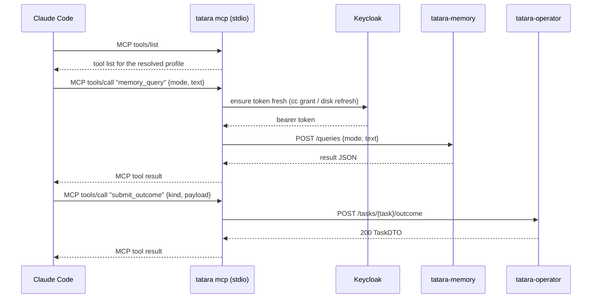

# tatara-cli

**Repository:** [`github.com/szymonrychu/tatara-cli`](https://github.com/szymonrychu/tatara-cli)

tatara-cli is a single Go binary with two distinct operational roles: a
human-facing CLI for authentication and REST exploration, and a headless MCP
server that every agent pod uses as its entire tool surface. The same binary
serves both roles; the mode is determined by the subcommand.

```
                        +-----------+
  human (device flow)   |           |   tatara-memory REST
  --------------------->|  tatara   |----------------------->
                        |           |
  Claude Code / agent   |   (cli)   |   tatara-operator REST
  --------------------->|           |----------------------->
    MCP over stdio      |  mcp sub  |
                        +-----------+
```

!!! abstract "Security model at a glance"
    The load-bearing facts for a reader evaluating this as an agent tool surface:

    - **`tools/list` is per-profile, not byte-identical across agent kinds.**
      Tools outside the resolved profile's allow-set are not registered at all,
      so the shape of `tools/list` itself differs per agent kind. This is a
      deliberate trade against the prior single-prompt-cache-prefix
      optimization; see [Per-kind tool gating](#per-kind-tool-gating).
    - **Fail-closed, uniformly.** `resolveProfile` fails **closed** whether
      `TATARA_TOOL_PROFILE` is empty, unset, or unrecognized: only the 6
      always-on tools register, and `submit_outcome` is not registered at all.
      There is no fail-open path any more.
    - **This is defense-in-depth, not a hard boundary.** The profile is set by
      the operator on the pod, not by the agent. It is not a substitute for SCM
      branch protection or the operator's own writeback gates.
    - **Credentials never reach the agent process.** Backend URLs and credential
      resolution are covered in [URL and credential resolution](#url-and-credential-resolution).

---

## Two roles

### Human CLI

For a developer or operator on their workstation the CLI provides:

- **OIDC device-flow login.** Opens a browser URL, waits for the Keycloak
  authorization, and writes a token to disk. No service account credentials
  required.
- **REST passthrough.** `tatara raw` calls any tatara backend endpoint with
  the stored token - useful for debugging or scripting.
- **Status inspection.** `tatara status` shows auth state and all resolved
  backend URLs without making any network calls.

### Agent MCP server

Inside every agent pod `tatara mcp` runs as a subprocess of Claude Code over
`stdio`. The wrapper bootstrap writes `/workspace/.mcp.json` pointing at
`tatara mcp` before the agent session starts. From that point, every MCP tool
call Claude Code makes is translated by the CLI into an authenticated REST
request against one of the two tatara backends (memory, operator) and the
response is returned as the MCP tool result. There is no third backend: chat
is decommissioned (see [How agents use it inside pods](#how-agents-use-it-inside-pods)).

The MCP server:

- **refuses to start on a contract-version mismatch** - see
  [Contract-version handshake](#contract-version-handshake),
- registers only the tools the resolved profile allows (fail-closed on an
  empty or unrecognized profile),
- automatically refreshes device-flow tokens from disk,
- automatically remints client-credentials tokens before expiry,
- writes structured JSON logs to `~/.local/state/tatara/mcp.log`,
- optionally exposes a Prometheus `/metrics` endpoint.



---

## Commands

### `tatara login`

OIDC device flow against Keycloak: prints a URL + user code, then writes the
token to `~/.config/tatara/token.json` on authorization. OIDC parameters
(defaults match the hosted platform; override for self-hosted):

| Parameter | Default |
|---|---|
| Issuer | `https://auth.szymonrichert.pl/realms/master` (override: `OIDC_ISSUER`) |
| Client ID | `tatara-cli` |
| Scope | `tatara` |

### `tatara logout`

Deletes the stored token file. Subsequent calls that require auth will fail
until `tatara login` is run again.

### `tatara status`

Shows auth state, the resolved project, the token file path, and the resolved
backend base URLs. Makes no network calls.

```
Auth:     logged in (token valid for 14m23s)
Project:  tatara
Token:    /home/you/.config/tatara/token.json
Memory:   https://tatara.szymonrichert.pl/api/v1/memory/tatara
Operator: https://tatara.szymonrichert.pl/api/v1/operator
```

### `tatara raw`

Authenticated REST passthrough. Sends a request to a tatara backend and prints
the response body to stdout, the HTTP status to stderr.

```sh
# default target is memory
tatara raw GET /memories

# explicit target
tatara raw --target operator GET /projects

# POST with a body
tatara raw --target operator POST /tasks/tatara-implement-2026-07-12-a1b2c/outcome \
  -d '{"kind":"implement","payload":{"action":"submitted","title":"..."}}'

# read body from a file
tatara raw --target memory POST /memories -d @payload.json
```

| Flag | Description |
|---|---|
| `--target` | Backend: `memory` (default) or `operator` |
| `-d` / `--data` | Request body: literal JSON, `@file`, or `-` for stdin |
| `--base-url` | Override memory base URL (see URL resolution below) |
| `--operator-base-url` | Override operator base URL |

### `tatara mcp`

Starts the MCP server over stdio. Intended to be launched by Claude Code, not
directly by a human.

```sh
tatara mcp
tatara mcp --tool-profile implement
tatara mcp --metrics-addr 127.0.0.1:9090
```

| Flag | Env | Description |
|---|---|---|
| `--tool-profile` | `TATARA_TOOL_PROFILE` | The agent kind naming the tool profile to register (see below). Empty or unrecognized fails **closed** to the always-on set. |
| `--metrics-addr` | `TATARA_MCP_METRICS_ADDR` | TCP address for the `/metrics` Prometheus endpoint. Empty disables it. |
| `--base-url` | `TATARA_MEMORY_URL` | tatara-memory base URL |
| `--operator-base-url` | `TATARA_OPERATOR_URL` | tatara-operator REST base URL |

### `tatara mcp-config`

Writes (or merges) a `tatara` entry into `.mcp.json` in the given directory.
Points the entry at the current binary path so the config stays valid after the
binary is moved.

```sh
# register tatara for the current project
tatara mcp-config ~/.config/claude

# overwrite an existing entry that points at a different binary
tatara mcp-config --force ~/.config/claude
```

The generated entry:

```json
{
  "mcpServers": {
    "tatara": {
      "command": "/usr/local/bin/tatara",
      "args": ["mcp"]
    }
  }
}
```

`mcp-config` merges into an existing `.mcp.json` rather than overwriting it,
preserving any other `mcpServers` entries and any extra fields (env, cwd,
timeout) on an existing `tatara` entry. Only `command` and `args` are updated.

### `tatara tool-manifest`

Prints the MCP tool surface - every registered tool's name and its top-level
enum fields (`action`, `kind`, `decision`, `verdict`, ...) - as JSON on
stdout. `submit_outcome`'s seven per-kind schemas are unioned into one
manifest entry since the tool name is shared across all seven profiles.

```sh
tatara tool-manifest
```

Not meant for interactive use. `release.yml` runs it after the semver tag
cut and uploads the output as a `tool-manifest.json` release asset - the
source of truth `tatara-agent-skills` CI fetches to lint skill-documented
tool calls against the real schema; see
[The tool-manifest drift lint](../reference/mcp-tools.md#the-tool-manifest-drift-lint).

---

## MCP tool surface

**20 tools total**, from five constructors: `CodeTools()` (4), `MemoryTools()`
(5), `PlatformTools()` (7, including `report_internal_issue`), `SCMTools()`
(3), `OutcomeTool(profile)` (1, the shaped `submit_outcome`). The prior
`AllTools()`, `ChatTools()`, and `HandoffTools()` constructors are deleted -
chat is decommissioned and `task_note` now carries the continuity job chat and
handoff tools used to. Server registration is
`NewServer(memory, operator *client.Client, log, profile)` - there is no `chat`
client argument.

Unlike the pre-redesign server, **tools outside a profile's allow-set are not
registered at all** - `tools/list` itself differs per agent kind, rather than
being filtered at call time behind a byte-identical list. `submit_outcome` is
shaped from `TATARA_TOOL_PROFILE` at registration time; with an empty or
unrecognized profile it is not registered.

For the authoritative per-kind allow-sets, exact counts, and tool schemas, see
the [MCP Tool Profiles reference](../reference/mcp-tools.md#the-profile-gating-table)
(source of truth). The groups, at a glance:

| Group | Tools |
|---|---|
| Always-on (every profile, including the fail-closed empty one) | `task_get`, `task_context`, `task_note`, `project_get`, `repo_list`, `report_internal_issue` |
| SCM (`SCMTools()`, 3) | `scm_read`, `issue_write`, `mr_write` - no `merge`, no `approve`, no `request_changes`; a review is posted by the operator from `submit_outcome` |
| Code-graph (`CodeTools()`, 4) | `code_search`, `code_context`, `code_graph`, `code_explain` |
| Memory (`MemoryTools()`, 5) | `memory_query`, `memory_describe`, `memory_write`, `memory_entity`, `memory_edges` |
| Platform (`PlatformTools()`, 7) | `task_get`, `task_list`, `task_context`, `task_note`, `project_get`, `repo_list`, `report_internal_issue` |
| Outcome (`OutcomeTool(profile)`, 1) | `submit_outcome` - one tool name, seven payload schemas, one per agent kind |

`task_note(kind, body)` replaces the entire prior chat (10 tools) and handoff
(4 tools) surface. It has no `agent` argument - the operator stamps the writer
from `status.agentKind`, so an agent can never produce a note claiming to be
the operator.

### Per-kind tool gating

The operator sets `TATARA_TOOL_PROFILE` in the agent pod env to the **agent
kind** (`status.agentKind`; 7 values). The CLI resolves that profile at
startup and registers only the allowed tools - gating happens at
**registration time**, not call time.

- **Empty or unset profile** -> fail-**closed**: only the 6 always-on tools
  register, logged as a WARN. `submit_outcome` is not registered.
- **Unrecognized profile string** -> fail-**closed**, identically. A typo can
  never grant a wider surface than the always-on set.

Per-profile counts, derived from the gating table (20 minus each profile's
denied cells): brainstorm 17, incident 18, clarify 14, implement 16, review
15, refine 13, documentation 18. The full tool-by-profile matrix lives in the
[MCP Tool Profiles reference](../reference/mcp-tools.md#the-profile-gating-table);
this page does not duplicate it.

!!! note "Security intent"
    Profile gating limits the blast radius of a prompt-injection attack. A
    `review` agent has no tool to merge or approve. A `brainstorm` agent
    cannot call `mr_write`. `refine` keeps `mr_write` restricted to
    `action=comment` only (a cli-side and operator-side check, not the
    schema) - it grooms the backlog, it does not push code. This is
    defense-in-depth, not a hard security boundary: the tool profile is set
    by the operator on the pod, not by the agent itself.

---

## Contract-version handshake

The wrapper image and the operator image ship in different helm releases and
can apply concurrently, so a moment where a new operator pairs with an old
agent image (old cli, old skills) is reachable. Without a check, that pod
would burn its entire turn budget against tool calls the old cli does not
have.

`tatara mcp` refuses to start on a mismatch: if `TATARA_CONTRACT_VERSION` is
set in the environment and does not equal the cli's compiled contract
version, it logs FATAL and exits non-zero, before registering any tools. An
**unset** value is allowed through - this is what makes a workstation or a
test run work with no contract-version env at all. Inside an agent pod the
operator always sets `TATARA_CONTRACT_VERSION=2`, so the check is live there
unconditionally.

This is one of three defenses in the full handshake; the other two
(the wrapper reporting `contractVersion` on `GET /v1/session`, and the
operator asserting it before turn-0) live in
[tatara-claude-code-wrapper](claude-code-wrapper.md#contract-version-handshake).

---

## URL and credential resolution

Backend URLs are resolved in this order for each backend:

1. CLI flag (`--base-url`, `--operator-base-url`)
2. Environment variable (`TATARA_MEMORY_URL`, `TATARA_OPERATOR_URL`)
3. Config file (`~/.config/tatara/config.yaml`, fields `baseUrl`, `operatorBaseUrl`)
4. Default (`https://tatara.szymonrichert.pl/api/v1/{memory|operator}`)

The memory URL is further scoped by project: `TATARA_MEMORY_URL/<project>` (set
via `--project` / `-p` / `TATARA_PROJECT`).

Auth credentials are resolved in this order:

1. Token file at `~/.config/tatara/token.json` (written by `tatara login`).
2. Client-credentials grant: `OIDC_ISSUER` + `CLI_OIDC_CLIENT_ID` +
   `CLI_OIDC_CLIENT_SECRET`. Used by agent pods - no browser required.

The MCP server handles token refresh automatically: device-flow tokens are
refreshed via the stored refresh token; client-credentials tokens are reminted
before they expire (within 30 seconds of expiry).

---

## Install

=== "Homebrew (macOS / Linux)"

    ```sh
    brew tap szymonrychu/tap
    brew install tatara
    ```

=== "Build from source"

    Requires Go 1.25+ (or `mise install` in the repo to pin the exact version).

    ```sh
    git clone https://github.com/szymonrychu/tatara-cli
    cd tatara-cli
    make build   # binary at bin/tatara
    make test
    make lint    # golangci-lint
    ```

---

## How agents use it inside pods

The `tatara-claude-code-wrapper` bootstrap renders `/workspace/.mcp.json` at
pod startup before Claude Code starts. It points at the `tatara` binary already
installed in the image and injects the environment the CLI needs:

```json
{
  "mcpServers": {
    "tatara": {
      "command": "/usr/local/bin/tatara",
      "args": ["mcp"],
      "env": {
        "TATARA_MEMORY_URL": "http://tatara-memory.tatara.svc:8080/api/v1/memory",
        "TATARA_OPERATOR_URL": "http://tatara-operator.tatara.svc:8080",
        "TATARA_TOOL_PROFILE": "implement",
        "TATARA_PROJECT": "tatara",
        "TATARA_TASK": "tatara-implement-2026-07-12-a1b2c",
        "TATARA_CONTRACT_VERSION": "2",
        "OIDC_ISSUER": "https://auth.szymonrichert.pl/realms/master",
        "CLI_OIDC_CLIENT_ID": "tatara-agent",
        "CLI_OIDC_CLIENT_SECRET": "<injected from Secret>"
      }
    }
  }
}
```

Key points:

- The CLI binary is pre-installed in the wrapper image at a fixed path. The
  version in the image is pinned by `TATARA_CLI_VERSION` in the wrapper
  Dockerfile. Bumping that pin and merging to `main` rebuilds the image and
  ships the new CLI to all agents.
- `TATARA_TOOL_PROFILE` is set to the **agent kind** (`status.agentKind`, not
  `spec.kind`) by the operator's pod builder before spawning the agent. The
  CLI reads it at startup; changing it requires restarting the MCP process
  (i.e., restarting the pod).
- `TATARA_TASK` and `TATARA_PROJECT` are injected so that operator tools that
  accept `task` or `project` as optional arguments can fall back to these env
  vars. The agent rarely needs to pass them explicitly.
- **There is no `TATARA_CHAT_URL` and no chat backend.** tatara-chat is fully <!-- stale-ok: tatara-chat -->
  decommissioned; the cli's `TargetChat` client, `ChatTools()`, and
  `HandoffTools()` are deleted along with the `chat` argument to
  `mcp.NewServer`. <!-- stale-ok: TargetChat, ChatTools, HandoffTools -->
  `task_note` on the always-on tool set does the continuity job chat used to.
- Backend URLs use in-cluster DNS (`*.tatara.svc`); the default hosted URLs are
  never used inside pods. The operator REST base is the service root on
  `:8080` with **no** `/api/v1/operator` suffix
  (`http://tatara-operator.tatara.svc:8080`). Operator ports `:8081`/`:8082`
  are the operator's own health and internal-callback binds, not client-facing
  service ports.
- The MCP server can optionally expose a `/metrics` endpoint
  (`TATARA_MCP_METRICS_ADDR`), scraped by the Prometheus stack.
