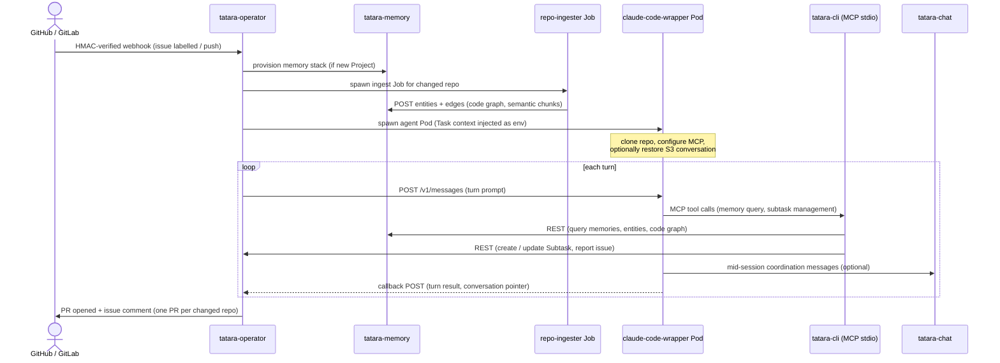
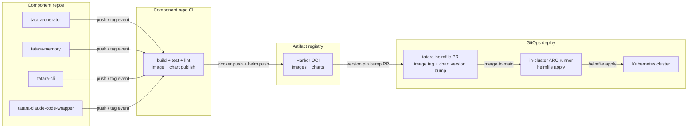
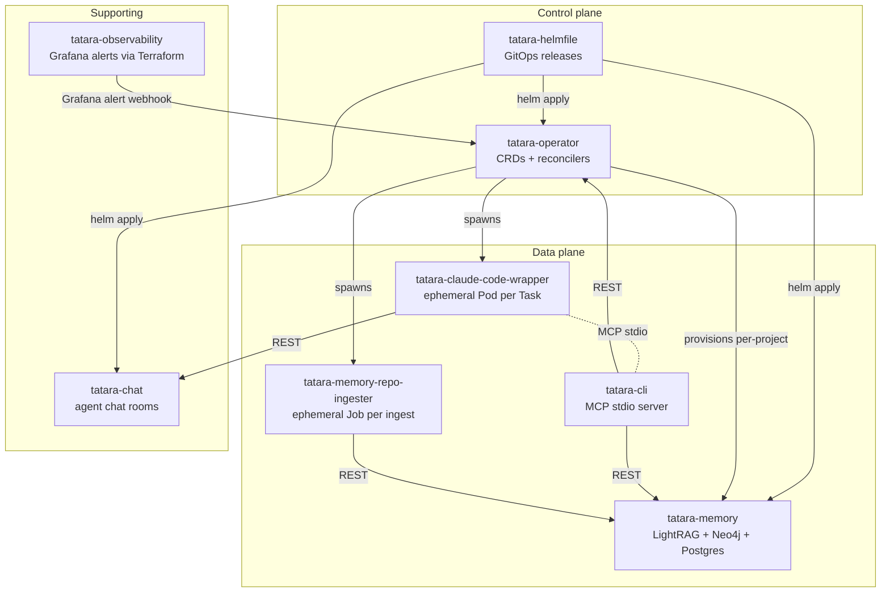

# Components

This section covers the eight independent GitHub repositories that make up the
running platform and its deploy/observability tooling. Each ships its own Helm
chart (or deploy mechanism), CI pipeline, and independent release lifecycle.
There is no umbrella helmfile and no monorepo. Components compose into the
platform at runtime but version, build, and deploy in isolation.

Two further repos support the platform without being runtime components and are
documented outside this section: `tatara-agent-skills` (the source of the wrapper
agent skills) and `tatara-documentation` (this site).

---

## Component table

| Component | Role | Language | Deploy unit | Build phase |
|---|---|---|---|---|
| [`tatara-operator`](operator.md) | CRD controller, webhook receiver, agent orchestrator, per-project memory stack provisioner | Go | Helm chart (`tatara-operator`) -> K8s Deployment | 6 |
| [`tatara-memory`](memory.md) | OIDC-gated REST memory service over LightRAG + Neo4j + Postgres | Go | Helm chart (`tatara-memory`) with CNPG, Neo4j, LightRAG subcharts -> K8s Deployment | 1 |
| [`tatara-cli`](cli.md) | OIDC device-flow auth, REST passthrough to any tatara backend, stdio MCP server for agent sessions | Go | Homebrew tap (`szymonrychu/tap`) + binary pre-installed in wrapper container image | 2 |
| [`tatara-claude-code-wrapper`](claude-code-wrapper.md) | Single-session Claude Code supervisor over PTY; submits turns, captures results via Stop hook | Go + Claude Code | K8s Pod - ephemeral, one per Task, spawned by operator | 4 |
| [`tatara-memory-repo-ingester`](repo-ingester.md) | Stateless batch ingester: language-aware static analysis, code graph + semantic chunk push to memory | Go | K8s Job - ephemeral, spawned per ingest cycle by operator | 3 |
| [`tatara-chat`](chat.md) | Durable OIDC-gated agent-to-agent chat rooms with cursor-based delivery and long-poll | Go | Helm chart (`tatara-chat`) -> K8s Deployment | 7 |
| [`tatara-helmfile`](helmfile.md) | GitOps helmfile: owns all platform Helm releases and enrollment CRs; deploys on merge via in-cluster ARC runner | Helmfile + YAML | GitHub Actions + in-cluster ARC runner | - |
| [`tatara-observability`](observability.md) | Observability-as-code: Grafana alert rules applied by Terraform on merge to main | Terraform + YAML | GitHub Actions | - |

!!! note "Build phases"
    Phase numbers reflect the order the platform was originally designed and built.
    `tatara-helmfile` and `tatara-observability` are operational repos (no runtime
    service, no container image) and carry no phase number.

---

## Plane model

The eight components fall into three functional layers.

### Control plane

The control plane holds the decisions and the desired-state declarations.
Nothing in the data plane runs without the control plane authorizing it.

| Component | Responsibility |
|---|---|
| `tatara-operator` | Single source of truth for task state. Reconciles four CRDs (`Project` / `Repository` / `Task` / `QueuedEvent`); a fifth, `Subtask`, is a data-only REST object with no reconciler. Decides what runs, when, and with what context. Receives SCM and Grafana webhooks, enforces concurrency and token-budget limits, drives the agent turn loop, supervises deploys, writes results back to the SCM as PRs and comments. |
| `tatara-helmfile` | Single source of truth for deployment state. Every Helm release version and every enrollment CR is pinned here. No component is deployed outside this repo's apply pipeline. |

### Data plane

The data plane does the work: storing knowledge, executing agent sessions, and
keeping the knowledge graph current.

| Component | Responsibility |
|---|---|
| `tatara-memory` | Permanent knowledge store. Agents read and write through it across all sessions. Persists entity graphs, code structure, and semantic chunks. One instance per `Project` CR, provisioned by the operator. |
| `tatara-cli` | Tool surface inside every agent session. Translates MCP tool calls (from Claude Code) into REST calls against tatara-memory and the operator. Agents never hold raw service credentials. |
| `tatara-claude-code-wrapper` | Agent execution boundary. Owns one interactive `claude` process per pod over a PTY (not `-p`/print mode - the full interactive harness). Submits turns, captures results via the cc-stop-hook, delivers callbacks to the operator. Optionally restores S3-backed conversation transcripts across pod restarts. |
| `tatara-memory-repo-ingester` | Knowledge pipeline. Runs as an ephemeral K8s Job on each repository at enrollment and on each push event. Produces the code-entity graph and semantic chunks that tatara-memory serves to agents. |

### Supporting infrastructure

Supporting components provide CI/CD, inter-agent coordination, and observability.
They do not participate in the core agent turn loop.

| Component | Responsibility |
|---|---|
| `tatara-chat` | Inter-agent coordination. Durable chat rooms (one per implementation stream) let parallel agent subagents exchange findings mid-session without polling the operator. |
| `tatara-observability` | Platform alerting. Defines Grafana alert rules as declarative YAML; on firing, alerts labelled `system=tatara` route to the operator's Grafana webhook endpoint, which opens an `incident` Task. |

---

## Per-component summaries

-   :material-cog-sync: **tatara-operator**

    ---

    The orchestration brain. Reconciles four CRDs with a controller-runtime
    manager: `Project`, `Repository`, `Task`, and `QueuedEvent` (a fifth,
    `Subtask`, is a data-only REST object; `WorkItem` is a Go struct, not a CRD).
    Provisions per-project memory stacks (CNPG Postgres, Neo4j, LightRAG,
    tatara-memory), ingests repos, receives HMAC-verified GitHub/GitLab and
    bearer-verified Grafana webhooks, admits queued work against concurrency and
    token-budget gates, spawns `tatara-claude-code-wrapper` pods, supervises the
    post-merge push-CD cascade, and writes results back as one PR per changed
    repository plus an issue comment.

    [:octicons-arrow-right-24: tatara-operator](operator.md)

-   :material-brain: **tatara-memory**

    ---

    An OIDC-gated REST service fronting LightRAG (entity/relation graph + semantic
    retrieval), Neo4j (graph storage), and CNPG Postgres (relational state + ingest
    job tracking). Every client authenticates with a Keycloak bearer token carrying
    `aud: tatara-memory`. The operator provisions one stack per `Project` CR;
    instances are not shared across projects.

    [:octicons-arrow-right-24: tatara-memory](memory.md)

-   :material-console: **tatara-cli**

    ---

    A Go CLI distributed via Homebrew tap (`szymonrychu/tap`) and pre-installed in
    the wrapper container image. Subcommands: `login` (OIDC device flow), `status`,
    `raw` (REST passthrough to memory, operator, or chat), `mcp` (starts the stdio
    MCP server Claude Code connects to), and `mcp-config` (writes `.mcp.json`).
    Inside every agent pod it is the sole MCP server - all tool calls flow through it.

    [:octicons-arrow-right-24: tatara-cli](cli.md)

-   :material-robot: **tatara-claude-code-wrapper**

    ---

    A Go supervisor that allocates a PTY, spawns an interactive `claude` process,
    submits turns via bracketed-paste input, and captures results from a custom
    cc-stop-hook. Exposes a turn-lifecycle HTTP API (`POST /v1/messages`,
    `GET /v1/messages/{turnId}`, etc.) that the operator drives. Conversation
    transcripts can be persisted to S3 and restored on the next pod so successive
    pods resume the same session rather than starting empty.

    [:octicons-arrow-right-24: Claude Code Wrapper](claude-code-wrapper.md)

-   :material-source-repository: **tatara-memory-repo-ingester**

    ---

    A stateless Go batch tool (`tatara-ingest`). Walks a repository with
    language-aware static analysis (Go, Python, JavaScript, Terraform, Helm,
    Markdown), produces a deterministic entity-and-edge code graph, and pushes it
    to tatara-memory via its REST API. Alternatively accepts a pre-generated SCIP
    index for languages with existing indexers. Runs as an ephemeral K8s Job;
    incremental ingest tracks the last-ingested commit to push only changed files.

    [:octicons-arrow-right-24: Repo Ingester](repo-ingester.md)

-   :material-chat-outline: **tatara-chat**

    ---

    A Go REST service backed by CNPG Postgres. Rooms are identified by UUID;
    participants receive server-generated handles. Message delivery is cursor-based:
    each participant's read cursor advances under a `FOR UPDATE` row lock, so
    concurrent polls never double-deliver. Supports long-poll (`?wait=<dur>`),
    direct messages, `orchestrator | implementer | reviewer | human` participant
    roles, and a configurable 24h idle TTL with automatic archival and retention
    sweep.

    [:octicons-arrow-right-24: tatara-chat](chat.md)

-   :material-ship-wheel: **tatara-helmfile**

    ---

    The single source of truth for what is running. A Helmfile repo with four
    releases (`tatara-operator`, `tatara-chat`, `project-tatara`,
    `project-infrastructure`). PRs post a sticky `helmfile diff` comment; merge
    to main triggers `helmfile apply` on the in-cluster ARC runner
    (`arc-runner-tatara-helmfile`), using that runner pod's in-cluster
    ServiceAccount. Both the Helm chart version (bare semver `X.Y.Z`) and the
    image tag (`vX.Y.Z`) pin live here, auto-bumped by the push-CD pipeline.

    [:octicons-arrow-right-24: tatara-helmfile](helmfile.md)

-   :material-chart-bell-curve: **tatara-observability**

    ---

    Grafana alert rules as declarative YAML files under `alerts/tatara-<component>.yaml`.
    Each file is one Grafana rule group rendered by a Terraform module into the
    Grafana `Tatara` folder. A PR posts a sticky `terraform plan`; merge runs
    `terraform apply`. Alerts labelled `system=tatara` route (via the infra
    notification policy) to the operator's Grafana webhook endpoint, which opens
    an `incident` Task.

    [:octicons-arrow-right-24: tatara-observability](observability.md)

---

## How they compose at runtime

At runtime the components form two concurrent flows: the **agent execution loop**
and the **CI/CD supply chain**.

### Agent execution loop

A developer (or the operator's periodic brainstorm scan) labels a GitHub or GitLab
issue. The operator picks it up and drives the following sequence:

### CI/CD supply chain

Component images and charts move from source repo to the cluster through the
CI/CD supply chain, never by hand. `tatara-argo-workflows` was decommissioned
(2026-07-05); it was homelab GitLab CI, never part of the tatara platform
runtime. The in-cluster `argo-workflows` Helm release remains as separate,
unrelated homelab infrastructure.

### Component interaction map

The diagram below shows the full platform topology grouped by plane, matching
the control / data / supporting classification above:

---

## Release model

Since the semver push-CD migration (2026-07-05), every component that ships a
container image publishes at a bare-semver image tag (`vX.Y.Z`) and its chart at
the matching bare semver (`X.Y.Z`). The release pipeline cuts the tag from a
`semver:*` label on the merged PR, auto-propagates the version pins into a
`tatara-helmfile` PR, coalesces sibling components into a deploy train, and lets
the operator close the originating issue on apply. `tatara-helmfile` pins the
chart version and the image tag independently - an image-only update does not
require a chart version bump, and vice versa.

The legacy `0.0.0-g<sha>` pre-release scheme (the `g` prefix avoids an all-digit
leading segment failing `helm package` semver validation) is still packaged on
every push to main, but the deployed pins are the bare-semver releases, not the
per-commit charts.

!!! warning "No hand deploys"
    Every release flows through `tatara-helmfile`. Direct `kubectl set-image`,
    `kubectl patch`, or `helm upgrade` invocations are prohibited except for
    incident response (unblocking a downed service), and any such live patch
    must be immediately re-asserted via a `tatara-helmfile` PR so live state
    matches the repo. See [Deployment & GitOps](../operations/deployment.md).
