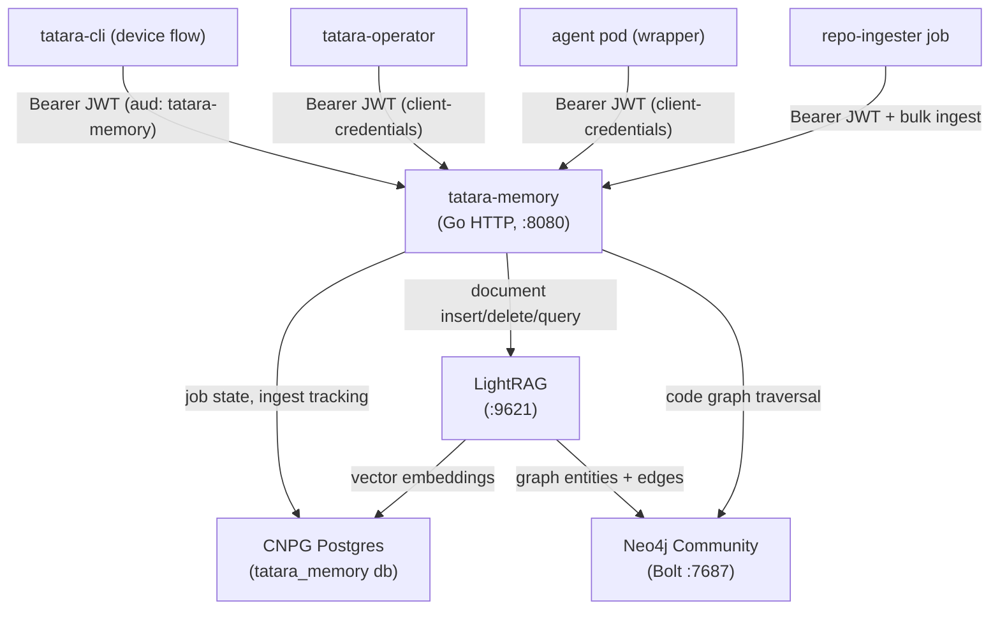

# tatara-memory

The knowledge service for the tatara platform. Provides OIDC-gated REST over [LightRAG](https://github.com/HKUDS/LightRAG), combining chunk-level semantic search with a structured code graph, all backed by a CloudNativePG Postgres cluster (pgvector) and a Neo4j community-edition instance.

**Repository:** [`github.com/szymonrychu/tatara-memory`](https://github.com/szymonrychu/tatara-memory)

---

## What it is

`tatara-memory` is a Go HTTP service that sits between all tatara components and the underlying storage layer. Callers never talk to LightRAG, Postgres, or Neo4j directly -- every read and write goes through this service's REST API, which enforces OIDC authentication and provides a stable, versioned interface over the storage backends.

Two classes of data live here:

- **Unstructured memories** -- text chunks from documentation, issue descriptions, PR diffs, and similar content. Stored as LightRAG documents; queried via vector similarity.
- **Code graph** -- entities (functions, types, packages, files, resources) and typed edges between them (calls, imports, implements, depends-on). Stored in Neo4j and queried via graph traversal and structural APIs.

The operator provisions one `tatara-memory` stack per `Project` CR. Agent pods communicate with their project's instance, so knowledge is scoped per project.



---

## OIDC authentication

All API endpoints (except `/healthz`, `/readyz`, and `/metrics`) require a bearer JWT. The service uses `coreos/go-oidc` for discovery and key rotation.

| Parameter | Value |
|-----------|-------|
| Realm | `master` at `https://auth.szymonrichert.pl` |
| Audience (`aud` claim) | `tatara-memory` |
| Human flow | `tatara-cli login` (OIDC device-authorization grant via `tatara-cli` public client) |
| Service account flow | Client-credentials grant against the `tatara-memory` confidential client |
| Scope | `tatara` scope carries an audience mapper that adds `tatara-memory` to `aud` |

The service validates `iss`, `exp`, and `aud` on every request. The authenticated subject from the JWT claim is logged with every business action.

!!! warning "No per-user RBAC in v1"
    All authenticated callers share the same permission level. A valid JWT grants full read and write access to all memories and the entire code graph. Project-scope isolation is enforced by deploying separate per-project instances, not by intra-instance ACLs.

---

## Backing stores

### CNPG Postgres (pgvector)

A CloudNativePG `Cluster` CR is deployed as a subchart (`cnpg/cluster` v0.6.1, aliased `postgres`). Both the `tatara-memory` service and LightRAG share a **single database** (`tatara_memory`) on the same Postgres cluster.

```yaml
# chart defaults (values.yaml)
pgHost: "tatara-memory-postgres-rw"
pgPort: 5432
pgDb: "tatara_memory"
pgUser: "tatara_memory"
```

The `pgvector` extension is installed at cluster init time via `postInitApplicationSQL`:

```yaml
postgres:
  cluster:
    initdb:
      database: tatara_memory
      owner: tatara_memory
      postInitApplicationSQL:
        - CREATE EXTENSION IF NOT EXISTS vector;
```

The `tatara-memory` service accesses Postgres directly for ingest-job state (queuing, progress, resume-on-restart). LightRAG uses the same database for its own vector and entity tables. The CNPG app secret (`tatara-memory-postgres-app`) is projected into both workloads as a password.

### Neo4j Community Edition

A Neo4j Community instance (`neo4j` chart v2026.4.0) is deployed as a subchart. It holds the code graph (entities, edges, hyperedges, communities).

| Parameter | Default |
|-----------|---------|
| Edition | `community` |
| Service type | `ClusterIP` |
| Bolt endpoint | `bolt://tatara-neo4j-lb-neo4j:7687` |
| Storage | 10 Gi via `defaultStorageClass` |

!!! note "Service naming collision"
    The Neo4j chart's `default` service would be named after the Helm release, colliding with the `tatara-memory` app service. The chart disables the `default` service and enables the `neo4j` service (exposed as the `-lb-neo4j` suffix) with `type: ClusterIP`. LightRAG and the memory service both connect to `tatara-neo4j-lb-neo4j:7687`.

The Neo4j password is not stored in `values.yaml`. It must be supplied via a SOPS-encrypted values overlay (key `neo4j.neo4j.password`) at deploy time. The deploying helmfile project manages the cluster-specific pull secret -- `imagePullSecrets` is intentionally empty in `values.yaml`.

### LightRAG

LightRAG is deployed as a local subchart (`lightrag` v0.1.0). It connects to the shared Postgres database and to Neo4j, and exposes an internal HTTP API on `:9621` that `tatara-memory` proxies through.

```yaml
lightrag:
  postgresHost: tatara-memory-postgres-rw
  neo4jUri: bolt://tatara-neo4j-lb-neo4j:7687
```

LightRAG requires an LLM API key (`LLM_BINDING_API_KEY`) for its embedding and graph-extraction pipeline. This is injected via a SOPS-encrypted secret (`lightrag.secrets.openai.existingSecret`) at deploy time.

---

## API surface

The service listens on `:8080`. All endpoints below require a valid bearer token unless stated otherwise.

### Operator-internal endpoints (no auth required)

| Endpoint | Purpose |
|----------|---------|
| `GET /healthz` | Liveness. Returns `200 OK` immediately. |
| `GET /readyz` | Readiness. Runs a configurable backend check; returns `503` with a JSON error body if not ready. |
| `GET /metrics` | Prometheus metrics. Scraped from the `monitoring` namespace via ServiceMonitor. |

These are not exposed through the public ingress. Reach them locally via port-forward:

```bash
kubectl -n tatara port-forward svc/tatara-memory 8080:http
curl http://localhost:8080/healthz
curl http://localhost:8080/readyz
curl http://localhost:8080/metrics
```

### Memory (chunk-level) endpoints

| Method | Path | Description |
|--------|------|-------------|
| `POST` | `/memories` | Insert a single memory chunk. Returns the created memory with assigned `id`. |
| `GET` | `/memories/{id}` | Fetch a memory by ID. |
| `DELETE` | `/memories/{id}` | Delete a memory by ID. |
| `POST` | `/memories:bulk` | Enqueue a bulk ingest job. Returns `202 Accepted` with a job object. |
| `GET` | `/ingest-jobs/{id}` | Poll job status. Terminal states: `succeeded`, `failed`. |

**Bulk ingest request body:**

```json
{
  "repo": "tatara-operator",
  "reconcile_files": ["internal/controller/task.go"],
  "items": [
    {
      "idempotency_key": "optional-caller-key",
      "content": "...",
      "metadata": { "repo": "tatara-operator", "file": "internal/controller/task.go" }
    }
  ]
}
```

When `reconcile_files` is set, the service purges prior memories for those files (in the named `repo`) before inserting the new items. This is the incremental-ingest path used by `tatara-memory-repo-ingester`. A bare JSON array of items is also accepted for back-compat callers.

The per-item ingest timeout defaults to `60s` (configurable via `ingestItemTimeout`). Worker concurrency is controlled by `workerPoolSize` (default 4). Jobs survive service restarts: state is persisted in Postgres and workers resume on startup. Maximum request body for bulk endpoints is 32 MiB.

### Query endpoints

| Method | Path | Description |
|--------|------|-------------|
| `POST` | `/queries` | Semantic query over memories. Returns ranked results with scores. |
| `POST` | `/queries:describe` | Returns a narrative summary over the retrieved chunks rather than raw results. |

### Entity and edge endpoints

Direct manipulation of the LightRAG knowledge graph nodes and edges.

| Method | Path | Description |
|--------|------|-------------|
| `GET` | `/entities` | Search entities by query string. |
| `GET` | `/entities/{id}` | Fetch entity by ID. |
| `PATCH` | `/entities/{id}` | Update entity metadata. |
| `GET` | `/edges` | List edges. |
| `POST` | `/edges` | Create an edge. |
| `DELETE` | `/edges/{id}` | Delete an edge. |

### Code graph endpoints

Structural queries against the Neo4j graph. All require `?repo=<name>`.

| Method | Path | Description |
|--------|------|-------------|
| `POST` | `/code-graph:bulk` | Push a code graph snapshot for a repo (entities + edges). |
| `GET` | `/code/entities` | Search code entities (`?q=`, `?type=`, `?limit=`). |
| `GET` | `/code/entity` | Fetch a single code entity (`?id=`). |
| `GET` | `/code/neighbors` | Direct neighbors of an entity (`?id=`, `?relation=`, `?direction=in\|out`, `?depth=`). |
| `GET` | `/code/callers` | Entities that call the given entity. |
| `GET` | `/code/callees` | Entities called by the given entity. |
| `GET` | `/code/dependents` | Entities that depend on the given entity. |
| `GET` | `/code/dependencies` | Entities the given entity depends on. |
| `GET` | `/code/resource-graph` | Kubernetes resource ownership graph rooted at an entity. |
| `GET` | `/code/file-imports` | Import edges for a file path (`?path=`). |
| `GET` | `/code/cross-repo` | Cross-repo links for an entity. |
| `GET` | `/code-graph/path` | Shortest path between two entities (`?from=`, `?to=`, `?relations=`, `?max_depth=`). |
| `GET` | `/code-graph/important` | Top-N entities by degree or betweenness centrality (`?by=degree\|betweenness`). |
| `GET` | `/code-graph/stats` | Graph statistics (node count, edge count, density). |
| `GET` | `/code-graph/ambiguous` | Edges with ambiguous or low-confidence classification. |
| `GET` | `/code-graph/explain` | Explanation context for an entity (inbound + outbound edge summary). |
| `GET` | `/code-graph/related` | Entities related via any path (`?relations=`, `?min_confidence=`). |
| `GET` | `/code-graph/hyperedges` | Hyperedges involving an entity. |
| `GET` | `/code-graph/hyperedge` | Fetch a single hyperedge by ID. |
| `POST` | `/code-graph/semantic-misses` | Given a list of `{file, sha}` pairs, return the subset not yet indexed. |
| `GET` | `/code-graph/communities` | Detected graph communities (Louvain partition). |
| `GET` | `/code-graph/community` | Members of a specific community by integer community ID. |
| `GET` | `/code-graph/bridges` | Bridge edges whose removal would disconnect the graph. |

Confidence filtering is available on most traversal endpoints via `?min_confidence=0.0-1.0` and `?tier=EXTRACTED|INFERRED|AMBIGUOUS`. List endpoints cap at 500 results; the default page size is 100.

---

## Per-project deployment shape

The operator creates one `tatara-memory` Helm release per `Project` CR. The release bundles all four subcharts into a single deployment unit within the project namespace.

```
tatara-memory              (Deployment, 1 replica, :8080)
tatara-memory-postgres-rw  (CNPG cluster, 1-3 instances, :5432)
tatara-neo4j-lb-neo4j      (Neo4j ClusterIP, :7687 Bolt)
tatara-memory-lightrag     (LightRAG Deployment, :9621)
```

Stack sizing (Postgres replicas, storage sizes) is supplied by the operator from the `Project` CR's `spec.memory` fields when it provisions the release.

### Ingress

The operator sets ingress configuration from `Project`-level values. The public path convention is `tatara.<domain>/api/v1/memory`. Operator-internal endpoints (`/healthz`, `/readyz`, `/metrics`) are not routed through the ingress.

```yaml
# Cluster-specific values supplied by the deploying helmfile project
ingress:
  enabled: true
  className: "nginx"
  host: "tatara.example.com"
  path: "/api/v1/memory"
  clusterIssuer: "letsencrypt-prod"
  tlsSecretName: "tatara-memory-tls"
```

`values.yaml` defaults have `ingress.enabled: false` and all host/class fields empty, enforcing the cluster-agnostic chart contract.

### Security context

The service pod runs fully hardened:

| Setting | Value |
|---------|-------|
| `runAsNonRoot` | `true` |
| `runAsUser` / `runAsGroup` / `fsGroup` | `65532` |
| `allowPrivilegeEscalation` | `false` |
| `capabilities.drop` | `[ALL]` |
| `readOnlyRootFilesystem` | `true` |

---

## Chart dependencies and NetworkPolicy

The `tatara-memory` chart (v0.3.1) declares three subchart dependencies:

| Subchart | Version | Source | Condition key |
|----------|---------|--------|---------------|
| `cnpg/cluster` (alias `postgres`) | `0.6.1` | `https://cloudnative-pg.github.io/charts` | `postgres.enabled` |
| `neo4j/neo4j` | `2026.4.0` | `https://helm.neo4j.com/neo4j` | `neo4j.enabled` |
| `lightrag` (local file) | `0.1.0` | `file://charts/lightrag` | `lightrag.enabled` |

All three are enabled by default.

### NetworkPolicy

When `networkPolicy.enabled=true` (the default), the chart creates a `NetworkPolicy` that restricts the `tatara-memory` pod to exactly the traffic it requires:

**Ingress permitted from:**

- `ingress-nginx` namespace -- public API calls
- `monitoring` namespace -- Prometheus scrape of `/metrics` on port `8080`

**Egress permitted to:**

- CNPG Postgres pods (label `cnpg.io/cluster=<release>-postgres`) on port `5432`
- Neo4j pod (label `helm.neo4j.com/neo4j.name=tatara-neo4j`) on port `7687` (Bolt)
- LightRAG pods (label `app.kubernetes.io/name=lightrag`) on port `9621`
- kube-dns on UDP/TCP `53`
- Any namespace on TCP `443` -- OIDC JWKS discovery against Keycloak

The LightRAG subchart ships its own NetworkPolicy with equivalent egress rules scoped to its pod.

```yaml
# Override label selectors if your cluster uses non-default names
networkPolicy:
  enabled: true
  postgresClusterName: ""   # defaults to <release>-postgres
  neo4jName: ""             # defaults to .Values.neo4j.neo4j.name
```

---

## Observability

A Prometheus `ServiceMonitor` is enabled by default:

```yaml
serviceMonitor:
  enabled: true
  interval: "30s"
  scrapeTimeout: "10s"
```

The service exposes counters for request counts, error rates, and panic recoveries, and histograms for request latencies. Every business action (memory create, delete, bulk ingest enqueue, code graph push) is logged at `INFO` using structured `log/slog` fields: `action`, `request_id`, `user` (JWT subject), `resource_id`, and `duration_ms`.

---

## Operational notes

### Corpus size and LightRAG throughput

LightRAG performs LLM-driven graph extraction (entity and relation identification) on every inserted chunk. This is the primary cost driver. For large repositories with thousands of files, initial ingest can take several hours and consume significant LLM API tokens. Monitor the ingest job queue via `GET /ingest-jobs/{id}` and watch the LightRAG pod logs for back-pressure signals.

### LightRAG idempotency responses

!!! warning "duplicated and partial_success are not errors"
    LightRAG returns `"duplicated"` or `"partial_success"` when content is already indexed. `tatara-memory` treats both as success. Earlier versions mapped these to errors, causing cascading failures on any re-ingest run. The `lightrag.secrets.openai.existingSecret` must be set before first ingest or LightRAG will fail to extract entities.

### CephFS and Neo4j page-cache poisoning

If Neo4j runs on a CephFS-backed PVC and an OSD crash or OSD recovery event occurs, Neo4j can serve stale or poisoned data from its page cache. The symptom is graph queries returning incomplete results or `EIO` errors with no apparent data loss. Resolution: restart the Neo4j pod to flush the page cache.

### CNPG single-instance on CephFS

Single-replica CNPG on CephFS is fragile. Unclean probe-kill restarts can leave stale CephFS write caps that cause `pwrite64` hangs during an end-of-recovery checkpoint. This presents as the Postgres pod wedged indefinitely, blocking all ingest jobs. Deterministic recovery: fail the MDS standby-replay instance (`ceph mds fail`) to drop the stale caps. Set `pgInstances: 3` on the Project CR to eliminate this failure mode.

### No per-user RBAC

`tatara-memory` v1 has a single authorization tier: any valid JWT with `aud: tatara-memory` has full read/write access. Per-user or per-team ACLs are not implemented. Project isolation is achieved by the operator deploying separate per-project instances.

### Resource defaults

```yaml
resources:
  requests:
    cpu: 100m
    memory: 256Mi
  limits:
    memory: 512Mi
```

No CPU limit is set by default. Size for production based on query concurrency and ingest throughput. Neo4j Community Edition is single-instance and not horizontally scalable.
