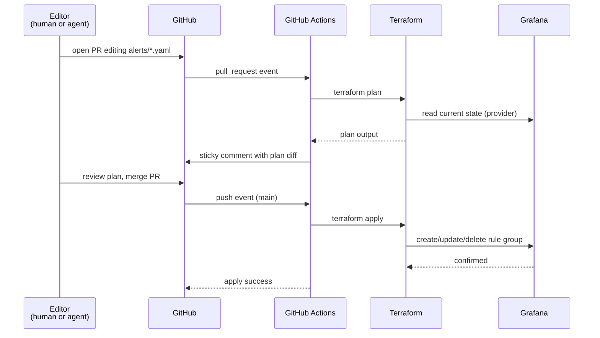

# tatara-observability

Alerts-as-code for the tatara platform. Grafana alert rules live in versioned YAML files
under `alerts/`, rendered into Grafana by Terraform on PR merge. Both humans and enrolled
agents change alerts through the same PR workflow - open a PR, review the `terraform plan`
diff, merge to apply.

**Repository:** [`github.com/szymonrychu/tatara-observability`](https://github.com/szymonrychu/tatara-observability)

---

## What it is

The repo contains one YAML file per component under `alerts/tatara-<component>.yaml`.
Each file maps to exactly one Grafana rule group in the `Tatara` folder. The
`modules/grafana_alert` Terraform module reads every `alerts/*.yaml` and renders the rules
into Grafana via the Grafana provider.

Current rule groups:

| File | Grafana rule group | Datasources |
|---|---|---|
| `alerts/tatara-operator.yaml` | `tatara-operator` | Prometheus |
| `alerts/tatara-wrapper.yaml` | `tatara-wrapper` | Prometheus |
| `alerts/tatara-memory.yaml` | `tatara-memory` | Prometheus |
| `alerts/tatara-ingester.yaml` | `tatara-ingester` | Prometheus |
| `alerts/tatara-chat.yaml` | `tatara-chat` | Prometheus |
| `alerts/tatara-cd.yaml` | `tatara-cd` | Prometheus |
| `alerts/tatara-quality.yaml` | `tatara-quality` | Prometheus |
| `alerts/tatara-usage-gate.yaml` | `tatara-usage-gate` | Prometheus |
| `alerts/tatara-logs.yaml` | `tatara-logs` | Loki |

`tatara-cd` covers the push-CD cascade (deploy-train stalls, apply failures),
`tatara-quality` the model-keyed review/CI quality-feedback signals, and
`tatara-usage-gate` the token/usage-budget gate.

All rules land in the Grafana **Tatara** folder, which is managed exclusively by this repo.
The `infra/terraform/grafana` state never touches the Tatara folder, so the two states never
collide.

---

## Alert-as-code flow



---

## Rule schema

Each `alerts/tatara-<component>.yaml` file is a rule group definition. The file is parsed
by `grafana.tf` with `yamldecode` and passed to `modules/grafana_alert`.

### Group-level fields

| Field | Type | Default | Description |
|---|---|---|---|
| `interval_seconds` | integer | `60` | Evaluation interval for all rules in the group |
| `default_no_data_state` | string | `"NoData"` | State when a query returns no data. The **module** default is `"NoData"`; every tatara group file sets it to `"OK"` by convention to avoid noise on scrape gaps |
| `default_datasource_uid` | string | `"prometheus"` | Fallback datasource for rules that do not specify one |

### Rule-level fields

| Field | Required | Type | Description |
|---|---|---|---|
| `name` | yes | string | Alert name shown in Grafana and in incident task titles |
| `queries` | yes | list | One or more query definitions (see below) |
| `threshold` | yes | number | Numeric threshold for the comparison |
| `math_operator` | no | string | Comparison operator: `>`, `<`, `>=`, `<=`, `==`, `!=`. Default `">"` |
| `for` | no | string | Hold-off duration before the alert fires. Default `"1m"`. Use Prometheus duration syntax (`5m`, `15m`, `1h`) |
| `decimal_points` | no | integer | Rounding precision applied to the query result before comparison. Default `2` |
| `annotations` | no | map | Grafana alert annotations. Supports Go template expressions (see below) |
| `labels` | no | map | Alert labels for routing. **Replaces** module defaults; set all four required keys |
| `no_data_state` | no | string | Per-rule override for the no-data state |
| `exec_err_state` | no | string | State when query execution errors. Module default is `"Error"`; tatara group files commonly set `"OK"` by convention |
| `is_paused` | no | bool | Pause the rule without deleting it. Default `false` |

### Query object fields

| Field | Required | Type | Default | Description |
|---|---|---|---|---|
| `expression` | yes | string | - | PromQL or LogQL expression |
| `datasource_uid` | no | string | `"prometheus"` | Override datasource. Use the Grafana datasource UID |
| `query_type` | no | string | `"prometheus"` | `"prometheus"` or `"loki"` |
| `relative_time_range_from` | no | integer | `1200` | Query look-back in seconds (1200 = 20 min). Increase for metrics with long update intervals |
| `relative_time_range_to` | no | integer | `0` | End of query range relative to now (0 = now) |

### Query pipeline

The module builds a four-stage pipeline for every rule:

```
expression (PromQL/LogQL)
   └─► Reduce    (last value of each series)
       └─► Round (to decimal_points precision)
           └─► Threshold (math_operator compared against threshold)
```

`expression` provides the raw value. The comparison is expressed entirely through
`math_operator` and `threshold`. For example, "alert when the error ratio exceeds 20%":

```yaml
math_operator: ">"
threshold: 0.2
```

And "alert when fewer than one replica is up" (reverse comparison):

```yaml
math_operator: "<"
threshold: 1
```

### Annotation templates

Grafana annotation values are Go templates evaluated at alert time. The module exposes two
template variables:

- `{{ index $values "C" }}` - the numeric result of the reduce/round stage (the value compared against the threshold)
- `{{ index $labels "<key>" }}` - a label value from the firing series (useful for `pod`, `reason`, `component`, etc.)

```yaml
annotations:
  summary: >
    tatara-operator reconcile error ratio is {{ index $values "C" }} (>0.20) over 15m.
    Reconciles are failing en masse.
```

### Example: Prometheus rule

```yaml
interval_seconds: 60
default_no_data_state: "OK"
rules:
  - name: "Operator reconcile error ratio high"
    queries:
      - expression: |
          sum(increase(operator_reconcile_total{namespace="tatara",job="tatara-operator",result="error"}[15m]))
          / clamp_min(sum(increase(operator_reconcile_total{namespace="tatara",job="tatara-operator"}[15m])), 1)
    math_operator: ">"
    threshold: 0.2
    for: 15m
    decimal_points: 2
    annotations:
      summary: "Reconcile error ratio is {{ index $values \"C\" }} (>0.20) over 15m."
    labels:
      homelab: "true"
      system: "tatara"
      component: "operator"
      severity: "warning"
```

### Example: Loki rule

For log-based alerts, override `datasource_uid` and set `query_type: "loki"` on the query
object. The `expression` becomes a LogQL stream selector + pipeline:

```yaml
rules:
  - name: "Tatara agent reported platform problem"
    queries:
      - expression: |
          sum by (description, category, severity) (
            count_over_time(
              {namespace="tatara", app="tatara-claude-code-wrapper"}
              | pattern `<_> <_> <_> <body>`
              | line_format `{{.body}}`
              | json
              | action="internal_issue_report"
              [5m]
            )
          )
        datasource_uid: "efihqbqlmroqod"
        query_type: "loki"
    math_operator: ">"
    threshold: 0
    for: 1m
    decimal_points: 0
    annotations:
      summary: "Agent reported a platform problem: {{ index $labels \"description\" }}"
    labels:
      homelab: "true"
      system: "tatara"
      component: "wrapper"
      severity: "warning"
```

---

## Label requirements for routing

Every rule must carry four labels. The labels **replace** the module defaults - there is no
merge. Omitting a label removes it from the rule.

| Label | Required value | Effect |
|---|---|---|
| `homelab` | `"true"` | Matches the root homelab notification policy in Grafana |
| `system` | `"tatara"` | Routes to the tatara operator incident webhook. Omit for info-only rules |
| `component` | e.g. `"operator"`, `"memory"`, `"ingester"` | Identifies the firing component in incident task context |
| `severity` | `"warning"`, `"critical"`, or `"info"` | `warning`/`critical` trigger an incident Task; `info` routes to email only |

!!! warning "Per-rule labels replace defaults"
    The `labels` map on a rule **replaces** the module's `default_labels` (`homelab: "true"`).
    If you set a `labels` block without `homelab: "true"`, the rule will not match the homelab
    notification policy and will fire silently. Always set all four labels explicitly.

!!! note "Info rules"
    Rules that should surface in Grafana but not page on-call omit `system: "tatara"`.
    Without that label the `system=tatara` child policy does not match, and the alert falls
    through to the homelab email route.

### Severity and incident routing

When an alert with `homelab=true` + `system=tatara` + `severity=warning|critical` fires,
Grafana sends a POST to the operator's alert webhook (`/operator/webhooks/tatara/grafana`).
The operator validates the bearer token, deduplicates by alert group, enqueues a `QueuedEvent`
of class `alert`, and spawns an `incident` Task. The agent runs with access to a
`grafana-mcp` sidecar for in-session Grafana queries.

---

## CI

GitHub Actions in `.github/workflows/apply.yml` drives the full terraform lifecycle.

### Triggers

The workflow runs on PRs and pushes to `main` for changes to:

- `alerts/**`
- `**.tf`
- `modules/**`
- `.github/workflows/apply.yml`

### Steps

| Event | Steps |
|---|---|
| Pull request | `fmt -check` -> `init` -> `validate` -> `plan` -> sticky PR comment |
| Push to `main` | `fmt -check` -> `init` -> `validate` -> `apply` |

The plan comment is posted (and updated on each push) via
`marocchino/sticky-pull-request-comment` with header `tatara-observability-plan`. The
concurrency group `tatara-observability-tf` is set to `cancel-in-progress: false` so
concurrent applies queue rather than cancel.

### Required secrets

| Secret | Purpose |
|---|---|
| `AWS_ACCESS_KEY_ID` | S3 Terraform state backend (bucket `szymonrychu-terraform-state`, key `terraform/tatara-observability`) |
| `AWS_SECRET_ACCESS_KEY` | S3 Terraform state backend |
| `TF_VAR_GRAFANA_API_KEY` | Grafana Editor service account token |
| `TF_VAR_GRAFANA_URL` | Grafana base URL |

---

## Ownership boundary

This repository has a deliberately narrow scope.

```
tatara-observability (this repo)
├── Grafana folder: "Tatara"
└── Rule groups: tatara-*

infra/terraform/grafana (separate repo + state)
├── Contact points (operator incident webhook, email)
├── Notification policies
│   ├── homelab root policy (homelab=true)
│   └── system=tatara child route -> operator webhook contact point
└── All other Grafana folders and rule groups
```

!!! warning "Do not touch routing here"
    Contact points and notification policies are outside this repo's scope. Changes to alert
    routing must go to `infra/terraform/grafana`. The two Terraform states manage disjoint
    resources and must not overlap.

The separation is intentional: tatara agents are enrolled on GitHub repos only.
`infra/terraform/grafana` lives on GitLab and is not enrolled on the tatara Project.
Moving alert rules to this GitHub repo lets agents propose and review changes to their own
observability without access to global homelab infrastructure.

---

## How agents edit alerts

tatara agents are enrolled on this repository as a standard `Repository` CR. The standard
PR-based workflow applies:

1. An agent (or a human) edits one or more files in `alerts/`.
2. The agent opens a PR via the SCM API.
3. GitHub Actions runs `terraform plan` and posts the diff as a sticky PR comment.
4. A human reviewer reads the plan diff - it shows exactly which Grafana rule groups will
   change, what threshold values shift, and what labels are added or removed.
5. On approval and merge, `terraform apply` pushes the changes to Grafana immediately.

No Terraform knowledge is required to author a rule. The YAML schema is the only interface.
The plan comment makes the Grafana impact visible before any change reaches production.

!!! tip "Reviewing agent-proposed alert changes"
    The sticky plan comment renders a collapsed `<details>` block with the full `terraform
    plan -no-color` output. Focus on `# grafana_rule_group` resource diffs. A rule rename or
    label change shows as a destroy + create pair; a threshold change shows as an in-place
    update. Verify that `system` and `homelab` labels are present on all routed rules.

---

## Operations notes

**Loki datasource UID is hardcoded.** Rules in `tatara-logs.yaml` use
`datasource_uid: "efihqbqlmroqod"`. This is the UID of the Loki datasource in the target
Grafana instance. If you install tatara-observability against a different Grafana, update
this value to match your Loki datasource UID (find it in Grafana under
Configuration -> Data sources).

**Ingest alert mode selector.** The rule "Tatara ingest job failing" in
`tatara-ingester.yaml` uses `mode="full"` in its PromQL selector. This is intentional and
must not be removed. Failed incremental ingest jobs self-heal via the full-ingest fallback
and are benign; alerting on them produces chronic noise. Only terminal full-ingest failures
(which mean the recall corpus is going stale) warrant a page.

**No-data defaults to OK.** All tatara rule groups set `default_no_data_state: "OK"`. This
suppresses spurious alerts during scrape gaps (component restarts, transient probe failures).
A component that is genuinely down will fire via the `up == 0` or pod-not-ready rules, not
via no-data state.
