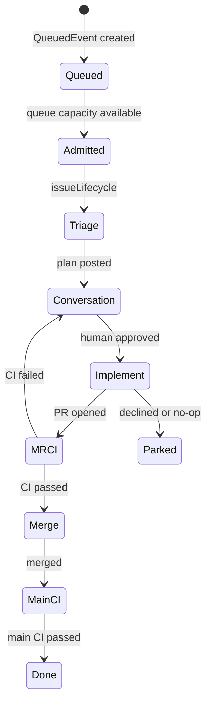

# tatara-operator

The central component of the tatara platform. A controller-runtime Kubernetes operator that owns four CRDs, drives the agentic development lifecycle, receives SCM webhooks, manages per-project memory stacks, and enforces the security model.

**Repository:** [`github.com/szymonrychu/tatara-operator`](https://github.com/szymonrychu/tatara-operator)

## What it does

- Reconciles `Project`, `Repository`, `Task`, `QueuedEvent`, `Subtask`, and `WorkItem` CRs
- Receives HMAC-verified GitHub and GitLab webhooks on a shared HTTP listener
- Provisions per-project memory stacks (CNPG Postgres + Neo4j + LightRAG + tatara-memory service)
- Schedules repo-ingest jobs (`tatara-memory-repo-ingester`) on push and on cron
- Spawns `tatara-claude-code-wrapper` pods for agent turns
- Drives the turn loop: submits prompts, receives callbacks, transitions task states
- Writes results back to the SCM: opens PRs, posts comments, applies labels, merges on approval
- Exposes an OIDC-gated REST API (used by tatara-cli and agent pods)
- Serves Prometheus metrics on `/metrics` and alert webhook on a separate port

## Layout

```
cmd/manager/                       # controller-runtime entrypoint + wiring
api/v1alpha1/                      # CRD types: Project/Repository/Task/Subtask/QueuedEvent/WorkItem
internal/controller/               # reconcilers + turn loop + writeback
internal/agent/                    # agent Pod/Service builder + turn session/callback
internal/ingest/                   # repo-ingest Job builder
internal/memory/                   # per-project memory stack builders
internal/scm/                      # GitHub/GitLab clients + provider registry
internal/restapi/                  # OIDC-gated CRUD REST API
internal/webhook/                  # HMAC-verified push + work-item webhook server
internal/auth/                     # OIDC verifier + client-credentials token source
internal/config/                   # env-scalar config
internal/obs/                      # JSON slog + Prometheus metrics
charts/tatara-operator/            # cluster-agnostic Helm chart + CRDs
```

## Reconciliation model

Each controller reconciles its resource type independently. The most complex is the **Task reconciler**, which drives a state machine across the full lifecycle of an agent session:



For non-lifecycle tasks (`implement`, `review`, `brainstorm`, `incident`), the state machine is simpler: `Planning` -> `Running` -> `Succeeded`/`Failed`.

## Leader election and metrics

The operator runs multi-replica with leader election. Metrics that can only be observed on the leader (reconcile state, queue depth) are exported with `sum by()` / `max by()` aggregates so Prometheus correctly handles the non-leader replicas reporting zero.

## Helm chart

The chart at `charts/tatara-operator/` is cluster-agnostic. Cluster-specific configuration (ingress host, storage class, imagePullSecrets, OIDC URLs) comes from the `tatara-helmfile` values files.

The chart packages both the operator itself and `charts/tatara-project/` as a sibling chart. The `tatara-project` chart templates `Project` and `Repository` CRs declaratively from helmfile values (replacing raw YAML presync manifests).

## CRD ownership

CRDs are bundled in `charts/tatara-operator/templates/crds.yaml` and applied via `helm upgrade`. On initial install or first upgrade, pre-existing CRDs need a one-time ownership annotation (`helm.sh/resource-policy: keep` + managed-by Helm annotations) before the chart can adopt them.

## Key configuration

| Env / Value | Description |
|---|---|
| `OIDC_ISSUER` | Keycloak issuer URL |
| `OIDC_AUDIENCE` | Expected audience in bearer tokens from agent pods |
| `WEBHOOK_SECRET` | HMAC secret for GitHub/GitLab webhook validation |
| `S3_BUCKET` | Conversation persistence bucket (off by default) |
| `GRAFANA_WEBHOOK_SECRET` | Bearer secret for Grafana alert webhook |
| `LOG_LEVEL` | `debug`/`info`/`warn`/`error` |

## Metrics

Key Prometheus metrics exposed on `:8080/metrics`:

| Metric | Type | Description |
|---|---|---|
| `operator_reconcile_total` | counter | Reconcile counts by controller and result |
| `operator_task_turns_total` | counter | Agent turn completions by kind and result |
| `operator_queue_depth` | gauge | Current `QueuedEvent` count by class and state |
| `operator_webhook_events_total` | counter | Webhook events by provider and result |
| `operator_ingest_jobs_total` | counter | Ingest job completions by result |
