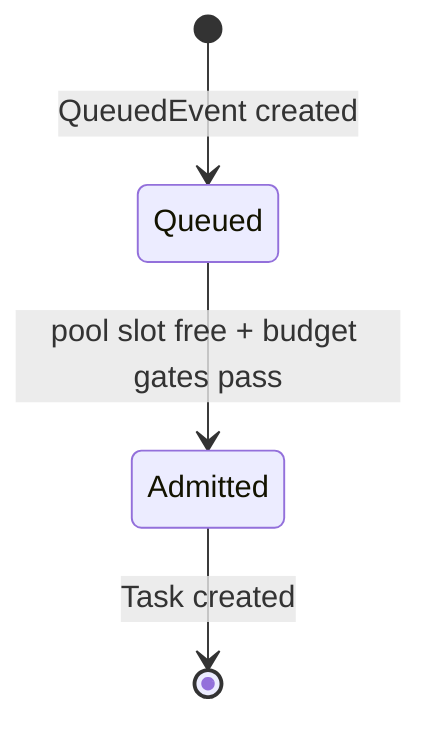
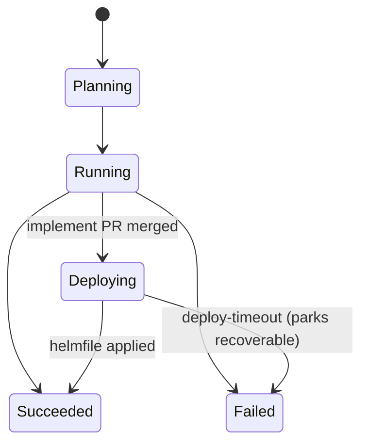

# tatara-operator

The central component of the tatara platform. A controller-runtime Kubernetes operator that reconciles the platform CRDs, drives the agentic development lifecycle, receives SCM and Grafana webhooks, provisions per-project memory stacks, gates spend, supervises deploys, and enforces the security model.

**Repository:** [`github.com/szymonrychu/tatara-operator`](https://github.com/szymonrychu/tatara-operator)

## What it does

- Reconciles four CRDs with a controller-runtime manager: `Project`, `Repository`, `Task`, and `QueuedEvent`. A fifth CRD, `Subtask`, is a data-only object written and read over the REST API (the agent self-planning ledger); it has no reconciler. `WorkItem` is **not** a CRD - it is a plain Go struct that backs the `Task.Status.WorkItems` project-level work-item ledger.
- Receives HMAC-verified GitHub and GitLab webhooks and bearer-verified Grafana alert webhooks on a shared HTTP listener
- Provisions per-project memory stacks (CNPG Postgres + Neo4j + LightRAG + tatara-memory service)
- Schedules repo-ingest jobs (`tatara-memory-repo-ingester`) on push and on cron
- Admits queued work against per-project concurrency and token-budget gates, then spawns `tatara-claude-code-wrapper` pods for agent turns
- Drives the turn loop: submits prompts, receives callbacks, transitions task states
- Writes results back to the SCM: opens PRs, posts comments, applies labels, merges on approval
- Supervises the post-merge push-CD cascade to a `tatara-helmfile` apply
- Reaps orphaned pods and GCs terminal Tasks and stale conversation transcripts
- Exposes an OIDC-gated REST API (used by tatara-cli and agent pods)

## Listener ports

The manager binds four separate addresses. Only the public HTTP listener is routed through the ingress.

| Bind | Env / default | Serves |
|---|---|---|
| Public HTTP | `HTTP_ADDR` `:8080` | SCM + Grafana webhooks and the OIDC-gated REST API (tatara-cli, agent pods) |
| Metrics | `METRICS_ADDR` `:9090` | Prometheus `/metrics` |
| Health | `HEALTH_ADDR` `:8081` | `/healthz`, `/readyz` |
| Internal callback | `INTERNAL_ADDR` `:8082` | Agent turn-complete callbacks (in-cluster only) |

## Layout

```
cmd/manager/                       # controller-runtime entrypoint + wiring
api/v1alpha1/                      # CRD types: Project/Repository/Task/QueuedEvent/Subtask (+ WorkItem struct)
internal/controller/               # reconcilers + turn loop + writeback + queue dispatcher + reaper
internal/agent/                    # agent Pod/Service builder + turn session/callback
internal/ingest/                   # repo-ingest Job builder
internal/memory/                   # per-project memory stack builders
internal/budget/                   # token-budget admission gate
internal/scm/                      # GitHub/GitLab clients + provider registry
internal/restapi/                  # OIDC-gated CRUD REST API
internal/webhook/                  # HMAC-verified SCM + bearer-verified Grafana webhook server
internal/auth/                     # OIDC verifier + client-credentials token source
internal/config/                   # env-scalar config
internal/obs/                      # JSON slog + Prometheus metrics
charts/tatara-operator/            # cluster-agnostic Helm chart + CRDs
```

## Reconciliation model

Each controller reconciles its resource type independently. The most complex is the **Task reconciler**, which drives every kind's own `Status.Phase` machine and, for a Task whose PR clears review, a separate operator-only deploy-supervision machine (Go field `Status.DeployState`, JSON/CRD key `lifecycleState`) that takes over after merge (see [Phase vs. lifecycleState](#phase-vs-lifecyclestate) below).

Admission happens first, on the `QueuedEvent`:



Every task kind (`brainstorm`, `incident`, `clarify`, `implement`, `review`, `documentation`, `refine`) then runs a pod-backed `Status.Phase` machine:



Retired kinds (`selfImprove`, `triageIssue`, `healthCheck`, `issueLifecycle`) remain valid `Task.Spec.Kind` enum values so pre-existing stored Tasks can still be read, but no production code path creates a new Task of any of these kinds any more: `triageIssue` and the front half of `issueLifecycle` were absorbed into `clarify`, `healthCheck` was absorbed into `brainstorm`, and the back half of `issueLifecycle` (`Merge`/`MainCI`/`Deploying`) survives as the operator-only deploy supervisor described below - not an agent kind.

## Phase vs. lifecycleState

Every Task carries a generic `Status.Phase` (`Planning`, `Running`, `Succeeded`, `Failed`,
`Deploying`) tracking the current pod's run - or, for `Deploying`, the pod-less deploy
supervisor's run. Once a Task's PR has been review-approved, auto-merged, and main CI has gone
green, the operator additionally starts populating the deploy-supervision status field - a
10-value enum: `Triage`, `Conversation`, `Implement`, `MRCI`, `Merge`, `MainCI`, `Deploying`,
`Done`, `Stopped`, `Parked` (the front four are legacy-drain-only, stamped only by in-flight
pre-redesign `issueLifecycle` Tasks) - as the deploy supervisor takes over: `Phase` and this
field both read `Deploying` at that point, in parallel, and neither alone is terminal.

!!! note "Wire key vs. Go name"
    The Go struct field is `DeployState` (`api/v1alpha1/task_types.go`), but its JSON/CRD key is
    unchanged: `lifecycleState`. `kubectl get task -o jsonpath='{.status.lifecycleState}'` and any
    Grafana panel or automation reading this field must use `lifecycleState`, not `deployState` -
    the Go name is controller-internal only and never appears on the wire.

Most kinds (`clarify`/`implement`/`review`/`brainstorm`/`incident`/`refine`) never populate this
field at all - only a Task whose PR gets review-approved enters deploy supervision, and even
then it is the operator, not an agent kind, driving it.

A Task is terminal when `Phase` is `Succeeded`/`Failed`, or once deploy supervision has begun,
when `lifecycleState` is `Done`/`Stopped`/`Parked`. The `TaskTerminal` helper is the source of
truth; controller code and any external audit must use it rather than testing `Phase` alone.

## Queue admission and concurrency

Agent work is not spawned directly from a webhook. Producers stash a `QueuedEvent` (class `normal` or `alert`) and an in-operator dispatcher admits events against per-project pool capacity, so a burst of issues cannot fan out into unbounded concurrent agent pods.

| Pool | Class | Capacity source | Default |
|---|---|---|---|
| Normal | `normal` | `spec.queue.capacity`, else `spec.maxConcurrentTasks`, else 3 | 3 |
| Alert | `alert` | `spec.queue.alertCapacity` | 1 |

Over-capacity events wait in `Queued` and are admitted when a slot frees; the alert pool has reserved slots so an incident is never starved by a backlog of normal work.

!!! warning "`maxConcurrentTasks: 0` fully pauses a Project"
    A zero value (the field's zero value, whether unset or set to `0`) is a hard pause: the dispatcher admits **no** work of either class, so no agent pod, brainstorm, or incident Task is created while the Project sits at `0`. A positive value sets normal-pool concurrency. This is the operational kill switch for a runaway or a maintenance window.

## Token conservation and budget gates

The operator has three independent spend controls, from coarsest to finest:

1. **Concurrency cap** - `spec.maxConcurrentTasks` (above). Bounds how many agent pods can run at once.
2. **Per-Task token ceiling** - `spec.agent.maxTaskTokens`. A cumulative output-token ceiling per Task; when a Task crosses it the operator terminates the pod and marks the Task failed with reason `TokenBudgetExceeded`. This is the runaway backstop, independent of the admission gate.
3. **Per-Project token-budget admission gate** - `spec.tokenBudget` plus operator env. When enabled, the dispatcher pauses admission before spawning new work once the Project crosses a usage threshold within a window. Two thresholds: `proactivePercent` pauses the normal pool (brainstorm/implement/review/...), `emergencyPercent` pauses the alert pool (incidents) so incidents keep running longer than routine work.

The gate has two modes, selected by the `TOKEN_BUDGET_MODE` operator env (default `customWindow`):

| Mode | Meters against |
|---|---|
| `customWindow` | The operator's own per-turn token accounting, reset on `TOKEN_BUDGET_RESET_SCHEDULE` (cron) |
| `claudeSubscription` | The Claude Code 5-hour and weekly usage windows |

!!! note "What is actually enforced today"
    The per-Task `maxTaskTokens` ceiling and the concurrency cap are the always-on controls. The `tokenBudget` admission gate is present and functional but ships inert unless a `spec.tokenBudget` block and a token limit are configured; it is off across the reference fleet at the time of writing. See [operations/tuning.md](../operations/tuning.md) for the current fleet posture and the honest scope of what is deployed.

## Deploy supervision (push-CD)

An `implement` Task does not go terminal when its PR merges. It enters `Deploying` and the operator drives the post-merge push-CD cascade: it tracks the artifact through `CascadeStage` (`tagged` -> `parent-pr-open` -> `parent-merged` -> `helmfile-applied`) toward a terminal `tatara-helmfile` apply, then resolves the Task's `lifecycleState` (Go field `DeployState`) to `Done` and closes the originating issue. A wall-clock deadline of `now + spec.deployBudgetSeconds` (with a `spec.deploySingleHopBudgetSeconds` per-artifact override) bounds the wait; on exceed the Task parks recoverable with reason `deploy-timeout`. This is how a merged change is followed all the way to running in the cluster rather than being assumed deployed at merge.

## Reaper and GC

A background sweep keeps state bounded: it reaps orphaned agent pods (pods whose owning Task is gone or terminal, after a grace period), GCs terminal Tasks, and GCs stale conversation transcripts. Each path is metered (`operator_orphan_reaped_total`, `operator_tasks_gc_total`, `operator_conversation_gc_total`) so leaks are visible.

## Leader election and metrics

The operator runs multi-replica with leader election. Metrics that can only be observed on the leader (reconcile state, queue depth) are exported with `sum by()` / `max by()` aggregates so Prometheus correctly handles the non-leader replicas reporting zero.

## Helm chart

The chart at `charts/tatara-operator/` is cluster-agnostic. Cluster-specific configuration (ingress host, storage class, imagePullSecrets, OIDC URLs) comes from the `tatara-helmfile` values files.

The chart packages both the operator itself and `charts/tatara-project/` as a sibling chart. The `tatara-project` chart templates `Project` and `Repository` CRs declaratively from helmfile values (replacing raw YAML presync manifests).

## CRD ownership

CRDs are templated in the chart and applied via `helm upgrade`. On initial install or first upgrade, pre-existing CRDs need a one-time ownership annotation (`helm.sh/resource-policy: keep` + managed-by Helm annotations) before the chart can adopt them.

## Key configuration

Operator configuration is env scalars. The webhook signing secrets are **not** operator env: they are read per-Project from Kubernetes Secrets referenced by the Project CR (see the note below).

| Env / Value | Description |
|---|---|
| `OIDC_ISSUER` | Keycloak issuer URL |
| `OIDC_AUDIENCE` | Expected audience in bearer tokens from agent pods |
| `S3_BUCKET` | Conversation persistence bucket (empty disables the feature; off by default) |
| `TOKEN_BUDGET_MODE` | `customWindow` (default) or `claudeSubscription` |
| `TOKEN_BUDGET_RESET_SCHEDULE` | Cron for the `customWindow` reset |
| `LOG_LEVEL` | `debug`/`info`/`warn`/`error` |

!!! note "Webhook secrets are per-Project, not operator env"
    There is no global `WEBHOOK_SECRET` or `GRAFANA_WEBHOOK_SECRET`. The SCM HMAC secret is read from the Secret named by `Project.spec.scmSecretRef` (key `webhookSecret`); the Grafana alert-webhook bearer secret is read from `Project.spec.grafana.secretRef` (key `webhookSecret`). Each Project supplies its own.

## Metrics

The operator exposes roughly sixty Prometheus series on `:9090/metrics`. A representative subset:

| Metric | Type | Labels | Description |
|---|---|---|---|
| `operator_reconcile_total` | counter | controller, result | Reconcile counts by controller and result |
| `operator_task_turns_total` | counter | project, repo, kind, issue | Agent turns completed |
| `operator_task_tokens_total` | counter | project, repo, kind, issue, model, type | Agent token usage (input/output/cache) |
| `operator_task_terminal_total` | counter | kind, phase, reason | Tasks reaching a terminal phase |
| `operator_queue_depth` | gauge | project, class | Queued (not-yet-admitted) events per pool |
| `operator_queue_inflight` | gauge | project, class | Admitted in-flight events per pool |
| `operator_admission_blocked_total` | counter | project, class, reason | Events the gate declined to admit (`token_budget`, `project_paused`) |
| `operator_token_budget_used_ratio` | gauge | project, scope | Budget usage vs the window limit |
| `operator_webhook_events_total` | counter | provider, kind, action, result | Webhook events |
| `operator_ingest_job_total` | counter | result, mode | Finished ingest Jobs by result and mode |
| `operator_scm_writes_total` | counter | - | SCM writeback operations |
| `operator_turn_timeout_total` | counter | - | Turns aborted on inactivity timeout |
| `operator_orphan_reaped_total` | counter | - | Orphaned pods reaped |
| `operator_review_outcome_total` | counter | project, repo, model, verdict | Review verdicts, keyed by review model |
| `operator_implement_ci_total` | counter | - | Implement-PR CI outcomes (quality feedback) |
