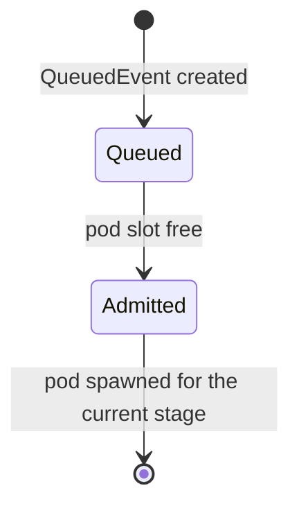

# tatara-operator

The central component of the tatara platform. A controller-runtime Kubernetes operator that reconciles the platform CRDs, drives every Task through its 15-stage lifecycle, receives SCM and Grafana webhooks, provisions per-project memory stacks, gates agent-pod concurrency, walks the post-review merge sequence, and enforces the security model.

**Repository:** [`github.com/szymonrychu/tatara-operator`](https://github.com/szymonrychu/tatara-operator)

## What it does

- Reconciles **six** CRDs, all `tatara.dev/v1alpha1`, namespaced: `Project`, `Repository`, `Task`, `QueuedEvent`, `Issue` (short name `iss`), `MergeRequest` (short name `mr`). `Subtask` is deleted. `WorkItem` was never a CRD - it was an embedded Go slice on `Task.Status` - and it is gone entirely along with the field. <!-- stale-ok: Subtask, WorkItem -->
- Receives HMAC-verified GitHub and GitLab webhooks and bearer-verified Grafana alert webhooks on a shared HTTP listener.
- Provisions per-project memory stacks (CNPG Postgres + Neo4j + LightRAG + tatara-memory service).
- Schedules repo-ingest jobs (`tatara-memory-repo-ingester`) on push and on cron.
- Admits queued work against per-project agent-pod concurrency (`maxConcurrentAgents`), then spawns `tatara-claude-code-wrapper` pods for agent turns.
- Drives the Task stage machine end to end: `triaging` classifies the origin and mints `Issue` CRs, a kind-specific agent stage runs a pod, `approved` gates admission, `implementing` -> `reviewing` -> `merging` -> `deploying` -> `delivered`, with a nightly batch `documenting` stage.
- Writes results back to the SCM through a mirror-first REST layer: opens MRs, posts comments, posts review verdicts as `COMMENT`-type reviews (never a forge-native approve), and merges directly once a review approves and CI is green.
- Walks the sequential per-repo merge order (`spec.mergeOrder`) after review, re-verifying the live head SHA and CI status immediately before each merge.
- Reaps orphaned agent pods and GCs terminal Tasks and stale-labelled Issues/MergeRequests per a fixed retention table.
- Exposes an OIDC-gated REST API (used by tatara-cli and agent pods).

## Listener ports

The manager binds four separate addresses. Only the public HTTP listener is routed through the ingress.

| Bind | Env / default | Serves |
|---|---|---|
| Public HTTP | `HTTP_ADDR` `:8080` | SCM + Grafana webhooks and the OIDC-gated REST API (tatara-cli, agent pods) |
| Metrics | `METRICS_ADDR` `:9090` | Prometheus `/metrics` |
| Health | `HEALTH_ADDR` `:8081` | `/healthz`, `/readyz` |
| Internal callback | `INTERNAL_ADDR` `:8082` | Agent turn-complete callbacks (in-cluster only) |

## Layout

```
cmd/manager/                       # controller-runtime entrypoint + wiring
api/v1alpha1/                      # CRD types: Project/Repository/Task/QueuedEvent/Issue/MergeRequest
internal/controller/               # the sweep, admission dispatcher, stage machine, merge walker, reaper
internal/agent/                    # agent Pod/Service builder + turn session/callback
internal/ingest/                   # repo-ingest Job builder
internal/memory/                   # per-project memory stack builders
internal/scm/                      # GitHub/GitLab clients + provider registry
internal/restapi/                  # OIDC-gated CRUD REST API
internal/webhook/                  # HMAC-verified SCM + bearer-verified Grafana webhook server
internal/auth/                     # OIDC verifier + client-credentials token source
internal/config/                   # env-scalar config
internal/obs/                      # JSON slog + Prometheus metrics
charts/tatara-operator/            # cluster-agnostic Helm chart + CRDs
```

## The Task stage machine

Every `Task` carries `status.stage`, one of 15 values: `triaging`, `brainstorming`, `clarifying`, `investigating`, `refining`, `approved`, `implementing`, `reviewing`, `merging`, `deploying`, `delivered`, `documenting`, `rejected`, `failed`, `parked`. Only the operator writes `status.stage` - an agent never does. A transition outside the fixed table is rejected and counted (`operator_illegal_stage_transition_total`).

`Task.spec.kind` is the **origin**, immutable, one of `brainstorm`, `incident`, `clarify`, `refine`, `review`, `documentation`. `Task.status.agentKind` is the **currently running agent**, one of those six plus `implement` - `implement` exists only as an agent kind, never as a Task origin. Most pod-spawning stages map 1:1 to an agent kind and a pod named `<task-name>-<agent-kind>` (e.g. `<task>-implement`, `<task>-review`); `triaging`, `approved`, `merging`, and `deploying` run no pod at all - they are pure operator logic.

For full details on the transition table, the three-clock deadline model (admission / readiness / work), and the per-stage retention windows, see [Architecture: the stage machine](../architecture/ownership.md) and [Approval gates](../operations/security/approval-gates.md#the-approval-grammar).

Admission is a separate concern from the stage machine: a producer stashes a `QueuedEvent` (class `normal` or `alert`), and the dispatcher admits it against the project's agent-pod pool before any pod is spawned.



## Queue admission and concurrency

Agent work is not spawned directly from a webhook. Producers stash a `QueuedEvent` and an in-operator dispatcher admits events against per-project pod-slot capacity, so a burst of issues cannot fan out into unbounded concurrent agent pods.

| Pool | Class | Capacity source | Default |
|---|---|---|---|
| Normal | `normal` | `spec.queue.capacity`, else `spec.maxConcurrentAgents`, else 3 | 3 |
| Alert | `alert` | `spec.queue.alertCapacity` | 1 |

Over-capacity events wait in `Queued` and are admitted when a pod slot frees; the alert pool has reserved slots so an incident is never starved by a backlog of normal work.

!!! warning "`maxConcurrentAgents: 0` fully pauses a Project"
    A zero value is a hard pause: the dispatcher admits **no** work of either class, so no agent pod - and therefore no Task-minting sweep pass either - runs while the Project sits at `0`. There is no `Minimum=1`; `0` is a first-class, intentional value. This is the operational kill switch for a runaway or a maintenance window.

Two further caps bound the mint side, independent of the concurrency gate:

| Setting | Default | Bounds |
|---|---|---|
| `maxOpenTasks` | 6 | ACTIVE Tasks (every stage that is pod-eligible - not parked/delivered/rejected/failed). A creation budget, not the same lever as `maxConcurrentAgents`. Parked `backlog-sweep` Tasks do not count: they hold ownership of an Issue, not work. |
| `maxNewTasksPerSweep` | 5 | Tasks ONE sweep pass may mint. |

`agentPodTTLSeconds` (default 3600, minimum 300) bounds one pod's life, not the Task: a Task persists across as many pods as it takes, each one picking up continuity from `Task.status.notes`. `maxBundleBytes` (default 400000, roughly 100k tokens) is the hard byte budget for a rendered context bundle; the oldest comments elide first, behind an explicit marker.

## Turn and pod-recreation budgets

Token-metered spend gates (`maxTaskTokens`, the `tokenBudget` admission mode) are gone. <!-- stale-ok: maxTaskTokens --> The backstops that replace them are turn- and pod-count based, on `Project.spec.agent`:

| Setting | Default | Scope |
|---|---|---|
| `maxTurnsPerPod` | 40 | Caps one pod run. The `implement` agent kind is **exempt** - a long healthy coding run is not cut off. |
| `maxTurnsPerTask` | 300 | Lifetime cap across every pod of a Task, all kinds included. This is what actually bounds the `implement` exemption. |
| `maxReviewRounds` | 3 | The `reviewing <-> implementing` cycle. |
| `maxPodRecreations` | 3 | Respawns of a never-Ready pod within the current stage before the Task fails. |

## The review post and the merge

There is exactly **one** bot identity on the platform, and GitHub/GitLab both reject an `APPROVE` or `REQUEST_CHANGES` review from the same identity that opened the PR (422). So the operator never attempts either: it posts a `COMMENT`-type review carrying the verdict text, and the actual approval of record is the merge itself. Auto-merge is never armed on any tatara-opened PR. <!-- stale-ok: auto-merge -->

```
verdict=approve          -> operator posts a COMMENT review, then MERGES directly
verdict=request_changes  -> operator posts a COMMENT review with inline findings,
                             Task returns to implementing
```

A `review`-kind Task - a human's own PR under review - can never reach `merging` by any path: it parks at `awaiting-human` instead, bounded by `maxHumanReviewRounds` (5), and only a human's next comment un-parks it. Merging is exclusively an operator action; no MCP tool exposes it to an agent.

Once a Task's review approves, the operator walks `spec.mergeOrder` sequentially: for each repo it re-reads the live head SHA (never the mirror), confirms CI is green, and merges. If the live head moved since the reviewed SHA, the Task returns to `reviewing` rather than merging a stale review. See [Merge and deploy](../workflows/merge-and-deploy.md#the-merge-sequence) for the full walker.

!!! danger "Accepted risk: the merge gate is operator logic, not a forge-enforced control"
    Because the platform has one bot identity, branch protection cannot require an approving review - nothing could ever satisfy it, so enabling it would deadlock every merge. Defense-in-depth is instead: no-direct-push branch protection on every repo, a scoped GitHub App installation token (not an org-wide PAT), and `gh`/`glab`/direct-to-forge-API `curl` on the agent pod's deny-list. A pod holding a merge-capable token could still bypass the gate by calling the merge endpoint directly; this is detected, not prevented, by `operator_unexpected_merge_total`. See [Approval gates](../operations/security/approval-gates.md).

## Reaper and GC

A background sweep keeps state bounded. Every terminal stage ages out on a fixed clock: `parked` (except `backlog-sweep`, which is exempt - it owns an Issue at zero agent cost and is reaped only when that Issue closes) after 7 days, `failed` after 7 days, `rejected` after 24 hours, `delivered` after 48 hours (and only once the nightly documentation batch has covered it, or it provably has nothing to document). The reaper also GCs orphaned agent pods (pods whose owning Task is gone or terminal, after a grace period). Each path is metered so leaks are visible - see [Metrics](#metrics).

## Leader election and metrics

The operator runs multi-replica with leader election. Metrics that can only be observed on the leader (reconcile state, queue depth) are exported with `sum by()` / `max by()` aggregates so Prometheus correctly handles the non-leader replicas reporting zero.

## Helm chart

The chart at `charts/tatara-operator/` is cluster-agnostic. Cluster-specific configuration (ingress host, storage class, imagePullSecrets, OIDC URLs) comes from the `tatara-helmfile` values files.

The chart packages both the operator itself and `charts/tatara-project/` as a sibling chart. The `tatara-project` chart templates `Project` and `Repository` CRs declaratively from helmfile values (replacing raw YAML presync manifests).

## CRD ownership

CRDs are templated in the chart and applied via `helm upgrade`. On initial install or first upgrade, pre-existing CRDs need a one-time ownership annotation (`helm.sh/resource-policy: keep` + managed-by Helm annotations) before the chart can adopt them.

## Key configuration

Operator configuration is env scalars. The webhook signing secrets are **not** operator env: they are read per-Project from Kubernetes Secrets referenced by the Project CR (see the note below).

| Env / Value | Description |
|---|---|
| `OIDC_ISSUER` | Keycloak issuer URL |
| `OIDC_AUDIENCE` | Expected audience in bearer tokens from agent pods |
| `LOG_LEVEL` | `debug`/`info`/`warn`/`error` |

!!! note "Webhook secrets are per-Project, not operator env"
    There is no global `WEBHOOK_SECRET` or `GRAFANA_WEBHOOK_SECRET`. The SCM HMAC secret is read from the Secret named by `Project.spec.scmSecretRef` (key `webhookSecret`); the Grafana alert-webhook bearer secret is read from `Project.spec.grafana.secretRef` (key `webhookSecret`). Each Project supplies its own.

!!! note "The contract-version handshake"
    Every agent pod is injected with `TATARA_CONTRACT_VERSION=2`. Before submitting a pod's first turn, the operator reads `GET /v1/session` from the wrapper and asserts the reported `contractVersion` matches. On mismatch (or a missing field, meaning an old wrapper), the Task fails instantly with `stageReason=agent-contract-mismatch`, before a single turn is submitted - see [tatara-claude-code-wrapper](claude-code-wrapper.md#contract-version-handshake).

## Metrics

The operator exposes Prometheus series on `:9090/metrics`. A representative subset - see [Observability](observability.md) for the alerting-relevant set in full:

| Metric | Type | Labels | Description |
|---|---|---|---|
| `operator_reconcile_total` | counter | controller, result | Reconcile counts by controller and result |
| `operator_task_stage` | gauge | stage, kind | Current Task count per stage and kind - replaces every prior phase/lifecycle series |
| `operator_task_stage_age_seconds` | gauge | task, stage, kind | Time in the current stage, observable against the F.4 deadline table |
| `operator_illegal_stage_transition_total` | counter | from, to | A transition outside the fixed table was attempted - any nonzero value is a code bug |
| `operator_task_parked_total` | counter | stage, stageReason | Which parks actually happen |
| `operator_agent_pod_ttl_expired_total` | counter | agent_kind, outcome | `outcome` = `agent_handoff`\|`synthetic_handoff`\|`force_deleted` |
| `operator_agent_contract_mismatch_total` | counter | expected, got, image | The contract-version handshake failed - any nonzero value is critical |
| `operator_merge_cursor_stalled_seconds` | gauge | task, repo | A sequential merge that stopped advancing |
| `operator_unexpected_merge_total` | counter | repo | An MR found merged with no `mergeCursor` advance - the accepted-risk detector |
| `operator_sweep_last_success_timestamp_seconds` | gauge | activity | Heartbeat - alerts must set `noDataState: Alerting` on it |
| `operator_scm_ratelimited_total` | counter | provider, path, limit_type | SCM egress rate-limit hits |
| `operator_object_too_large_total` | counter | kind, name | The etcd object byte-budget guard could not evict enough - critical |
| `operator_queue_depth` | gauge | project, class | Queued (not-yet-admitted) events per pool |
| `operator_queue_inflight` | gauge | project, class | Admitted in-flight events per pool |
| `operator_webhook_events_total` | counter | provider, kind, action, result | Webhook events |
| `operator_ingest_job_total` | counter | result, mode | Finished ingest Jobs by result and mode |
| `operator_orphan_reaped_total` | counter | - | Orphaned pods reaped |

See [Observability](observability.md) for the complete metric and alert catalogue.
