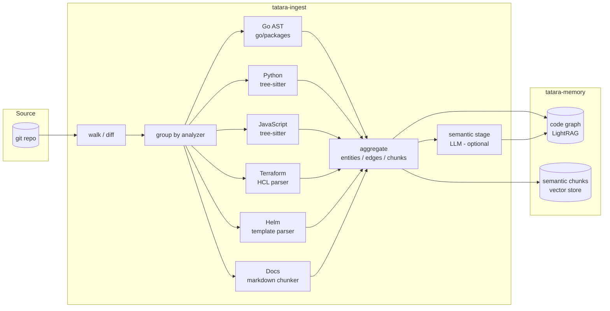
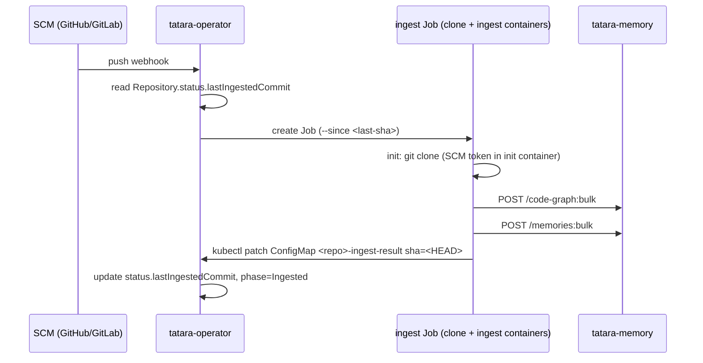

# tatara-memory-repo-ingester

Stateless Go batch tool that walks a git repository, runs language-aware static analysis, and pushes a deterministic code graph plus enriched semantic chunks to `tatara-memory`. It is the bulk knowledge loader that seeds the platform's persistent code graph before any agent works on a repository.

**Repository:** [`github.com/szymonrychu/tatara-memory-repo-ingester`](https://github.com/szymonrychu/tatara-memory-repo-ingester)

---

## What it does

The ingester is a short-lived binary (`tatara-ingest`) with no persistent state of its own. Each run:

1. Computes the set of files to process - either a `git diff` window (incremental) or the full tracked file list (`git ls-files` for first or forced full runs).
2. Routes each file to the first matching language analyzer in a fixed precedence order.
3. Runs all matched analyzers in sequence, each producing entities, directed edges, and semantic text chunks.
4. Pushes the aggregate code graph to `tatara-memory` via `POST /code-graph:bulk`.
5. Pushes semantic chunks to `tatara-memory` via `POST /memories:bulk`, with per-file reconciliation so stale chunks for deleted or renamed files are purged.
6. Optionally runs a best-effort LLM semantic extraction stage (Phase 2) that enriches the graph with concept and rationale nodes for files the server's content-SHA cache marks as unseen.

The ingester is **fail-closed on hard analyzer errors**: if any analyzer fails for its entire file batch (as opposed to a single-file soft parse error), the run aborts before pushing anything and exits non-zero so the operator retries the same commit window without permanently losing graph coverage.



---

## Language analyzers

The analyzer registry has a fixed precedence order. Each file is claimed by the first matching analyzer; files matching none are silently skipped. Helm is registered before Docs so chart YAML is not consumed by the markdown/text path.

| Analyzer | File patterns | Engine | Emits |
|---|---|---|---|
| **Go** | `*.go` (non-test by default) | `go/packages` + `go/types` | packages, types, funcs, methods; import and call edges with typed confidence scores |
| **Python** | `*.py` | tree-sitter | modules, classes, functions; import edges |
| **JavaScript** | `*.js`, `*.mjs`, `*.cjs` | tree-sitter | modules, classes, functions; import edges |
| **Terraform** | `*.tf` | HashiCorp HCL parser | resources, data sources, modules, variables, outputs; module-source and var-ref edges |
| **Helm** | `Chart.yaml`, `values.yaml`, `templates/**` in charts | Go `text/template` parser | chart, template, and value entities; contains and value-ref edges |
| **Docs** | `*.md`, `*.markdown`, `*.txt`, `*.rst` | plain text + frontmatter | one `doc_file` entity per file; semantic chunk with optional YAML frontmatter provenance (source\_url, author, captured\_at) |

!!! note "Adding a language"
    The analyzer interface is three methods (`Name`, `Match`, `Analyze`). Adding a language is one new file under `internal/analyze/` plus one `Register` call in `registry.go`. No other code changes.

### Go analyzer - confidence scoring

The Go analyzer uses `go/packages` to perform full type resolution. Call edges carry a numeric confidence score and a tier:

| Resolution level | Score | Tier |
|---|---|---|
| type_resolved | 0.98 | EXTRACTED |
| scoped_name_match | 0.85 | INFERRED |
| imported_name_match | 0.70 | INFERRED |
| global_name_match | 0.45 | INFERRED |
| ambiguous_multi_def | 0.20 | AMBIGUOUS |
| unresolved | 0.00 | AMBIGUOUS |

Cross-repo symbol references (packages under a configurable `crossRepoPrefix`, defaulting to `github.com/szymonrychu/`) are emitted as `SymbolRow` records so `tatara-memory` can link entities across repository boundaries.

---

## Two ingest modes

=== "Walk-based (source repo)"

    The standard path. The ingester clones (or is given) the repository, computes a file diff, and drives all language analyzers.

    ```sh
    tatara-ingest \
      --repo-root /path/to/repo \
      --repo-name my-service \           # optional; defaults to basename of repo-root
      --since <base-commit>  \           # incremental: diff since this SHA
      --base-url http://tatara-memory:8080
    ```

    Flags also accept environment variables (`REPO_ROOT`, `REPO_NAME`, `BASE_URL`). Flags take precedence over env.

    | Flag | Env | Default | Description |
    |---|---|---|---|
    | `--repo-root` | `REPO_ROOT` | - | Path to the git repository root (required) |
    | `--repo-name` | `REPO_NAME` | `basename(repo-root)` | Logical name written into graph entities |
    | `--since` | - | (full ingest) | Base commit SHA for incremental diff |
    | `--full` | - | false | Force full re-ingest even when `--since` is set |
    | `--base-url` | `BASE_URL` | - | tatara-memory base URL |

    **Output:** entities + edges (code graph) and semantic chunks (memories). Both are pushed in the same run.

=== "SCIP index"

    For repositories where a pre-generated [SCIP](https://github.com/sourcegraph/scip) index (`index.scip`) is available - typically produced by a language-specific indexer in CI - the ingester can bypass the source walker entirely and consume the protobuf index directly.

    ```sh
    tatara-ingest \
      --scip /path/to/index.scip \
      --scip-repo my-service \           # required
      --base-url http://tatara-memory:8080
    ```

    | Flag | Description |
    |---|---|
    | `--scip` | Path to the pre-generated SCIP index protobuf |
    | `--scip-repo` | Logical repo name (required when `--scip` is set) |

    !!! warning "SCIP mode - code graph only"
        SCIP ingest pushes entities and edges to the code graph (`extractor=scip`) but does **not** produce semantic text chunks. There is no memory (vector store) population in this mode. This is a v1 limitation; semantic chunks from SCIP-indexed repos are planned for a later phase.

    SCIP ingest uses the same `POST /code-graph:bulk` endpoint as walk-based ingest, tagged with `extractor=scip` so the server's reconcile logic treats the two origins independently.

---

## Incremental re-ingest

The ingester does not maintain local state between runs. Incrementality is driven entirely by git:

1. The operator records `status.lastIngestedCommit` on the `Repository` CR after each successful ingest Job.
2. On the next ingest trigger the operator passes `--since <lastIngestedCommit>` to the Job.
3. The ingester runs `git diff -M -z --name-status <since>..HEAD` to produce the change set.
4. If `<since>` is no longer in history (force-push, rebase, GC) the diff command fails; the ingester logs a WARN and **falls back to a full `git ls-files` pass** automatically. No manual intervention is needed.

### Reconcile-per-file (idempotency)

For each ingest run the ingester sends a `reconcile_files` list alongside the chunk push. The `tatara-memory` server purges prior chunks for every file in that list before inserting the new ones. This means:

- Deleted files: chunks are removed from the vector store.
- Renamed files: old-path chunks are purged; new-path chunks are inserted.
- Re-analyzed files: stale chunks are replaced, not duplicated.

Files where an analyzer produced a per-file soft parse error are **excluded** from `reconcile_files` so existing chunks for those files survive until the file is parseable again.

A full re-ingest (`--full` or first ingest) is insert-only - no reconcile list is sent - so it is safe to run over an already-populated store without a destructive purge pass.

---

## Operator-managed Jobs

The tatara operator manages ingest as short-lived Kubernetes `Job` resources. Operators do not invoke `tatara-ingest` directly.

### Job lifecycle



### Job structure

Each Job has two containers sharing an `emptyDir` workspace volume:

- **init container (`clone`)**: runs `git clone` using the project's SCM token (sourced via `SecretKeyRef` from `spec.scmSecretRef`). The token is never embedded in the Job spec stored in etcd.
- **main container (`ingest`)**: runs `tatara-ingest --repo-root ... --repo-name ... [--since ...]`, then patches the result ConfigMap with the cloned HEAD SHA.

```yaml
# Abridged Job spec produced by the operator
apiVersion: batch/v1
kind: Job
metadata:
  name: my-service-ingest-x7k2m
  labels:
    tatara.dev/repository: my-service
    tatara.dev/ingest-mode: incremental   # or: full
spec:
  backoffLimit: 0          # incremental: 0 (fail fast, let operator escalate to full)
  ttlSecondsAfterFinished: 600
  template:
    spec:
      restartPolicy: Never
      serviceAccountName: tatara-ingest
      initContainers:
      - name: clone
        image: <ingesterImage>
        command: ["/bin/sh", "-c"]
        args:
        - git clone --branch "$GIT_BRANCH" "$GIT_CLONE_URL" "$GIT_REPO_DIR"
        env:
        - name: SCM_TOKEN
          valueFrom:
            secretKeyRef:
              name: <project.spec.scmSecretRef>
              key: token
      containers:
      - name: ingest
        image: <ingesterImage>
        env:
        - name: OIDC_CLIENT_SECRET
          valueFrom:
            secretKeyRef:
              name: <oidcSecretName>
              key: OPERATOR_OIDC_CLIENT_SECRET
        - name: HTTP_TIMEOUT
          value: "300s"
        - name: SEMANTIC_INGEST
          value: "true"     # mirrors Repository.spec.semanticIngest
```

### Retry and backoff

| Mode | `backoffLimit` | Rationale |
|---|---|---|
| Incremental | 0 | A missing `--since` SHA is deterministic; one attempt is enough before the operator escalates to a full ingest. |
| Full | 2 | Transient clone or network failures can self-heal across retries. |

The operator applies exponential backoff between failed Job recreations using `status.ingestFailureCount` and `status.lastIngestFailureTime` on the `Repository` CR.

### Repository CR - ingest-relevant fields

```yaml
apiVersion: tatara.dev/v1alpha1
kind: Repository
metadata:
  name: my-service
spec:
  projectRef: my-project
  url: https://github.com/myorg/my-service
  defaultBranch: main
  ingestEnabled: true           # default: true; set false to suspend all ingest
  semanticIngest: true          # default: true; set false for AST-only (no LLM cost)
  reingestSchedule: "0 6 * * *" # cron: daily catch-up ingest at 06:00 UTC
status:
  phase: Ingested               # Ingesting | Ingested | Failed
  lastIngestedCommit: "a1b2c3d"
  lastIngestTime: "2026-06-27T06:00:00Z"
  ingestFailureCount: 0
  jobName: "my-service-ingest-x7k2m"
```

`reingestSchedule` is required. It fires a periodic full-history catch-up in addition to push-webhook-triggered incremental ingests, guarding against missed events or webhook delivery failures.

---

## Authentication

All HTTP calls to `tatara-memory` are authenticated with an OIDC client-credentials bearer token. The ingester fetches a short-lived token from the issuer's token endpoint before each run and attaches it to every request. Configuration is via environment variables:

| Env var | Description |
|---|---|
| `OIDC_ISSUER` | Token endpoint base URL (e.g. `https://keycloak.example.com/realms/tatara`) |
| `OIDC_CLIENT_ID` | Client ID for the ingester service account |
| `OIDC_CLIENT_SECRET` | Client secret (sourced from a Kubernetes Secret in operator-managed Jobs) |
| `OIDC_AUDIENCE` | Expected audience claim on the token |

When `OIDC_CLIENT_ID` is unset, the ingester makes unauthenticated requests. This is acceptable in local development but should not be used in production.

---

## Observability

The ingester is a short-lived Job and cannot be scraped by Prometheus during its run. It pushes gathered metrics to the operator's `/internal/metrics/push` receiver at Job completion. The operator's `tatara.dev/ingest-mode` label on the Job distinguishes incremental from full runs for alert routing.

Key metrics emitted:

| Metric | Type | Description |
|---|---|---|
| `ingest_runs_total` | Counter | Total ingest runs started |
| `ingest_run_result_total{result}` | Counter | Terminal results: `success` or `failure` |
| `ingest_stage_duration_seconds{stage}` | Histogram | Per-stage latency: `push_graph`, `push_chunks`, `scip`, `total` |
| `analyzer_entities_total{analyzer}` | Counter | Entities emitted per analyzer |
| `analyzer_edges_total{analyzer}` | Counter | Edges emitted per analyzer |
| `analyzer_duration_seconds{analyzer}` | Histogram | Per-analyzer wall time |
| `analyzer_parse_errors_total{analyzer}` | Counter | Per-file soft parse errors |
| `push_requests_total{endpoint,result}` | Counter | HTTP push requests by endpoint and outcome |
| `semantic_misses_total` | Counter | Files sent to LLM extraction (cache misses) |
| `llm_calls_total{result}` | Counter | LLM completion calls: `ok` or `fail` |
