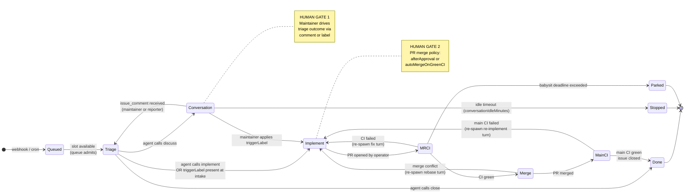

# The Agentic Operating Model

Tatara is not a chat interface or a one-shot code generator. It is an **operating model**: a persistent loop where a Kubernetes operator orchestrates autonomous Claude Code sessions that read your issue tracker, conduct a triage conversation, write code, open pull requests, babysit CI, and close the originating issue - while humans remain in control of every consequential gate.

This page explains the loop structure, trigger sources, human control points, and the guardrails that keep autonomy bounded. It targets architects and platform engineers evaluating whether tatara's operating model fits their engineering culture.

---

## The closed-loop lifecycle

The central abstraction is the `issueLifecycle` Task: a single durable Kubernetes object that carries a named state machine from issue intake through merge. It is **not** a script that runs once and exits. It is a CRD that a controller reconciles continuously, resuming across pod restarts, respecting human gates before advancing, and giving up safely when a deadline is reached.

!!! info "State machine is the Task"
    `Task.status.lifecycleState` records the current position in this diagram. Every transition is logged at INFO with `action=lifecycle_transition` and metered as `tatara_lifecycle_transition_total{from,to}`.

---

## Two trigger sources

Tatara processes work from two orthogonal sources. Both feed the same queue and create the same Task CRD.

### Reactive triggers (SCM webhooks)

The operator listens on a per-Project HMAC-verified webhook endpoint exposed as `Project.status.webhookURL`. GitHub and GitLab deliver:

| Webhook event | Operator action |
|---|---|
| `issues` (opened / edited / labeled) | Create or rebind an `issueLifecycle` Task at Triage (or skip to Implement if `triggerLabel` already present) |
| `issue_comment` (created) | If a lifecycle Task is in Conversation: reset idle timer, transition back to Triage with the new comment in context. If no live Task: create one at Triage. |
| `pull_request` (bot-authored, no live Task) | Create an `issueLifecycle` Task entered at MRCI - the babysit path for restart scenarios. |
| `pull_request` (human-authored) | Create a `review` Task (separate path; not the lifecycle). |
| `push` (default branch) | Triggers a repository re-ingest into the memory graph. |

All events pass through an **intake filter** before a Task is created: the author must be the bot, a `maintainerLogin`, or a `reporterLogin`. Events from unknown authors are dropped at intake so that third-party issue authors cannot drive agent execution via prompt-crafted content.

### Proactive triggers (in-operator cron)

The operator runs cron activities on schedules defined in `spec.scm.cron`. No external CronJob or message bus is involved - scheduling is embedded in the Project reconciler.

| Activity | Field | Default | Task kind created |
|---|---|---|---|
| **mrScan** | `cron.mrScan.schedule` | disabled | `issueLifecycle` (MRCI entry for bot PRs), `review` (human PRs) |
| **issueScan** | `cron.issueScan.schedule` | disabled | `issueLifecycle` (Triage) |
| **brainstorm** | `cron.brainstorm.enabled` | `false` | `brainstorm` |
| **healthCheck** | `cron.healthCheck.enabled` | `false` | `healthCheck` |
| **refine** | runs off scan cadence | always | `refine` (pre-scan barrier) |

`refine` is not a separate cron schedule. It fires automatically as a mandatory barrier before each `mrScan` / `issueScan` cycle, culling stale or duplicate open issues before the scan selects candidates for work.

Selection order within a scan cycle: items carrying `spec.scm.priorityLabel` first, then oldest-updated-first within each group, capped at `maxPerRepo` concurrent tasks per repository lane.

---

## Human-in-the-loop gates

Tatara is autonomous within each state. It is **not** autonomous across states - humans control the transitions that matter.

### Gate 1: Triage outcome

On issue intake the agent reads the issue body, the comment thread, and the memory graph, then calls exactly one `issue_outcome` MCP tool:

- `implement` - the agent proceeds to code immediately. This is the fast path when the issue is unambiguous.
- `discuss` - the agent posts questions or a design sketch as an issue comment and parks in **Conversation** state. The operator does not proceed until a human responds.
- `close` - the operator closes the issue with the agent's explanatory comment. No code is written.

When a maintainer applies the `triggerLabel` (default `tatara`) to an issue, triage is bypassed entirely: the Task enters **Implement** directly, treating the label as explicit human approval to proceed.

### Gate 2: Conversation

While the Task is in **Conversation**, the agent pod is torn down. No compute is consumed. The operator waits for one of three signals:

1. A new `issue_comment` webhook (from a maintainer or reporter) - resets the idle timer, re-spawns the agent at Triage with the updated thread.
2. The maintainer applies `triggerLabel` - skips directly to **Implement** without re-running triage.
3. The idle timeout (`spec.scm.conversationIdleMinutes`, default 60 minutes of continuous silence) expires - the Task transitions to **Stopped** (resumable; no PR is opened, no issue is closed).

!!! warning "Idle timeout is an inactivity window"
    The conversation idle timer measures continuous silence, not wall-clock age of the issue. A comment from a maintainer resets it to zero. Operator downtime is self-healing: `issueScan` backstop re-binds Tasks whose issues have new `updatedAt` timestamps.

### Gate 3: PR merge policy

The operator opens a PR when an **Implement** run completes. It never merges without human involvement unless explicitly configured to do so:

| `spec.scm.mergePolicy` | Merge behavior |
|---|---|
| `afterApproval` (default) | Operator merges when the agent signals `pr_outcome=merge`. The agent infers human intent from the PR/issue thread; the operator does **not** independently verify SCM review state. |
| `autoMergeOnGreenCI` | Operator merges once the PR CI pipeline is green, without waiting for a human review. |

`afterApproval` is the recommended default for most teams. `autoMergeOnGreenCI` is appropriate for low-risk autonomous maintenance work (dependency bumps, doc updates) where the CI suite is the sufficient gate.

### Gate 4: Brainstorm proposal approval

Brainstorm-generated issues are never implemented automatically. The agent applies `spec.scm.brainstormingLabel` (default `tatara-brainstorming`) to every proposal. A human must apply `spec.scm.approvedLabel` (default `tatara-approved`) - or add the `triggerLabel` - before the operator will consider the issue for implementation. At or above `maxOpenProposals` (default 5) open unapproved proposals, the next brainstorm cycle is skipped entirely.

---

## Bounded autonomy

Autonomous agents that can loop forever are an operational liability. Tatara enforces hard limits at every layer.

### Turn and session limits

| Parameter | CRD field | Default | Effect |
|---|---|---|---|
| Max turns per task | `spec.agent.maxTurnsPerTask` | `50` | Agent pod is terminated after this many turns regardless of state |
| Turn inactivity timeout | `spec.agent.turnTimeoutSeconds` | `1800` (30 min) | A turn is failed only after this long with **no agent output** - a turn actively writing code is never interrupted mid-work |
| Lifecycle iteration cap | `spec.agent.maxLifecycleIterations` | `10` | Hard backstop on the Implement -> MRCI -> Merge -> MainCI loop entries |
| Babysit deadline | `spec.scm.babysitDeadlineMinutes` | `60` | MRCI/MainCI poll gives up after this many minutes; Task moves to **Parked** (PR left open for a human) |
| Conversation idle stop | `spec.scm.conversationIdleMinutes` | `60` | Conversation state moves to **Stopped** after this many minutes of silence |

### Context window guard

Each agent turn reports its token usage via the operator's callback API. The operator accumulates `Task.status.lastTurnInputTokens`. When this value reaches `spec.agent.handoverThresholdPercent` (default 25%) of `spec.agent.contextWindowTokens` (default 200,000), the operator triggers a handover before re-spawning for the next Implement iteration:

1. The current agent is given one final turn to produce a `submit_handover` artifact: a compact prose summary of what was done, what remains, and what context the next agent needs.
2. The agent pod is terminated and the conversation is reset.
3. The next pod starts fresh and receives the handover text as the first turn prompt.

This prevents context overflow from silently degrading code quality on long-running issues.

### Queue capacity

Concurrent agent pod execution is bounded by the admission queue:

| Parameter | CRD field | Default |
|---|---|---|
| Normal task slots | `spec.queue.capacity` | `spec.maxConcurrentTasks` (default 3) |
| Alert-class reserved slots | `spec.queue.alertCapacity` | `1` |

Alert-class slots (reserved for incident investigations) are not consumed by normal implementation tasks. When normal capacity is full, new `QueuedEvent` objects wait in `Queued` state and are admitted as slots free.

### Give-up paths

A Task that cannot make progress lands in one of two safe terminal states rather than looping indefinitely:

- **Stopped** - idle Conversation timeout. The issue remains open. A new maintainer comment will re-engage the agent via webhook.
- **Parked** - babysit deadline exceeded, or merge conflict not resolved within the iteration cap. The PR is left open for a human. The operator posts a comment explaining what it attempted.

In neither case does the operator close the issue, force-push, or retry silently.

---

## Why labels and comments are the control plane

Every human decision in tatara is expressed through two SCM-native mechanisms: **labels** and **comments**. This is a deliberate architectural choice, not a convenience.

**Labels project operator state externally.** The lifecycle phase label set (`tatara-brainstorming`, `tatara-approved`, `tatara-implementation`, `tatara-declined`) is written by the operator and readable by any tool with SCM access: CI systems, dashboards, humans scrolling the issue list. State is visible without querying a Kubernetes API.

**Comments create a natural audit log.** Every agent action - triage decision, design question, scope summary, merge outcome, give-up reason - appears as an issue or PR comment. The comment thread is the complete history of the agent's reasoning, visible to everyone with SCM read access, survives operator restarts, and requires no tatara-specific tooling to interpret.

**Webhook reactions are human-native actions.** A maintainer approves implementation by applying a label they already use, or by replying to an issue comment. There is no tatara-specific UI to learn. The operator responds to SCM events - the same events your CI system, project management tools, and on-call runbooks already consume.

**The control plane is the issue tracker.** This means the blast radius of a misconfigured agent is bounded: the worst outcome is a PR you can close and an issue comment you can read. There are no hidden side effects in a separate system.

---

## Security boundary summary

| Concern | Mechanism |
|---|---|
| Third-party prompt injection | `reporterLogins` allowlist: only bot, maintainers, and allowed reporters can drive agent intake |
| Unauthorized approve-to-implement | `maintainerLogins` gates which comment authors count as human approval signals |
| SCM write-back authorship | Egress verified via `GetPRState` at operator side, not trusting webhook payload |
| Webhook authenticity | HMAC-SHA256 verified per GitHub/GitLab spec |
| Agent network egress | Cluster-side NetworkPolicy; internet access only for `brainstorm` tasks with `internet` source, gated by a pod label the infra helmfile controls |
| Kubernetes API access | Agent pods have no Kubernetes credentials. Only tatara-cli (MCP server in the pod) can call the operator REST API, which is OIDC-gated |

See [Approval Gates](../operations/security/approval-gates.md) and [Prompt-Injection Defenses](../operations/security/prompt-injection.md) for full detail on each mechanism.
