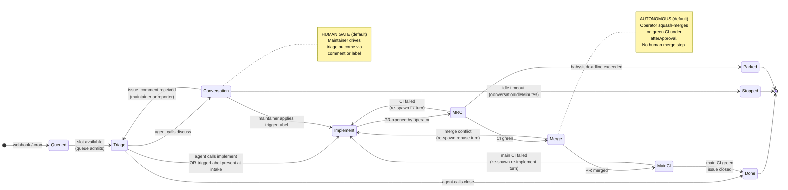

# The Agentic Operating Model

Tatara is not a chat interface or a one-shot code generator. It is an **operating model**: a persistent loop where a Kubernetes operator orchestrates autonomous Claude Code sessions that read your issue tracker, conduct a triage conversation, write code, open pull requests, babysit CI, and close the originating issue.

Be precise about where the human sits in that loop. In the **shipped defaults** the one hard human gate is at **triage**: a person decides whether an issue gets worked (by allowing the agent to `implement`, or by applying the `triggerLabel`). After that decision, the implement-to-merge path is **autonomous** - under the default `afterApproval` merge policy the operator squash-merges the bot's PR on its own once CI is green (or immediately if the repo has no CI). There is no human merge step and no per-PR sign-off unless you add one yourself via the SCM's branch-protection rules. The stronger "human at every gate" posture is available but is **configuration you opt into**, not the default. This page is explicit about which is which.

It targets architects and platform engineers evaluating whether tatara's operating model fits their engineering culture.

---

## The closed-loop lifecycle

The central abstraction is the `issueLifecycle` Task: a single durable Kubernetes object that carries a named state machine from issue intake through merge. It is **not** a script that runs once and exits. It is a CRD that a controller reconciles continuously, resuming across pod restarts, respecting human gates before advancing, and giving up safely when a deadline is reached.

!!! info "State machine is the Task"
    `Task.status.lifecycleState` records the current position in this diagram. Every transition is logged at INFO with `action=lifecycle_transition` and metered as `tatara_lifecycle_transition_total{from,to}`.

---

## Two trigger sources

Tatara processes work from two orthogonal sources. Both feed the same queue and create the same Task CRD.

### Reactive triggers (SCM webhooks)

The operator listens on a per-Project HMAC-verified webhook endpoint exposed as `Project.status.webhookURL`. GitHub and GitLab deliver:

| Webhook event | Operator action |
|---|---|
| `issues` (opened / edited / labeled) | Create or rebind an `issueLifecycle` Task at Triage (or skip to Implement if `triggerLabel` already present) |
| `issue_comment` (created) | If a lifecycle Task is in Conversation: reset idle timer, transition back to Triage with the new comment in context. If no live Task: create one at Triage. |
| `pull_request` (bot-authored, no live Task) | Create an `issueLifecycle` Task entered at MRCI - the babysit path for restart scenarios. |
| `pull_request` (human-authored) | Create a `review` Task (separate path; not the lifecycle). |
| `push` (default branch) | Triggers a repository re-ingest into the memory graph. |

All events pass through an **intake filter** before a Task is created - but only once you configure it. When `spec.scm.reporterLogins` is populated, the author must be the bot, a `maintainerLogin`, or a `reporterLogin`, and events from unknown authors are dropped at intake so that third-party issue authors cannot drive agent execution via prompt-crafted content. When `reporterLogins` is **empty (the shipped default)** the operator preserves its historical open behavior and accepts issues and comments from **any** author. The prompt-injection intake defense is therefore opt-in: it is inert until you populate the allowlist. See [Gate 1](#gate-1-triage-outcome) and the [Security boundary summary](#security-boundary-summary).

### Proactive triggers (in-operator cron)

The operator runs cron activities on schedules defined in `spec.scm.cron`. No external CronJob or message bus is involved - scheduling is embedded in the Project reconciler.

| Activity | Field | Default | Task kind created |
|---|---|---|---|
| **mrScan** | `cron.mrScan.schedule` | disabled | `issueLifecycle` (MRCI entry for bot PRs), `review` (human PRs) |
| **issueScan** | `cron.issueScan.schedule` | disabled | `issueLifecycle` (Triage) |
| **brainstorm** | `cron.brainstorm.enabled` | `false` | `brainstorm` |
| **healthCheck** | `cron.healthCheck.enabled` | `false` | `healthCheck` |
| **refine** | runs off scan cadence | always | `refine` (pre-scan barrier) |

`refine` is not a separate cron schedule. It fires automatically as a mandatory barrier before each `mrScan` / `issueScan` cycle, culling stale or duplicate open issues before the scan selects candidates for work.

Selection order within a scan cycle: items carrying `spec.scm.priorityLabel` first, then oldest-updated-first within each group, capped at `maxPerRepo` concurrent tasks per repository lane.

---

## Human-in-the-loop gates

Tatara is autonomous within each state. Across states, the human control points are **triage** (Gate 1/2) and **brainstorm approval** (Gate 4). The **merge** transition (Gate 3) is autonomous by default and becomes human-gated only when you configure it - the SCM branch-protection route below. Read each gate for its shipped default, not the aspirational posture.

### Gate 1: Triage outcome

On issue intake the agent reads the issue body, the comment thread, and the memory graph, then calls exactly one `issue_outcome` MCP tool:

- `implement` - the agent proceeds to code immediately. This is the fast path when the issue is unambiguous.
- `discuss` - the agent posts questions or a design sketch as an issue comment and parks in **Conversation** state. The operator does not proceed until a human responds.
- `close` - the operator closes the issue with the agent's explanatory comment. No code is written.

When a maintainer applies the `triggerLabel` (default `tatara`) to an issue, triage is bypassed entirely: the Task enters **Implement** directly, treating the label as explicit human approval to proceed.

### Gate 2: Conversation

While the Task is in **Conversation**, the agent pod is torn down. No compute is consumed. The operator waits for one of three signals:

1. A new `issue_comment` webhook (from a maintainer or reporter) - resets the idle timer, re-spawns the agent at Triage with the updated thread.
2. The maintainer applies `triggerLabel` - skips directly to **Implement** without re-running triage.
3. The idle timeout (`spec.scm.conversationIdleMinutes`, default 60 minutes of continuous silence) expires - the Task transitions to **Stopped** (resumable; no PR is opened, no issue is closed).

!!! warning "Idle timeout is an inactivity window"
    The conversation idle timer measures continuous silence, not wall-clock age of the issue. A comment from a maintainer resets it to zero. Operator downtime is self-healing: `issueScan` backstop re-binds Tasks whose issues have new `updatedAt` timestamps.

### Gate 3: PR merge policy (autonomous by default)

Read this one carefully, because the default behavior is the opposite of what "afterApproval" sounds like. The operator opens a PR when an **Implement** run completes. From there the lifecycle advances to **MRCI**, and once CI reports green (or immediately, if the repo has no CI at all) the operator moves the Task to **Merge** and calls `mergeAllowed()`. Under the default policy that call **always returns true** - the operator squash-merges the bot's own PR with no human step and no approval signal.

| `spec.scm.mergePolicy` | Merge behavior (as shipped) |
|---|---|
| `afterApproval` (default) | `mergeAllowed()` returns **true unconditionally**. The operator squash-merges as soon as the lifecycle reaches **Merge** (CI green, or no CI). It does **not** consult SCM review state and does **not** wait for a human. The name reflects the *intent* (trust that review happened out of band), not an enforced check. |
| `autoMergeOnGreenCI` | Merges only when CI is present and green; a present-but-failing CI blocks the merge. With no CI configured it falls back to the `afterApproval` behavior (merges). |

!!! warning "There is no `pr_outcome` gate on the lifecycle merge path"
    The `pr_outcome` MCP tool (`action=merge|close`) is profiled and documented as **`selfImprove`-only** - it drives the operator's own self-improvement PRs, not the `issueLifecycle` state machine. A normal lifecycle Task never signals `pr_outcome=merge`; nothing about the merge is agent-driven. The merge is triggered by the CI-green state transition, full stop.

**If you want a real human merge gate**, it does not come from `afterApproval`. Configure `autoMergeOnGreenCI` **and** an SCM branch-protection rule that requires an approving review before required checks can pass. That makes the forge (not tatara) hold the merge until a human approves. Note that the shipped semver push-CD design goes the other way on purpose: it stamps the significance label and enables the forge's **native auto-merge** on the freshly opened bot PR, so bot-authored PRs merge themselves on green required checks. Autonomous merge is the designed steady state, not an edge case.

### Gate 4: Brainstorm proposal approval

Brainstorm-generated issues are never implemented automatically. The agent applies `spec.scm.brainstormingLabel` (default `tatara-brainstorming`) to every proposal. A human must apply `spec.scm.approvedLabel` (default `tatara-approved`) - or add the `triggerLabel` - before the operator will consider the issue for implementation. At or above `maxOpenProposals` (default 5) open unapproved proposals, the next brainstorm cycle is skipped entirely.

---

## Bounded autonomy

Autonomous agents that can loop forever are an operational liability. Tatara enforces hard limits at every layer.

### Turn and session limits

| Parameter | CRD field | Default | Effect |
|---|---|---|---|
| Max turns per task | `spec.agent.maxTurnsPerTask` | `50` | Agent pod is terminated after this many turns regardless of state |
| Turn inactivity timeout | `spec.agent.turnTimeoutSeconds` | `1800` (30 min) | A turn is failed only after this long with **no agent output** - a turn actively writing code is never interrupted mid-work |
| Lifecycle iteration cap | `spec.agent.maxLifecycleIterations` | `10` | Hard backstop on the Implement -> MRCI -> Merge -> MainCI loop entries |
| Babysit deadline | `spec.scm.babysitDeadlineMinutes` | `60` | MRCI/MainCI poll gives up after this many minutes; Task moves to **Parked** (PR left open for a human) |
| Conversation idle stop | `spec.scm.conversationIdleMinutes` | `60` | Conversation state moves to **Stopped** after this many minutes of silence |

### Context window guard

Each agent turn reports its token usage via the operator's callback API. The operator **overwrites** `Task.status.lastTurnInputTokens` with the latest turn's input-token total on every callback (it is a snapshot of the last turn, not a running sum - the running totals live in separate `cumulative*` fields). It uses that single latest value as a proxy for how full the model's context currently is, and compares it to `spec.agent.handoverThresholdPercent` (default 25%) of `spec.agent.contextWindowTokens` (default 200,000).

**Default path, below the threshold: full-transcript resume.** When a fresh pod picks the Task up for the next Implement iteration, it resumes the entire persisted Claude conversation via `claude --resume` (issue #114). No reset, no summarization - the next pod continues where the last one stopped, with full history.

**At or above the threshold: compacted handover.** Only once `lastTurnInputTokens` crosses `handoverThresholdPercent` does the operator switch to the reset path, to keep the next turn's context from overflowing:

1. The current agent is given one final turn to produce a `submit_handover` artifact: a compact prose summary of what was done, what remains, and what context the next agent needs.
2. The full-transcript resume is skipped for that spawn.
3. The next pod starts fresh and receives the compacted handover text as the first turn prompt.

The two paths are mutually exclusive: a spawn gets **either** the full transcript (`--resume`, under threshold) **or** the handover summary (at/over threshold), never both. This keeps quality high on ordinary multi-turn work (full history) while preventing context overflow from silently degrading long-running issues (compaction only when genuinely needed).

### Queue capacity

Concurrent agent pod execution is bounded by the admission queue:

| Parameter | CRD field | Default |
|---|---|---|
| Normal task slots | `spec.queue.capacity` | `spec.maxConcurrentTasks` (default 3) |
| Alert-class reserved slots | `spec.queue.alertCapacity` | `1` |

Alert-class slots (reserved for incident investigations) are not consumed by normal implementation tasks. When normal capacity is full, new `QueuedEvent` objects wait in `Queued` state and are admitted as slots free.

### Give-up paths

A Task that cannot make progress lands in one of two safe terminal states rather than looping indefinitely:

- **Stopped** - idle Conversation timeout. The issue remains open. A new maintainer comment will re-engage the agent via webhook.
- **Parked** - babysit deadline exceeded, or merge conflict not resolved within the iteration cap. The PR is left open for a human. The operator posts a comment explaining what it attempted.

In neither case does the operator close the issue, force-push, or retry silently.

---

## Why labels and comments are the control plane

Every human decision in tatara is expressed through two SCM-native mechanisms: **labels** and **comments**. This is a deliberate architectural choice, not a convenience.

**Labels project operator state externally.** The lifecycle phase label set (`tatara-brainstorming`, `tatara-approved`, `tatara-implementation`, `tatara-declined`) is written by the operator and readable by any tool with SCM access: CI systems, dashboards, humans scrolling the issue list. State is visible without querying a Kubernetes API.

**Comments create a natural audit log.** Every agent action - triage decision, design question, scope summary, merge outcome, give-up reason - appears as an issue or PR comment. The comment thread is the complete history of the agent's reasoning, visible to everyone with SCM read access, survives operator restarts, and requires no tatara-specific tooling to interpret.

**Webhook reactions are human-native actions.** A maintainer approves implementation by applying a label they already use, or by replying to an issue comment. There is no tatara-specific UI to learn. The operator responds to SCM events - the same events your CI system, project management tools, and on-call runbooks already consume.

**The control plane is the issue tracker.** Every agent side effect surfaces as a PR you can close or an issue comment you can read - there are no hidden effects in a separate system, which makes the day-to-day blast radius legible. Be honest about the ceiling, though: that framing bounds the *review surface*, not the *privilege*. The bot PAT carries whatever repo scopes you grant it (org-wide write in the reference deployment), and once the default `afterApproval` merge is autonomous, a misconfigured or prompt-injected agent can land code without a human merge step. Where the platform self-deploys, a merged change to the GitOps repo flows to the cluster via a runner with broad rights. The control plane is legible; the aggregate privilege is not trivial. Bound it with the intake allowlist, a review-gated branch-protection rule on sensitive repos, and least-privilege PAT scopes - see [Trade-offs](why-tatara.md#trade-offs-to-consider) and the [security docs](../operations/security/index.md).

---

## Security boundary summary

These are the mechanisms, with their **shipped default state** called out. Several are opt-in and inert until configured - do not read the "Mechanism" column as an always-on guarantee.

| Concern | Mechanism | Default state |
|---|---|---|
| Third-party prompt injection | `reporterLogins` allowlist: only bot, maintainers, and allowed reporters can drive agent intake | **Opt-in.** Empty `reporterLogins` (default) accepts **any** author. Populate the list to activate the filter. |
| Unauthorized approve-to-implement | `maintainerLogins` gates which comment authors count as human approval signals | **Opt-in.** Empty `maintainerLogins` (default) treats any non-bot human reply as the approval go-ahead. Populate to restrict. |
| Autonomous merge | Merge is gated only by the SCM's branch protection, not by tatara | **Off.** Default `afterApproval` merges on green CI with no human step (see [Gate 3](#gate-3-pr-merge-policy-autonomous-by-default)). Require an approving review via branch protection to gate. |
| SCM write-back authorship | Egress verified via `GetPRState` at operator side, not trusting webhook payload | Always on. |
| Webhook authenticity | **GitHub:** HMAC-SHA256 over the body (`X-Hub-Signature-256`). **GitLab:** constant-time comparison of the static shared-secret `X-Gitlab-Token` header (a replayable bearer, not an HMAC over the payload - materially weaker). | Always on (both require a configured secret). |
| Agent network egress | Cluster-side NetworkPolicy; internet access only for `brainstorm` tasks with `internet` source, gated by a pod label the infra helmfile controls | On where the NetworkPolicy is applied (cluster config). |
| Kubernetes API access | Agent pods have no Kubernetes credentials. Only tatara-cli (MCP server in the pod) can call the operator REST API, which is OIDC-gated | Always on. |

The strong intake and approval guarantees in the rows above are real, but only **once you populate the allowlists**. As shipped with empty allowlists and `afterApproval`, the honest posture is: any author can open work, and an implemented PR merges itself on green CI. See [Approval Gates](../operations/security/approval-gates.md) and [Prompt-Injection Defenses](../operations/security/prompt-injection.md) for full detail on each mechanism.
