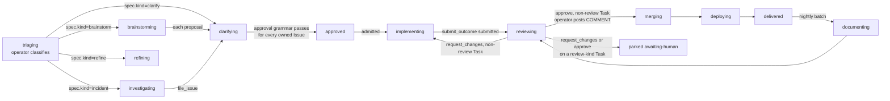

# The Agentic Operating Model

Tatara is not a chat interface or a one-shot code generator. It is an **operating model**: a
persistent loop where a Kubernetes operator orchestrates discrete, single-purpose autonomous
Claude Code sessions - one agent kind per pod - that read your issue tracker, run a clarifying
conversation, write code, open pull requests, review the diff, and hand off to a merge and
deploy sequence the operator drives on its own.

Be precise about where the human sits in that loop. The one hard human gate is **maintainer
approval**, and it is expressed as **comment text**, not a label: a project maintainer's most
recent comment on every issue the Task owns must match one of `Project.spec.scm.approvalPhrases`.
Labels are a write-only projection of that state, never a source of it - nothing reads a label to
decide whether work proceeds. After that comment-driven approval is recorded, the
implement-review-merge-deploy path is autonomous, but the merge step itself is not agent-driven:
the **operator** merges, from a review pod's accepted verdict, never from a native SCM approval
the agent posted itself - agents never call a merge API and never post an `APPROVE`/`REQUEST_CHANGES`
review on their own PR. No tatara-opened PR is ever opened with the forge's merge-when-green
feature switched on. This page is explicit about which is which.

It targets architects and platform engineers evaluating whether tatara's operating model fits their
engineering culture.

---

## The closed-loop lifecycle

The central abstraction is the **Task**: a project-scoped Kubernetes custom resource that is the
umbrella for one implementation stream - every linked Issue and MergeRequest CR across every
affected repo, kept fresh on the CR's status, plus `status.notes`, an append-only log of
plans, handoffs, and free-text continuation state that every pod reads at turn 0. There is no
single long-lived pod straddling triage, coding, and review: the operator hands work between
**discrete, single-purpose agent pods** - one agent kind per pod, each spawned fresh, each
scoped to one job, each leaving the next stage to the operator's own stage machine. That
separation is what lets `review` structurally never approve its own diff: it is always a
different pod, a different turn, than the one that wrote the code.

Every arrow above is an operator-written stage transition, driven by an agent's `submit_outcome`
call or by admission/webhook events - never a phase field an agent flips itself. See
[Task reference](../reference/task.md) for the CRD shape and
[MCP Tools by Agent Kind](../reference/mcp-tools.md) for the exact tool each kind calls to hand
off.

## Two enums, not one

A Task carries two kind-shaped fields and they mean different things. Conflating them is the
single most common misreading of the model.

| Field | Meaning | Values |
|---|---|---|
| `Task.spec.kind` | The **origin**. Why this Task exists. Immutable; baked into the Task name. | `brainstorm`, `incident`, `clarify`, `refine`, `review`, `documentation` |
| `Task.status.agentKind` | The **running agent**. Which pod is executing right now. Changes as the Task advances. | the six above, plus `implement` |

`implement` is an **agent kind only**. There is no `implement` Task origin: a Task that started
life as a `clarify` (a human filed an issue) runs an `implement` pod once it is approved, and a
`review` pod after that. One Task, one durable object, many pods.

Model and effort tiering (`Project.spec.agent.modelByKind` / `effortByKind`) keys on the **agent**
kind, because that is what determines what the pod is about to do.

!!! danger "`Task.status.phase` and `Task.status.lifecycleState` are gone" <!-- stale-ok: Task.status.phase, lifecycleState -->
    Both fields are deleted, along with the ~3200-line lifecycle machine behind them and the
    retired single-pod, all-in-one Task kind that produced them. They are replaced by a single field,
    `Task.status.stage`, and a single transition table. See the
    [Task stage machine](../reference/task.md).

---

## Origin kinds and where they trigger

| Origin kind (`spec.kind`) | Trigger | Scope |
|---|---|---|
| `brainstorm` | Schedule (cron), one tick per project | project |
| `incident` | Grafana alert webhook | project |
| `clarify` | New issue, or any comment on an existing issue | project |
| `review` | PR/MR-create webhook (also spawned per delivered Task by the nightly documentation batch's own review pass) | project |
| `documentation` | Nightly cron, one batch Task per project covering everything `delivered` in the last 24h | repo (the docs repo, via `spec.repositoryRef`) |
| `refine` | Schedule, as a barrier immediately before the `brainstorm` tick | project |

`implement` is not in this table: it is never a Task origin, only the agent kind that runs during
the `implementing` stage. Every origin kind above is **project-scoped** except `documentation`,
which is the one kind that sets `spec.repositoryRef` because it targets exactly one docs repo per
run. Full per-kind trigger and behavior detail lives on each kind's own page under
[Workflows](../workflows/index.md).

All triggers pass through a **reporter allowlist** before a Task is minted from a webhook event -
but only once you configure it. When `Project.spec.scm.reporterLogins` is populated, the author
must be the bot, a maintainer, or an allowed reporter, or the event is dropped at intake so that
third-party issue authors cannot drive agent execution via prompt-crafted content. When
`reporterLogins` is empty (the shipped default) the operator accepts issues and comments from
any author. The allowlist is therefore opt-in: inert until you populate it. See
[Approval Gates](../operations/security/approval-gates.md) and
[Prompt-Injection Defenses](../operations/security/prompt-injection.md).

Admission within a scan cycle is priority-ordered: incident-class work first, then
webhook-originated work, then cron/sweep-originated work, capped at `Project.spec.maxOpenTasks`
(active-Task cap, default 6) and `maxNewTasksPerSweep` (default 5) new mints per sweep. `refine`
is not a cron schedule of its own significance beyond the barrier: it fires ahead of each
`brainstorm` tick, folding or closing stale and duplicate open issues before brainstorm proposes
new ones.

---

## Human-in-the-loop gates

Tatara is autonomous within each kind's run. Across kind handoffs, the human control point is
**the approval grammar** (Gate 1) - the same mechanism whether the issue was filed by a human or
proposed by `brainstorm`. The **review-approval -> merge** transition (Gate 2) is autonomous by
construction, and there is no configuration flag that arms the forge's merge-when-green feature:
read it for what actually gates a merge, not for an aspirational stronger posture.

### Gate 1: The approval grammar

The load-bearing human gate is a comment, matched by a precise grammar, never a label. For a Task
to leave `clarifying` and enter `approved`, **every** Issue it owns that is still open and not
already `done`/`rejected` must have a most-recent maintainer comment whose normalized body
*consists of* one of `Project.spec.scm.approvalPhrases` - not merely contains it. The match is
anchored and whole-line, after stripping fenced code, quoted lines, markdown emphasis, and
trailing whitespace/emoji, so `**LGTM**` on its own line approves and `I can't approve this until
the tests pass` does not. The comment's author must be in the effective maintainer set and must
not be the bot - an agent can never approve its own proposal. Each approval comment is single-use:
a Task cannot be re-approved off a comment ID it already consumed. On a successful match, the
operator stamps `Issue.status.approval` with the matched comment's author, ID, and phrase, and
once every owned Issue is approved, `Task.status.stage` moves to `approved`.

`clarify` is a **live polling pod**: on a new issue or a comment on an existing one, the operator
spawns a clarify pod that converses on the thread. That conversation shapes the plan and can be as
persuasive as it likes, but it is informational - even when clarify concludes the issue is
implement-ready and calls `submit_outcome(decision=implement)`, the operator evaluates the
approval grammar independently. No matching comment on every owned Issue means the Task parks at
`parked(identity-unverified)`, and the grammar is re-evaluated on every subsequent non-bot comment
until it passes or the Task ages out.

Approval is **not sticky**: a Task that acquires a new Issue after reaching `approved` - via a
fresh `issue_write(create)` or a refine fold adopting one - drops back to `clarifying`, because
the "every owned Issue is approved" clause no longer holds. An agent cannot widen its own mandate
by adopting work after the gate.

Brainstorm-authored proposals go through this exact same gate, not a separate one: each accepted
proposal from a `brainstorm` Task becomes its own new `clarify` Task, and clarifying-to-approved
requires the identical maintainer-comment match. There is no bot-writable label that substitutes
for it.

!!! warning "Clarify cannot answer its own comments"
    The self-comment guard lives in the permission layer, not skill prose: the MCP comment action
    refuses when the last comment on the thread is bot-authored, and the webhook actor-check
    refuses to (re)spawn clarify off a bot's own comment. `refine` is the sole exception (see
    [Refine](../workflows/refine.md)).

### Gate 2: Review approval, then an operator-driven merge

`review` never calls a merge API, and it never posts a native `APPROVE`/`REQUEST_CHANGES` review
on the platform's own PR - both 422 on a self-authored PR, because the platform has exactly one
bot identity. On approval it calls `submit_outcome(approve)`; the operator is the one that
subsequently posts a `COMMENT`-type review and, once required checks are green, performs the
merge itself, verified against the exact head SHA the agent reported reviewing. If any owned MR
is unmergeable, or the reviewer requests changes, the Task returns to `implementing` instead - on
a `kind == "review"` Task (a human's own PR under review), neither path re-invokes `implement`:
the Task parks at `awaiting-human`, because **a human's PR is fixed by the human**, un-parked only
by the human's next comment and bounded by `maxHumanReviewRounds` (5).

!!! danger "If you want a human merge gate, you already have one - it is the default"
    No tatara-opened PR is ever opened with merge-when-green switched on. The operator merges only after a review pod
    submits `verdict=approve` and the operator accepts it, and only against the exact head SHA
    that was reviewed. A branch-protection rule requiring an approving review is **not** available
    as defence in depth here: the platform's one bot identity means it can never post `APPROVE` on
    its own PR (GitHub 422s), so a rule that required one would deadlock every merge. The real
    defence in depth is at the forge and the token: no-direct-push branch protection, a scoped App
    installation token, and `gh` / `glab` / direct-to-API `curl` on the deny-list - the MCP
    surface is a guardrail, not a security boundary.

A `review`-kind Task (one opened against a contributor's or maintainer's own PR, not the
platform's) can **never** reach `merging`, by any path: neither the approve edge nor the
request-changes edge lets it. Merging a human's PR is a human action, full stop. See
[Merge and Deploy](../workflows/merge-and-deploy.md#the-merge-sequence) for the merge sequence and
[Approval Gates](../operations/security/approval-gates.md#the-approval-grammar) for the full grammar.

---

## Bounded autonomy

Autonomous agents that can loop forever are an operational liability. Tatara enforces hard limits
at every layer.

### Turn and review-round limits

| Parameter | CRD field | Default | Effect |
|---|---|---|---|
| Max turns per pod run | `Project.spec.agent.maxTurnsPerPod` | `40` | Caps one pod's run. **`implement` is exempt** - a long healthy coding run is not cut off mid-work |
| Max turns per Task, lifetime | `Project.spec.agent.maxTurnsPerTask` / `Task.spec.maxTurnsPerTask` | `300` | Applies to every agent kind, `implement` included - this is what bounds the `implement` exemption above |
| Turn inactivity timeout | `spec.agent.turnTimeoutSeconds` | `1800` (30 min) | A turn fails only after this long with no agent output |
| Review rounds (non-`review` Task) | `Project.spec.agent.maxReviewRounds` | `3` | `request_changes` cycles above this cap park the Task at `review-loop-exhausted` |
| Human review rounds (`review`-kind Task) | `maxHumanReviewRounds` | `5` | Bounds the `awaiting-human` <-> `reviewing` cycle on a human's own PR |
| Pod recreations | `Project.spec.agent.maxPodRecreations` | `3` | A pod that never becomes Ready within 5 minutes of creation respawns, not fails, up to this budget; past it the Task fails at `pod-recreation-exhausted` |

### Queue capacity

Concurrent agent pod execution is bounded by the admission queue, keyed on
`Project.spec.agent.maxConcurrentAgents` (default 3) - **this is the project's kill switch**: set
it to `0` and no pod, of any kind, is ever admitted. A reserved `AlertCapacity` (default 1) keeps
incident-class investigations from starving behind normal implementation work. When capacity is
full, new `QueuedEvent` objects wait in `Queued` state and are admitted as slots free.

### Give-up paths

A Task that cannot make progress lands in one of the terminal or quasi-terminal members of the
fifteen-value `Task.status.stage` enum rather than looping indefinitely - `rejected`, `failed`,
and `parked` all age out; `delivered` is reaped once documented or provably nothing to document.
The stage carries a `stageReason` explaining what happened (`admission-starved`,
`review-loop-exhausted`, `pod-recreation-exhausted`, `identity-unverified`, `awaiting-human`, and
others). See [Task reference](../reference/task.md) for the full stage and reason list; do not
re-derive it here, it changes independently of this page.

In no case does the operator close an issue, force-push, or retry silently: every give-up is a
posted comment explaining what was attempted.

---

## Why comments are the control plane, and labels are not

Every human decision in tatara is expressed as **comment text**, matched against a configured
grammar. Labels still exist, but only as an operator-written, one-way projection of
`Issue.status.status` - readable by any tool with SCM access (CI systems, dashboards, humans
scrolling the issue list) but never a source of truth. No code path reads a label to produce a
status; a test asserts it. This is a deliberate architectural choice: a comment carries authorship,
timestamp, and content the operator can verify against the maintainer set and the exact phrase
grammar, in a way a label-apply event alone cannot - a label-add tells you *that* someone acted, a
matched comment tells you *what* they approved and lets a human read the reasoning next to the
decision.

**Comments create a natural audit log.** Every agent action - triage decision, design question,
scope summary, merge outcome, give-up reason - appears as an issue or PR comment, or as a
`Task.status.notes` entry visible via the operator's REST API. The comment thread and the notes
log together are the complete history of the agent's reasoning.

**The control plane is the issue tracker**, but be honest about the ceiling: that framing bounds
the *review surface*, not the *privilege*. The bot PAT carries whatever repo scopes you grant it,
and because the operator merges autonomously on a review pod's accepted approval plus green CI, a
misconfigured or prompt-injected agent can land code without a human merge step. Bound it with the
intake allowlist, a review-gated branch-protection rule on sensitive repos, and least-privilege PAT
scopes - see [Trade-offs](why-tatara.md#trade-offs-to-consider) and the
[security docs](../operations/security/index.md).

---

## Security boundary summary

These are the mechanisms, with their **shipped default state** called out. Several are opt-in and
inert until configured - do not read the "Mechanism" column as an always-on guarantee.

| Concern | Mechanism | Default state |
|---|---|---|
| Third-party prompt injection | `reporterLogins` allowlist: only the bot, maintainers, and allowed reporters can drive agent intake | **Opt-in.** Empty `reporterLogins` (default) accepts any author. Populate the list to activate the filter. |
| Unauthorized approve-to-implement | The C.6 approval grammar: anchored whole-line phrase match, from the effective maintainer set, structurally excluding the bot, single-use per comment | **Closed by default.** Empty `maintainerLogins` means no login is a maintainer, so no comment can ever satisfy the grammar and nothing advances past `clarifying`. Populate the list to allow any approvals at all. |
| Autonomous merge | The operator merges only once a review pod's `submit_outcome(approve)` is accepted and required checks are green - never from an agent-posted native review, and never via a merge API any agent can call | On by construction. `review` structurally cannot approve its own diff (separate pod, separate turn), and a `review`-kind Task (a human's own PR) can never reach `merging` at all. See [Gate 2](#gate-2-review-approval-then-an-operator-driven-merge). |
| SCM write-back authorship | Egress verified operator-side against the live PR/MR state, not trusted from the webhook payload alone | Always on. |
| Webhook authenticity | **GitHub:** HMAC-SHA256 over the body. **GitLab:** constant-time comparison of the shared-secret token header (a replayable bearer, not an HMAC over the payload - materially weaker). | Always on (both require a configured secret). |
| Agent network egress | Cluster-side NetworkPolicy; internet access only for `brainstorm` tasks configured for it, gated by a pod label the infra helmfile controls | On where the NetworkPolicy is applied (cluster config). |
| Kubernetes API access | Agent pods carry no Kubernetes credentials. Only tatara-cli (the MCP server in the pod) can call the operator REST API, which is OIDC-gated | Always on. |

Intake and approval do not fail the same way when left unconfigured. As shipped with an empty
`reporterLogins`, intake is **open**: any author can open work and drive the conversation. As
shipped with an empty `maintainerLogins`, approval is **closed**: nobody can ever satisfy the
grammar, so no issue - however it was opened - ever advances to implementation until you populate
the list. Once you do, an approved Task still runs its merge fully autonomously, with no per-PR
human sign-off, unless you add an SCM branch-protection rule of your own. See
[Approval Gates](../operations/security/approval-gates.md) and
[Prompt-Injection Defenses](../operations/security/prompt-injection.md) for full detail on each
mechanism.
