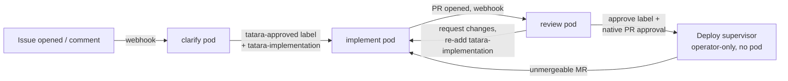

# The Agentic Operating Model

Tatara is not a chat interface or a one-shot code generator. It is an **operating model**: a persistent loop where a Kubernetes operator orchestrates discrete, single-purpose autonomous Claude Code sessions - one kind per pod - that read your issue tracker, run a clarifying conversation, write code, open pull requests, review the diff, and (once approved) hand off to a merge/deploy step the operator drives on its own.

Be precise about where the human sits in that loop. The one hard human gate is **maintainer
approval**: a project maintainer decides whether an issue gets worked, and the *only* action
that grants that approval is a maintainer applying the `tatara-approved` label directly to the
issue. `clarify`'s conversation shapes the plan but does not itself release the gate - a
comment never approves, regardless of author, and a non-maintainer or bot applying the label
never approves either. After a verified maintainer approval is recorded, the
implement-review-merge path is **autonomous** - `review` approves the bot's own PR from a
separate pod, and the deploy supervisor squash-merges once required checks are green and that
approval is present. There is no human merge step and no per-PR human sign-off unless you add
one yourself via the SCM's branch-protection rules. The stronger "human at every gate" posture
is available but is **configuration you opt into**, not the default. This page is explicit
about which is which.

It targets architects and platform engineers evaluating whether tatara's operating model fits their engineering culture.

---

## The closed-loop lifecycle

The central abstraction is the **Task**: a project-scoped Kubernetes custom resource that is
the umbrella for one implementation stream - every linked issue and every opened PR/MR across
every affected repo, with their comment threads and CI/mergeability state kept fresh on the
CR's status. Where the platform used to run one long-lived `issueLifecycle` pod through a
single state machine, it now hands work between **discrete, single-purpose agent pods** - one
kind per pod, each spawned fresh, each scoped to one job, each leaving the next one to a
different kind via a label swap or an MCP action. No single pod straddles triage, coding, and
review; that separation is what lets `review` structurally never approve its own diff.

Every arrow above is a **label swap or an MCP action**, not a phase field flip inside one
long-lived object. The Task CR does not carry a single `lifecycleState` enum walking through
these hops; it carries the cross-repo `WorkItems` ledger (issue/PR identity, state, labels,
head SHA, CI/mergeability, per member) that every kind's pod reads at turn 0. See
[Task reference](../reference/task.md) for the ledger shape and
[MCP Tool Profiles](../reference/mcp-tools.md) for the exact tool each kind calls to hand off.

!!! info "Where lifecycleState went"
    The `Task.status.lifecycleState` enum (`Triage`, `Conversation`, `Implement`, `MRCI`,
    `Merge`, `MainCI`, `Deploying`, `Done`, `Stopped`, `Parked`) is **not retired** - the
    JSON/CRD key is still `lifecycleState` and the enum still has all ten members. What changed
    with the `issueLifecycle` kind's retirement: its front half (Triage/Conversation/Implement/
    MRCI) is now legacy-drain-only, stamped only by in-flight pre-redesign `issueLifecycle`
    Tasks - new work is now three separate kinds (`clarify`/`implement`/`review`) coordinated by
    labels, not this status field. Its back half (Merge/MainCI/Deploying/Done/Stopped/Parked) is
    live: the **deploy supervisor**, an operator-only loop with no agent pod, still drives it.
    Only the Go struct field was renamed, to `DeployState` - the JSON/CRD wire key is unchanged -
    see [Deploy Supervisor](../workflows/deploy-supervisor.md).

---

## Seven kinds, seven triggers

| Kind | Trigger | Model | Scope |
|---|---|---|---|
| `brainstorm` | Schedule (cron) | opus | project |
| `incident` | Grafana alert webhook | opus | project |
| `clarify` | New issue, or any comment on an existing issue | opus | project |
| `implement` | `clarify`/`review` MCP action, or `tatara-approved` -> `tatara-implementation` label swap | opus surface, tiers its own subagents | project |
| `review` | PR/MR-create webhook | opus | project |
| `documentation` | Schedule (cron) | sonnet | repo (docs repo) |
| `refine` | Schedule (barrier before brainstorm tick) | sonnet | project |

Full per-kind trigger/scope/behavior detail lives on each kind's own page under
[Workflows](../workflows/index.md). This table is the map, not the territory - re-derive exact
field names from `reference/project.md`'s cron/model-tiering tables if they disagree.

Almost every kind is now **project-scoped** (a change from the old repo-scoped
`issueLifecycle`/`triageIssue`/`review` split) - only `documentation` stays repo-scoped, because
it targets one docs repo at a time. See [Task kinds and scoping](../reference/index.md#task-kinds-and-scoping)
for the full table with retirement notes.

All triggers pass through an **intake filter** before a Task is created - but only once you
configure it. When `spec.scm.reporterLogins` is populated, the author must be the bot, a
`maintainerLogin`, or a `reporterLogin`, and events from unknown authors are dropped at intake
so that third-party issue authors cannot drive agent execution via prompt-crafted content. When
`reporterLogins` is **empty (the shipped default)** the operator preserves its historical open
behavior and accepts issues and comments from **any** author. The prompt-injection intake
defense is therefore opt-in: it is inert until you populate the allowlist. See
[Gate 1](#gate-1-maintainer-approval-label) and the [Security boundary summary](#security-boundary-summary).

Selection order within a scan cycle: items carrying `spec.scm.priorityLabel` first, then
oldest-updated-first within each group, capped at `maxPerRepo` concurrent tasks per repository
lane. `refine` is not a separate cron schedule of its own kind of significance beyond the
barrier: it fires automatically ahead of each `brainstorm` tick, culling stale or duplicate open
issues before brainstorm proposes new ones.

---

## Human-in-the-loop gates

Tatara is autonomous within each kind's run. Across kind handoffs, the human control points are
**the maintainer-approval label** (Gate 1) and **brainstorm approval** (Gate 3, the same
mechanism applied to bot-authored proposals). The **review-approval -> merge** transition
(Gate 2) is autonomous by default and becomes human-gated only when you configure it - the SCM
branch-protection route below. Read each gate for its shipped default, not the aspirational
posture.

### Gate 1: Maintainer-approval label

The load-bearing human gate is not a conversation - it is a single, identity-verified SCM
action: **a project maintainer applies the `tatara-approved` label directly to the issue.**
Nothing else grants approval. A comment never approves, no matter its content or author. A
non-maintainer applying the label - including the issue's own reporter - does not approve;
the operator observes the label-add event, checks the actor against `spec.scm.maintainerLogins`,
and silently ignores the event if the actor is not a verified maintainer. An agent or bot
applying the label does not approve either: label-add events whose actor is the bot are
dropped before the maintainer check ever runs, so no pod can self-approve its own proposal.
`spec.scm.maintainerLogins` is closed by default - an empty list means the project has no
maintainers, so nothing can ever be approved and no issue advances past `clarify` into
implementation until the list is populated.

`clarify` is a **live polling pod**: on a new issue or a comment on an existing one, the
operator spawns a clarify pod that converses on the thread and waits up to 1 hour wall-clock
for the next reply (comments delivered live via the existing `PendingInterjections`
mechanism). The operator kills the pod on timeout - no agent runs while nobody is talking.
Clarify always starts with full cross-repo context (every linked issue + comment thread, every
repo at its newest default branch) so it is never in a position to say "I don't have enough
context" - the rigid `implement` skill downstream inherits the same rule (spec: implement "may
NOT reject for insufficient context"). That conversation shapes the plan and can be as
persuasive as it likes, but it is informational: even when clarify concludes the issue is
implement-ready and calls `issue_outcome(action=implement)`, the operator checks for a recorded
maintainer approval first. No recorded approval -> the issue is parked back to
`tatara-brainstorming` and clarify keeps waiting for the label, regardless of what the
conversation concluded.

On a new issue, clarify creates the project-scoped Task CR, digests the human's issue body, and
asks clarifying questions via the normal issue-comment channel. On a comment, clarify reads the
existing Task CR (or retro-creates it from full SCM history) and either answers back and waits,
or - once a maintainer approval is recorded - launches `implement` and exits.

A maintainer can apply `tatara-approved` at any point in the conversation, including
immediately on filing, to short-circuit further back-and-forth: the webhook records the
approval as soon as the event arrives, independent of clarify's own conversational state, so
the very next reconcile proceeds straight to handoff.

On handing off to implementation, clarify removes `tatara-brainstorming` and adds
`tatara-implementation` - the same two-label swap the old Conversation->Implement transition
did, just performed by a different, narrower kind, and gated on the recorded approval rather
than on clarify's own verdict.

For a systemic-improvement group (multiple sibling issues opened together across repos), this
gate applies **per issue**, not once for the whole group: each sibling needs its own recorded
maintainer approval, and an unapproved or declined sibling is never force-closed by the lead's
combined PR - its `Closes #N` reference is downgraded to `refs #N` instead. See
[Approval Gates](../operations/security/approval-gates.md#systemicgrouped-issue-sets-approval-is-per-issue-not-per-group).

!!! warning "Clarify cannot answer its own comments"
    The self-comment guard lives in the **permission layer**, not skill prose: the MCP comment
    action refuses when the last comment on the thread is bot-authored, and the webhook
    actor-check refuses to (re)spawn clarify off a bot's own comment. `refine` is the sole
    exception (see [Refine](../workflows/refine.md)).

!!! warning "Idle timeout is an inactivity window"
    The 1-hour wall-clock timer measures continuous silence, not wall-clock age of the issue. A
    comment from a maintainer resets it. Operator downtime is self-healing: the scan backstop
    re-binds Tasks whose issues have new `updatedAt` timestamps.

### Gate 2: Review approval - approve-label + native review, never a merge call

`review` never calls a merge API. On approval it applies `tatara-approved` and posts a native
PR/MR approval; that is the entire signal. The **deploy supervisor** is the only caller of the
merge API anywhere in the platform, and it merges only once both conditions hold: required
checks are green, and `tatara-approved` is present. If any MR under the Task is unmergeable
(conflict or failed pipeline), review withholds approval and re-adds `tatara-implementation`
to invoke `implement` again - there is no separate "request changes" merge-blocking step
distinct from this re-invocation.

!!! warning "There is no `pr_outcome` gate on the merge path"
    The `pr_outcome` MCP tool (`action=merge|close`) is profiled and documented as
    **`selfImprove`-only** (retired) - it never drove the live kind set's merge path. Nothing
    about the merge is agent-driven: the deploy supervisor merges on the green-checks +
    `tatara-approved` state, full stop, not on any agent-signaled `pr_outcome=merge`.

**If you want a real human merge gate**, add an SCM branch-protection rule that requires an
approving review before required checks can pass. That makes the forge (not tatara) hold the
merge until a human approves, on top of `review`'s own approval. Note that the shipped semver
push-CD design goes the other way on purpose: it stamps the significance label and enables the
forge's **native auto-merge** on the freshly opened bot PR, so bot-authored PRs merge
themselves on green required checks once `review` has approved. Autonomous merge is the
designed steady state, not an edge case.

### Gate 3: Brainstorm proposal approval

Brainstorm-generated issues are never implemented automatically. The agent applies `spec.scm.brainstormingLabel` (default `tatara-brainstorming`) to every proposal. This is the same Gate 1 mechanism applied to bot-authored proposals: a verified maintainer must apply `spec.scm.approvedLabel` (default `tatara-approved`) directly to the proposal issue before `clarify` hands it to `implement` - there is no other way to approve a proposal, and a bot-authored proposal can never approve itself. At or above `maxOpenProposals` (default 5) open unapproved proposals, the next brainstorm cycle is skipped entirely.

---

## Bounded autonomy

Autonomous agents that can loop forever are an operational liability. Tatara enforces hard limits at every layer.

### Turn and session limits

| Parameter | CRD field | Default | Effect |
|---|---|---|---|
| Max turns per task | `spec.agent.maxTurnsPerTask` | `50` | Agent pod is terminated after this many turns regardless of state |
| Turn inactivity timeout | `spec.agent.turnTimeoutSeconds` | `1800` (30 min) | A turn is failed only after this long with **no agent output** - a turn actively writing code is never interrupted mid-work |
| Babysit deadline | `spec.scm.babysitDeadlineMinutes` | `60` | Post-merge CI poll gives up after this many minutes; Task moves to **Parked** (PR left open for a human) |
| Clarify wall-clock cap | (live-polling window) | `60` min | Clarify's live pod is killed after this many minutes of silence; resumable by a future comment |

### Context window guard

Each agent turn reports its token usage via the operator's callback API. The operator **overwrites** `Task.status.lastTurnInputTokens` with the latest turn's input-token total on every callback (it is a snapshot of the last turn, not a running sum - the running totals live in separate `cumulative*` fields). It uses that single latest value as a proxy for how full the model's context currently is, and compares it to `spec.agent.handoverThresholdPercent` (default 25%) of `spec.agent.contextWindowTokens` (default 200,000).

**Default path, below the threshold: full-transcript resume.** When a fresh pod picks the Task up for the next Implement iteration, it resumes the entire persisted Claude conversation via `claude --resume` (issue #114). No reset, no summarization - the next pod continues where the last one stopped, with full history.

**At or above the threshold: compacted handover.** Only once `lastTurnInputTokens` crosses `handoverThresholdPercent` does the operator switch to the reset path, to keep the next turn's context from overflowing:

1. The current agent is given one final turn to produce a `submit_handover` artifact: a compact prose summary of what was done, what remains, and what context the next agent needs.
2. The full-transcript resume is skipped for that spawn.
3. The next pod starts fresh and receives the compacted handover text as the first turn prompt.

The two paths are mutually exclusive: a spawn gets **either** the full transcript (`--resume`, under threshold) **or** the handover summary (at/over threshold), never both. This keeps quality high on ordinary multi-turn work (full history) while preventing context overflow from silently degrading long-running issues (compaction only when genuinely needed).

### Queue capacity

Concurrent agent pod execution is bounded by the admission queue:

| Parameter | CRD field | Default |
|---|---|---|
| Normal task slots | `spec.queue.capacity` | `spec.maxConcurrentTasks` (default 3) |
| Alert-class reserved slots | `spec.queue.alertCapacity` | `1` |

Alert-class slots (reserved for incident investigations) are not consumed by normal implementation tasks. When normal capacity is full, new `QueuedEvent` objects wait in `Queued` state and are admitted as slots free.

### Give-up paths

A Task that cannot make progress lands in one of two safe terminal states rather than looping indefinitely:

- **Stopped** - clarify's 1-hour wall-clock idle timeout elapses. The issue remains open. A new comment re-spawns a fresh clarify pod against the same Task via webhook.
- **Parked** - babysit deadline exceeded, or a merge conflict not resolved within the deploy supervisor's bounded-retry cap. The PR is left open for a human. The operator posts a comment explaining what it attempted.

In neither case does the operator close the issue, force-push, or retry silently.

---

## Why labels and comments are the control plane

Every human decision in tatara is expressed through two SCM-native mechanisms: **labels** and **comments**. This is a deliberate architectural choice, not a convenience.

**Labels project operator state externally.** The four managed labels (`tatara-brainstorming`, `tatara-approved`, `tatara-implementation`, `tatara-declined`) are written by the operator and readable by any tool with SCM access: CI systems, dashboards, humans scrolling the issue list. State is visible without querying a Kubernetes API. The label set is unchanged from the prior model - only which kind of pod reacts to each label changed.

**Comments create a natural audit log.** Every agent action - triage decision, design question, scope summary, merge outcome, give-up reason - appears as an issue or PR comment. The comment thread is the complete history of the agent's reasoning, visible to everyone with SCM read access, survives operator restarts, and requires no tatara-specific tooling to interpret.

**Webhook reactions are human-native actions.** A maintainer approves implementation by applying a label they already use - no comment, no reply, no tatara-specific UI to learn. The operator responds to SCM events - the same events your CI system, project management tools, and on-call runbooks already consume.

**The control plane is the issue tracker.** Every agent side effect surfaces as a PR you can close or an issue comment you can read - there are no hidden effects in a separate system, which makes the day-to-day blast radius legible. Be honest about the ceiling, though: that framing bounds the *review surface*, not the *privilege*. The bot PAT carries whatever repo scopes you grant it (org-wide write in the reference deployment), and because `review` approves the bot's own PR and the deploy supervisor then merges it autonomously on green CI, a misconfigured or prompt-injected agent can land code without a human merge step. Where the platform self-deploys, a merged change to the GitOps repo flows to the cluster via a runner with broad rights. The control plane is legible; the aggregate privilege is not trivial. Bound it with the intake allowlist, a review-gated branch-protection rule on sensitive repos, and least-privilege PAT scopes - see [Trade-offs](why-tatara.md#trade-offs-to-consider) and the [security docs](../operations/security/index.md).

---

## Security boundary summary

These are the mechanisms, with their **shipped default state** called out. Several are opt-in and inert until configured - do not read the "Mechanism" column as an always-on guarantee.

| Concern | Mechanism | Default state |
|---|---|---|
| Third-party prompt injection | `reporterLogins` allowlist: only bot, maintainers, and allowed reporters can drive agent intake | **Opt-in.** Empty `reporterLogins` (default) accepts **any** author. Populate the list to activate the filter. |
| Unauthorized approve-to-implement | `maintainerLogins` gates whose `tatara-approved` label-apply the operator records as approval; a comment never approves | **Closed by default.** Empty `maintainerLogins` means no login is a maintainer, so `tatara-approved` can never be verified and nothing ever advances to implement. Populate the list to allow any approvals at all. |
| Autonomous merge | Merge is gated by the deploy supervisor: required checks green AND `tatara-approved` present (set only by `review`'s approve action, never by `implement`). No agent calls a merge API. | On by construction - `review` structurally cannot approve its own diff (separate pod, separate turn). See [Gate 2](#gate-2-review-approval-approve-label-native-review-never-a-merge-call). |
| SCM write-back authorship | Egress verified via `GetPRState` at operator side, not trusting webhook payload | Always on. |
| Webhook authenticity | **GitHub:** HMAC-SHA256 over the body (`X-Hub-Signature-256`). **GitLab:** constant-time comparison of the static shared-secret `X-Gitlab-Token` header (a replayable bearer, not an HMAC over the payload - materially weaker). | Always on (both require a configured secret). |
| Agent network egress | Cluster-side NetworkPolicy; internet access only for `brainstorm` tasks with `internet` source, gated by a pod label the infra helmfile controls | On where the NetworkPolicy is applied (cluster config). |
| Kubernetes API access | Agent pods have no Kubernetes credentials. Only tatara-cli (MCP server in the pod) can call the operator REST API, which is OIDC-gated | Always on. |

Intake and approval do not fail the same way when left unconfigured. As shipped with an empty
`reporterLogins`, intake is **open**: any author can open work and drive the conversation. As
shipped with an empty `maintainerLogins`, approval is **closed**: nobody can ever satisfy the
maintainer check, so no issue - however it was opened - ever advances to implementation until
you populate the list. Once you do, a `review`-approved PR still merges itself on green CI with
no human merge step by default. See [Approval Gates](../operations/security/approval-gates.md)
and [Prompt-Injection Defenses](../operations/security/prompt-injection.md) for full detail on
each mechanism.
