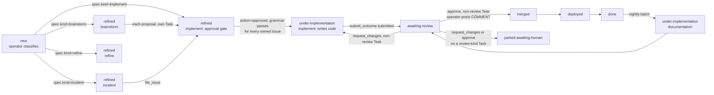

# The Agentic Operating Model

Read this page and you will know how a Task moves from an issue in your tracker to merged code,
which of those steps you control, and which run without you.

tatara is not a chat interface or a one-shot code generator. It is an **operating model**: a
Kubernetes operator drives discrete, single-purpose Claude Code sessions - one agent kind per pod -
that read your issue tracker, run an approval conversation, write code, open pull requests, review
the diff, then hand off to a merge and deploy sequence the operator drives on its own.

The one hard human gate is **maintainer approval**, and you express it as a **comment**, not a
label. A project maintainer comments on every issue the Task owns. The `implement` agent judges
whether that comment approves, cites it with a comment id and a verbatim quote, and pins the plan
it wants approved. The operator verifies that citation before any code is written. Labels are a
write-only projection of state, never a source of it: nothing reads a label to decide whether work
proceeds.

After that approval lands, the implement-review-merge-deploy path runs on its own. The merge step
is still not agent-driven. The **operator** merges, from a review pod's accepted verdict, never
from a native SCM approval an agent posted. Agents call no merge API and post no
`APPROVE`/`REQUEST_CHANGES` review on their own PR, and no tatara-opened PR is ever opened with the
forge's merge-when-green feature switched on.

!!! info "Since the #521 lifecycle redesign: `clarify` is `implement`"
    This page describes the platform after the #521 lifecycle redesign folded the `clarify`
    agent kind into `implement` and replaced the old 16-member `status.stage` with an 8-member
    `status.state` plus an orthogonal `status.parkReason` flag. Where earlier revisions of this
    page said "the clarify agent" or "`clarifying`-stage", read "the `implement` agent, at its
    approval-gate turn" and "`state=refined`" respectively.

---

## The closed-loop lifecycle

The central abstraction is the **Task**: a project-scoped Kubernetes custom resource that is the
umbrella for one implementation stream. It carries every linked Issue and MergeRequest CR across
every affected repo, kept fresh on the CR's status, plus `status.notes` - an append-only log of
plans, handoffs, and free-text continuation state that every pod reads at turn 0.

No single long-lived pod straddles triage, coding, and review. The operator hands work between
**discrete, single-purpose agent pods**: one agent kind per pod, each spawned fresh, each scoped
to one job, each leaving the next state to the operator. That separation is what makes it
structurally impossible for `review` to approve its own diff. It is always a different pod and a
different turn than the one that wrote the code.

```mermaid
flowchart LR
    T[new\noperator classifies] -->|spec.kind=implement| C[refined\nimplement: approval gate]
    C -->|action=approved, grammar passes\nfor every owned Issue| UI[under-implementation\nimplement: writes code]
    UI -->|submit_outcome submitted| RV[awaiting-review]
    RV -->|approve, non-review Task\noperator posts COMMENT| MG[merged]
    RV -->|request_changes, non-review Task| UI
    RV -->|request_changes or approve\non a review-kind Task| PH[parked awaiting-human]
    MG --> D[deployed]
    D --> DL[done]
    T -->|spec.kind=brainstorm| B[refined\nbrainstorm]
    B -->|each proposal, own Task| C
    T -->|spec.kind=incident| IN[refined\nincident]
    IN -->|file_issue| C
    T -->|spec.kind=refine| RF[refined\nrefine]
    DL -->|nightly batch| DOC[under-implementation\ndocumentation]
    DOC --> RV
```

Every arrow above is an operator-written state transition, driven by an agent's `submit_outcome`
call or by admission/webhook events - never a phase field an agent flips itself. See
[Task reference](../reference/task.md) for the CRD shape and
[MCP Tools by Agent Kind](../reference/mcp-tools.md) for the exact tool each kind calls to hand
off.

## The eight states

`Task.status.state` is a closed eight-value enum, and it is the one field that tells you where a
Task is:

| State | What it means |
|---|---|
| `new` | Triage. The operator validates the spec and routes the Task to its origin kind's target. No pod runs. |
| `refined` | The approval gate. A pod is up, writing a plan and looking for a maintainer comment to cite. |
| `under-implementation` | Code is being written. A pod is up. |
| `awaiting-review` | A review pod is up, whatever the Task's origin kind is. |
| `merged` | The merge phase: a review verdict of approve was accepted, and the operator is working the Task's merge order. Pod-less. |
| `deployed` | The deploy phase: merged, waiting for the deploy to land. Pod-less. |
| `done` | Terminal, success. |
| `rejected` | Terminal, stopped. A `stateReason` is mandatory. |

Four things about that table catch newcomers out.

**`parked` and `failed` are not states.** Parking is a separate flag, `status.parkReason`. A
stalled Task is `state=X` **and** `parkReason=Y` at the same time, and un-parking re-derives where
to go from the state it never left. `failed` does not exist at all any more.

**Terminal means exactly `done` and `rejected`.** Nothing else, and specifically not a park - a
parked Task is very much alive.

**`merged` and `deployed` name the phase, not the milestone.** A Task at `merged` has an accepted
approval and an operator walking its merge order; it does not mean every merge request is already
merged. Per-merge-request truth lives on the `MergeRequest` CR's own status.

**Only the operator writes `status.state`.** No agent ever asks for a state. An agent submits an
outcome - approved, submitted, declined, a review verdict - and the operator decides which edge, if
any, that outcome takes.

Twenty-five transitions connect those eight states, six guards constrain them, and the park flag
has its own vocabulary of reasons. All of it is tabulated on
[The Task state machine](../reference/task-stages.md), which this page deliberately does not
duplicate.

## One Task, two pods: the implement and review loop

For the platform's own work there is **no separate review Task**. The same Task moves from
`under-implementation` to `awaiting-review`. The operator tears the implement pod down and brings a
review pod up on that same Task. The pod name is stamped once, when the Task is created, so if the
project enables the persistent workspace volume the review pod inherits the implement pod's
`/workspace` rather than getting a fresh clone.

That is how the review stays structurally independent without splitting the work in two: a
different pod and a different turn, but the same durable object, the same notes journal, and the
same set of owned merge requests.

The loop runs like this:

1. The implement pod calls `submit_outcome(action=submitted)` with at least one open merge request
   it owns. The Task moves to `awaiting-review`.
2. The review pod reads the diff and returns one of exactly two verdicts: `approve`, or
   `request_changes` with at least one finding. There is no `comment` verdict.
3. On `request_changes` the Task goes back to `under-implementation` - **same Task, new pod**. The
   findings ride forward twice over, mirrored onto the merge request and written as an operator
   note, so the next pod reads them at turn 0.
4. On `approve` the Task moves to `merged` and **the operator merges**. No agent has a merge tool;
   nothing in the MCP surface exposes one.

**There is no round cap on that loop.** `Project.spec.agent.maxReviewRounds` still exists on the
CRD and has zero effect - the cap was deleted because it parked implement/review pairs that were
converging. What bounds the loop instead is residency: a Task may spend 24 hours in total across
`refined`, `under-implementation`, and `awaiting-review` before the dead-man switch stops it.

A `kind=review` Task is a different animal. It reviews a **human's** pull request, and by guard it
can never reach `under-implementation` or `merged` from anywhere - a human's PR is fixed by the
human and merged by the human. Those Tasks park at `awaiting-human` between rounds, un-park on the
human's next comment, and are bounded by `maxHumanReviewRounds` (5). See
[PR / MR Review](../workflows/review.md).

## Two enums, not one

A Task carries two kind-shaped fields and they mean different things. Conflating them is the
single most common misreading of the model.

| Field | Meaning | Values |
|---|---|---|
| `Task.spec.kind` | The **origin**. Why this Task exists. Immutable; baked into the Task name. | `brainstorm`, `incident`, `implement`, `refine`, `review`, `documentation`, `takeover`, `upgrade` |
| `Task.status.agentKind` | The **running agent**. Which pod is executing right now. Changes as the Task advances. | `brainstorm`, `incident`, `implement`, `refine`, `review`, `documentation`, `upgrade` - seven values |

`implement` is **both an origin and an agent kind**, since the #521 lifecycle redesign folded
`clarify` into it on both fronts: a Task minted from a new issue gets `spec.kind: implement`
directly (`SweepIssueKind` - the origin role `clarify` used to play), runs an `implement` pod for
its approval-gate conversation, and, once approved, runs an `implement` pod for the code too. One
Task, one durable object, many pods.

Model and effort tiering (`Project.spec.agent.modelByKind` / `effortByKind`) keys on the **agent**
kind, because that is what determines what the pod is about to do.

!!! danger "`Task.status.phase` and `Task.status.lifecycleState` are gone" <!-- stale-ok: Task.status.phase, lifecycleState -->
    Both fields are deleted, along with the ~3200-line lifecycle machine behind them and the
    retired single-pod, all-in-one Task kind that produced them. They were replaced by a single
    field, `Task.status.stage` (16 members) - itself superseded by the #521 redesign's
    `Task.status.state` (8 members) plus the orthogonal `Task.status.parkReason` flag. See the
    [Task state machine](../reference/task.md).

---

## Origin kinds and where they trigger

| Origin kind (`spec.kind`) | Trigger | Scope |
|---|---|---|
| `brainstorm` | Schedule (cron), one tick per project | project |
| `incident` | Grafana alert webhook | project |
| `implement` | New issue, or any comment on an existing issue (the origin role `clarify` used to play) | project |
| `review` | PR/MR-create webhook (also spawned per delivered Task by the nightly documentation batch's own review pass) | project |
| `documentation` | Nightly cron, one batch Task per project covering everything `done` in the last 24h | repo (the docs repo, via `spec.repositoryRef`) |
| `refine` | Schedule, as a barrier immediately before the `brainstorm` tick | project |
| `takeover` | A maintainer's hand-over comment on a foreign-authored MR | project |
| `upgrade` | A cron tick on the project's upgrade schedule, or a dependency engine's merge request the sweep adopts. Off by default | project |

`implement` is also the agent kind that runs the code-writing turn at `under-implementation`, for
every origin, not only its own. Every origin kind above is **project-scoped** except
`documentation`, which is the one kind that sets `spec.repositoryRef` because it targets exactly
one docs repo per run. Full per-kind trigger and behavior detail lives on each kind's own page
under [Workflows](../workflows/index.md).

All triggers pass through a **reporter allowlist** before a Task is minted from a webhook event -
but only once you configure it. When `Project.spec.scm.reporterLogins` is populated, the author
must be the bot, a maintainer, or an allowed reporter, or the event is dropped at intake so that
third-party issue authors cannot drive agent execution via prompt-crafted content. When
`reporterLogins` is empty (the shipped default) the operator accepts issues and comments from
any author. The allowlist is therefore opt-in: inert until you populate it. See
[Approval Gates](../operations/security/approval-gates.md) and
[Prompt-Injection Defenses](../operations/security/prompt-injection.md).

Admission within a scan cycle is priority-ordered: incident-class work first, then
webhook-originated work, then cron/sweep-originated work, capped at `Project.spec.maxOpenTasks`
(active-Task cap, default 6) and `maxNewTasksPerSweep` (default 5) new mints per sweep. `refine`
is not a cron schedule of its own significance beyond the barrier: it fires ahead of each
`brainstorm` tick, folding or closing stale and duplicate open issues before brainstorm proposes
new ones.

---

## Merge requests tatara did not open

Two flows put tatara on somebody else's branch. They look alike and they are not the same thing,
so the platform names them separately. **Adoption** claims a dependency engine's merge request
under a standing policy you configured. **Takeover** hands one specific merge request over on a
maintainer's request. Different Task kind, different trigger, different code path.

### Adoption: claiming a dependency engine's merge request

The `upgrade` kind keeps your dependencies current. It is scheduled, opt-in, and off until you
configure it, and it runs in two structurally different shapes.

**The cron shape.** Each due tick mints at most one upgrade Task, which enters directly at
`under-implementation`: there is no driving issue and no approval gate, because the upgrade policy
you configured is the standing go-ahead. The pod does its own discovery, takes exactly one upgrade
unit, reads the release notes for **every** release between the current pin and the target, makes
the code changes the bump needs, and runs the repo's real test suite. Renovate runs read-only
inside that pod as a candidate hint only, never as the source of truth - a dry run fetches no
release notes at all. Declining is a correct and common answer.

**The adopted shape.** Here Renovate opens the merge request and tatara claims it. Renovate keeps
discovery and changelogs; tatara keeps merge authority, so every dependency bump lands through a
Task rather than through the engine merging its own work. The operator mints an `upgrade` Task
bound to that merge request at `new`, and triage walks it straight to `awaiting-review`: no pod
runs at `new`, so there is no implement turn, no plan, and no approval gate. **A review pod goes
first.**

That review pod's `approve` merges a third party's merge request. That is intended, and it is the
common case - a trivial patch bump costs one review turn instead of an implement turn plus a review
turn. If the reviewer requests changes instead, the Task moves to `under-implementation` and the
**upgrade** agent pushes complementary commits onto Renovate's own branch, then another review
round follows.

Adoption is gated on eight clauses, and the first one is the switch: **`adoptBranchPrefix` empty
disables adoption entirely, and empty is the default.** The other seven bound what can be claimed -
the head branch carries that prefix, the author is your bot login or a login you listed as an
upgrade engine, the head repo is the base repo (never a fork, and an unknown head repo fails
closed), no Task already owns it, the merge request does not carry your trigger label, no refusal
marker exists for that exact head commit, and it has not stood down to a human push. The author
clause is what makes an adopted merge safe: the identity adoption accepts is the same identity the
merge corridor accepts, so anyone who pushes a branch named `renovate/whatever` gets a review, not
a merge. See [Upgrade](../workflows/upgrade.md).

Nobody asked for an adoption - the sweep made the claim on its own - so if a human pushes to an
adopted merge request, it becomes human-merged-only from then on. That is the deliberate difference
from a takeover, where a maintainer did ask.

### Takeover: one merge request, handed over and handed back

**Toward tatara, the trigger is a comment.** There is no label and no fixed command syntax. A
`review` Task is already reviewing the human's merge request; some comment in the thread reads as a
hand-over request - "take this over", "fix the conflicts and land it" - and the review agent judges
that intent and calls a tool.

The operator never trusts that judgment. It re-validates server-side that the cited comment exists
in its own mirror of the thread, and that the comment's author is a project **maintainer** - the
maintainer tier, deliberately not the weaker intake allowlist, because handing a branch over is a
privilege grant. An author who does not clear that bar gets **HTTP 403**, and nothing is written to
the forge. Refusing the requester conversationally is the review agent's job, not the operator's.
On success, ownership flips to tatara and exactly **one** takeover Task exists for that merge
request, reused across every round, so its history is never reset by a fresh mint.

**Back toward the human, the trigger is a push.** This direction is not agent-initiated and there
is no tool for it. A human pushes any commit to the branch; the operator sees the head move off the
last commit tatara pushed, flips ownership back to external, parks the owning Task, and posts a
stand-down comment. Detection is that comparison and nothing else - the operator never asks who
pushed, because a commit author is a string the pusher chose.

Standing down does not stop the review. tatara keeps reviewing, and the operator will still merge
on an approved review whose approval is pinned to your current head. To get the branch back, the
maintainer comments again and the same one Task un-parks.

There is no third direction: tatara never asks a human to take a merge request over. An agent that
declines parks its Task and writes a comment, and nothing about that returns the branch. The
procedure from your side is on [Handing an MR to tatara](../workflows/mr-takeover.md).

---

## Human-in-the-loop gates

tatara is autonomous within each kind's run. Across kind handoffs, your control point is **the
approval grammar** (Gate 1), and it is the same mechanism whether a human filed the issue or
`brainstorm` proposed it. The **review-approval to merge** transition (Gate 2) is autonomous by
construction, and no configuration flag arms the forge's merge-when-green feature. Read Gate 2 for
what actually gates a merge, not for a stronger posture you might hope is there.

### Gate 1: The approval grammar

The load-bearing human gate is a comment, judged by the agent and verified by the operator. Never a
label, never a wordlist match. For a Task to leave `refined` and enter `under-implementation`,
**every** Issue it owns that is still open and not already `done` or `rejected` needs a citation -
a comment `external_id` plus a verbatim quote from its body - that the operator's
`restapi.verifyApprovalScope` accepts, plus a pinned plan note (`plan_note_id`).

The `implement` agent judges whether a comment approves and supplies the citation. The operator
then checks that cited comment for itself: does it exist on the Issue, is its author in the
effective maintainer set and not the bot, does the quoted text really occur in the body the
operator holds, and has it not already been consumed. Each approval comment is single-use, so a
Task cannot be re-approved off a comment ID it already spent. Nothing requires the cited comment to
be the thread's most recent maintainer comment: reading whether a later comment withdraws an
earlier approval is the agent's job, not a structural check. On a clean check the operator stamps
`Issue.status.approval` with the cited comment's author, ID, and quote, and once every owned Issue
is approved, `Task.status.state` moves to `under-implementation`.

`implement`'s approval-gate turn is a **live polling pod**: on a new issue or a comment on an
existing one, the operator spawns an `implement` pod that converses on the thread. That
conversation shapes the plan and its judgment decides *which* comment to cite as approval, but the
judgment does not itself release the gate - even when the pod concludes the issue is
implement-ready and calls `submit_outcome(action=approved, approval_citations=...)`, the operator
evaluates the citation independently. No citation that passes on every owned Issue means the Task
parks at `parked(identity-unverified)` (HTTP 200, not an error), and the next non-bot comment
un-parks the Task, spawning a fresh `implement` pod that reads the refreshed thread and submits its
own fresh citation - the check itself is never re-run directly against a stale judgment. The plan
pin adds a second protection specific to the merged kind: the operator hashes the plan note at
grant and re-checks it before the same pod is allowed to write code, so a plan swapped after
approval routes back to `refined` instead of proceeding.

Approval is **not sticky**: a Task that acquires a new Issue after reaching `under-implementation`
- via a fresh `issue_write(create)` or a refine fold adopting one - drops back to `refined`,
because the "every owned Issue is approved" clause no longer holds. An agent cannot widen its own
mandate by adopting work after the gate.

Brainstorm-authored proposals go through this exact same gate, not a separate one: each accepted
proposal from a `brainstorm` Task becomes its own new `implement`-origin Task, and
refined-to-under-implementation requires the identical agent-cited, operator-verified comment.
There is no bot-writable label that substitutes for it. The one carve-out with no comment to cite
at all is `autoApproveTataraProposals`, unchanged by this design - see
[Approval Gates](../operations/security/approval-gates.md#the-one-carve-out-with-no-comment-to-cite-autoapprovetataraproposals).

!!! warning "Implement cannot answer its own comments at the conversation phase"
    The self-comment guard lives in the permission layer, not skill prose: the MCP comment action
    refuses when the last comment on the thread is bot-authored, and the webhook actor-check
    refuses to (re)spawn a pod off a bot's own comment. `refine` is the sole exception (see
    [Refine](../workflows/refine.md)).

### Gate 2: Review approval, then an operator-driven merge

`review` never calls a merge API, and it never posts a native `APPROVE`/`REQUEST_CHANGES` review on
the platform's own PR - both 422 on a self-authored PR, because the platform has exactly one bot
identity. On approval it calls `submit_outcome(approve)`. The operator is the one that posts a
`COMMENT`-type review afterwards and then, once required checks are green, merges, against the
exact head SHA the agent reported reviewing. If an owned MR is unmergeable or the reviewer requests
changes, the Task returns to `under-implementation`. On a `kind == "review"` Task - a human's own PR
under review - neither path re-invokes `implement`: the Task parks at `awaiting-human`, because
**a human's PR is fixed by the human**. Only the human's next comment un-parks it, and
`maxHumanReviewRounds` (5) bounds that cycle.

!!! danger "If you want a human merge gate, you already have one - it is the default"
    No tatara-opened PR is ever opened with merge-when-green switched on. The operator merges only after a review pod
    submits `verdict=approve` and the operator accepts it, and only against the exact head SHA
    that was reviewed. A branch-protection rule requiring an approving review is **not** available
    as defence in depth here: the platform's one bot identity means it can never post `APPROVE` on
    its own PR (GitHub 422s), so a rule that required one would deadlock every merge. The real
    defence in depth is at the forge and the token: no-direct-push branch protection, a scoped App
    installation token, and `gh` / `glab` / direct-to-API `curl` on the deny-list - the MCP
    surface is a guardrail, not a security boundary.

A `review`-kind Task (one opened against a contributor's or maintainer's own PR, not the
platform's) can **never** reach `merged`, by any path: neither the approve edge nor the
request-changes edge lets it. Merging a human's PR is a human action, full stop. See
[Merge and Deploy](../workflows/merge-and-deploy.md#the-merge-sequence) for the merge sequence and
[Approval Gates](../operations/security/approval-gates.md#the-approval-grammar) for the full grammar.

---

## Bounded autonomy

Autonomous agents that can loop forever are an operational liability. tatara enforces hard limits
at every layer.

### Turn and review-round limits

| Parameter | CRD field | Default | Effect |
|---|---|---|---|
| Max turns per pod run | `Project.spec.agent.maxTurnsPerPod` | `40` | **Deprecated, zero effect.** Used to cap one pod's run (`implement` exempt) |
| Max turns per Task, lifetime | `Project.spec.agent.maxTurnsPerTask` / `Task.spec.maxTurnsPerTask` | `300` | **Deprecated, zero effect.** A turn count measures how much an agent has done, not whether it is stuck - see the [residency cap](../reference/task-stages.md#residency-the-dead-man-switch) for what replaced it |
| Turn inactivity timeout | `spec.agent.turnTimeoutSeconds` | `1800` (30 min) | **No longer fails the turn.** Triggers a probe instead; only an unanswered escalation past `stallProbeMaxAttempts` interrupts the session - see [Stall detection](../architecture/agent-execution.md#stall-detection-probe-interrupt-stop) |
| Review rounds (non-`review` Task) | `Project.spec.agent.maxReviewRounds` | `3` | **Deprecated, zero effect.** The `awaiting-review` <-> `under-implementation` cycle carries no round count; residency bounds it instead |
| Human review rounds (`review`-kind Task) | `maxHumanReviewRounds` | `5` | Bounds the `awaiting-human` <-> `awaiting-review` cycle on a human's own PR. Still active |
| Pod recreations | `Project.spec.agent.maxPodRecreations` | `3` | **Deprecated, zero effect.** A pod that never becomes Ready still respawns, uncapped; repeated respawns are now an alert (`operator_pod_recreations_total`), not a Task failure |
| Residency, all three live states | hardcoded, not a field | `24h` | The dead-man switch that replaced the three deprecated rows above: a hard cumulative bound, uniform across `refined`/`under-implementation`/`awaiting-review` |

### Queue capacity

Concurrent agent pod execution is bounded by the admission queue, keyed on
`Project.spec.maxConcurrentAgents` (default 3) - **this is the project's kill switch**: set
it to `0` and no pod, of any kind, is ever admitted. A reserved `AlertCapacity` (default 1) keeps
incident-class investigations from starving behind normal implementation work. When capacity is
full, new `QueuedEvent` objects wait in `Queued` state and are admitted as slots free.

### Give-up paths

A Task that cannot make progress either lands on the `rejected` terminal (which ages out) or parks
rather than looping forever. Parking is a flag orthogonal to the eight-value `Task.status.state`,
not a state of its own, so the Task stays where it is and un-parks from there. `done` is reaped
once the work is documented or provably needs no documenting. A park carries a `parkReason`
explaining what happened - `admission-starved`, `identity-unverified`, `awaiting-human`,
`merge-conflict`, `pod-recreation-exhausted` and others, 29 in total - and `rejected` and `done`
carry their own much smaller `stateReason` vocabularies. See
[The Task state machine](../reference/task-stages.md) for the full state and reason lists; do not
re-derive them here, they change independently of this page.

In no case does the operator close an issue, force-push, or retry silently, and the
`parkReason`/`stateReason` is always recorded on the Task CR - but not every give-up reaches the
issue thread itself as a comment. `identity-unverified` in particular posts nothing to the thread:
the refusal is visible in the operator's logs, `Task.status.notes`, and its metrics, never as a
comment a maintainer would see.

---

## Why comments are the control plane, and labels are not

You express every decision as **comment text**, judged by the agent and verified by the operator.
Never a label. Labels still exist, as an operator-written one-way projection of
`Issue.status.status` that any tool with SCM access can read - CI systems, dashboards, you
scrolling the issue list - but never as a source of truth. No code path reads a label to produce a
status, and a test asserts it.

The choice is deliberate. A comment carries authorship and content the operator can check, against
the maintainer set and against the cited quote's presence in the comment body, in a way a
label-apply event cannot. A comment carries a timestamp too, but the operator checks nothing
against it: there is no recency requirement, by design (see
[why](../operations/security/approval-gates.md#there-is-no-most-recent-comment-requirement-and-that-is-deliberate)).
A label-add tells you *that* someone acted. A cited comment tells you *what* they approved, with
the reasoning sitting next to the decision.

**Comments create a natural audit log.** Every agent action - triage decision, design question,
scope summary, merge outcome, give-up reason - appears as an issue or PR comment, or as a
`Task.status.notes` entry visible via the operator's REST API. The comment thread and the notes
log together are the complete history of the agent's reasoning.

**The control plane is the issue tracker**, but be honest about the ceiling: that framing bounds
the *review surface*, not the *privilege*. The bot PAT carries whatever repo scopes you grant it,
and because the operator merges autonomously on a review pod's accepted approval plus green CI, a
misconfigured or prompt-injected agent can land code without a human merge step. Bound it with the
intake allowlist, a review-gated branch-protection rule on sensitive repos, and least-privilege PAT
scopes - see [Trade-offs](why-tatara.md#trade-offs-to-consider) and the
[security docs](../operations/security/index.md).

---

## Security boundary summary

These are the mechanisms, with their **shipped default state** called out. Several are opt-in and
inert until configured - do not read the "Mechanism" column as an always-on guarantee.

| Concern | Mechanism | Default state |
|---|---|---|
| Third-party prompt injection | `reporterLogins` allowlist: only the bot, maintainers, and allowed reporters can drive agent intake | **Opt-in.** Empty `reporterLogins` (default) accepts any author. Populate the list to activate the filter. |
| Unauthorized approve-to-implement | The approval grammar: the `implement` agent cites a comment and pins a plan, and the operator independently verifies the citation exists, its author is a verified non-bot maintainer, its quoted text is genuinely there, and the plan hash still matches at code-writing time - no wordlist, single-use per comment | **Closed by default.** Empty `maintainerLogins` means no login is a maintainer, so no comment can ever satisfy the check and nothing advances past `refined`. Populate the list to allow any approvals at all. |
| Autonomous merge | The operator merges only once a review pod's `submit_outcome(approve)` is accepted and required checks are green - never from an agent-posted native review, and never via a merge API any agent can call | On by construction. `review` structurally cannot approve its own diff (separate pod, separate turn), and a `review`-kind Task (a human's own PR) can never reach `merged` at all. See [Gate 2](#gate-2-review-approval-then-an-operator-driven-merge). |
| SCM write-back authorship | Egress verified operator-side against the live PR/MR state, not trusted from the webhook payload alone | Always on. |
| Webhook authenticity | **GitHub:** HMAC-SHA256 over the body. **GitLab:** constant-time comparison of the shared-secret token header (a replayable bearer, not an HMAC over the payload - materially weaker). | Always on (both require a configured secret). |
| Agent network egress | Cluster-side NetworkPolicy; internet access only for `brainstorm` tasks configured for it, gated by a pod label the infra helmfile controls | On where the NetworkPolicy is applied (cluster config). |
| Kubernetes API access | Agent pods carry no Kubernetes credentials. Only tatara-cli (the MCP server in the pod) can call the operator REST API, which is OIDC-gated | Always on. |

Intake and approval do not fail the same way when left unconfigured. As shipped with an empty
`reporterLogins`, intake is **open**: any author can open work and drive the conversation. As
shipped with an empty `maintainerLogins`, approval is **closed**: nobody can ever satisfy the
grammar, so no issue - however it was opened - ever advances to implementation until you populate
the list. Once you do, an approved Task still runs its merge fully autonomously, with no per-PR
human sign-off, unless you add an SCM branch-protection rule of your own. See
[Approval Gates](../operations/security/approval-gates.md) and
[Prompt-Injection Defenses](../operations/security/prompt-injection.md) for full detail on each
mechanism.
