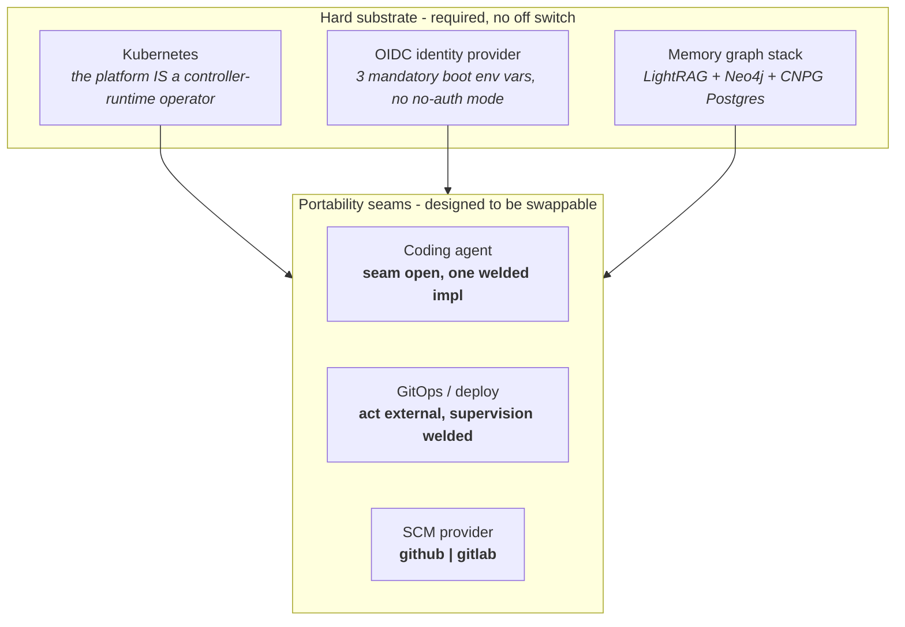

# Portability & Requirements

This page is an honest map of what tatara actually requires to run, what is
merely the maintainer's personal stack, and how portable the platform really is
today. It is written for platform architects, senior devops, and senior
developers who are evaluating whether they can run tatara on **their** stack:
any GitOps mechanism, any coding agent, their own identity and data services.

The reference deployment documented in
[Prerequisites](../getting-started/prerequisites.md) lists everything the
maintainer runs. That page is a shopping list for reproducing the reference
environment. **This page is the opposite exercise**: it separates the handful of
things tatara genuinely cannot run without from the many things that are one
person's deployment choices, and it is candid about where the two have become
welded together in the code as shipped.

!!! quote "The design intent"
    The CD pipeline (`tatara-helmfile` + GitHub Actions) is the maintainer's
    way of running tatara. It is **not** meant to be a requirement. Claude Code
    is the current agent, but tatara is meant to be runnable with any coding
    agent and any GitOps or reconcile mechanism. The requirement is *a* coding
    agent and *some* way to apply what it produces - not these specific tools.

    That is the intent. The rest of this page is honest about the gap between
    that intent and the current reality.

---

## The short version

Tatara was architected to be portable across three axes: the **coding agent**,
the **GitOps / deploy mechanism**, and the **SCM provider**. The seams for all
three exist in the code. Two of them are genuinely usable today; one is not.

| Axis | Seam exists? | Portable today? | Honest status |
|---|---|---|---|
| **SCM provider** | Yes (`Client` / `SCMReader` / `SCMWriter` interfaces) | Partly | Best-decoupled axis. Two full implementations (GitHub, GitLab) with header-based auto-detect. A third provider is code, not config. Some capabilities are GitHub-only. |
| **Coding agent** | Yes (plain-HTTP operator/agent wire) | **No** | The wire is agent-neutral, but exactly **one** agent adapter exists (a Claude Code TUI supervisor), and the operator hard-codes an Anthropic credential precondition. Swapping the agent is a new binary plus operator and CRD changes, not a config flip. |
| **GitOps / deploy** | Partly | **Mechanism yes, supervision no** | The operator makes zero `helm`/`kubectl`/`helmfile` calls - the deploy *act* is fully external and swappable. But the operator's deploy-*confirmation* feature is welded to `tatara-helmfile` + GitHub Actions by non-configurable Go constants. |

Underneath those three axes, five things are **unconditionally required** and
have no off switch today: **Kubernetes**, **a coding agent**, **an SCM**, **an
OIDC identity provider**, and **the memory graph stack**. These are covered
below.

---

## Irreducible requirements

These cannot be removed without a rewrite or significant new engineering. If any
of them is a hard no for your environment, tatara as shipped is not for you yet.

### 1. Kubernetes

Not negotiable. The platform **is** a `controller-runtime` operator. Six root
CRDs (`Project`, `Repository`, `Task`, `QueuedEvent`, `Issue`, `MergeRequest`)
are the state store; every agent turn runs as a `Pod`; the manager calls
`ctrl.GetConfigOrDie()` at boot and cannot start without a cluster.
`Subtask` is deleted and `WorkItem` was never a CRD to begin with - both retired concepts; per-implementation-stream state now lives on the `Task`'s own `status.notes` journal plus the `Issue`/`MergeRequest` CRs it owns. <!-- stale-ok: Subtask, WorkItem -->
There is no alternative scheduler and no non-Kubernetes state backend. "Run
tatara without Kubernetes" is not a configuration - it would be a different
product.

### 2. A coding agent

Tatara exists to drive a coding agent, so needing one is irreducible by
definition. What is **not** irreducible by design - but is a de-facto
requirement today - is that the agent be **Claude Code specifically**. See
[Seam 1](#seam-1-the-coding-agent) below. The requirement "an agent" is real;
the requirement "this exact agent" is an unfulfilled-intent coupling, not a
design necessity.

### 3. An SCM, from the set {GitHub, GitLab}

Tatara reads issues and writes PRs, so it needs a source-control host. This is
the best-abstracted axis: provider selection is a switch over `github` and
`gitlab`, both fully implemented, with header-based provider auto-detection.
Needing *an* SCM is irreducible; the specific provider is swappable **within
those two**. A third provider (Gitea, Forgejo, Bitbucket) is a code change, and
some capabilities (GitHub Projects v2, GitHub's atomic review-plus-inline-comments
API that the merge sequence's forge-side idempotency check relies on) are
GitHub-only - GitLab's equivalent path is N+1 calls with an inverted posting
order. See [Seam 3](#seam-3-the-scm-provider).

### 4. An OIDC identity provider

Every tatara API is OIDC-gated. The operator validates `OIDC_ISSUER`,
`OIDC_AUDIENCE`, and `OPERATOR_OIDC_SECRET_NAME` as mandatory at boot
(`config.go` returns an error if any is empty), and the memory server wraps
every handler in auth with no auth-disabled mode. All agent pods share one OIDC
client identity.

The good news: verification is standards-based (`go-oidc` discovery), so **any
compliant issuer works** - this is not Keycloak-locked. The hard part: needing
*an* IdP at all is a firm requirement today, with **no single-tenant / dev
"auth off" mode**. If you cannot stand up an OIDC issuer, you cannot boot the
platform.

### 5. The memory graph stack

This is the highest-leverage coupling and the one most likely to surprise
evaluators. The memory stack (the `tatara-memory` facade + LightRAG + Neo4j +
CloudNativePG Postgres) is **mandatory, not optional**:

- Every `Task` hard-gates on `project.Status.Memory.Phase == "Ready"` before an
  agent pod is built. No memory, no agents - anywhere.
- The operator provisions the stack unconditionally; there is no code path that
  skips it.
- `MemorySpec` exposes only footprint knobs (`pgInstances`, `pgStorage`,
  `neo4jStorage`). **There is no `enabled` field.**

This drags in the **CloudNativePG operator** as a hard transitive dependency and
means no agent runs anywhere without a fully healthy memory stack. It is
irreducible as-shipped, but it is the single decoupling that would most widen who
can run tatara: a `memory.enabled: false` toggle (mirroring the existing
`grafana.enabled` pattern) would let a team run the issue-to-PR loop against a
much smaller data footprint.

!!! note "Embeddings are a sub-dependency of the memory stack"
    LightRAG's semantic ingest uses OpenAI embeddings by default. This is a
    dependency **of the memory stack**, not of the platform: it is already
    escapable per repository with `semanticIngest: false` (AST-only ingest, no
    LLM embedding cost), so it does not add a fifth irreducible requirement.

---

## The maintainer's stack (NOT required)

Everything in this section is a deployment choice made by the maintainer for the
reference cluster. None of it is a platform requirement, and most of it is
already cleanly swappable. Where a "not required" item is nonetheless welded into
the code today, that caveat is called out and cross-referenced to the
[coupling hotspots](#coupling-hotspots).

| Maintainer choice | Required? | How you replace it |
|---|---|---|
| **helmfile GitOps CD** (`tatara-helmfile` + GitHub Actions + ARC runner + Harbor OCI + sops) | No, for the deploy *act* | The operator makes zero helm/kubectl/helmfile calls. Swap in Argo CD, Flux, or `kubectl` in CI freely - the reconcile loop is unaffected. **Caveat:** the deploy-*confirmation* feature is welded to it. See [Seam 2](#seam-2-gitops-and-deploy) and hotspots 2, 3, 5. |
| **Claude Code** as the concrete agent | No, by design | The operator/agent wire is plain HTTP (submit a turn, poll, receive a neutral completion callback). **Caveat:** exactly one adapter exists and the operator hard-codes an Anthropic secret precondition, so today this is a de-facto requirement. See [Seam 1](#seam-1-the-coding-agent) and hotspot 1. |
| **Keycloak** as the specific OIDC issuer | No | `oidcIssuer` / `oidcAudience` are plain config. Any standards-compliant IdP substitutes with **no code change**. (An IdP is required; *Keycloak* is not.) |
| **Prometheus + Grafana** observability | No | Services expose plain `/metrics`. `ServiceMonitor` / `PrometheusRule` emission is gated on the CRDs existing, so a cluster without prometheus-operator still runs. `grafana.enabled` defaults off. Optional integration, not a runtime dependency. |
| **S3 object store** for transcripts | No | Fully optional (disabled when no bucket is set) and vendor-neutral (AWS SDK with configurable endpoint + path-style: AWS S3, Ceph RGW, and MinIO all work). Already decoupled. |
| **Specific model ids** (`claude-opus-4-8`, `claude-sonnet-5`, worker default `sonnet`) | No | Passed opaquely to `--model` from the CRD / helmfile. A different provider's model ids drop straight in. **Caveat:** a couple of narrow literal leaks exist in operator code. See hotspot 7. |
| **ARC self-hosted runners, sops, Harbor, the deploy-harness skill** | No | Deploy-repo-local runtime choices that live correctly *outside* the platform code. Replace with whatever your CD stack uses. |

---

## How portable is it, really?

Candid section. The seams are drawn; the values behind two of them are welded.

### Seam 1: the coding agent

**The wire is generic. The implementation behind it is not.**

The operator talks to the agent over plain HTTP: `POST /v1/messages` with
`{text, callbackUrl}` returns a `turnId`; the operator polls; the agent posts an
agent-neutral turn-complete callback carrying the final text plus token usage.
Nothing in that contract is Claude-specific, which is why the operator is roughly
90% agent-agnostic.

But **below that seam there is exactly one adapter**, and it is a hand-built,
version-specific Claude Code TUI supervisor: PTY keystroke driving, bracketed-
paste submission, "Bypass Permissions" dialog navigation, a Stop-hook that parses
`~/.claude/projects/*.jsonl` transcripts, and the whole `.claude/` config tree -
all reverse-engineered against a pinned binary. Worse, the coupling **leaks up
into the operator**: `ValidatePodSecretRefs` fails the Project if the Anthropic
secret name is empty (`pod.go:135`), and the credential is injected under the
hardcoded env name `CLAUDE_CODE_OAUTH_TOKEN` (`pod.go:460`).

"Swap the agent" today means writing a brand-new wrapper binary **and** editing
operator pod-spawn plus CRD validation. It is not a config flip. The honest
status of "any coding agent" is: **architecturally anticipated, not yet
delivered.**

### Seam 2: GitOps and deploy

**The deploy act is fully external. The deploy confirmation is fully welded.**

The operator makes **zero** `helm`, `kubectl`, or `helmfile` calls - verified.
It never deploys anything itself; it only *watches* a deploy cascade complete so
it can close the originating issue once the code is actually live. That means the
deploy **mechanism** is completely swappable: point your merges at Argo CD, Flux,
or CI-driven `kubectl` and the core loop (issue -> PR -> merge -> done) does not
notice.

What is welded is the **deploy-supervision** feature. Six non-configurable Go
values in `deploy_supervision.go` assume the maintainer's exact CD stack:

- `helmfileRepoName = "tatara-helmfile"` - the terminal repo name is hardcoded.
- `applyWorkflowFile = "apply.yaml"` - the confirm workflow filename is hardcoded.
- `deployPinFiles` - the expected pin-file layout.
- the release-artifact attribution map.
- the helmfile `.gotmpl`-block regex used to match version pins.
- a **GitHub-only** `DeployWatcher` (a GitLab reader logs "cascade unsupervisable
  here" and parks).

None of these are on the CRD. If no repo named exactly `tatara-helmfile` is
enrolled, or your file layout differs, every cascade silently times out and
parks with a deploy-timeout. Confirmation works by GET-ing git-committed helmfile
files at the apply SHA and regex-matching pins, and by reading the highest
`vX.Y.Z` git tag - so OCI-digest / commit-SHA deploy flows (Argo image-updater,
Flux) publish **no matching signal** even on GitHub.

### Seam 3: the SCM provider

**The most portable axis, with honest edges.**

Provider access is behind clean `Client` / `SCMReader` / `SCMWriter` interfaces
with two complete implementations and header-based provider auto-detection.
Within `{github, gitlab}` this is genuinely a config choice. The edges:

- Provider selection is a **closed switch** (`registry.go`), so a third provider
  is a drop-in code change, not configuration.
- Several capabilities are GitHub-only: **Projects v2**, the **DeployWatcher**
  (see Seam 2), and semver push-CD labels. On GitLab these degrade rather than
  fail, but you do not get feature parity.

For the read/write core - issues, comments, PRs/MRs, commit CI status - both
providers are first-class.

---

## Coupling hotspots

The couplings that stand between "tatara as shipped" and "tatara on your stack",
ranked by how much they block the design intent. Each is real engineering, not a
config change.

| # | Coupling | Where it lives | What running on your stack requires |
|---|---|---|---|
| 1 | Single Claude adapter + operator's Anthropic precondition | wrapper binary; `pod.go:135`, `pod.go:460` | Formalize the HTTP seam as a canonical `AgentRuntime` contract; move credential env-name, secret key, and OIDC audience into a per-Project agent-adapter descriptor; ship the Claude wrapper as one impl. New binary + operator + CRD change. |
| 2 | Deploy-supervision welded to helmfile + GitHub | `deploy_supervision.go` (six constants) | Lift terminal repo, confirm workflow, pin locators, and artifact attribution into a per-Project deploy-target descriptor; default to today's values for back-compat. |
| 3 | Helmfile path is the *hot* path, not opt-in | `submit_outcome(action=submitted)`'s required `change_significance` field; `writeback.go:311` | Declaring change significance is required on every `implement`/`documentation` outcome, so the helmfile-coupled push-CD path fires for every implemented change. The no-helmfile "close-on-merge" fallback is logged as an anomaly (`opened_no_significance`). Demote significance to optional; add a first-class `deployConfirmation: none|helmfile|<target>` toggle. |
| 4 | Memory stack mandatory, no off switch | `task_controller.go:226`; `MemorySpec` has no `enabled` | Add `spec.memory.enabled` (mirror `grafana.enabled`); skip provisioning and the Task gate when false. Optionally accept an external Postgres DSN to drop CNPG. Highest-leverage single change. |
| 5 | DeployWatcher is GitHub-only and git-file-based | `github_deploy.go` | Redefine the seam as a provider-neutral `DeployObserver` (published version / convergence outcome / applied state); confirm against **live cluster state** (the operator already has k8s API access) or a CD-native applied revision, not git files. |
| 6 | OIDC mandatory to boot, no no-auth mode | `config.go:455-465`; memory middleware | Add an auth-disabled mode to the memory middleware and relax the operator's mandatory-OIDC validation when disabled, for single-tenant / dev. |
| 7 | Narrow Claude / model leaks in operator code | `incident/goal.go:55`; budget `ModeClaudeSubscription`; wrapper `config.go:165` | Parameterize the incident-revert "safe tier" from Project config; keep `claudeSubscription` as one pluggable budget mode with a provider-neutral default; parameterize the worker-subagent model default (`sonnet`). |
| 8 | SCM provider set is a closed switch | `registry.go` | Turn the switch into a registration map so a third provider is a drop-in; keep provider-specific capabilities behind optional-interface assertions so a new provider degrades gracefully. |
| 9 | Claude branding across the identity surface | OIDC audience `tatara-claude-code-wrapper`; `ANTHROPIC_SECRET_NAME`; `.claude/` conventions | Cosmetic but signals the one-agent assumption. Rename to a provider-neutral runtime identity; keep all `.claude/` generation inside the Claude adapter; have the operator pass neutral intent (headless flag, allowed-tools, instruction text, skill profile, MCP endpoints - MCP is already cross-vendor). |

---

## Can you run tatara on your stack?

A quick self-assessment. "Yes" means it works today with configuration; "Code"
means it needs engineering first.

| If your stack is... | Can you run tatara today? |
|---|---|
| Kubernetes (any distro with PVC support) | **Yes.** Required and sufficient as a substrate. |
| GitLab instead of GitHub | **Yes, with caveats.** Full issue/PR/CI-status loop works. You lose Projects v2 and automated deploy-confirmation (cascade parks as "unsupervisable"); use the close-on-merge path. |
| A third SCM (Gitea, Forgejo, Bitbucket) | **Code.** Implement the `SCMReader`/`SCMWriter` interfaces and register the provider (hotspot 8). |
| Any standards-compliant OIDC issuer (Auth0, Dex, Okta, Entra, Zitadel) | **Yes.** Set `oidcIssuer` / `oidcAudience`. No code change. Keycloak is not required. |
| No identity provider at all (single-tenant / dev) | **No.** OIDC is mandatory to boot and there is no auth-off mode (hotspot 6). |
| Argo CD / Flux / plain `kubectl`-in-CI instead of helmfile | **Yes for deploys, no for confirmation.** The operator never deploys, so any CD applies your merges. But automated deploy-confirmation only recognizes the `tatara-helmfile` + GitHub Actions cascade (hotspots 2, 3, 5). Run without confirmation via the close-on-merge path. |
| A coding agent that is not Claude Code | **Code.** Write a new agent wrapper against the HTTP wire **and** relax the operator's Anthropic precondition and credential injection (hotspot 1). Not a config flip. |
| No S3 object store | **Yes.** Transcript persistence is optional; without it, pod restarts begin fresh sessions. |
| No Prometheus / Grafana | **Yes.** Observability is optional; metrics endpoints still exist, monitor CRs are gated, `grafana.enabled` defaults off. |
| Want to run without the memory graph (no Neo4j / CNPG) | **No, today.** The memory stack is mandatory and gates every Task (hotspot 4). This is the single biggest lever for a smaller footprint. |

---

## Honest verdict

!!! abstract "Where intent and reality stand"
    Tatara is portable in **two of the three seams it was built for**, and not
    portable in the one place the design intent cares about most. The
    operator/agent **wire** is genuinely generic and the deploy **act** is fully
    external - so on paper "any agent, any GitOps" looks within reach. But below
    the HTTP seam there is exactly **one** agent adapter, a version-specific
    Claude Code TUI supervisor, and the coupling leaks up into the operator's
    pod-spawn and CRD validation. On the CD side the deploy mechanism is
    swappable, but deploy-*confirmation* is welded to `tatara-helmfile` + GitHub
    Actions by six non-configurable Go values, and because declaring change
    significance is required, that helmfile-coupled path is the **hot path** for
    every implemented issue, not a rare opt-in.

    There **is** a real escape hatch in the code today: a change with no declared
    significance takes a legacy close-on-merge path that touches no helmfile and
    works on GitHub or GitLab. So tatara **can** run with zero helmfile coupling
    right now - but only by surrendering deploy-confirmation and swimming against
    a platform that logs the no-helmfile path as an anomaly.

    Underneath all of it, three things are unconditionally required and not yet
    optional: **Kubernetes**, **an OIDC IdP**, and the **full memory stack**
    (which drags in CNPG as a hard transitive dependency).

    **Bottom line:** the architecture *anticipates* portability - a clean SCM
    interface with two implementations, an agent-neutral HTTP wire, a
    DeployWatcher interface, a pluggable budget-mode switch, feature-flagged S3
    and Prometheus. But **as shipped**, tatara runs on Claude Code and the
    maintainer's helmfile + GitHub GitOps as **de-facto requirements**, with the
    memory stack and an OIDC IdP as **genuine hard requirements**. Closing the
    gap is real engineering - an `AgentRuntime` contract, a per-Project
    deploy-target descriptor with live-state confirmation, significance made
    optional, and memory made toggleable - not documentation and not a config
    change.

---

## See also

- [Prerequisites](../getting-started/prerequisites.md) - the full reference-stack
  shopping list this page reinterprets.
- [CI/CD & Deploy Model](../architecture/ci-cd.md) - how the maintainer's
  helmfile GitOps cascade works in detail.
- [Identity & OIDC](../architecture/identity-and-oidc.md) - the OIDC client
  inventory and why every API is auth-gated.
- [Memory Architecture](../architecture/memory-architecture.md) - what the
  mandatory memory stack does and why.
- [Agent Execution](../architecture/agent-execution.md) - the operator/agent
  HTTP wire that the portability seam is built on.
- [Why tatara](why-tatara.md) - trade-offs and minimum viable adoption.
