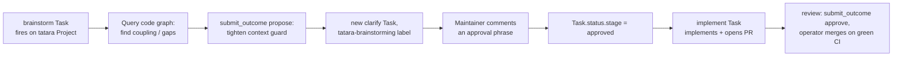
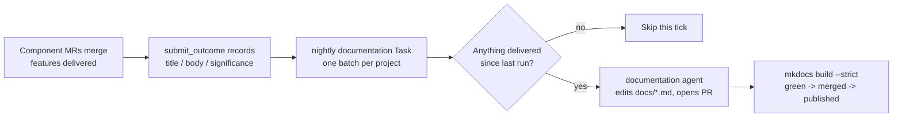

# tatara Builds tatara

Tatara is not a system that someone else maintains for you and that stands still.
**Tatara is enrolled as its own first `Project`, and it manages its own codebase.**
Every component repository - the operator, the memory service, the CLI, the wrapper,
the observability rules, and this documentation site - is an enrolled `Repository` on
the live `tatara` Project. The same autonomous loop that opens pull requests against
*your* code runs continuously against tatara's own.

The consequence is the point of this page: **the platform genuinely gets better on its
own.** Improvements are proposed from the knowledge graph, drawn out of live alerts,
implemented as reviewable PRs, and merged under the same gates described in
[The Agentic Operating Model](agentic-model.md). Nothing here is aspirational - tatara
was [enrolled to dogfood itself](../appendix/design-docs/2026-06-07-enroll-tatara-dogfood.md)
early, and has been running against its own repos ever since.

!!! info "This page is itself an example"
    The document you are reading was written by a tatara `documentation` agent, on a
    branch it opened, in reaction to changes landed elsewhere in the project, and merged
    through the normal PR flow - see
    [Documentation refreshes itself](#documentation-refreshes-itself) below.

---

## Why self-management compounds

A team's platform tooling normally decays: the backlog of small, well-understood
improvements never rises above sprint work, incident action items are filed and
forgotten, and the docs drift from the code. Tatara inverts each of these because the
same agent loop that ships product work is pointed at the platform itself:

- **Idle improvements get done.** The periodic [brainstorm](../workflows/brainstorm.md)
  surveys the code graph and files concrete proposals as new `clarify` Tasks; a maintainer
  comments an approval phrase on the good ones and the loop implements them.
- **Incidents close their own loops.** A firing alert spawns an
  [incident](../workflows/incident.md) investigation that produces an evidence-backed
  issue - which is then implemented, whether the fix is in code or in the alerting itself.
- **The backlog stays honest.** The [refine](../workflows/refine.md) pass grooms stale and
  duplicate work, and agents close issues whose fix already shipped instead of
  re-implementing them.
- **The docs track the code.** Documentation is an enrolled repo too, refreshed from the
  MRs and features that land in the component repos.

The rest of this page walks each category with concrete examples of how it plays out on
tatara's own repositories.

---

## Brainstorm-driven improvements

The [brainstorm](../workflows/brainstorm.md) cron queries tatara's own knowledge graph,
scores improvement candidates, and files them as new `clarify` Tasks carrying the
`tatara-brainstorming` label. **Brainstorm never implements** - each accepted proposal becomes
its own `clarify` Task, and a verified maintainer must post a comment matching one of
`Project.spec.scm.approvalPhrases` before the loop writes any code; the bot is structurally
excluded from ever satisfying its own gate. This is
[Gate 1, the approval grammar](agentic-model.md#gate-1-the-approval-grammar) and it is the
load-bearing control on self-directed work - brainstorm-authored proposals go through the exact
same gate as a human-filed issue, not a lighter one.

A representative cycle on tatara's own codebase:

**Example - a graph-discovered refactor.** A brainstorm pass reading the operator's code
graph notices that a token-accounting helper is copy-pasted across three reconcilers. It
files *"Deduplicate per-turn token accounting into a single helper"* with a problem
statement, a proposed approach, and the expected benefit, as a new `clarify` Task. A maintainer
comments an approval phrase on the issue; the Task moves to `approved` and then `implementing`,
which extracts the helper, adds a table-driven test, and opens a PR that a review pod approves
and the operator merges once CI is green. The improvement is one a human would have wanted and
never scheduled.

Brainstorm caps its own volume - at or above `maxOpenProposals` (default 5) open
unapproved proposals it skips the cycle entirely and spends no tokens - so
self-improvement never floods tatara's own tracker. Several design documents in the
[appendix](../appendix/design-docs/index.md) began as exactly this kind of proposal
against tatara's repos.

---

## Alert-driven improvements

When a Grafana alert fires against tatara's own services, the operator spawns an
[incident](../workflows/incident.md) agent with read-only Grafana MCP access. It queries
metrics, logs, and the firing rule, forms a diagnosis, and calls
`submit_outcome(action=file_issue)` to open one evidence-backed issue under a new `clarify`
Task. That Task then goes through the normal `clarify` -> `implement` -> `review` handoff. Two
shapes of fix come out of this, and tatara does both.

### 1. Fixing the code the alert pointed at

The common case: the alert is real, and the remediation is a code change in the implicated
component repo. The incident agent's [`submit_outcome(action=file_issue)`](../workflows/incident.md)
call names the component repo directly; an implementation agent then edits that component and
opens a PR.

**Example - a latency alert becomes a code fix.** A `tatara_memory_query_latency` alert
fires. The incident agent follows the alert's `generatorURL`, runs PromQL to confirm the
regression is real and correlated with a specific query path, and reads Loki logs showing
an unbounded graph traversal. It files *"memory: bound the neighbor-expansion fan-out in
code_neighbors"* against `tatara-memory`. The implementation agent adds the bound plus a
regression test, and the PR merges. The alert stops firing because the underlying behavior
changed.

### 2. Fixing the alerting itself

Sometimes the code is fine and the **alert** is wrong - too tight a threshold, a missing
label, or a rule that pages on normal variance. Tatara treats its alerting as code and
changes it the same way. Alert rules live in `tatara-observability` under `alerts/*.yaml`,
and [agents edit those YAML files directly and open a PR; `terraform apply` runs on
merge](../workflows/incident.md#routing-boundary).

**Example - retuning a noisy threshold.** A `tatara_operator_reconcile_slow` alert fires
repeatedly during nightly ingest, but the incident agent's investigation shows reconcile
latency is expected to spike then and recovers on its own - a false positive, not an
incident. Rather than filing a code issue, the follow-up work edits
`alerts/tatara-operator.yaml` in `tatara-observability` to raise the `for:` duration and
scope the expression, and opens a PR against the observability repo. The alerting gets
quieter and more trustworthy without touching a line of operator code.

Tatara also self-corrects the *tiering* that drives quality: a
[`tatara_tier_quality` alert](../workflows/incident.md#5a-tier-revert-incidents) fires when
a model/effort downgrade regresses review or CI outcomes for a given kind, and the agent
opens a GitOps MR against `tatara-helmfile` bumping that kind's model and effort back up.

!!! warning "The agent proposes; the merge is gated like any other"
    Whether the fix is in component code, in `alerts/*.yaml`, or in a `tatara-helmfile`
    pin, the incident/implementation agent **opens a PR and stops**. It never edits live
    alert rules through Grafana (its MCP access is read-only) and never bypasses the deploy
    path. Alerting and deploy changes flow through the same CI-gated merge as any other
    change - see the [GitOps deploy model](../architecture/ci-cd.md).

---

## Refinement: closing what is already delivered

Not every improvement is new code. A large share of a healthy backlog's value is *removing*
work that no longer needs doing. Tatara's [refine](../workflows/refine.md) pass runs as a
mandatory barrier before every brainstorm tick, and implementation agents carry an explicit
escape hatch for work that turns out to be done.

**Example - an agent closes an already-delivered task.** An issue asks to *"add a
`--dry-run` flag to the enrollment command."* By the time the implementation agent picks it
up, another PR - shipped for a sibling issue on the shared branch - has already added
exactly that flag. Instead of duplicating the change or opening an empty PR, the agent
reads the repository, confirms the flag exists, and terminates by calling
`submit_outcome(action=declined, decline_reason=...)`, pointing at the commit that delivered
it. The Task parks as `implement-declined` rather than opening a redundant PR, and the
tracker reflects reality.

This matters because autonomous loops that only ever *add* work eventually drown in
duplicates. Refine and the decline path are the counter-pressure:

| Situation | Terminal action | Result |
|---|---|---|
| The fix already shipped (prior PR, shared branch) | `submit_outcome(action=declined)` | Task parks `implement-declined`; no PR |
| Duplicate or stale proposal in the backlog | refine `closes[]` / `links[]` | Backlog groomed before brainstorm runs |
| Recoverably-parked implementation | refine `folds[]` adopts the work; operator re-rolls | Work resumes with better direction |

Refine itself never writes code and never opens issues - it only grooms - so this
pruning can never turn into a runaway. See the
[refine workflow](../workflows/refine.md) for the full groom-only contract.

---

## Documentation refreshes itself

The documentation site you are reading is **not maintained by hand on the side** - it is
an enrolled `Repository` on the same `tatara` Project as the operator and the memory
service. Doc updates flow through the schedule-driven `documentation` kind: on each cron
tick the agent determines when the docs repo was last meaningfully updated, diffs what
changed across the project's other repos since then, and opens a PR only if the
accumulated change is non-trivial. There is no push-webhook trigger and no doc-issue - a
merge elsewhere in the project does not by itself spawn a documentation Task; only the
next due cron tick does. See [Documentation](../workflows/documentation.md).

The freshness signal comes from the component repos themselves. When a feature lands, the
implementing agent records what shipped via
[`submit_outcome(action=submitted)`](../workflows/implement.md) - its `title`, `body`, and
required `change_significance` land in the MR **and carry into the docs** the next time the
nightly `documentation` batch fires, covering every Task delivered since the last run.

You can see the evidence in this repository's own history: commits authored as
`tatara agent: tatara/docs-<sha>` are documentation refreshes an agent opened on a branch
named for the component commit that motivated them, merged as a normal PR. Every doc PR is
gated by `mkdocs build --strict` in CI (see the [CI/CD model](../architecture/ci-cd.md)),
so a self-authored change that breaks a link or the nav never reaches the published site.

The result is a documentation set that tracks the code because it is produced by the same
loop that changes the code - not a wiki that rots between releases.

---

## Putting it together

Self-management is not a separate feature bolted onto tatara; it is the ordinary loop
pointed at tatara's own repos. The four categories reinforce each other:

- **Brainstorm** surfaces improvements from the graph.
- **Incidents** convert live alerts into code *and* alerting fixes.
- **Refine** and the decline path keep the backlog honest by closing what is already done.
- **Documentation** is refreshed by the same loop, from the features that land.

Every one of these runs under the human gates in
[The Agentic Operating Model](agentic-model.md): a person still decides which proposals get
worked, by comment, and the platform's single bot identity means that decision - not a
per-PR human sign-off - is the gate. What changes is the *default
direction of drift*. Left alone, most platforms decay. Left alone, tatara files, implements,
reviews, and merges its own improvements - and genuinely gets better.
