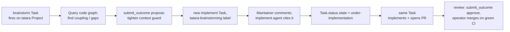
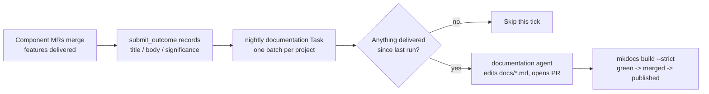

# tatara Builds tatara

The platform you are evaluating works on itself. **tatara is enrolled as its own first
`Project`, and it manages its own codebase.** Every component repository - the operator,
the memory service, the CLI, the wrapper, the observability rules, and this documentation
site - is an enrolled `Repository` on the live `tatara` Project. The same loop that opens
pull requests against *your* code runs continuously against tatara's own.

That is the point of this page: the platform gets better without anyone scheduling it to.
Improvements come out of the knowledge graph and out of live alerts, land as reviewable
PRs, and merge under the same gates described in
[The Agentic Operating Model](agentic-model.md). None of it is aspirational - tatara was
[enrolled to dogfood itself](../appendix/design-docs/2026-06-07-enroll-tatara-dogfood.md)
early and has run against its own repos ever since. Every example below names the issue
and the pull request it came from, on public repositories you can open right now. Where
tatara has no real instance of something yet, the page says so instead of describing one.

!!! info "This page is itself an example"
    A tatara `documentation` agent created this page. It opened
    [tatara-documentation#6](https://github.com/szymonrychu/tatara-documentation/pull/6)
    on 2026-07-06 from a branch it named itself, and that pull request added
    `docs/concepts/self-improvement.md`, its nav entry, and the cards that link to it.
    What you are reading is no longer that draft. People have edited the page since, and
    the edit that put the issue and PR numbers into the examples below was one of them -
    the first version illustrated each category with a plausible story rather than a
    citation. For pages the agent still maintains unattended, see
    [Documentation refreshes itself](#documentation-refreshes-itself) below.

---

## Why self-management compounds

Platform tooling normally decays. Small well-understood improvements never rise above
sprint work, incident action items get filed and forgotten, docs drift from the code, and
dependency pins go stale. tatara inverts each of these by pointing the same agent loop
that ships product work at the platform itself:

- **Idle improvements get done.** The periodic [brainstorm](../workflows/brainstorm.md)
  surveys the code graph and files concrete proposals as new `implement`-origin Tasks. A
  maintainer comments on the good ones, the `implement` agent cites that comment as
  approval, and the loop implements them once the operator verifies the citation.
- **Incidents close their own loops.** A firing alert spawns an
  [incident](../workflows/incident.md) investigation that produces an evidence-backed
  issue, which then gets implemented - whether the fix is in code or in the alerting itself.
- **The backlog stays honest.** The [refine](../workflows/refine.md) pass grooms stale and
  duplicate work, and agents close issues whose fix already shipped instead of
  re-implementing them.
- **The docs track the code.** Documentation is an enrolled repo too, refreshed from the
  MRs and features that land in the component repos.
- **Dependencies stop rotting.** The [upgrade](../workflows/upgrade.md) kind works one
  dependency unit per tick, and adopts the merge requests the dependency engine opens so
  every bump lands through a review rather than through the engine merging its own work.

The rest of this page walks each category with concrete examples from tatara's own
repositories.

---

## Brainstorm-driven improvements

The [brainstorm](../workflows/brainstorm.md) cron queries tatara's own knowledge graph,
scores improvement candidates, and files them as new `implement`-origin Tasks carrying the
`tatara-brainstorming` label. **Brainstorm never implements** - each accepted proposal becomes
its own `implement` Task, and a verified maintainer must post a comment the `implement` agent cites
and the operator independently verifies before the loop writes any code; the bot is structurally
excluded from ever satisfying its own gate. This is
[Gate 1, the approval grammar](agentic-model.md#gate-1-the-approval-grammar) and it is the
load-bearing control on self-directed work - brainstorm-authored proposals go through the exact
same gate as a human-filed issue, not a lighter one.

A representative cycle on tatara's own codebase:

```mermaid
flowchart LR
    A[brainstorm Task<br/>fires on tatara Project] --> B[Query code graph:<br/>find coupling / gaps]
    B --> C[submit_outcome propose:<br/>tighten context guard]
    C --> D[new implement Task,<br/>tatara-brainstorming label]
    D --> E[Maintainer comments;<br/>implement agent cites it]
    E --> F[Task.status.state = under-implementation]
    F --> G[same Task<br/>implements + opens PR]
    G --> H[review: submit_outcome approve,<br/>operator merges on green CI]
```

**Example - a graph-discovered refactor.** On 2026-08-16 a brainstorm pass over
`tatara-memory` filed
[tatara-memory#107](https://github.com/szymonrychu/tatara-memory/issues/107) at 06:54Z.
Three packages in that service each ran their own schema migrations at startup, and only
one of the three tracked which migrations it had already applied. The proposal quoted the
file and line behind every claim, including the migration that dropped and rebuilt the
primary key on the largest table in the code graph on every single boot, and the test that
passed while asserting a schema the migrations do not produce. The implementation Task
posted its plan on the same thread at 07:02Z and opened
[tatara-memory#108](https://github.com/szymonrychu/tatara-memory/pull/108), *"one
version-tracked migration runner for all three packages"*, which merged at 08:24Z and
closed the issue. Three hand-rolled copies became one `internal/pgmigrate` runner, with
replay tests that fail on `main`. Nothing was broken loudly enough to force that work onto
anyone's sprint, which is exactly why it had sat there since June.

The same morning, the brainstorm pass on `tatara-agent-skills` filed
[#57](https://github.com/szymonrychu/tatara-agent-skills/issues/57), which found seven
byte-different copies of a file each of them called the canonical contract. The fix made
one copy the source and fanned it out as a pull request per repository, including
[tatara-documentation#41](https://github.com/szymonrychu/tatara-documentation/pull/41).

Brainstorm caps its own volume - at or above `maxOpenProposals` (default 5) open
unapproved proposals it skips the cycle entirely and spends no tokens - so
self-improvement never floods tatara's own tracker.

!!! warning "tatara releases its own proposals, and you should know that"
    Read the two threads above and you will not find a maintainer on either of them. Every
    comment is the platform's. #107 went from filed to under implementation in seven
    minutes and from filed to merged in ninety, and no person said yes at any point.

    That is `Project.spec.autoApproveTataraProposals`, a per-project field that releases
    bot-authored, tatara-proposed issues and nothing else. It
    [defaults to `false`](https://github.com/szymonrychu/tatara-operator/blob/main/api/v1alpha1/project_types.go),
    and tatara turns it on for its own Project so that its backlog moves without a person
    in the loop. Your project does not get that behavior unless you ask for it: with the
    field off, a self-proposed chain parks until a human approves it, and every other
    origin of work is gated regardless of how the field is set.

    So the gate above is real, and this page is not the place to watch it work. For a run
    where a maintainer opened the gate by hand and the operator wrote a receipt naming the
    comment ID it acted on, read [Watch One Run](../explainers/watch-one-run.md).

---

## Alert-driven improvements

When a Grafana alert fires against tatara's own services, the operator spawns an
[incident](../workflows/incident.md) agent with read-only Grafana MCP access. It queries
metrics, logs, and the firing rule, forms a diagnosis, and calls
`submit_outcome(action=file_issue)` to open one evidence-backed issue under a new `implement`-origin
Task. That Task then goes through the normal approval-gate -> code -> `review` handoff, all within
`implement`. Two shapes of fix come out of this, and tatara does both.

### 1. Fixing the code the alert pointed at

The common case: the alert is real, and the remediation is a code change in the implicated
component repo. The incident agent's [`submit_outcome(action=file_issue)`](../workflows/incident.md)
call names the component repo directly; an implementation agent then edits that component and
opens a PR.

**Example - an error alert becomes a code fix.** A Grafana rule over the operator's own
error logs fired at 2026-08-02T01:26:50Z. Twelve minutes later the incident agent had
filed [tatara-operator#529](https://github.com/szymonrychu/tatara-operator/issues/529)
with the mechanism in the body: agent-supplied issue titles were never length-clamped, so
a title over GitLab's 255-character cap was rejected and the whole accepted outcome behind
it was dropped without a retry. The issue carries the label
`tatara-alert-rule=759e75110b9af5cc`, which is the firing rule's identity in
machine-readable form, so anything reading the thread later can tell where it came from
without parsing prose. The fix landed six days later as
[tatara-operator#550](https://github.com/szymonrychu/tatara-operator/pull/550), *"clamp
agent-supplied issue titles at the restapi boundary"*, across eleven files including its
tests.

That run is worth reading end to end rather than in summary: an implementation attempt
failed outright and the platform parked the issue instead of retrying, a maintainer's
two-word approval opened the gate, and the operator posted a receipt naming the comment ID
it acted on. Every comment is quoted in [Watch One Run](../explainers/watch-one-run.md).

### 2. Fixing the alerting itself

Sometimes the code is fine and the **alert** is wrong - too tight a threshold, a missing
label, or a rule that pages on normal variance. tatara treats its alerting as code and
changes it the same way. Alert rules live in `tatara-observability` under `alerts/*.yaml`,
and [agents edit those YAML files directly and open a PR; `terraform apply` runs on
merge](../workflows/incident.md#routing-boundary).

**Example - a false page becomes a one-line rule change.** At 2026-07-12T03:15Z the
*Operator replica missing* warning paged. It was wrong: all three operator replicas were
healthy the whole time. The incident agent filed
[tatara-observability#50](https://github.com/szymonrychu/tatara-observability/issues/50) at
04:40Z with the mechanism spelled out. The rule read
`count(up{job="tatara-operator"} == 1) or vector(0)` and compared it against `< 3`, so
during a Prometheus restart, when every `up` series is briefly absent, `or vector(0)`
manufactured a literal zero and the rule paged on it. Nothing was down; a fallback value
had been mistaken for a measurement.

The fix was in the alerting.
[tatara-observability#52](https://github.com/szymonrychu/tatara-observability/pull/52)
merged at 08:14Z the same morning, three and a half hours after the issue was filed,
touching `alerts/tatara-operator.yaml` and `MEMORY.md` and nothing else. It dropped the
`or vector(0)`, and it went one step further: it audited the other five rules using the
same comparison and explained in the PR body why the fallback is correct in all five,
because those are total-outage detectors where an absent series genuinely does mean the
operator is gone. Partial degradation still pages. One rule got quieter without a line of
operator code changing.

tatara also watches the *tiering* that drives quality. `alerts/tatara-quality.yaml` in
`tatara-observability` carries rules labelled `tatara_tier_quality: "true"` that fire when
a cheaper model's review find-rate collapses, and the designed response is a
[tier-revert incident](../workflows/incident.md#5a-tier-revert-incidents) opening a GitOps
MR against `tatara-helmfile`. That path has no receipt yet. The file says its own
thresholds are provisional, chosen before there was baseline data to tune them against,
and no tier-revert MR has been opened. Treat it as designed and deployed, not as
demonstrated.

!!! warning "The agent proposes; the merge is gated like any other"
    Whether the fix is in component code, in `alerts/*.yaml`, or in a `tatara-helmfile`
    pin, the incident/implementation agent **opens a PR and stops**. It never edits live
    alert rules through Grafana (its MCP access is read-only) and never bypasses the deploy
    path. Alerting and deploy changes flow through the same CI-gated merge as any other
    change - see the [GitOps deploy model](../architecture/ci-cd.md).

---

## Refinement: closing what is already delivered

Not every improvement is new code. A large share of a healthy backlog's value is *removing*
work that no longer needs doing. tatara's [refine](../workflows/refine.md) pass runs as a
mandatory barrier before every brainstorm tick, and implementation agents carry an explicit
escape hatch for work that turns out to be done.

**Example - a proposal overtaken by the fix.** On 2026-08-08 a brainstorm pass filed
[tatara-operator#556](https://github.com/szymonrychu/tatara-operator/issues/556): the
shared merge gate never compiled the Dockerfile, so a Go version bump could merge green
and then red `main`, and three of six Go repositories had been unreleasable for ten days
on a one-line pin the pull-request gate structurally could not see. The finding was
correct. It was also already being fixed - the `image-verify` job landed in
[tatara-operator#560](https://github.com/szymonrychu/tatara-operator/pull/560) the next
morning, before #556 was ever implemented. The issue was closed with a comment naming the
PR that delivered it, and the platform labelled it `tatara-declined`. No second PR, no
duplicate work, and the tracker says what happened.

!!! note "Who did the declining here"
    The maintainer closed #556 and wrote that comment; the agent did not detect the
    overlap on its own. The decline path in the table below is a real terminal action the
    implementation agent can take, and `tatara-declined` on the issue is the same label
    either way, but this receipt shows the label landing, not the agent's judgment
    producing it.

This matters because autonomous loops that only ever *add* work eventually drown in
duplicates. Refine and the decline path are the counter-pressure:

| Situation | Terminal action | Result |
|---|---|---|
| The fix already shipped (prior PR, shared branch) | `submit_outcome(action=declined)` | Task parks `implement-declined`; no PR |
| Duplicate or stale proposal in the backlog | refine `closes[]` / `links[]` | Backlog groomed before brainstorm runs |
| Recoverably parked implementation | refine `folds[]` adopts the work; operator re-rolls | Work resumes with better direction |

Refine itself never writes code and never opens issues - it only grooms - so this
pruning can never turn into a runaway. See the
[refine workflow](../workflows/refine.md) for the full groom-only contract.

---

## Documentation refreshes itself

The documentation site you are reading is **not maintained by hand on the side** - it is
an enrolled `Repository` on the same `tatara` Project as the operator and the memory
service. Doc updates flow through the schedule-driven `documentation` kind: on each cron
tick the agent determines when the docs repo was last meaningfully updated, diffs what
changed across the project's other repos since then, and opens a PR only if the
accumulated change is non-trivial. There is no push-webhook trigger and no doc-issue - a
merge elsewhere in the project does not by itself spawn a documentation Task; only the
next due cron tick does. See [Documentation](../workflows/documentation.md).

The freshness signal comes from the component repos themselves. When a feature lands, the
implementing agent records what shipped via
[`submit_outcome(action=submitted)`](../workflows/implement.md) - its `title`, `body`, and
required `change_significance` land in the MR **and carry into the docs** the next time the
nightly `documentation` batch fires, covering every Task delivered since the last run.

```mermaid
flowchart LR
    A[Component MRs merge<br/>features delivered] --> B[submit_outcome records<br/>title / body / significance]
    B --> C[nightly documentation Task<br/>one batch per project]
    C --> D{Anything delivered<br/>since last run?}
    D -->|no| E[Skip this tick]
    D -->|yes| F[documentation agent<br/>edits docs/*.md, opens PR]
    F --> G[mkdocs build --strict<br/>green -> merged -> published]
```

The evidence is this repository's own pull-request history, and it is not thin. Every
merged PR from #37 to #46 was opened by the agent. The scheduled batches run on branches
named `tatara/task-tatara-documentation-<date>-<id>`, such as
[#39](https://github.com/szymonrychu/tatara-documentation/pull/39) covering the new
`upgrade` agent kind and
[#46](https://github.com/szymonrychu/tatara-documentation/pull/46) correcting how upgrade
adoption is paced. The ones that trace to a specific finding run on `tatara/feat-<issue>`:
[#43](https://github.com/szymonrychu/tatara-documentation/pull/43) fixed two runbook
thresholds that quoted a number their histogram could never reach, and it merged the same
morning as the alert-rule fix for the same defect in `tatara-observability`, deliberately
first, so the runbook and the rule never disagreed in public. Earlier commits carry the
older `tatara agent: tatara/docs-<sha>` branch naming from July 2026, before the operator
changed the scheme.

Every doc PR is gated by `mkdocs build --strict` in CI (see the
[CI/CD model](../architecture/ci-cd.md)), so a self-authored change that breaks a link or
the nav never reaches the published site.

The result is a documentation set that tracks the code because the same loop that changes
the code produces it, rather than a wiki that rots between releases.

---

## Dependencies bump themselves

Nine repos means nine sets of pins going stale in parallel, which is exactly the kind of
work that never wins an argument against sprint work. The [upgrade](../workflows/upgrade.md)
kind is how tatara keeps its own current, and it is opt-in and off until you configure it.

On a cron tick, an upgrade Task enters at `under-implementation` with no issue behind it -
the upgrade policy on the Project is the standing go-ahead. The pod takes exactly one
upgrade unit, reads the release notes for every release between the current pin and the
target rather than only the target's, changes whatever code has to move with the bump, runs
the repo's real test suite, and declares its merge order in publish-dependency order.
Declining is a correct and common answer.

The second shape matters more day to day. Where a dependency engine already opens merge
requests, tatara **adopts** them: the engine keeps discovery and changelogs, tatara keeps
merge authority, and a review pod goes first. A trivial patch bump therefore costs one
review turn rather than an implement turn plus a review turn, and no bump reaches `main`
without a Task having decided it should. The eight clauses that gate adoption, and why the
review agent approving a third party's merge request is the intended outcome rather than a
mistake, are on
[Merge requests tatara did not open](agentic-model.md#adoption-claiming-a-dependency-engines-merge-request).

This is the youngest part of the loop and the one with the least history behind it. The
`upgrade` kind and its cron landed in
[tatara-operator#600](https://github.com/szymonrychu/tatara-operator/pull/600) on
2026-08-13 and adoption in
[#601](https://github.com/szymonrychu/tatara-operator/pull/601) two days later, with
[#602](https://github.com/szymonrychu/tatara-operator/pull/602),
[#612](https://github.com/szymonrychu/tatara-operator/pull/612) and
[#619](https://github.com/szymonrychu/tatara-operator/pull/619) following within the week
as it met real merge requests. Those follow-ups are the honest signal here: the mechanism
is running and still settling. It has not yet produced a pull request on any of the nine
public repositories this page cites, so unlike every other section there is no thread to
link. Read this one as a description of what is deployed, not as a receipt.

---

## Putting it together

Self-management is not a separate feature bolted onto tatara. It is the ordinary loop
pointed at tatara's own repos, and the five categories reinforce each other:

- **Brainstorm** surfaces improvements from the graph.
- **Incidents** turn live alerts into code fixes *and* alerting fixes.
- **Refine** and the decline path keep the backlog honest by closing what is already done.
- **Documentation** is refreshed by the same loop, from the features that land.
- **Upgrade** keeps the dependency pins current under the same review gate.

Every one of these runs under the human gates in
[The Agentic Operating Model](agentic-model.md): a person still decides which proposals get
worked, by comment, and the platform's single bot identity means that decision - not a
per-PR human sign-off - is the gate. What changes is the *default
direction of drift*. Left alone, most platforms decay. Left alone, tatara files, implements,
reviews, and merges its own improvements - and genuinely gets better.
