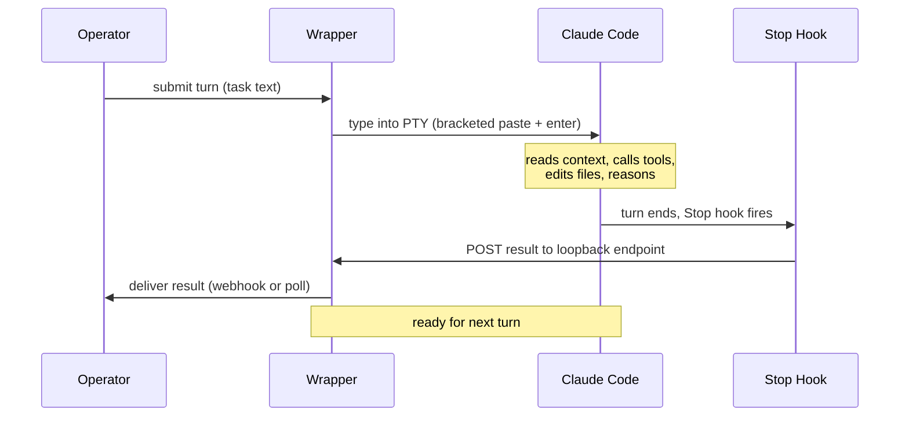
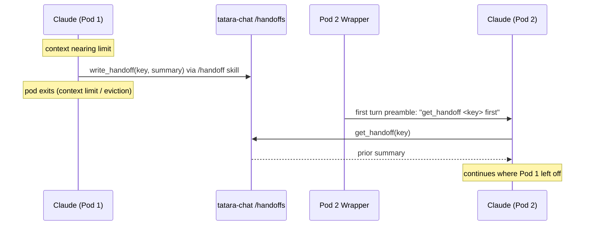
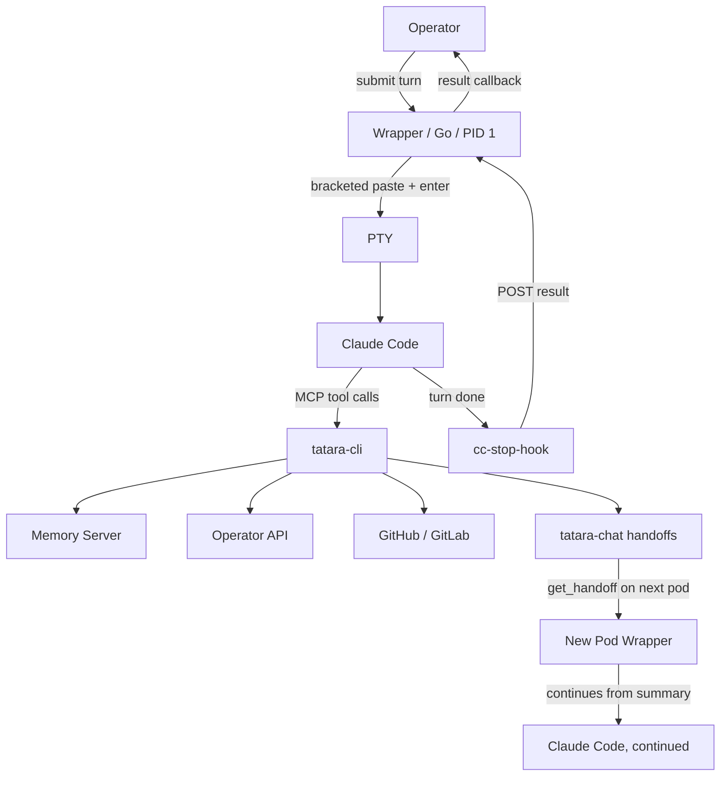

# Inside an Agent Session

Every time the tatara operator assigns work to an agent, it starts a Kubernetes
Pod. Inside that pod is a running copy of Claude Code - the same AI assistant
you might run in your own terminal. This page explains what that looks like, why
it works the way it does, and what happens when things get complicated.

---

## A robot at a terminal

The simplest mental model: imagine a robot sitting at a computer, with a
terminal open running `claude`. The robot types questions and watches the
responses scroll by.

That is almost literally what tatara does. The wrapper process (PID 1 in the
pod) allocates a **pseudo-terminal (PTY)** - the same mechanism your terminal
emulator uses - and spawns Claude Code's interactive binary attached to it.
Claude is not running in a stripped-down "API mode". It is running the full
interactive harness: the same session you get when you open Claude Code on your
laptop, with all the same skills, hooks, and tool access.

Why does this matter? Anthropic develops and tests Claude Code's interactive
mode. Running Claude in that mode means you get the real experience - skill
files, normal permission handling, accurate behavior. The alternative (`claude
-p` / print mode) is a divergent code path with different behavior. Tatara
explicitly avoids it.

---

## How a turn works

When the operator wants Claude to do something, it sends a turn: a block of
text describing the task. The wrapper "types" that text into the PTY using
**bracketed paste** (the same protocol your terminal uses when you paste
multi-line text), followed by a carriage return to submit it. Claude sees it
exactly as if a human had typed it.

Then the wrapper waits.



The wrapper never tries to read the terminal screen to figure out when Claude
has finished. Instead it relies on a **Stop hook** - a small binary
(`cc-stop-hook`) that Claude Code runs automatically at the end of every turn.
That binary reads the final assistant message from the session transcript and
posts it to a loopback HTTP endpoint on `127.0.0.1` inside the pod. When the
wrapper receives that callback, it knows the turn is done. This is how Claude
communicates "I am finished" without the wrapper having to parse any terminal
escape sequences.

Turns are strictly sequential. Only one can be in flight at a time. If the
operator submits a second turn while one is still running, the wrapper returns
`409 Conflict`. The operator waits for the callback before submitting the next
turn.

---

## The tool bridge: tatara-cli

Claude Code's power comes partly from its tools. In a standard installation,
those tools let Claude read and write files, run shell commands, and search the
web. In a tatara agent pod, Claude has all of that plus a set of
**platform-specific tools** that let it do things like:

- Query the memory graph (read what previous agents have stored)
- Look up the current task and project context
- Post comments on GitHub or GitLab issues
- Open pull requests
- Report internal issues or escalate incidents

These platform tools are served through Claude Code's **MCP** (Model Context
Protocol) mechanism. The `tatara-cli` binary runs as an MCP stdio server inside
the pod, and Claude's tool calls travel over that bridge.

```
Claude Code  <--stdio--> tatara-cli (MCP server)
                              |
                    +---------+---------+
                    |         |         |
                 Memory   Operator   GitHub/
                 Server    API        GitLab
```

At boot, the wrapper writes `/workspace/.mcp.json` pointing to `tatara-cli`,
and configures `~/.claude/settings.json` to enable it. Claude discovers the
tools automatically when the session starts. From Claude's perspective, these
are just tools - the same as any other capability. It calls `query` (memory
retrieval) or `comment_on_issue` the same way it calls a file-read tool.

The set of tools available is scoped by task type. A brainstorm pod gets
broader tool access than a review pod; the operator sets a `TATARA_TOOL_PROFILE`
environment variable, and `tatara-cli` filters its tool list at startup.

---

## When context runs low: handover

Long-running tasks (multi-file refactors, deep research, complex
implementations) approach the context window before the work is done. Rather
than let the session degrade, tatara hands the task off to a fresh pod that
continues from a compact summary.

The mechanism is a **chat-backed handoff**, not a transcript replay. On a pod's
first turn, if the operator supplied a continuation key (the task's
`CONVERSATION_OBJECT_KEY`, reused as a `handoff_key`), the wrapper prepends a
short preamble to the goal: call `get_handoff` with this key before starting,
and `write_handoff` an updated summary before finishing. The `/handoff` skill
drives the actual calls. `get_handoff` and `write_handoff` hit the tatara-chat
`/handoffs` endpoints - a small structured summary keyed by `handoff_key`, not
the full conversation. The wrapper itself never calls chat; it only injects the
preamble.

So when a pod is about to exhaust its context, it writes a handoff summary and
exits. The next pod for the same task reads that summary on its first turn and
picks up where the previous one left off. The earlier transcript-to-S3 replay
machinery was removed (issue #114); the wrapper no longer uploads conversations
anywhere. A compact handoff is cheaper to carry across pods and cannot overflow
the new pod's context on boot the way a full transcript could.



This makes agent sessions **resilient to pod restarts**. A task survives node
evictions, OOM kills, and scheduled pod rotations: the next pod rehydrates from
the handoff summary. A distinct, narrower case is an in-pod crash relaunch,
where the wrapper restarts Claude in the *same* pod with `--continue` to resume
the most recent on-disk conversation - the only place a transcript is replayed,
and only locally.

---

## Why headless: no pop-up questions

Claude Code's interactive mode normally lets the AI ask the user questions via
interactive pickers - dialogs that pause the session and wait for input. That
works fine when a human is watching the terminal. In a tatara agent pod, there
is no human at the keyboard.

To handle this, tatara does two things:

1. **Deny interactive pickers in `settings.json`.** The tool calls
   `AskUserQuestion`, `ExitPlanMode`, and `EnterPlanMode` are blocked. Claude
   cannot pause and wait for a human to click something.

2. **Route decisions to issue comments.** When an agent genuinely needs human
   input - an ambiguous requirement, a choice between two approaches, a
   potentially destructive action - it posts a comment on the GitHub or GitLab
   issue and marks the task as waiting. A human reads the comment, replies, and
   the operator resumes the task with the reply as context.

This is intentional. It makes agent behavior fully auditable: every decision
point appears in the issue thread, in plain language, visible to the whole team.
The conversation is not buried in a terminal session or a Slack DM. It is part
of the project's history.

!!! note "The boot dialog"
    One dialog is not suppressible: the "Bypass Permissions mode" warning that
    Claude Code shows on every interactive start. The wrapper handles this
    automatically - it watches the PTY ring buffer, detects the warning text
    (stripping ANSI escape codes to match it reliably), and sends the
    "Yes, I accept" keystrokes. This happens before the session is marked ready,
    so the operator never sees it.

---

## The full picture

Putting it all together:



One pod. One Claude process. One turn at a time. Results delivered via webhook
or poll. Context handed off through a compact chat-backed summary so restarts
survive. Decisions surfaced to humans via issue comments, not interactive
prompts.
