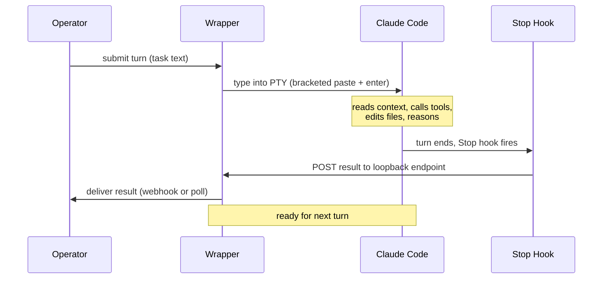
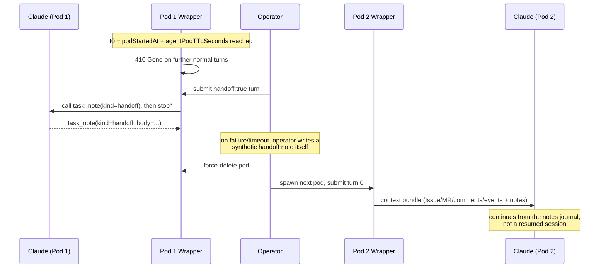
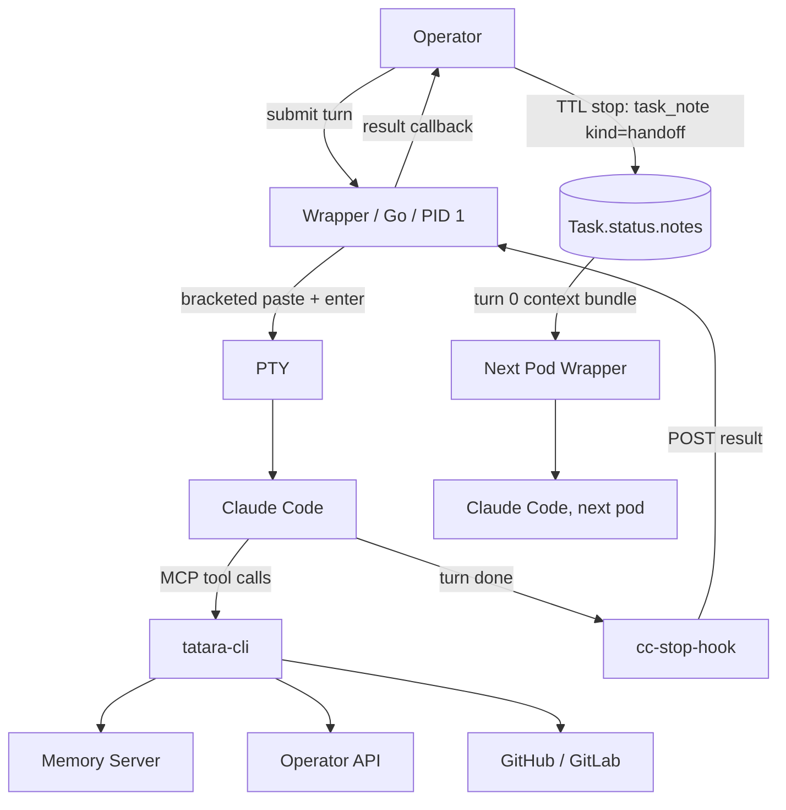

# Inside an Agent Session

Every time the tatara operator assigns work to an agent, it starts a Kubernetes
Pod. Inside that pod is a running copy of Claude Code - the same AI assistant
you might run in your own terminal. This page explains what that looks like, why
it works the way it does, and what happens when things get complicated.

---

## A robot at a terminal

The simplest mental model: imagine a robot sitting at a computer, with a
terminal open running `claude`. The robot types questions and watches the
responses scroll by.

That is almost literally what tatara does. The wrapper process (PID 1 in the
pod) allocates a **pseudo-terminal (PTY)** - the same mechanism your terminal
emulator uses - and spawns Claude Code's interactive binary attached to it.
Claude is not running in a stripped-down "API mode". It is running the full
interactive harness: the same session you get when you open Claude Code on your
laptop, with all the same skills, hooks, and tool access.

Why does this matter? Anthropic develops and tests Claude Code's interactive
mode. Running Claude in that mode means you get the real experience - skill
files, normal permission handling, accurate behavior. The alternative (`claude
-p` / print mode) is a divergent code path with different behavior. Tatara
explicitly avoids it.

---

## How a turn works

When the operator wants Claude to do something, it sends a turn: a block of
text describing the task. The wrapper "types" that text into the PTY using
**bracketed paste** (the same protocol your terminal uses when you paste
multi-line text), followed by a carriage return to submit it. Claude sees it
exactly as if a human had typed it.

Then the wrapper waits.



The wrapper never tries to read the terminal screen to figure out when Claude
has finished. Instead it relies on a **Stop hook** - a small binary
(`cc-stop-hook`) that Claude Code runs automatically at the end of every turn.
That binary reads the final assistant message from the session transcript and
posts it to a loopback HTTP endpoint on `127.0.0.1` inside the pod. When the
wrapper receives that callback, it knows the turn is done. This is how Claude
communicates "I am finished" without the wrapper having to parse any terminal
escape sequences.

Turns are strictly sequential. Only one can be in flight at a time. If the
operator submits a second turn while one is still running, the wrapper returns
`409 Conflict`. The operator waits for the callback before submitting the next
turn.

---

## The tool bridge: tatara-cli

Claude Code's power comes partly from its tools. In a standard installation,
those tools let Claude read and write files, run shell commands, and search the
web. In a tatara agent pod, Claude has all of that plus a set of
**platform-specific tools** that let it do things like:

- Query the memory graph (read what previous agents have stored)
- Look up the current task and project context
- Post comments on GitHub or GitLab issues
- Open pull requests
- Report internal issues or escalate incidents

These platform tools are served through Claude Code's **MCP** (Model Context
Protocol) mechanism. The `tatara-cli` binary runs as an MCP stdio server inside
the pod, and Claude's tool calls travel over that bridge.

```
Claude Code  <--stdio--> tatara-cli (MCP server)
                              |
                    +---------+---------+
                    |         |         |
                 Memory   Operator   GitHub/
                 Server    API        GitLab
```

At boot, the wrapper writes `/workspace/.mcp.json` pointing to `tatara-cli`,
and configures `~/.claude/settings.json` to enable it. Claude discovers the
tools automatically when the session starts. From Claude's perspective, these
are just tools - the same as any other capability. It calls `query` (memory
retrieval) or `submit_outcome` (reporting its result) the same way it calls a
file-read tool.

The full tool surface is small (20 tools total) and scoped per **agent kind** -
`brainstorm`, `incident`, `clarify`, `refine`, `implement`, `review`, or
`documentation`. A brainstorm pod gets broader tool access than a review pod;
the operator sets the `TATARA_TOOL_PROFILE` environment variable to the agent
kind, and `tatara-cli` filters its registered tool list at startup, failing
**closed** on an unrecognized profile rather than serving everything.

---

## One pod, many pods: how a Task survives

A `Task` is a durable Kubernetes object. It can live for hours or days and pass
through many stages (`clarifying`, `approved`, `implementing`, `reviewing`,
`merging`, ...). A **pod is not the Task** - it is one bounded run against it.
The pod is named `<task-name>-<agent-kind>`, and `Project.spec.agentPodTTLSeconds`
(default 3600s, minimum 300s) caps how long that one pod may live. When a Task
needs a `clarify` pod, then later an `implement` pod, then a `review` pod, those
are three separate, single-purpose pods against the same Task - not one long
session resumed three times.

There is no session-resume mode. There is no continuation key, no conversation
object, and no chat service a new pod queries to catch up - that whole
mechanism was removed along with `tatara-chat` itself, which is decommissioned. <!-- stale-ok: tatara-chat -->
Every pod's first turn gets the **same kind of render**: the operator builds a
context bundle fresh from the current state of the Task's CRs - its Issue(s),
MergeRequest(s), recent comments, recent events, and its notes - and delivers
it as the `text` of the pod's first `POST /v1/messages`. There is no special
"resume" preamble; turn 0 looks the same whether this is the Task's first pod
or its fifth. See [Task notes](../reference/task-notes.md) and the context
bundle reference for the exact mechanics.

What actually carries continuity from one pod to the next is
`Task.status.notes`: an append-only journal every pod reads as part of that
turn-0 bundle. An agent writes to it with `task_note(kind, body)` - `note` for
an observation, `plan` for its approach, `handoff` for what the next pod needs
to know. Nothing else persists agent working memory across pod boundaries.

### The TTL stop sequence

Because a pod's life is bounded, tatara has to guarantee a handoff note gets
written before the pod disappears - even if the pod is unresponsive or mid-turn
when its TTL expires (which, empirically, is nearly always the case). At
`t0 = podStartedAt + agentPodTTLSeconds` the wrapper:

1. **Stops admitting normal turns.** Any `POST /v1/messages` without
   `handoff: true` gets `410 Gone` past `t0`.
2. **Waits for the in-flight turn** to complete, bounded by the turn timeout.
3. **Submits exactly one more turn**, marked `handoff: true`, asking the agent
   to call `task_note(kind=handoff)` with everything the next pod needs, then
   stop.
4. **Falls back to a synthetic note.** If that turn fails, times out, or the
   hard cap (`t0` plus twice the turn timeout, plus 60s grace) is reached, the
   operator writes the handoff note itself, in-process, from the last turn's
   final text and which repos were pushed - then force-deletes the pod.

`Task.status.notes` is therefore never empty after a TTL stop: either the agent
wrote the handoff, or the operator did.



This makes a Task **resilient to pod restarts** in the ordinary sense: node
evictions, OOM kills, and TTL rotations all just end one pod and start the
next, with the notes journal as the only thing that crosses the boundary. A
distinct, narrower mechanism is the in-pod crash relaunch, where the wrapper
restarts Claude in the *same* pod with `--continue` to resume the most recent
on-disk conversation after a local crash. That is the only place a transcript
is ever replayed, it happens only inside one pod's lifetime, and it is
unrelated to the cross-pod handoff above.

---

## Why headless: no pop-up questions

Claude Code's interactive mode normally lets the AI ask the user questions via
interactive pickers - dialogs that pause the session and wait for input. That
works fine when a human is watching the terminal. In a tatara agent pod, there
is no human at the keyboard.

To handle this, tatara does two things:

1. **Deny interactive pickers in `settings.json`.** The tool calls
   `AskUserQuestion`, `ExitPlanMode`, and `EnterPlanMode` are blocked. Claude
   cannot pause and wait for a human to click something.

2. **Route decisions to issue comments.** When an agent genuinely needs human
   input - an ambiguous requirement, a choice between two approaches, a
   potentially destructive action - it posts a comment on the GitHub or GitLab
   issue and marks the task as waiting. A human reads the comment, replies, and
   the operator resumes the task with the reply as context.

This is intentional. It makes agent behavior fully auditable: every decision
point appears in the issue thread, in plain language, visible to the whole team.
The conversation is not buried in a terminal session or a Slack DM. It is part
of the project's history.

!!! note "The boot dialog"
    One dialog is not suppressible: the "Bypass Permissions mode" warning that
    Claude Code shows on every interactive start. The wrapper handles this
    automatically - it watches the PTY ring buffer, detects the warning text
    (stripping ANSI escape codes to match it reliably), and sends the
    "Yes, I accept" keystrokes. This happens before the session is marked ready,
    so the operator never sees it.

---

## The full picture

Putting it all together:



One pod. One Claude process. One turn at a time. Results delivered via webhook
or poll. Continuity carried forward through the Task's own notes journal, not
a resumed session, so pod restarts and TTL rotations survive. Decisions
surfaced to humans via issue comments, not interactive prompts.
