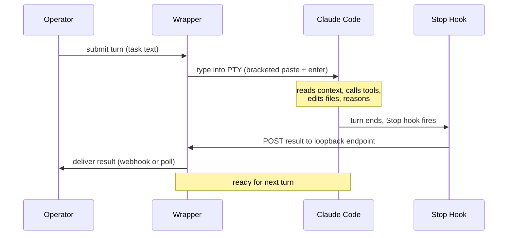
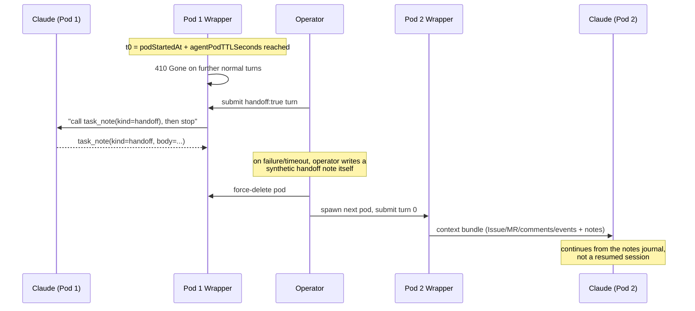
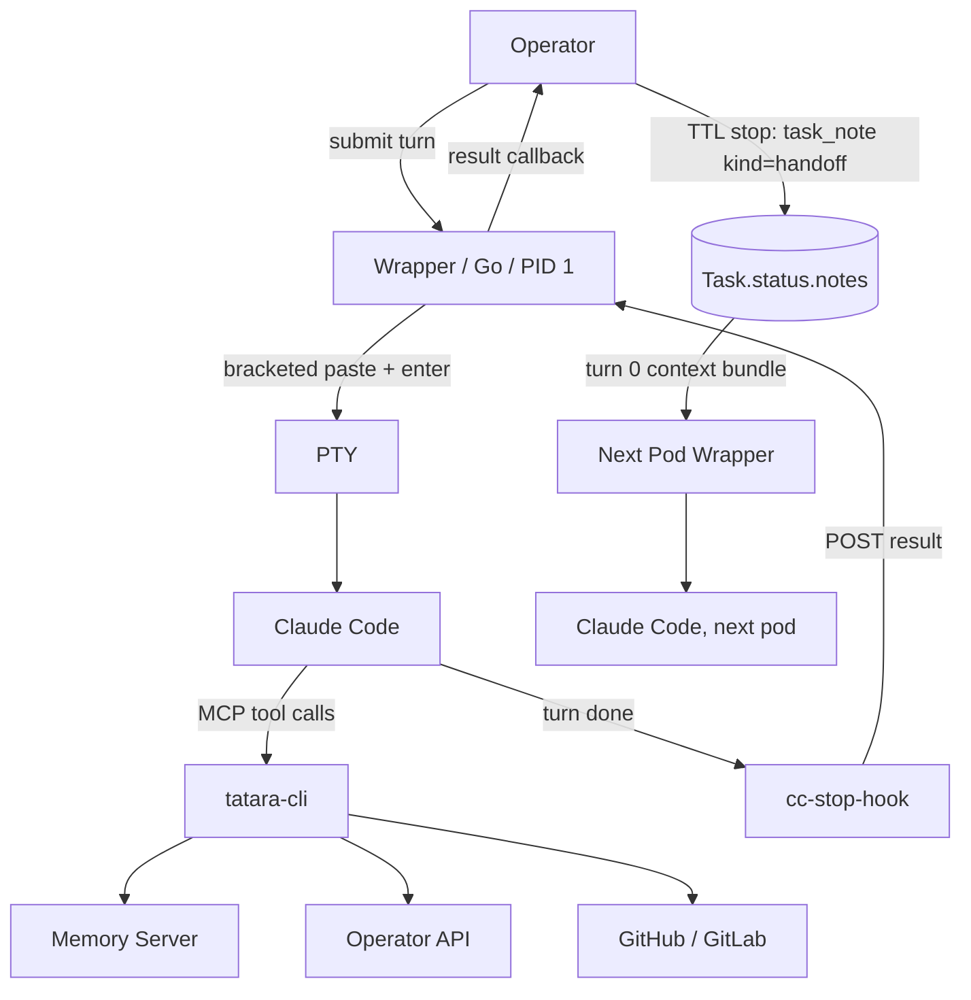

# Inside an Agent Session

Read this page and you will know exactly what is running when tatara is working
on your issue: a real interactive Claude Code session, driven over a
pseudo-terminal by a Go supervisor, in a pod with a bounded life. You will also
know what survives when that pod goes away, which is the part that decides how
much you can trust the loop.

---

## A real terminal, not an API call

The wrapper process (PID 1 in the pod) allocates a **pseudo-terminal (PTY)**,
the same mechanism your terminal emulator uses, and spawns Claude Code's
interactive binary attached to it. Claude is not running in a stripped-down API
mode. It is the full interactive harness: the same session you get when you open
Claude Code on your laptop, with the same skills, hooks, and tool access.

That choice costs some engineering and it buys accuracy. Interactive mode is the
mode Anthropic develops and tests, so you get the behavior that was tested:
skill files load, permissions are handled the normal way, and the agent behaves
the way it does on your machine. Print mode (`claude -p`) is a separate code
path with different behavior, and tatara does not use it.

---

## How a turn works

When the operator wants Claude to do something, it sends a turn: a block of
text describing the task. The wrapper "types" that text into the PTY using
**bracketed paste** (the same protocol your terminal uses when you paste
multi-line text), followed by a carriage return to submit it. Claude sees it
exactly as if a human had typed it.

Then the wrapper waits.


```mermaid
sequenceDiagram
    participant OP as Operator
    participant WR as Wrapper
    participant CL as Claude Code
    participant HOOK as Stop Hook

    OP->>WR: submit turn (task text)
    WR->>CL: type into PTY (bracketed paste + enter)
    Note over CL: reads context, calls tools,<br/>edits files, reasons
    CL->>HOOK: turn ends, Stop hook fires
    HOOK->>WR: POST result to loopback endpoint
    WR->>OP: deliver result (webhook or poll)
    Note over WR,CL: ready for next turn
```

The wrapper never tries to read the terminal screen to figure out when Claude
has finished. Instead it relies on a **Stop hook** - a small binary
(`cc-stop-hook`) that Claude Code runs automatically at the end of every turn.
That binary reads the final assistant message from the session transcript and
posts it to a loopback HTTP endpoint on `127.0.0.1` inside the pod. When the
wrapper receives that callback, it knows the turn is done. This is how Claude
communicates "I am finished" without the wrapper having to parse any terminal
escape sequences.

Turns are strictly sequential. Only one can be in flight at a time. If the
operator submits a second turn while one is still running, the wrapper returns
`409 Conflict`. The operator waits for the callback before submitting the next
turn.

---

## The tool bridge: tatara-cli

A standard Claude Code installation can read and write files, run shell
commands, and search the web. In a tatara agent pod, Claude keeps all of that
and gains a set of **platform tools** that let it:

- Query the memory graph (read what previous agents have stored)
- Look up the current task and project context
- Post comments on GitHub or GitLab issues
- Open pull requests
- Report internal issues or escalate incidents

These platform tools are served through Claude Code's **MCP** (Model Context
Protocol) mechanism. The `tatara-cli` binary runs as an MCP stdio server inside
the pod, and Claude's tool calls travel over that bridge.

```
Claude Code  <--stdio--> tatara-cli (MCP server)
                              |
                    +---------+---------+
                    |         |         |
                 Memory   Operator   GitHub/
                 Server    API        GitLab
```

At boot, the wrapper writes `/workspace/.mcp.json` pointing to `tatara-cli`,
and configures `~/.claude/settings.json` to enable it. Claude discovers the
tools automatically when the session starts. From Claude's perspective they are
ordinary tools: it calls `memory_query` (memory retrieval) or `submit_outcome`
(reporting its result) exactly the way it calls a file-read tool.

The full tool surface is small (21 tools total) and scoped per **agent kind** -
`brainstorm`, `incident`, `refine`, `implement`, `review`,
`documentation`, or `upgrade` (seven values; `clarify` folded into `implement` at #521). A brainstorm pod gets broader tool access than a review pod;
the operator sets the `TATARA_TOOL_PROFILE` environment variable to the agent
kind, and `tatara-cli` filters its registered tool list at startup, failing
**closed** on an unrecognized profile rather than serving everything.

---

## One pod, many pods: how a Task survives

A `Task` is a durable Kubernetes object. It can live for hours or days and pass
through several states (`refined`, `under-implementation`, `awaiting-review`,
`merged`, and the rest). A **pod is not the Task** - it is one bounded run
against it. `Project.spec.agentPodTTLSeconds` (default 3600s, minimum 300s) caps
how long any one pod may live. When a Task needs an `implement` pod for its
approval-gate conversation, then an `implement` pod for the code, then a
`review` pod, those are three separate single-purpose runs against the same
Task, not one long session resumed three times.

The pod's **name** is a different matter: it is composed once, when the Task is
created, and stamped into the `tatara.dev/pod-name` annotation (see
[Pod naming](../reference/task-stages.md#pod-naming)). It is derived from the
Task, not from the Task's own object name, and it does not change as the Task
advances.

There is no session-resume mode. There is no continuation key, no conversation
object, and no chat service a new pod queries to catch up - that whole
mechanism was removed along with `tatara-chat` itself, which is decommissioned. <!-- stale-ok: tatara-chat -->
Every pod's first turn gets the **same kind of render**: the operator builds a
context bundle fresh from the current state of the Task's CRs - its Issue and
MergeRequest mirrors, recent comments, recent events, and its notes - and
delivers it as the `text` of the pod's first `POST /v1/messages`. There is no
special "resume" preamble; turn 0 looks the same whether this is the Task's
first pod or its fifth. See [Task notes](../reference/task-notes.md) and the
context bundle reference for the exact mechanics.

What actually carries continuity from one pod to the next is
`Task.status.notes`: an append-only journal every pod reads as part of that
turn-0 bundle. An agent writes to it with `task_note(kind, body)` - `note` for
an observation, `plan` for its approach, `handoff` for what the next pod needs
to know. Nothing else persists agent working memory across pod boundaries.

### The implement-to-review handoff

The clearest case of that pattern is the one you will watch most often. When the
implement pod calls `submit_outcome(action=submitted)` with at least one open
merge request it owns, the **same Task** moves from `under-implementation` to
`awaiting-review`. The operator tears the implement pod down, because leaving a
state deletes that state's pod, and brings a review pod up on the same Task.
There is no second Task, no review Task minted alongside, and no moment where
both pods are running.

That is what makes the review structurally independent rather than merely
instructed to be: the pod reading the diff is a different pod, on a different
turn, with no memory of having written the code. It reads the diff, the notes
journal, and the merge request, and nothing else.

The stamped pod name has one consequence worth knowing about. The per-Task
workspace volume is named after the pod name, so it resolves to the same claim
for every run against that Task. If your project has the [persistent workspace
PVC](../reference/project.md#workspacespec) enabled, the review pod therefore
attaches to the implement pod's `/workspace` rather than cloning fresh - a build
cache and a working tree that are already warm, and a reviewer looking at the
same checkout the implementer left behind. Two switches gate it and both must be
on: the project's own `workspace.enabled`, which defaults on, and the
operator-wide chart value `agentWorkspacePvcEnabled`, which defaults **off**. So
on a stock install, every pod clones.

### The TTL stop sequence

Because a pod's life is bounded, tatara has to guarantee a handoff note gets
written before the pod disappears - even if the pod is unresponsive or mid-turn
when its TTL expires (which, empirically, is nearly always the case). At
`t0 = podStartedAt + agentPodTTLSeconds` - or, in any state where a pod is up,
the last conversation event if that is later, so an active back-and-forth with a
maintainer pushes the deadline out rather than getting cut off mid-exchange -
the wrapper:

1. **Stops admitting normal turns.** Any `POST /v1/messages` without
   `handoff: true` gets `410 Gone` past `t0`.
2. **Waits for the in-flight turn** to complete, bounded by the turn timeout.
3. **Submits exactly one more turn**, marked `handoff: true`, asking the agent
   to call `task_note(kind=handoff)` with everything the next pod needs, then
   stop.
4. **Falls back to a synthetic note.** If that turn fails, times out, or the
   hard cap (`t0` plus twice the turn timeout, plus 60s grace) is reached, the
   operator writes the handoff note itself, in-process, from the last turn's
   final text and which repos were pushed - then force-deletes the pod.

`Task.status.notes` is therefore never empty after a TTL stop: either the agent
wrote the handoff, or the operator did.


```mermaid
sequenceDiagram
    participant CL1 as Claude (Pod 1)
    participant WR1 as Pod 1 Wrapper
    participant OP as Operator
    participant WR2 as Pod 2 Wrapper
    participant CL2 as Claude (Pod 2)

    Note over WR1: t0 = podStartedAt + agentPodTTLSeconds reached
    WR1->>WR1: 410 Gone on further normal turns
    OP->>WR1: submit handoff:true turn
    WR1->>CL1: "call task_note(kind=handoff), then stop"
    CL1-->>WR1: task_note(kind=handoff, body=...)
    Note over OP: on failure/timeout, operator writes a<br/>synthetic handoff note itself
    OP->>WR1: force-delete pod
    OP->>WR2: spawn next pod, submit turn 0
    WR2->>CL2: context bundle (Issue/MR/comments/events + notes)
    Note over CL2: continues from the notes journal,<br/>not a resumed session
```

This makes a Task **resilient to pod restarts** in the ordinary sense: node
evictions, OOM kills, and TTL rotations all just end one pod and start the
next, with the notes journal as the only thing that crosses the boundary. A
distinct, narrower mechanism is the in-pod crash relaunch, where the wrapper
restarts Claude in the *same* pod with `--continue` to resume the most recent
on-disk conversation after a local crash. That is the only place a transcript
is ever replayed, it happens only inside one pod's lifetime, and it is
unrelated to the cross-pod handoff above.

---

## Why headless: no pop-up questions

Claude Code's interactive mode normally lets the AI ask the user questions via
interactive pickers - dialogs that pause the session and wait for input. That
works fine when a human is watching the terminal. In a tatara agent pod, there
is no human at the keyboard.

To handle this, tatara does two things:

1. **Deny interactive pickers in `settings.json`.** The tool calls
   `AskUserQuestion`, `ExitPlanMode`, and `EnterPlanMode` are blocked. Claude
   cannot pause and wait for a human to click something.

2. **Route decisions to issue comments.** When an agent genuinely needs human
   input - an ambiguous requirement, a choice between two approaches, a
   potentially destructive action - it posts a comment on the GitHub or GitLab
   issue and marks the task as waiting. A human reads the comment, replies, and
   the operator resumes the task with the reply as context.

That is deliberate, and it is what you get out of it: every decision point
appears in the issue thread, in plain language, where your whole team can read
it. None of the agent's reasoning is buried in a terminal session or a direct
message. It is part of the project's history.

!!! note "The boot dialog"
    One dialog is not suppressible: the "Bypass Permissions mode" warning that
    Claude Code shows on every interactive start. The wrapper handles this
    automatically - it watches the PTY ring buffer, detects the warning text
    (stripping ANSI escape codes to match it reliably), and sends the
    "Yes, I accept" keystrokes. This happens before the session is marked ready,
    so the operator never sees it.

---

## The full picture

Putting it all together:


```mermaid
graph TD
    OP[Operator] -->|submit turn| WR[Wrapper / Go / PID 1]
    WR -->|bracketed paste + enter| PTY[PTY]
    PTY --> CL[Claude Code]
    CL -->|MCP tool calls| CLI[tatara-cli]
    CLI --> MEM[Memory Server]
    CLI --> OPAPI[Operator API]
    CLI --> SCM[GitHub / GitLab]
    CL -->|turn done| HOOK[cc-stop-hook]
    HOOK -->|POST result| WR
    WR -->|result callback| OP
    OP -->|TTL stop: task_note kind=handoff| TASK[(Task.status.notes)]
    TASK -->|turn 0 context bundle| WR2[Next Pod Wrapper]
    WR2 --> CL2[Claude Code, next pod]
```

One pod. One Claude process. One turn at a time. Results delivered by webhook
or poll. Continuity carried by the Task's own notes journal rather than a
resumed session, so pod restarts and TTL rotations survive it. Decisions
surfaced to you as issue comments, not as interactive prompts.

---

## Where to go next

- [Watch One Run](watch-one-run.md) - these pods doing a real piece of work, quoted from the thread.
- [The Agentic Operating Model](../concepts/agentic-model.md#one-task-two-pods-the-implement-and-review-loop) - the implement and review loop as part of the whole model.
- [Agent Execution](../architecture/agent-execution.md) - the wrapper, the stall probe, and the turn contract in full detail.
