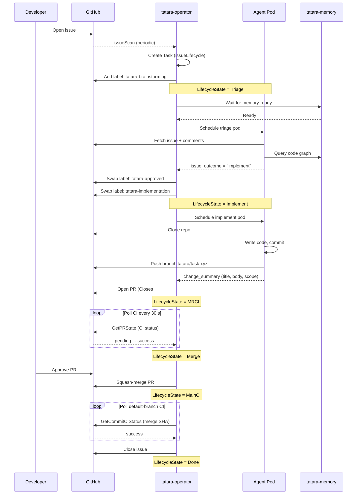

# From Issue to PR

*Follow one GitHub issue through the whole tatara machine - from the moment you click "Submit" to the moment the PR is merged and the issue closes itself.*

The four labels tatara manages on your issue are a live status bar. At every stage below you will see which label is active and why.

| Label | Default name | What it means |
|-------|-------------|---------------|
| Brainstorming | `tatara-brainstorming` | Agent is deciding what to do |
| Approved | `tatara-approved` | Approved for implementation |
| Implementation | `tatara-implementation` | Code is being written |
| Declined | `tatara-declined` | Will not be implemented |

Label names are configurable in `Project.spec.scm.brainstormingLabel` etc. The defaults above are used here throughout.

---

## Step 1 - You open an issue

You create a GitHub issue in any repository enrolled in your tatara Project. The title and body are your only inputs; tatara reads them verbatim.

**Issue label:** *(nothing yet)*

If you want tatara to start immediately and skip straight to writing code - because the change is already well-defined and you trust it - add the *trigger label* (configured in `Project.spec.triggerLabel`, commonly `tatara`). That fires the webhook path, which skips triage and enters the Implement state directly. For everything else, the periodic issue scan (default: hourly) picks up the issue on its next pass.

This page follows the full path - issue opened, no trigger label, triage runs first.

---

## Step 2 - The operator creates a Task

The issueScan reconciler sees a new open issue in an enrolled repository and creates a **Task** custom resource. A Task is the durable, per-issue unit that carries all state for the entire lifecycle - branch name, PR number, CI results, token counts, and the current state-machine position. There is exactly one Task per issue at a time; reopening the issue re-enters the existing Task rather than creating a new one.

```yaml
apiVersion: tatara.dev/v1alpha1
kind: Task
metadata:
  name: myproject-myrepo-42-a3f9d  # deterministic from project + issue ref
spec:
  kind: issueLifecycle
  source:
    issueRef: "owner/myrepo#42"
    number: 42
    title: "Support dark mode in the dashboard"
status:
  lifecycleState: Triage
```

The operator applies the first label to the issue.

**Issue label:** `tatara-brainstorming`

---

## Step 3 - An agent pod spins up and reads the issue

The operator checks that the project's memory service is ready (tatara-memory holds a code knowledge graph built from recent repository ingests), then schedules a **wrapper pod** - a container running `tatara-claude-code-wrapper` with `tatara-cli` as its MCP server. The pod:

1. Clones the repository.
2. Fetches the issue title, body, and all existing comments via the GitHub API.
3. Loads the code knowledge graph from tatara-memory.
4. Reads the prior handoff summary via `get_handoff` (keyed by the task's conversation key) if a previous pod left one; on first triage there is none.
5. Presents everything to the agent as a structured prompt and waits for a decision.

The agent has read-only access to the repository and issue at this stage - it is not writing code yet.

---

## Step 4 - Triage: should we do this?

The agent reads the issue and the codebase and calls the `issue_outcome` MCP tool with one of three answers.

### Path A - decline

The issue is out of scope, already fixed elsewhere, or not actionable. The agent calls `issue_outcome(action="close", comment="...")`. The operator:

- Swaps the label to `tatara-declined`.
- Posts the reason as a comment.
- Closes the issue.
- Marks the Task **Done**.

**Issue label:** `tatara-declined` - then issue closes.

### Path B - discuss

The issue needs clarification, a design choice, or human input. The agent calls `issue_outcome(action="discuss", comment="...")`, posting its questions. The operator:

- Keeps the `tatara-brainstorming` label.
- Tears down the pod (no cost while waiting).
- Starts a 60-minute idle timer.

**Issue label:** `tatara-brainstorming` (waiting)

When you reply, the webhook fires and the Task re-enters Triage immediately: the agent re-reads the full comment thread and tries again. This loop continues until you apply the trigger label (skip to Implement) or 60 minutes pass with no activity (Task parks in **Stopped**, resumable by commenting again).

!!! note "Self-approve guard"
    If the issue was filed by the tatara bot itself (e.g., from a brainstorm proposal), tatara will not auto-approve implementation without a human engaging first. It enters Conversation and waits. Issues opened by a human bypass this guard.

### Path C - implement

The agent decides this is worth building. It calls `issue_outcome(action="implement")`. The operator swaps the label.

**Issue label:** `tatara-approved`

The Task transitions to **Implement**.

---

## Step 5 - The implement agent writes the code

A new pod spawns. The operator sets the implementation label.

**Issue label:** `tatara-implementation`

The agent:

1. Re-reads the issue and its conversation thread.
2. Queries the code knowledge graph for relevant context.
3. Plans the change (it may spawn sub-agents for large or cross-repo work).
4. Writes code, commits, and pushes to branch `tatara/task-<taskname>`.
5. Calls `change_summary` with a PR title, PR body, what was delivered, a required **change significance** (`major`/`minor`/`patch`, which drives the semver tag on push-CD repos - see Step 9), and optionally what remains.

The operator then opens the pull request. The PR body contains `Closes #42` so GitHub will auto-close the issue on merge. If the agent reported remaining scope, the operator opens a follow-up issue to track it.

If the agent exhausted a significant portion of its context window during a long implementation run, the operator may ask it to write a handover document (`submit_handover`) before the session ends. The next session starts by reading that document rather than re-reading everything from scratch.

---

## Step 6 - CI runs, the operator babysits

The Task moves to **MRCI** (MR CI poll). The pod is gone. Every 30 seconds the operator checks the PR's CI pipeline.

**Issue label:** `tatara-implementation` (unchanged)

| CI result | What the operator does |
|-----------|----------------------|
| Pending | Waits and polls again |
| **Green** | Moves to Merge |
| **Red** | Re-spawns an Implement pod with the failing check output as context; agent fixes and pushes; repeat |
| Deadline (60 min) | Posts a comment on the PR and parks the Task |

If CI never goes green within the deadline the PR is left open for a human and the Task enters **Parked**. The lifecycle iteration counter (capped at 10 by default) provides a hard backstop so the fix loop cannot run indefinitely.

---

## Step 7 - Human approves, the operator merges

When CI is green, the Task enters **Merge**. The operator reads `mergePolicy` from the Project:

- If `mergePolicy: afterApproval` (the default), the operator merges when the agent signals `pr_outcome=merge`. The agent reads the PR thread and infers whether a human has approved the work; the operator does **not** independently verify SCM review state. To require a hard SCM review gate, pair `afterApproval` with a branch protection rule requiring an approving review before CI passes - the CI gate then proxies human review.
- If `mergePolicy: autoMergeOnGreenCI`, the operator merges as soon as CI is green, without waiting for the agent's `pr_outcome` signal.
- Once merge is allowed, the operator calls the GitHub squash-merge API. The author of all commits is the bot account (`spec.scm.botLogin`, e.g., `szymonrychu-bot`).

If the merge hits a conflict (GitHub returns `405 Method Not Allowed`), the operator re-spawns an Implement agent with instructions to rebase the default branch into the task branch, resolve conflicts, and push. The previous implementation had a bug here where this 405 caused an infinite controller-runtime backoff loop; the current state machine absorbs the error and routes it correctly.

---

## Step 8 - Post-merge CI is watched, then the issue closes

After the squash merge the Task enters **MainCI**. The operator polls the default-branch pipeline for the merge commit SHA every 30 seconds.

| Result | What the operator does |
|--------|----------------------|
| Pending | Waits |
| **Green** | For a change with no declared significance, closes issue #42 (idempotent if `Closes #N` already did it) and moves the Task to **Done**. For a push-CD-eligible change (a significance was declared), the Task instead enters **Deploying** - see Step 9 |
| **Red** | Clears the merged-PR fields, re-enters Implement to open a brand-new PR with the fix |

Once the issue closes, all managed labels disappear with it.

**Issue:** closed.

---

## Step 9 - Opt-in push-CD: tatara ships the change

Repositories wired into semver push-CD (the tatara platform's own components deploy themselves this way) take one more hop before the issue closes. When the agent declared a `change_significance` on `change_summary` - or a human set a `semver:<level>` label on the PR - the merged change is **push-CD-eligible**, and after main CI goes green the Task enters the pod-less **Deploying** lifecycle state instead of going straight to Done.

No agent pod runs during Deploying. The operator supervises a release cascade:

1. The bot-authored PR was auto-merged on green required checks (agents never merge their own PRs).
2. CI cuts a semver tag from the declared significance (`major`/`minor`/`patch`) and publishes the versioned artifact - container image and/or chart - at `vX.Y.Z`.
3. The new version pin propagates to the parent repo, and finally to `tatara-helmfile`.
4. `tatara-helmfile` applies the pin to the cluster on merge (GitOps, via an in-cluster runner).
5. On a successful apply the operator closes issue #42 and moves the Task to **Done**.

If the apply does not land within the deploy budget, the Task parks recoverable with a `deploy-timeout` reason, so a stuck release surfaces for a human rather than hanging silently.

**Issue label:** `tatara-implementation` (unchanged) until the apply lands, then the issue closes.

This path is opt-in per repository. Repos not wired into push-CD take the Step 8 Green path straight to Done, and everything above stays exactly the same up to that point.

---

## Full sequence diagram



---

## Labels as a status bar

Here is the same journey as a label timeline.

```
Issue #42 opened
  [tatara-brainstorming]  -- Triage running
  [tatara-approved]       -- Triage: will implement
  [tatara-implementation] -- Code being written, CI running
  (issue closed)          -- Done: merged + main CI green
```

If the agent needs clarification:

```
  [tatara-brainstorming]  -- Triage: discuss (questions posted)
  [tatara-brainstorming]  -- Waiting for your reply...
  (you reply)
  [tatara-brainstorming]  -- Triage re-running
  [tatara-approved]       -- Approved, proceeding
  [tatara-implementation] -- ...
```

If the issue is out of scope:

```
  [tatara-brainstorming]  -- Triage running
  [tatara-declined]       -- Declined, reason posted
  (issue closed)
```

---

## What to do when a Task is Parked

A Task enters **Parked** when the operator cannot proceed without human input: the babysit deadline expired, a merge conflict was not resolved, the iteration cap was hit, or the agent explicitly declined with `decline_implementation`. The operator always posts a comment explaining what stopped it.

Your options:

- **Comment on the issue** to reactivate it. The Task re-enters Triage with the full thread as context.
- **Apply the trigger label** to skip Triage and go straight to Implement.
- **Fix the underlying problem** (e.g., merge conflict, failing test) and then apply the trigger label.

While Parked the Task consumes no resources. It waits indefinitely until you act.
