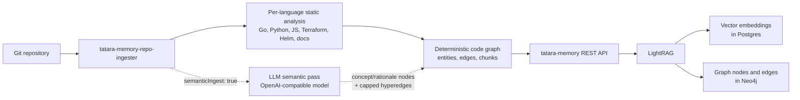

# The Memory Graph

## Why a graph?

When an AI agent reads your codebase from scratch on every session, it is slow (reading many files), expensive (token-heavy), and stateless (it forgets). A knowledge graph changes this: the codebase is pre-processed once, stored as entities and relationships, and queried semantically.

"What does `RetryClient` do and what calls it?" is answered by one bounded retrieval that returns the relevant chunks and their graph neighbors, instead of the agent reading and re-tokenizing 50 files to reconstruct the same picture.

## How the graph is built



**The ingester** runs a per-language analyzer over the changed files (Go, Python, JavaScript, Terraform, Helm, plus a docs/markdown path) rather than slicing the repo into fixed-size windows. Each analyzer emits code-shaped chunks - function- and method-level for code, section-level for docs - so entities stay coherent. A language with no analyzer is simply not ingested as code (there is no Java analyzer, for example).

**Vector embeddings** capture semantic meaning - "retry logic" and "exponential backoff" are near each other in the vector space even if neither string appears in the other.

**The code graph** - function and method signatures, import edges, and call relationships - is produced by the ingester's deterministic static analysis (tree-sitter for code, HCL and Helm-template parsing for infra). No LLM derives it; the same input always yields the same graph.

**Semantic enrichment** (when `semanticIngest: true`) is a separate, optional pass. The ingester sends chunks to an **OpenAI-compatible** model (default `gpt-4o-mini` against `OPENAI_BASE_URL`; the LightRAG side of the memory service is likewise configured for OpenAI - `gpt-4.1-mini` for extraction, `text-embedding-3-small` for embeddings) to layer conceptual nodes and edges on top of the deterministic graph: concept and rationale entities plus a small, capped set of hyperedges, for example "RetryClient handles transient failures like 429 and 503". It does not re-derive the code structure. There is no Claude or Anthropic model anywhere in the memory path - Claude runs only in the agent pods that query it.

## What the graph knows

After a full ingest, the graph contains:

- **Files** as top-level nodes
- **Functions and methods** as child nodes with their signatures
- **Import relationships** (`file A imports package B`)
- **Call relationships** (`function X calls function Y`)
- **Semantic chunks** with embeddings
- **Conceptual relationships** extracted by LLM (`RetryClient handles transient failures like 429 and 503`)

## How agents query it

Inside a running agent pod, `tatara-cli mcp` exposes memory tools. The agent calls these via MCP:

```
Agent: "I need to understand how the HTTP client works"
  -> calls query(mode="hybrid", text="HTTP client retry error handling")
  -> LightRAG runs hybrid search: vector similarity + graph traversal
  -> returns relevant chunks: the RetryClient struct, its Do() method,
     test cases, and caller sites
```

One bounded `query` returns the relevant chunks and their graph neighbors, so the agent spends its context budget on the code that matters instead of reading and re-tokenizing the entire `internal/httpclient/` directory to find the same thing. For a generative answer with cited source paths there is a companion `describe` tool; it is LLM-backed and correspondingly slower.

## Query modes

LightRAG supports four query modes. `mode` is a **required** argument on the `query` and `describe` tools - the caller picks one explicitly; there is no tool-level default:

| Mode | Good for |
|---|---|
| `naive` | Simple keyword search |
| `local` | Focused entity lookup (find this specific function) |
| `global` | Cross-file relationship queries (what calls this?) |
| `hybrid` | Combined vector + graph (best for "explain how X works") |

## Keeping the graph fresh

The graph is not static. Two mechanisms keep it current:

1. **Push webhooks:** when you push code, GitHub fires a webhook to the operator. The operator creates an incremental ingest Job that processes only the changed files.
2. **Cron re-ingest:** `spec.reingestSchedule` on the Repository CR triggers a periodic full re-ingest to catch any drift.

The graph is eventually consistent with your main branch, typically within a few minutes of a push.

## Memory is per-project

Each `Project` CR has its own dedicated memory stack (CNPG Postgres + Neo4j + LightRAG service). Repositories in Project A cannot access Project B's graph. This provides isolation between organizations or teams using the same cluster.

## What the graph does not know

- Secrets and credentials (the ingester reads code only, not `.env` files or Secret manifests)
- Runtime state (the graph is a static analysis of code structure, not a trace of running behavior)
- Private repositories outside the enrolled set
- Future code that has not been pushed yet
