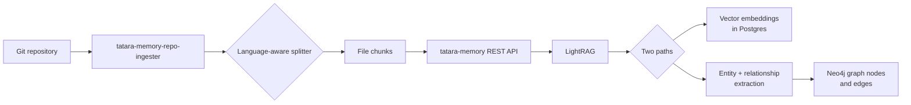

# The Memory Graph

## Why a graph?

When an AI agent reads your codebase from scratch on every session, it is slow (reading many files), expensive (token-heavy), and stateless (it forgets). A knowledge graph changes this: the codebase is pre-processed once, stored as entities and relationships, and queried semantically.

"What does `RetryClient` do and what calls it?" is answered in milliseconds against the graph, not by reading 50 files.

## How the graph is built



**The splitter** divides your code into logical chunks (function-level for Go/Python, class-level for Java, etc.) rather than fixed-size windows. This keeps entities coherent.

**Vector embeddings** capture semantic meaning - "retry logic" and "exponential backoff" are near each other in the vector space even if neither string appears in the other.

**Entity extraction** (when `semanticIngest: true`) sends each chunk to Claude and asks it to identify: function names, class hierarchies, import dependencies, call relationships. These become nodes and edges in Neo4j.

## What the graph knows

After a full ingest, the graph contains:

- **Files** as top-level nodes
- **Functions and methods** as child nodes with their signatures
- **Import relationships** (`file A imports package B`)
- **Call relationships** (`function X calls function Y`)
- **Semantic chunks** with embeddings
- **Conceptual relationships** extracted by LLM (`RetryClient handles transient failures like 429 and 503`)

## How agents query it

Inside a running agent pod, `tatara-cli mcp` exposes memory tools. The agent calls these via MCP:

```
Agent: "I need to understand how the HTTP client works"
  -> calls memory_query("HTTP client retry error handling")
  -> LightRAG runs hybrid search: vector similarity + graph traversal
  -> returns relevant chunks: the RetryClient struct, its Do() method,
     test cases, and caller sites
```

The query result is much smaller than reading the entire `internal/httpclient/` directory, and much faster.

## Query modes

LightRAG supports four query modes, chosen by the tool implementation:

| Mode | Good for |
|---|---|
| `naive` | Simple keyword search |
| `local` | Focused entity lookup (find this specific function) |
| `global` | Cross-file relationship queries (what calls this?) |
| `hybrid` | Combined vector + graph (default; best for "explain how X works") |

## Keeping the graph fresh

The graph is not static. Two mechanisms keep it current:

1. **Push webhooks:** when you push code, GitHub fires a webhook to the operator. The operator creates an incremental ingest Job that processes only the changed files.
2. **Cron re-ingest:** `spec.reingestSchedule` on the Repository CR triggers a periodic full re-ingest to catch any drift.

The graph is eventually consistent with your main branch, typically within a few minutes of a push.

## Memory is per-project

Each `Project` CR has its own dedicated memory stack (CNPG Postgres + Neo4j + LightRAG service). Repositories in Project A cannot access Project B's graph. This provides isolation between organizations or teams using the same cluster.

## What the graph does not know

- Secrets and credentials (the ingester reads code only, not `.env` files or Secret manifests)
- Runtime state (the graph is a static analysis of code structure, not a trace of running behavior)
- Private repositories outside the enrolled set
- Future code that has not been pushed yet
