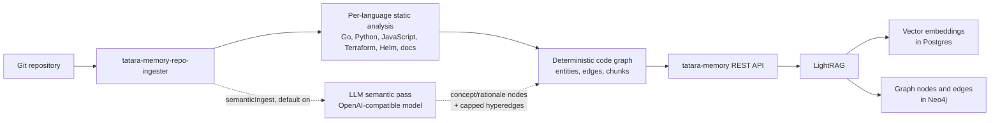

# How Agents Remember Your Code

Read this page and you will know why a tatara agent can answer "what does `RetryClient` do and what calls it?" without reading 50 files, how the graph behind that answer gets built, and what it deliberately does not contain.

## Why a graph

An agent that reads your codebase from scratch every session is slow, expensive in tokens, and forgetful. A knowledge graph changes the economics: your repository is analyzed once, stored as entities and relationships, and queried semantically after that.

So the question above becomes one bounded retrieval that returns the relevant chunks plus their graph neighbors, instead of the agent reading and re-tokenizing half a package to reconstruct the same picture.

## How the graph is built


```mermaid
flowchart LR
    A[Git repository] --> B[tatara-memory-repo-ingester]
    B --> C[Per-language static analysis<br/>Go, Python, JavaScript, Terraform, Helm, docs]
    C --> D[Deterministic code graph<br/>entities, edges, chunks]
    B -. semanticIngest, default on .-> S[LLM semantic pass<br/>OpenAI-compatible model]
    S -. concept/rationale nodes<br/>+ capped hyperedges .-> D
    D --> E[tatara-memory REST API]
    E --> F[LightRAG]
    F --> G[Vector embeddings<br/>in Postgres]
    F --> H[Graph nodes and edges<br/>in Neo4j]
```

**The ingester** runs a per-language analyzer over the changed files rather than slicing the repository into fixed-size windows. There are six analyzers, and the list is the whole list: Go, Python, JavaScript, Terraform, Helm, and a docs path covering `.md`, `.markdown`, `.txt`, and `.rst`. A language with no analyzer is not ingested as code at all. There is no Java analyzer, no Rust analyzer, and no TypeScript analyzer.

Chunking follows the analyzer. Code chunks are function- and method-level, each carrying its signature as a header, so an entity stays coherent when it is retrieved on its own. Documents are chunked whole-file: one entity and one chunk per file, with no heading-level split.

**The code graph** - function and method signatures, import edges, and call relationships - comes from deterministic static analysis, so the same input always yields the same graph. The parser differs per language, and it is worth knowing which you are getting. Go is analyzed with the real type checker (`go/packages` and `go/types`), and falls back to tree-sitter only when the type check reports errors. Python and JavaScript are tree-sitter throughout. Terraform is parsed with HashiCorp's own HCL parser. Helm charts are parsed as Go templates with a permissive function map that stands in for the sprig and Helm builtins, which means chart structure and template calls are captured but values are never substituted: it is not a real `helm template` render.

**Semantic enrichment** is a separate pass on top of that, controlled by `spec.semanticIngest` on the `Repository` CR. It defaults to **true**, so it is opt-out rather than opt-in, and it is inert anyway unless an OpenAI API key is configured. The ingester sends chunks to an **OpenAI-compatible** model (`SEMANTIC_MODEL`, default `gpt-4o-mini`, against `OPENAI_BASE_URL`) and layers conceptual nodes and edges onto the deterministic graph: `concept` and `rationale` entities plus a capped set of hyperedges, three per chunk, expressing things like "RetryClient handles transient failures like 429 and 503". It never re-derives the code structure. Set `semanticIngest: false` to run AST-only and avoid the per-file LLM cost.

There is no Claude or Anthropic model anywhere in the memory path. The LightRAG side of `tatara-memory` is likewise configured for OpenAI: `gpt-4.1-mini` for extraction and `text-embedding-3-small` for embeddings. Claude runs only in the agent pods that query all this.

## What the graph knows

After an ingest, the graph carries:

- **Repository and file** nodes at the top
- **Language-specific entities**: Go packages, types, functions and methods; Python modules, classes and functions; JavaScript modules, classes and functions; Terraform resources, data sources, modules, variables and outputs; Helm charts, templates and values; document files
- **Structural edges**: `contains`, `defines`, `imports`, `calls`, `references`, `implements`, `depends_on`, plus the infrastructure-specific `module_source`, `var_ref`, `output_ref`, `value_ref`, `includes` and `subchart`
- **Semantic chunks** with embeddings, in LightRAG
- **Semantic edges** from the enrichment pass: `conceptually_related_to`, `semantically_similar_to`, `rationale_for`, `shares_data_with`, `cites`

The ingester can also consume a pre-generated **SCIP index** (`--scip`), which pushes an intra-repository graph without chunks. Cross-repository symbol resolution from SCIP monikers is not there yet.

## How agents query it

Inside a running agent pod, `tatara-cli mcp` exposes five memory tools. The two an agent reaches for most are `memory_query` and `memory_describe`:

```
Agent: "I need to understand how the HTTP client works"
  -> calls memory_query(mode="hybrid", text="HTTP client retry error handling")
  -> LightRAG runs hybrid search: vector similarity + graph traversal
  -> returns relevant chunks: the RetryClient struct, its Do() method,
     test cases, and caller sites
```

One bounded `memory_query` returns the relevant chunks and their graph neighbors, so the agent spends its context budget on the code that matters instead of re-tokenizing an entire directory to find the same thing. `memory_describe` is the companion for a generative answer with cited source paths; it is LLM-backed and correspondingly slower. The full per-kind tool grants are in [MCP Tools by Agent Kind](../reference/mcp-tools.md).

## Query modes

LightRAG supports four query modes. `mode` is a **required** argument on both `memory_query` and `memory_describe` - the caller picks one explicitly, and there is no tool-level default:

| Mode | Good for |
|---|---|
| `naive` | Simple keyword search |
| `local` | Focused entity lookup (find this specific function) |
| `global` | Cross-file relationship queries (what calls this?) |
| `hybrid` | Combined vector and graph (best for "explain how X works") |

## Keeping the graph fresh

The graph is not static. Two mechanisms keep it current, and both take the same incremental path.

1. **Push webhooks.** When you push, your forge fires a webhook to the operator, which stamps a reingest-requested annotation on the `Repository`. The next reconcile launches an ingest Job that starts from the last ingested commit, so only what changed is processed.
2. **Cron catch-up.** `spec.reingestSchedule` on the `Repository` CR is a required 5-field cron expression. Each due tick stamps the same annotation, so it is an incremental catch-up rather than a full rebuild - it exists to cover pushes whose webhook never arrived.

A **full** re-ingest happens in exactly two situations: the first ingest of a repository, and a self-heal after repeated incremental failures, which is how a force-pushed branch whose last ingested commit no longer exists in history recovers on its own.

The graph is eventually consistent with your main branch, typically within a few minutes of a push.

## Memory is per-project

Each `Project` CR gets its own memory stack: a CNPG Postgres cluster, Neo4j, LightRAG, and the `tatara-memory` service, all owner-referenced to the Project so they are torn down with it. The isolation is therefore a separate deployment per project, not a tenant parameter inside a shared one, and an agent pod is pointed at its own project's service. Delete the Project and its graph goes with it.

## What the graph does not know

- Secrets and credentials. The ingester reads code, not `.env` files or Secret manifests
- Runtime state. The graph is static analysis of code structure, not a trace of running behavior
- Repositories outside the enrolled set
- Code that has not been pushed yet
