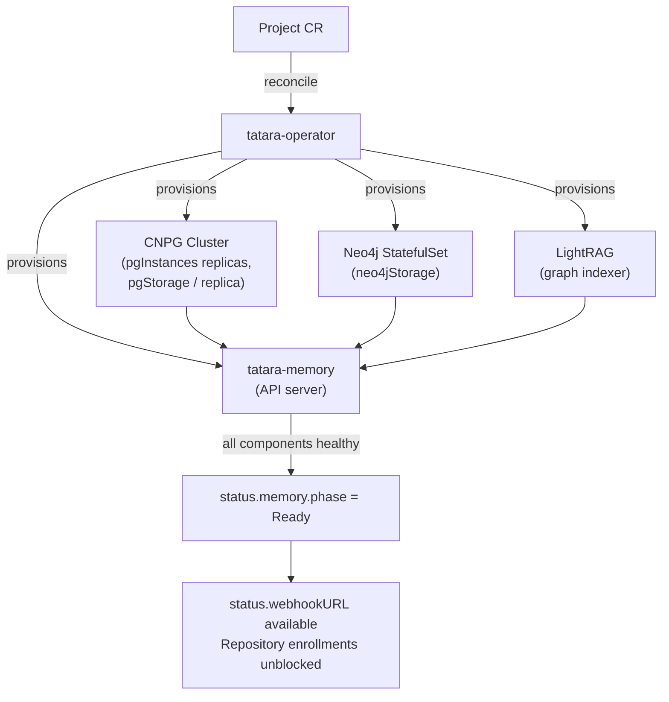

# Your First Project

A `Project` CR is the top-level entity in tatara. One Project per logical SCM namespace (GitHub
organization or GitLab group): it binds the bot identity, SCM connection, agent execution policy,
and the per-project memory stack. Creating a Project triggers the operator to provision everything
downstream - memory, webhooks, cron schedules, and optionally Grafana incident integration.

!!! info "Prerequisites"
    - tatara-operator deployed and healthy (see [Installation](installation.md))
    - A dedicated bot account on your SCM provider with permissions to comment, label, and open
      pull requests on the target repositories
    - A Kubernetes Secret in the `tatara` namespace holding the bot's personal access token (PAT)
      in key `token`

---

## 1. Minimal Project

The minimum viable Project requires only the bot credentials and SCM binding. All other fields
have enforced defaults.

```yaml title="my-project.yaml"
apiVersion: tatara.dev/v1alpha1
kind: Project
metadata:
  name: my-project
  namespace: tatara
spec:
  scmSecretRef: tatara-scm   # Secret in the same namespace; key "token" = bot PAT
  triggerLabel: tatara        # label that activates the agent loop on issues (default: tatara)
  maxConcurrentAgents: 3      # kill switch: max simultaneous agent PODS project-wide (default: 3; 0 fully pauses the project)
  agentPodTTLSeconds: 3600    # bounds one pod's life; the Task persists across many pods (default: 3600, minimum 300)

  scm:
    provider: github          # github | gitlab
    owner: my-org             # GitHub org name or GitLab group path
    botLogin: my-org-bot      # bot account username on the SCM provider

  agent:
    model: claude-opus-4-8    # Claude model; no built-in default, set it explicitly
    image: harbor.example.com/tatara-claude-code-wrapper:v1.2.3
    effort: xhigh             # reasoning effort: low | medium | high | xhigh | max
```

!!! warning "Deploy through tatara-helmfile, not kubectl apply"
    In production, apply the Project through the `tatara-project` chart (managed in
    `tatara-helmfile`) rather than `kubectl apply` directly. The chart keeps the Project CR under
    Helm ownership and ensures the co-deployed Repository CRs and Secrets are consistent. Direct
    `kubectl apply` is fine in a development cluster. See [Enrollment](enrollment.md).

### SCM Secret format

Create the Secret before or alongside the Project:

```yaml
apiVersion: v1
kind: Secret
metadata:
  name: tatara-scm
  namespace: tatara
type: Opaque
stringData:
  token: "ghp_..."   # bot PAT: contents, issues, pull requests, metadata, org members read
                     # (GitHub fine-grained) or api + read/write_repository (GitLab). No webhook scope.
```

### Required and key top-level fields

| Field | Required | Default | Notes |
|---|---|---|---|
| `spec.scmSecretRef` | Yes | - | Secret name in the same namespace; key `token` = PAT |
| `spec.scm.provider` | Yes | - | `github` or `gitlab` |
| `spec.scm.owner` | Yes | - | GitHub org / GitLab group path |
| `spec.scm.botLogin` | Yes | - | Bot account username |
| `spec.triggerLabel` | No | `tatara` | Issues labeled with this activate the agent loop |
| `spec.maxConcurrentAgents` | No | `3` | The project's kill switch: caps simultaneous agent PODS (the admission unit is the pod-spawn, not the Task). `0` fully pauses the project - no pod, of any kind, is ever admitted |
| `spec.agentPodTTLSeconds` | No | `3600` | Bounds one agent pod's life; the Task itself persists across as many pods as it needs |
| `spec.maxOpenTasks` | No | `6` | Separate lever from `maxConcurrentAgents`: caps how many Tasks may be *active* (any pod-eligible stage) at once, independent of how many pods are running concurrently |

---

## 2. Memory sizing

Each Project gets a dedicated memory stack: a CNPG PostgreSQL cluster, a Neo4j graph database, a
LightRAG graph indexer, and the `tatara-memory` API server that other components query. This stack
persists the code-knowledge graph agents traverse at runtime.



Configure storage under `spec.memory`:

| Field | Default | Description |
|---|---|---|
| `pgInstances` | `1` | CNPG cluster replica count. `1` for development; `3` for HA production |
| `pgStorage` | `10Gi` | PVC size per PostgreSQL replica (PGDATA). Grows with repository count and embedding volume |
| `pgWalStorage` | `8Gi` | PVC size per PostgreSQL replica for CNPG's dedicated WAL volume, separate from PGDATA |
| `neo4jStorage` | `10Gi` | PVC for the Neo4j graph. Sized proportionally to total ingested lines |

**Scaling guidance:**

- **Development / single repository:** defaults (`pgInstances: 1`, `pgStorage: 10Gi`,
  `neo4jStorage: 10Gi`) are sufficient for evaluation.
- **Production / multiple repositories:** set `pgInstances: 3` for PostgreSQL HA and increase
  storage to `20Gi`+ once ingestion consistently hits 80% capacity. The live tatara self-hosting
  project runs `pgInstances: 3`, `pgStorage: 10Gi`, `neo4jStorage: 10Gi` across eight
  repositories.
- **Large monorepos (>500k LOC):** start at `neo4jStorage: 20Gi` and `pgStorage: 20Gi`.

!!! warning "Storage provisioning is one-way"
    PVC expansion requires a storage class that supports `allowVolumeExpansion`. The CNPG cluster
    must be restarted after a resize. Plan capacity before the initial repository ingest to avoid
    downtime.

```yaml
spec:
  memory:
    pgInstances: 3
    pgStorage: 20Gi
    neo4jStorage: 10Gi
```

---

## 3. Agent configuration

`spec.agent` configures every agent pod the operator schedules for this Project.

| Field | Default | Description |
|---|---|---|
| `model` | *(none)* | Claude model string, e.g. `claude-opus-4-8` or `claude-sonnet-4-6`. A single model serves all agent kinds in the Project unless overridden per kind in `modelByKind` |
| `image` | *(none)* | Full `tatara-claude-code-wrapper` image reference (registry + tag). Pin to an explicit tag; never `latest` |
| `effort` | `xhigh` | Reasoning effort: `low` / `medium` / `high` / `xhigh` / `max`. Passed to the wrapper as the `EFFORT` env var, which drives Claude's reasoning budget |
| `maxTurnsPerPod` | `40` | Caps turns for a single pod's run. The `implement` agent kind is **exempt** - a long healthy coding run is not cut off mid-work; it is bounded only by `maxTurnsPerTask` below |
| `maxTurnsPerTask` | `300` | Lifetime turn ceiling across every pod of the same Task, for every agent kind including `implement`. This is what actually bounds the `implement` exemption above |
| `turnTimeoutSeconds` | `1800` | Per-turn inactivity window in seconds. A turn is killed only after this many seconds with **no agent output** - an actively streaming turn is never interrupted |
| `maxReviewRounds` | `3` | Caps the `reviewing` <-> `implementing` cycle on non-`review`-kind Tasks. Beyond it the Task parks `review-loop-exhausted` |
| `maxPodRecreations` | `3` | A pod that never becomes Ready within 5 minutes of creation is respawned, not failed, up to this budget. Past it the Task fails at `pod-recreation-exhausted` |
| `permissionMode` | `bypassPermissions` | Claude Code permission mode. Leave as default; headless agents require this mode |

```yaml
spec:
  agent:
    model: claude-opus-4-8
    image: harbor.example.com/tatara-claude-code-wrapper:v1.2.3
    effort: xhigh
    maxTurnsPerPod: 40
    maxTurnsPerTask: 300
    turnTimeoutSeconds: 1800    # 30 minutes of inactivity, not wall-clock age
    maxReviewRounds: 3
    maxPodRecreations: 3
```

!!! tip "Turn timeout semantics"
    `turnTimeoutSeconds` measures inactivity, not elapsed time. An agent writing a large Go
    implementation that keeps emitting tool-call output is never killed by this timer. Only a
    stalled turn (no output at all for the timeout duration) is terminated. The default 1800 s
    handles large file writes and long compilation steps.

### Lifecycle hooks

Optional shell commands the wrapper runs at fixed lifecycle points. Each is executed via `sh -c`;
a non-zero exit is logged but never aborts the agent run.

```yaml
spec:
  agent:
    hooks:
      preClone: "echo cloning $1"
      postClone: "mise install"
      conversationStart: "notify-start.sh"
      agentTurnFinished: "run-metrics-push.sh"
```

| Hook | When it fires |
|---|---|
| `preClone` | Before each repository clone; receives the repo URL as `$1` |
| `postClone` | After each successful clone and checkout; receives clone destination as `$1` |
| `conversationStart` | Once after the agent session boots successfully |
| `conversationRestart` | Each time the session is relaunched after a crash (the `--continue` path) |
| `agentTurnFinished` | After each agent turn completes |
| `conversationFinished` | Once during session teardown |

---

## 4. Approval and intake

Tatara's intake model determines which humans can drive the agent loop; a separate allow-list
determines who can release an issue into implementation.

**You approve by commenting.** When a `clarify` agent has settled the scope, a maintainer posts a
comment whose text is an approval phrase, and the operator - not the agent - reads it. The operator
checks that the comment is the most recent one from a maintainer, that its author is not the bot,
and that its text matches an entry in `spec.scm.approvalPhrases`. It then pins the comment's id on
the Issue as single-use evidence and lets the work start. No label approves anything.

### What approves, and what does not

| A maintainer comments | Result |
|---|---|
| `go ahead` | **Approves.** The whole comment is the phrase |
| `LGTM` | **Approves.** Case and markdown emphasis are normalised away, so `**LGTM**` works too |
| `I can't approve this until the tests pass` | Does not approve. The match is anchored to a whole line: the comment must *consist of* a phrase, not merely contain one |
| `Looks good, ship it once you have rebased on main` | Does not approve. Same reason - and this is the point of the anchoring, because a substring match would have shipped it |
| `> go ahead` (quoting someone else) | Does not approve. Quoted lines are stripped before the match |
| An `approve` from an account not in `maintainerLogins` | Does not approve. Identity is checked before the text is read |
| The bot posting `go ahead` | Does not approve. The bot is excluded structurally, before the text is read |

`approvalPhrases` defaults, when unset, to `approve`, `approved`, `go ahead`, `lgtm`, `ship it`,
`implement it`. An empty list means those defaults; it never means "any text approves".

If no comment passes, the Task parks and the operator comments on the issue saying what it was
waiting for. Post a passing comment at any time afterwards and the Task picks up where it left off.
See [Approval Gates](../operations/security/approval-gates.md#the-approval-grammar) for the full
rules.

### Allow-lists

| Field | Effect when empty | Effect when set |
|---|---|---|
| `spec.scm.maintainerLogins` | **Closed by default.** No login is a maintainer, so no comment can ever approve anything and no issue - human-filed or bot-authored - ever advances to implementation | Only a comment authored by a listed login can approve, and only when its text matches an approval phrase |
| `spec.scm.reporterLogins` | Issues and comments from any author are processed | Only the bot, maintainers, and listed reporters trigger the agent loop; all others are silently dropped at intake |

!!! danger "Security recommendation"
    Set both `maintainerLogins` and `reporterLogins` to the real humans who hold commit access to
    your repositories. Leaving them empty permits any GitHub or GitLab user who can file an issue
    to steer an agent that has elevated SCM permissions. See [Prompt-Injection Defenses](../operations/security/prompt-injection.md) for the full threat model.

```yaml
spec:
  scm:
    maintainerLogins:
      - alice
      - bob
    reporterLogins:
      - alice
      - bob
```

Both lists are overridable per-repository via `RepositorySpec.maintainerLogins` and
`RepositorySpec.reporterLogins`.

### Label set

The operator projects a small set of labels onto an issue as a **one-way, read-only mirror**
of `Issue.status.status` and `Task.status.stage` - useful for dashboards and humans scanning the
issue list, but never read back to decide anything. Defaults work out of the box; override only
to match organizational naming conventions. Field names are on `spec.scm.*` (e.g.
`brainstormingLabel`, `declinedLabel`, `incidentLabel`) plus the top-level `triggerLabel`; see the
merged `tatara-operator` source for the exact current set and defaults, since the label
vocabulary is deliberately not part of this contract's stable surface the way the approval
grammar below is.

### Merge policy

An agent-opened PR is never merged by an agent, and no tatara-opened PR is ever opened with the
forge's own merge-when-green feature switched on. Once a `review` pod calls
`submit_outcome(verdict=approve)` from a separate pod that structurally cannot decide its own
diff's fate on the forge, the operator itself reads the live PR head, posts a `COMMENT`-type
review carrying the verdict, and [merges it](../workflows/merge-and-deploy.md#the-merge-sequence)
as soon as required checks are green - never a native forge `APPROVE`, since GitHub blocks a
PR's own author from approving it (one bot identity means that call always 422s). There is no
SCM branch-protection rule that adds a human merge step on top of this: a rule requiring an
approving review would deadlock every merge, because the platform can never satisfy it on its
own PR. See [the accepted-risk note](../operations/security/index.md) for what real
defense-in-depth looks like under one bot identity instead.

### PR reaction scope

`spec.scm.prReactionScope` gates which human PRs/MRs the cron `mrScan` re-review path reacts to.
It has **no default**, and unset is the widest setting, not the narrowest:

- unset / `all` (the effective default): the `mrScan` path reviews **every open human PR/MR** in
  every enrolled repository. This is the historical open behavior.
- `labeledOrMentioned`: restricts `mrScan` re-review to PRs labeled with `triggerLabel` or that
  `@mention` the bot account, so unlabeled, un-mentioned PRs are not re-reviewed every scan cycle.

!!! warning "Set this explicitly to narrow cron re-review"
    The field is deliberately not defaulted to `labeledOrMentioned`: a defaulted value is
    indistinguishable from an explicit one, so auto-defaulting would silently gate every project.
    If you want the bot to only re-review labeled/mentioned PRs on a schedule, set
    `prReactionScope: labeledOrMentioned` yourself. (The inbound-webhook PR path is separately
    hardcoded to labeled-or-mentioned regardless of this field; this setting governs the cron
    re-review loop.)

---

## 5. Optional: cron activities, Grafana, and board projection

### Cron activities

Cron drives the autonomous loop. All schedules use standard 5-field cron syntax. An empty schedule
disables that activity.

!!! note "Refine runs automatically"
    `spec.scm.cron.refine` fires as a mandatory pre-step before each scan and brainstorm cycle.
    It does not need its own schedule. `closedLookbackDays` (default 30 when unset) controls how
    far back closed issues are loaded for already-implemented detection.

=== "Issue and MR scans"

    ```yaml
    spec:
      scm:
        cron:
          issueScan:
            schedule: "0 * * * *"   # every hour at :00
            maxPerRepo: 1            # max concurrent issue-scan tasks per repository
          mrScan:
            schedule: "0 * * * *"
            maxPerRepo: 1
    ```

    `maxPerRepo` caps concurrent scan tasks per repository lane. The default of `1` is the safe
    starting point; a single scan agent per repo prevents interleaving conflicts.

=== "Brainstorm"

    ```yaml
    spec:
      scm:
        cron:
          brainstorm:
            enabled: true
            schedule: "0 * * * *"
            maxOpenProposals: 8      # skip cycle if open proposals >= this value project-wide
            sources:                 # docs | memory | internet
              - docs
              - memory
              - internet
    ```

    One brainstorm task fires per project per cycle regardless of the `maxOpenProposals` cap. The
    cap determines whether the cycle is *skipped entirely*, not how many tasks run.

    `sources` controls what the brainstorm agent reads to generate proposals:

    | Source | What the agent reads |
    |---|---|
    | `docs` | Repository documentation and code already ingested into the memory graph |
    | `memory` | The structured knowledge graph (entity + relationship queries) |
    | `internet` | External web search for relevant context and prior art |

=== "Documentation"

    ```yaml
    spec:
      scm:
        cron:
          documentation:
            enabled: true
            schedule: "0 2 * * *"   # nightly at 02:00
    ```

    `documentation` is a schedule-driven, repo-scoped kind that keeps a project's docs repo
    current: on each tick it diffs what changed across the project's other repos since the docs
    repo was last meaningfully updated, and opens a PR to the docs repo only if the accumulated
    change is non-trivial. There is no webhook path - only the cron tick drives it. See the
    [Documentation workflow](../workflows/documentation.md) for details.

### Grafana incident-response integration

When enabled, the operator provisions a per-project `grafana-mcp` **Deployment** (read-only
Grafana Viewer service account) and exposes an alert-webhook receiver at `<webhookURL>/grafana`.
Agent pods reach it over the network via the `TATARA_GRAFANA_MCP_URL` env var the operator injects;
it is a standalone in-cluster service, not a sidecar container co-located in each agent pod.
Grafana alert rules that POST to the webhook receiver trigger automatic incident-response tasks.

```yaml
spec:
  grafana:
    enabled: true
    url: http://prometheus-grafana.monitoring.svc.cluster.local
    secretRef: tatara-grafana
```

The referenced Secret must contain two keys:

```yaml
apiVersion: v1
kind: Secret
metadata:
  name: tatara-grafana
  namespace: tatara
type: Opaque
stringData:
  serviceAccountToken: "glsa_..."   # Grafana Viewer SA token (mounted into grafana-mcp)
  webhookSecret: "..."              # bearer the Grafana contact point presents to the webhook
```

!!! note "`cooldownSeconds` is deprecated"
    The `grafana.cooldownSeconds` field is retained for API compatibility but has no effect.
    Per-alert-group refire dedup is handled at admission time via in-flight idempotency.

### Project board projection

```yaml
spec:
  scm:
    board:
      githubProjectNumber: 42   # GitHub Projects v2 (or classic) project number
      statusField: Status       # board field tatara writes to (default: "Status")
```

For GitLab, use `gitlabBoardId` instead of `githubProjectNumber`.

### Project guidance

`spec.scm.guidance` is free-form text appended verbatim to brainstorm and health-check prompts.
Use it to scope the agents' focus area for this project:

```yaml
spec:
  scm:
    guidance: >-
      Treat the helm charts, CI pipelines, and Kubernetes configuration as in-scope alongside
      application features. Prioritize reliability and observability improvements.
```

---

## 6. Apply and watch

Apply the Project (via tatara-helmfile in production, or directly in a development cluster):

```sh
kubectl apply -f my-project.yaml
```

Watch the memory stack come up:

```sh
kubectl -n tatara get project my-project -w \
  -o jsonpath='{.status.memory.phase}{"\n"}'
```

Wait for `phase` to become `Ready`. The operator sets this once the CNPG cluster, Neo4j,
LightRAG, and the memory API server are all healthy. Repository enrollments (and task/lifecycle
agent spawns) stay gated for a further **3 minutes** after `phase` first turns `Ready`, so a
single blip cannot herd-release the whole backlog at once. During that window a Repository shows
a `MemoryNotReady` condition with message `waiting for project my-project memory stack to become
stably Ready` even though `status.memory.phase` already reads `Ready` - this is expected, not a
stuck reconcile.

!!! info "Phase progression"
    `Provisioning` -> `Ready` (or `Failed` on an apply or password error). If the phase stays
    `Provisioning` for more than a few minutes, check the condition message:
    ```sh
    kubectl -n tatara describe project my-project
    # look for the MemoryReady condition
    kubectl -n tatara get pods -l tatara.dev/project=my-project
    ```
    If `phase` is already `Ready` but Repository enrollment or task spawning still appears
    blocked, check `status.memory.readySince` - work stays gated until 3 minutes after that
    timestamp.

Once `Ready`, grab the webhook URL:

```sh
kubectl -n tatara get project my-project \
  -o jsonpath='{.status.webhookURL}'
```

Register this URL in your SCM provider (GitHub: organization Settings -> Webhooks; GitLab: group
Settings -> Webhooks):

| Setting | Value |
|---|---|
| Payload URL | value from `status.webhookURL` |
| Content type | `application/json` |
| Secret | `webhookSecret` value from the operator Helm values |
| Events (GitHub) | Issues, Issue comments, Pull requests, Pull request reviews |
| Events (GitLab) | Issues events, Comments, Merge request events |

Tail structured operator logs to confirm reconciliation is healthy:

```sh
kubectl -n tatara logs deploy/tatara-operator -f | jq .
```

Look for `"msg":"project reconciled"` or `"msg":"memory stack ready"` with your project name in
the `resource_id` field.

### Watch it work

Once you file a test issue, watch the Task the operator mints for it move through the stage
machine directly:

```sh
kubectl -n tatara get tasks -o custom-columns=\
NAME:.metadata.name,STAGE:.status.stage,KIND:.spec.kind,AGENT:.status.agentKind -w
```

`STAGE` is the single source of truth (see [Task reference](../reference/task.md) for the full
fifteen-value enum); `KIND` is the immutable origin and `AGENT` is whichever pod is running right
now - they diverge as soon as an issue moves past `clarifying`. The mirrored `Issue` and
`MergeRequest` CRs the Task owns are visible the same way:

```sh
kubectl -n tatara get iss,mr -l tatara.dev/task=<task-name>
```

---

## Annotated full Project YAML

A production-ready example for a GitHub organization with all commonly used fields.

```yaml title="my-project-full.yaml" linenums="1"
apiVersion: tatara.dev/v1alpha1
kind: Project
metadata:
  name: my-project              # (1)!
  namespace: tatara
spec:
  scmSecretRef: tatara-scm      # (2)!
  triggerLabel: tatara          # (3)!
  maxConcurrentAgents: 5        # (4)!
  agentPodTTLSeconds: 3600      # (5)!
  maxOpenTasks: 6                # (6)!

  agent:
    model: claude-opus-4-8      # (7)!
    image: harbor.example.com/tatara-claude-code-wrapper:v1.2.3  # (8)!
    effort: xhigh               # (9)!
    maxTurnsPerPod: 40           # (10)!
    maxTurnsPerTask: 300         # (11)!
    turnTimeoutSeconds: 1800    # (12)!
    maxReviewRounds: 3           # (13)!
    maxPodRecreations: 3         # (14)!

  memory:
    pgInstances: 3              # (15)!
    pgStorage: 20Gi             # (16)!
    neo4jStorage: 10Gi          # (17)!

  scm:
    provider: github            # (18)!
    owner: my-org               # (19)!
    botLogin: my-org-bot        # (20)!
    botEmail: 12345+my-org-bot@users.noreply.github.com  # (21)!
    maintainerLogins:           # (22)!
      - alice
      - bob
    reporterLogins:             # (23)!
      - alice
      - bob
    approvalPhrases:            # (24)!
      - go ahead
      - lgtm
    prReactionScope: labeledOrMentioned  # (25)!
    guidance: >-                # (26)!
      Focus on reliability and observability alongside new features.
    cron:
      issueScan:
        schedule: "0 * * * *"
        maxPerRepo: 1           # (27)!
      mrScan:
        schedule: "0 * * * *"
        maxPerRepo: 1
      brainstorm:
        enabled: true
        schedule: "0 * * * *"
        maxOpenProposals: 8     # (28)!
        sources:
          - docs
          - memory
          - internet
      documentation:
        enabled: true
        schedule: "0 2 * * *"
      refine:
        closedLookbackDays: 30  # (29)!

  grafana:
    enabled: true               # (30)!
    url: http://prometheus-grafana.monitoring.svc.cluster.local
    secretRef: tatara-grafana   # (31)!

  queue:
    capacity: 5                 # (32)!
    alertCapacity: 1            # (33)!
```

1.  Project name must be unique per namespace. It becomes the label `tatara.dev/project` on all
    downstream resources (agent pods, memory stack, cron jobs).
2.  Name of the Kubernetes Secret in the same namespace; must contain key `token` with the bot PAT.
    The Secret must exist before the Project is applied.
3.  Issues labeled with this value activate the agent loop. Defaults to `tatara`. Match this to
    the label you apply in your SCM provider to request agent attention.
4.  The project's kill switch: maximum concurrent agent **pods** across all repositories in this
    Project - the admission unit is the pod-spawn, not the Task. Setting this to `0` fully pauses
    the project: no `QueuedEvent` is ever admitted, so no pod and no Task is created.
5.  Bounds one agent pod's life in seconds. The Task itself persists across as many pods as it
    needs; a pod that runs past this deadline is stopped with a guaranteed handoff note written to
    `Task.status.notes`, and a fresh pod picks up where it left off. Minimum `300`.
6.  A separate lever from `maxConcurrentAgents`: caps how many Tasks may be *active* (any
    pod-eligible stage) at once, independent of how many pods are running concurrently right now.
7.  Claude model for all agent kinds in this Project. A single model serves every kind unless
    overridden per kind in `modelByKind`. Changing this affects new pods immediately; an in-flight
    pod continues with the model it started on.
8.  Full image reference for the `tatara-claude-code-wrapper` container. Pin to an explicit digest
    or tag; the operator uses this verbatim in every agent Pod spec.
9.  Reasoning effort level. `xhigh` is the default and the recommended starting point. Lower
    values reduce API cost but also agent quality on complex multi-file implementation tasks.
10. Caps turns for a single pod's run. The `implement` agent kind is exempt - a long healthy
    coding run is not cut off mid-work, bounded instead by `maxTurnsPerTask` below.
11. Lifetime turn ceiling across every pod of the same Task, for every agent kind including
    `implement`. This is what actually bounds the `implement` exemption above.
12. Per-turn inactivity timeout in seconds. Only a stalled turn (no output for this duration) is
    killed. A turn actively writing files or running tests is never interrupted by this timer.
13. Caps the `reviewing` <-> `implementing` cycle on non-`review`-kind Tasks. Beyond this many
    `request_changes` rounds the Task parks `review-loop-exhausted`.
14. A pod that never becomes Ready within 5 minutes of creation is respawned automatically, not
    failed, up to this budget. Past it the Task fails at `pod-recreation-exhausted`.
15. CNPG PostgreSQL replica count. `1` is fine for development; `3` delivers HA via synchronous
    replication and is required for production workloads.
16. PVC storage allocated per PostgreSQL replica. Stores embedding vectors; scale with the number
    and size of enrolled repositories.
17. PVC for the Neo4j graph database. The code-knowledge graph grows with total ingested line
    count across all enrolled repositories.
18. SCM provider: `github` or `gitlab`.
19. GitHub organization name or GitLab group path (as it appears in repository URLs).
20. Username of the dedicated bot account. Its PAT must grant repo contents read/write, issues,
    pull requests, and org-membership read on all target repositories. No webhook-admin scope:
    the operator never registers webhooks (you configure them manually, section 6).
21. GitHub noreply commit-author email for the bot. Links agent commits to the bot account in
    the GitHub web UI. Find this in the bot account's GitHub email settings.
22. Human maintainer logins. **Required for anything to ever be approved** - empty means no
    approvals are ever possible. When set, only a comment from one of these accounts, matching
    `approvalPhrases` below, is ever recorded as approval; they also form the trusted-insider set
    for intake bypass. Overridable per-repository.
23. Reporter allow-list. When set, issues and comments from accounts not in this list, not in
    `maintainerLogins`, and not the bot are silently dropped at intake. Closes the primary
    prompt-injection vector. Overridable per-repository.
24. The closed, per-project wordlist an approving maintainer comment must match: some line of the
    normalized comment body must *consist of* one of these phrases, anchored whole-line, not
    merely contain it. Empty means the built-in defaults (`lgtm`, `approve`, `approved`, `ship it`,
    `go ahead`, `go`, `implement it`) - it never means "any text approves."
25. Cron `mrScan` re-review scope. This example opts in to the narrow setting. Left unset (or
    `all`), the `mrScan` path re-reviews every open human PR/MR each cycle. `labeledOrMentioned`
    restricts scheduled re-review to PRs labeled with `triggerLabel` or that `@mention` the bot.
    The field has no default; set it explicitly to narrow the loop.
26. Free-form project charter text appended verbatim to brainstorm goal prompts. Use this to focus
    agent attention on your project's priorities and in-scope concerns.
27. Maximum concurrent issue-scan (or MR-scan) Tasks per repository lane. `1` is the safe default;
    a single scan agent per repo prevents conflicting concurrent scans.
28. Project-wide cap on open, unapproved agent proposals across all repositories. When the count
    reaches this number, the brainstorm cycle is skipped entirely for that tick.
29. How far back in days closed issues are loaded during the refine pre-step for
    already-implemented detection. Defaults to 30 days when not set.
30. Enables the per-project Grafana integration: a read-only `grafana-mcp` Deployment provisioned
    with a Viewer service account token (agents reach it via the injected `TATARA_GRAFANA_MCP_URL`,
    not as a pod sidecar), and an alert-webhook receiver at `<webhookURL>/grafana`.
31. Kubernetes Secret containing two keys: `serviceAccountToken` (Grafana Viewer SA token,
    mounted into the grafana-mcp container) and `webhookSecret` (bearer token the configured
    Grafana contact point must present to the webhook).
32. Queue admission capacity - maximum simultaneously admitted normal-class events. Defaults to
    `maxConcurrentAgents` when not set. Override only to decouple queue capacity from the
    concurrency cap.
33. Reserved concurrent slots for alert-class events (Grafana-sourced incidents). Default 1.
    Alert slots are separate from `capacity`, ensuring an incoming incident always gets an agent
    pod even when the normal queue is fully saturated.
