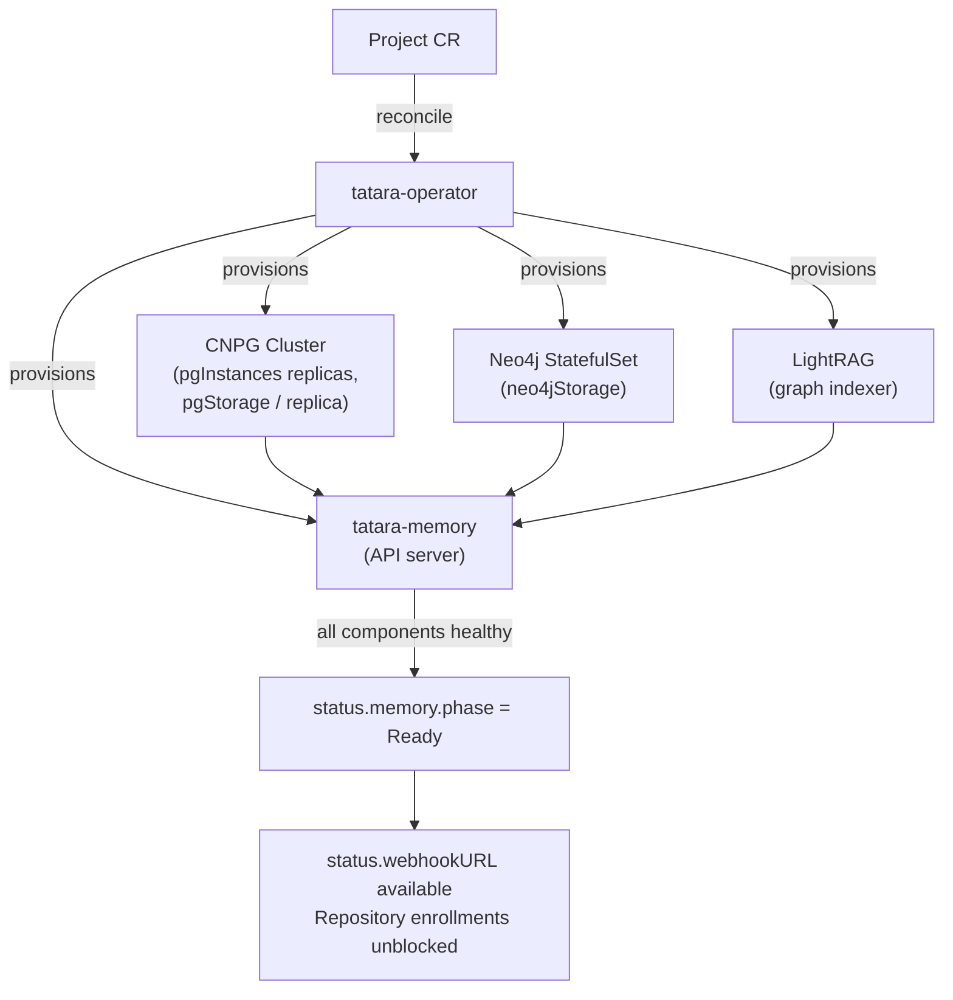

# Your First Project

A `Project` CR is the top-level entity in tatara. One Project per logical SCM namespace (GitHub
organization or GitLab group): it binds the bot identity, SCM connection, agent execution policy,
and the per-project memory stack. Creating a Project triggers the operator to provision everything
downstream - memory, webhooks, cron schedules, and optionally Grafana incident integration.

!!! info "Prerequisites"
    - tatara-operator deployed and healthy (see [Installation](installation.md))
    - A dedicated bot account on your SCM provider with permissions to comment, label, and open
      pull requests on the target repositories
    - A Kubernetes Secret in the `tatara` namespace holding the bot's personal access token (PAT)
      in key `token`

---

## 1. Minimal Project

The minimum viable Project requires only the bot credentials and SCM binding. All other fields
have enforced defaults.

```yaml title="my-project.yaml"
apiVersion: tatara.dev/v1alpha1
kind: Project
metadata:
  name: my-project
  namespace: tatara
spec:
  scmSecretRef: tatara-scm   # Secret in the same namespace; key "token" = bot PAT
  triggerLabel: tatara        # label that activates the agent loop on issues (default: tatara)
  maxConcurrentTasks: 3       # max simultaneous agent pods project-wide (default: 3)

  scm:
    provider: github          # github | gitlab
    owner: my-org             # GitHub org name or GitLab group path
    botLogin: my-org-bot      # bot account username on the SCM provider

  agent:
    model: claude-sonnet-4-6  # Claude model the agents use
    image: harbor.example.com/tatara-claude-code-wrapper:v1.2.3
    effort: xhigh             # reasoning effort: low | medium | high | xhigh | max
```

!!! warning "Deploy through tatara-helmfile, not kubectl apply"
    In production, apply the Project through the `tatara-project` chart (managed in
    `tatara-helmfile`) rather than `kubectl apply` directly. The chart keeps the Project CR under
    Helm ownership and ensures the co-deployed Repository CRs and Secrets are consistent. Direct
    `kubectl apply` is fine in a development cluster. See [Enrollment](enrollment.md).

### SCM Secret format

Create the Secret before or alongside the Project:

```yaml
apiVersion: v1
kind: Secret
metadata:
  name: tatara-scm
  namespace: tatara
type: Opaque
stringData:
  token: "ghp_..."   # GitHub/GitLab PAT with repo, issues, and webhooks scopes
```

### Required and key top-level fields

| Field | Required | Default | Notes |
|---|---|---|---|
| `spec.scmSecretRef` | Yes | - | Secret name in the same namespace; key `token` = PAT |
| `spec.scm.provider` | Yes | - | `github` or `gitlab` |
| `spec.scm.owner` | Yes | - | GitHub org / GitLab group path |
| `spec.scm.botLogin` | Yes | - | Bot account username |
| `spec.triggerLabel` | No | `tatara` | Issues labeled with this activate the agent loop |
| `spec.maxConcurrentTasks` | No | `3` | Caps simultaneous agent pods project-wide |

---

## 2. Memory sizing

Each Project gets a dedicated memory stack: a CNPG PostgreSQL cluster, a Neo4j graph database, a
LightRAG graph indexer, and the `tatara-memory` API server that other components query. This stack
persists the code-knowledge graph agents traverse at runtime.



Configure storage under `spec.memory`:

| Field | Default | Description |
|---|---|---|
| `pgInstances` | `1` | CNPG cluster replica count. `1` for development; `3` for HA production |
| `pgStorage` | `10Gi` | PVC size per PostgreSQL replica. Grows with repository count and embedding volume |
| `neo4jStorage` | `10Gi` | PVC for the Neo4j graph. Sized proportionally to total ingested lines |

**Scaling guidance:**

- **Development / single repository:** defaults (`pgInstances: 1`, `pgStorage: 10Gi`,
  `neo4jStorage: 10Gi`) are sufficient for evaluation.
- **Production / multiple repositories:** set `pgInstances: 3` for PostgreSQL HA and increase
  storage to `20Gi`+ once ingestion consistently hits 80% capacity. The live tatara self-hosting
  project runs `pgInstances: 3`, `pgStorage: 10Gi`, `neo4jStorage: 10Gi` across eight
  repositories.
- **Large monorepos (>500k LOC):** start at `neo4jStorage: 20Gi` and `pgStorage: 20Gi`.

!!! warning "Storage provisioning is one-way"
    PVC expansion requires a storage class that supports `allowVolumeExpansion`. The CNPG cluster
    must be restarted after a resize. Plan capacity before the initial repository ingest to avoid
    downtime.

```yaml
spec:
  memory:
    pgInstances: 3
    pgStorage: 20Gi
    neo4jStorage: 10Gi
```

---

## 3. Agent configuration

`spec.agent` configures every agent pod the operator schedules for this Project.

| Field | Default | Description |
|---|---|---|
| `model` | *(none)* | Claude model string, e.g. `claude-opus-4-8` or `claude-sonnet-4-6`. A single model serves all task types in the Project |
| `image` | *(none)* | Full `tatara-claude-code-wrapper` image reference (registry + tag). Pin to an explicit tag; never `latest` |
| `effort` | `xhigh` | Reasoning effort: `low` / `medium` / `high` / `xhigh` / `max`. Passed to the wrapper as the `--effort` flag |
| `maxTurnsPerTask` | `50` | Maximum agent turns before the task is forced to a handover and a fresh pod continues from where the previous left off. Raise for complex implementation tasks (`100` is a proven production value) |
| `turnTimeoutSeconds` | `1800` | Per-turn inactivity window in seconds. A turn is killed only after this many seconds with **no agent output** - an actively streaming turn is never interrupted |
| `contextWindowTokens` | `200000` | Context window size reported to the agent. Match this to the model's actual context limit |
| `handoverThresholdPercent` | `25` | When last-turn input tokens exceed this share of `contextWindowTokens`, the next pod resumes from a compacted handover summary rather than the full conversation transcript |
| `maxLifecycleIterations` | `10` | Maximum pod starts (lifecycle iterations) per task before it is parked. Prevents infinite restart loops. Minimum 3 |
| `permissionMode` | `bypassPermissions` | Claude Code permission mode. Leave as default; headless agents require this mode |

```yaml
spec:
  agent:
    model: claude-opus-4-8
    image: harbor.example.com/tatara-claude-code-wrapper:v1.2.3
    effort: xhigh
    maxTurnsPerTask: 100
    turnTimeoutSeconds: 1800    # 30 minutes of inactivity, not wall-clock age
    contextWindowTokens: 200000
    handoverThresholdPercent: 25
```

!!! tip "Turn timeout semantics"
    `turnTimeoutSeconds` measures inactivity, not elapsed time. An agent writing a large Go
    implementation that keeps emitting tool-call output is never killed by this timer. Only a
    stalled turn (no output at all for the timeout duration) is terminated. The default 1800 s
    handles large file writes and long compilation steps.

### Lifecycle hooks

Optional shell commands the wrapper runs at fixed lifecycle points. Each is executed via `sh -c`;
a non-zero exit is logged but never aborts the agent run.

```yaml
spec:
  agent:
    hooks:
      preClone: "echo cloning $1"
      postClone: "mise install"
      conversationStart: "notify-start.sh"
      agentTurnFinished: "run-metrics-push.sh"
```

| Hook | When it fires |
|---|---|
| `preClone` | Before each repository clone; receives the repo URL as `$1` |
| `postClone` | After each successful clone and checkout; receives clone destination as `$1` |
| `conversationStart` | Once after the agent session boots successfully |
| `conversationRestart` | Each time the session is relaunched after a crash (the `--continue` path) |
| `agentTurnFinished` | After each agent turn completes |
| `conversationFinished` | Once during session teardown |

---

## 4. Approval and intake

Tatara's intake model determines which humans can drive the agent loop and whose comments count as
approvals. Configure these fields to close the prompt-injection surface: without explicit
allow-lists, any user who can comment on an issue can influence agent behavior.

### Allow-lists

| Field | Effect when empty | Effect when set |
|---|---|---|
| `spec.scm.maintainerLogins` | Any non-bot human reply counts as an approval go-ahead | Only comments from listed logins count as approvals; others are observed but not trusted |
| `spec.scm.reporterLogins` | Issues and comments from any author are processed | Only the bot, maintainers, and listed reporters trigger the agent loop; all others are silently dropped at intake |

!!! danger "Security recommendation"
    Set both `maintainerLogins` and `reporterLogins` to the real humans who hold commit access to
    your repositories. Leaving them empty permits any GitHub or GitLab user who can file an issue
    to steer an agent that has elevated SCM permissions. See [Prompt-Injection Defenses](../operations/security/prompt-injection.md) for the full threat model.

```yaml
spec:
  scm:
    maintainerLogins:
      - alice
      - bob
    reporterLogins:
      - alice
      - bob
```

Both lists are overridable per-repository via `RepositorySpec.maintainerLogins` and
`RepositorySpec.reporterLogins`.

### Label set

The operator uses six labels to track an issue through its lifecycle. Defaults work out of the
box; override only to match organizational naming conventions.

| Field | Default | Lifecycle role |
|---|---|---|
| `approvedLabel` | `tatara-approved` | Applied when a maintainer approves a proposal; triggers implementation |
| `brainstormingLabel` | `tatara-brainstorming` | Applied while a proposal is under triage or discussion |
| `implementationLabel` | `tatara-implementation` | Applied while an implementation agent is active |
| `declinedLabel` | `tatara-declined` | Applied when a proposal is rejected before implementation |
| `incidentLabel` | `tatara-incident` | Additive label on incident-sourced proposals; never swept by the reconciler |
| `triggerLabel` (top-level) | `tatara` | The label that activates the agent on any issue |

### Merge policy

`spec.scm.mergePolicy` controls when the operator merges an agent-opened PR:

- `afterApproval` (default): merge after a maintainer approves the PR in the SCM review UI.
- `autoMergeOnGreenCI`: merge automatically once CI passes, without a human approval step. Use
  only in trusted, low-risk repositories.

### PR reaction scope

`spec.scm.prReactionScope` controls which PRs the operator processes:

- `labeledOrMentioned` (default): only PRs labeled with `triggerLabel` or that `@mention` the
  bot account.
- `all`: every PR in every enrolled repository.

---

## 5. Optional: cron activities, Grafana, and board projection

### Cron activities

Cron drives the autonomous loop. All schedules use standard 5-field cron syntax. An empty schedule
disables that activity.

!!! note "Refine runs automatically"
    `spec.scm.cron.refine` fires as a mandatory pre-step before each scan and brainstorm cycle.
    It does not need its own schedule. `closedLookbackDays` (default 30 when unset) controls how
    far back closed issues are loaded for already-implemented detection.

=== "Issue and MR scans"

    ```yaml
    spec:
      scm:
        cron:
          issueScan:
            schedule: "0 * * * *"   # every hour at :00
            maxPerRepo: 1            # max concurrent issue-scan tasks per repository
          mrScan:
            schedule: "0 * * * *"
            maxPerRepo: 1
    ```

    `maxPerRepo` caps concurrent scan tasks per repository lane. The default of `1` is the safe
    starting point; a single scan agent per repo prevents interleaving conflicts.

=== "Brainstorm"

    ```yaml
    spec:
      scm:
        cron:
          brainstorm:
            enabled: true
            schedule: "0 * * * *"
            maxOpenProposals: 8      # skip cycle if open proposals >= this value project-wide
            sources:                 # docs | memory | internet
              - docs
              - memory
              - internet
    ```

    One brainstorm task fires per project per cycle regardless of the `maxOpenProposals` cap. The
    cap determines whether the cycle is *skipped entirely*, not how many tasks run.

    `sources` controls what the brainstorm agent reads to generate proposals:

    | Source | What the agent reads |
    |---|---|
    | `docs` | Repository documentation and code already ingested into the memory graph |
    | `memory` | The structured knowledge graph (entity + relationship queries) |
    | `internet` | External web search for relevant context and prior art |

=== "Health check"

    ```yaml
    spec:
      scm:
        cron:
          healthCheck:
            enabled: true
            schedule: "0 2 * * *"   # nightly at 02:00
            maxOpenProposals: 5
            sources:
              - docs
              - memory
    ```

    Health-check is a distinct activity from brainstorm: it surveys CI failures, coverage gaps,
    pipeline steps, code to simplify, and other tech-debt rather than proposing new features.

### Grafana incident-response integration

When enabled, the operator provisions a per-project `grafana-mcp` sidecar (read-only Grafana
Viewer service account) and exposes an alert-webhook receiver at `<webhookURL>/grafana`. Grafana
alert rules that POST to this endpoint trigger automatic incident-response tasks.

```yaml
spec:
  grafana:
    enabled: true
    url: http://prometheus-grafana.monitoring.svc.cluster.local
    secretRef: tatara-grafana
```

The referenced Secret must contain two keys:

```yaml
apiVersion: v1
kind: Secret
metadata:
  name: tatara-grafana
  namespace: tatara
type: Opaque
stringData:
  serviceAccountToken: "glsa_..."   # Grafana Viewer SA token (mounted into grafana-mcp)
  webhookSecret: "..."              # bearer the Grafana contact point presents to the webhook
```

!!! note "`cooldownSeconds` is deprecated"
    The `grafana.cooldownSeconds` field is retained for API compatibility but has no effect.
    Per-alert-group refire dedup is handled at admission time via in-flight idempotency.

### Project board projection

```yaml
spec:
  scm:
    board:
      githubProjectNumber: 42   # GitHub Projects v2 (or classic) project number
      statusField: Status       # board field tatara writes to (default: "Status")
```

For GitLab, use `gitlabBoardId` instead of `githubProjectNumber`.

### Project guidance

`spec.scm.guidance` is free-form text appended verbatim to brainstorm and health-check prompts.
Use it to scope the agents' focus area for this project:

```yaml
spec:
  scm:
    guidance: >-
      Treat the helm charts, CI pipelines, and Kubernetes configuration as in-scope alongside
      application features. Prioritize reliability and observability improvements.
```

---

## 6. Apply and watch

Apply the Project (via tatara-helmfile in production, or directly in a development cluster):

```sh
kubectl apply -f my-project.yaml
```

Watch the memory stack come up:

```sh
kubectl -n tatara get project my-project -w \
  -o jsonpath='{.status.memory.phase}{"\n"}'
```

Wait for `phase` to become `Ready`. The operator sets this once the CNPG cluster, Neo4j,
LightRAG, and the memory API server are all healthy. Repository enrollments are blocked until
`status.memory.phase == Ready`.

!!! info "Phase progression"
    `Provisioning` -> `Ready` (or `Failed` on an apply or password error). If the phase stays
    `Provisioning` for more than a few minutes, check the condition message:
    ```sh
    kubectl -n tatara describe project my-project
    # look for the MemoryReady condition
    kubectl -n tatara get pods -l tatara.dev/project=my-project
    ```

Once `Ready`, grab the webhook URL:

```sh
kubectl -n tatara get project my-project \
  -o jsonpath='{.status.webhookURL}'
```

Register this URL in your SCM provider (GitHub: organization Settings -> Webhooks; GitLab: group
Settings -> Webhooks):

| Setting | Value |
|---|---|
| Payload URL | value from `status.webhookURL` |
| Content type | `application/json` |
| Secret | `webhookSecret` value from the operator Helm values |
| Events (GitHub) | Issues, Issue comments, Pull requests, Pull request reviews |
| Events (GitLab) | Issues events, Comments, Merge request events |

Tail structured operator logs to confirm reconciliation is healthy:

```sh
kubectl -n tatara logs deploy/tatara-operator -f | jq .
```

Look for `"msg":"project reconciled"` or `"msg":"memory stack ready"` with your project name in
the `resource_id` field.

---

## Annotated full Project YAML

A production-ready example for a GitHub organization with all commonly used fields.

```yaml title="my-project-full.yaml" linenums="1"
apiVersion: tatara.dev/v1alpha1
kind: Project
metadata:
  name: my-project              # (1)!
  namespace: tatara
spec:
  scmSecretRef: tatara-scm      # (2)!
  triggerLabel: tatara          # (3)!
  maxConcurrentTasks: 5         # (4)!

  agent:
    model: claude-opus-4-8      # (5)!
    image: harbor.example.com/tatara-claude-code-wrapper:v1.2.3  # (6)!
    effort: xhigh               # (7)!
    maxTurnsPerTask: 100        # (8)!
    turnTimeoutSeconds: 1800    # (9)!
    contextWindowTokens: 200000 # (10)!
    handoverThresholdPercent: 25 # (11)!
    maxLifecycleIterations: 10  # (12)!

  memory:
    pgInstances: 3              # (13)!
    pgStorage: 20Gi             # (14)!
    neo4jStorage: 10Gi          # (15)!

  scm:
    provider: github            # (16)!
    owner: my-org               # (17)!
    botLogin: my-org-bot        # (18)!
    botEmail: 12345+my-org-bot@users.noreply.github.com  # (19)!
    maintainerLogins:           # (20)!
      - alice
      - bob
    reporterLogins:             # (21)!
      - alice
      - bob
    approvedLabel: tatara-approved            # (22)!
    brainstormingLabel: tatara-brainstorming
    implementationLabel: tatara-implementation
    declinedLabel: tatara-declined
    incidentLabel: tatara-incident
    mergePolicy: afterApproval  # (23)!
    prReactionScope: labeledOrMentioned  # (24)!
    babysitDeadlineMinutes: 60  # (25)!
    conversationIdleMinutes: 60 # (26)!
    guidance: >-                # (27)!
      Focus on reliability and observability alongside new features.
    cron:
      issueScan:
        schedule: "0 * * * *"
        maxPerRepo: 1           # (28)!
      mrScan:
        schedule: "0 * * * *"
        maxPerRepo: 1
      brainstorm:
        enabled: true
        schedule: "0 * * * *"
        maxOpenProposals: 8     # (29)!
        sources:
          - docs
          - memory
          - internet
      healthCheck:
        enabled: true
        schedule: "0 2 * * *"
        maxOpenProposals: 5
        sources:
          - docs
          - memory
      refine:
        closedLookbackDays: 30  # (30)!

  grafana:
    enabled: true               # (31)!
    url: http://prometheus-grafana.monitoring.svc.cluster.local
    secretRef: tatara-grafana   # (32)!

  queue:
    capacity: 5                 # (33)!
    alertCapacity: 1            # (34)!
```

1.  Project name must be unique per namespace. It becomes the label `tatara.dev/project` on all
    downstream resources (agent pods, memory stack, cron jobs).
2.  Name of the Kubernetes Secret in the same namespace; must contain key `token` with the bot PAT.
    The Secret must exist before the Project is applied.
3.  Issues labeled with this value activate the agent loop. Defaults to `tatara`. Match this to
    the label you apply in your SCM provider to request agent attention.
4.  Maximum concurrent agent pods across all repositories in this Project. Events exceeding this
    cap wait in `Queued` state; the queue admits them as slots free.
5.  Claude model for all agents in this Project. A single model serves all task types. Changing
    this affects new tasks immediately; in-flight tasks continue with the model they started on.
6.  Full image reference for the `tatara-claude-code-wrapper` container. Pin to an explicit digest
    or tag; the operator uses this verbatim in every agent Pod spec.
7.  Reasoning effort level. `xhigh` is the default and the recommended starting point. Lower
    values reduce API cost but also agent quality on complex multi-file implementation tasks.
8.  Maximum agent turns per task. Each turn is one LLM call-response cycle with tool use. A task
    that reaches this limit hands over to a fresh pod that continues from a compacted summary or
    full transcript.
9.  Per-turn inactivity timeout in seconds. Only a stalled turn (no output for this duration) is
    killed. A turn actively writing files or running tests is never interrupted by this timer.
10. Context window size in tokens reported to the agent. Set to the model's actual published
    context limit. The wrapper uses this to decide when to compact the conversation.
11. When last-turn input tokens exceed this percentage of `contextWindowTokens`, the next pod
    resumes from a compacted handover summary instead of replaying the full transcript. Below the
    threshold, full transcript replay is used for better task continuity. Default is 25%.
12. Maximum pod start count (lifecycle iterations) before the task is parked. Prevents indefinite
    restart loops on persistently failing tasks. Minimum allowed value is 3.
13. CNPG PostgreSQL replica count. `1` is fine for development; `3` delivers HA via synchronous
    replication and is required for production workloads.
14. PVC storage allocated per PostgreSQL replica. Stores embedding vectors; scale with the number
    and size of enrolled repositories.
15. PVC for the Neo4j graph database. The code-knowledge graph grows with total ingested line
    count across all enrolled repositories.
16. SCM provider: `github` or `gitlab`.
17. GitHub organization name or GitLab group path (as it appears in repository URLs).
18. Username of the dedicated bot account. Must hold repo read/write, issues, labels, and webhook
    permissions on all target repositories.
19. GitHub noreply commit-author email for the bot. Links agent commits to the bot account in
    the GitHub web UI. Find this in the bot account's GitHub email settings.
20. Human maintainer logins. When set, only thread comments from these accounts count as the
    approval go-ahead. They also form the trusted-insider set for auto-approve decisions (issue
    #102). Overridable per-repository.
21. Reporter allow-list. When set, issues and comments from accounts not in this list, not in
    `maintainerLogins`, and not the bot are silently dropped at intake. Closes the primary
    prompt-injection vector. Overridable per-repository.
22. The six lifecycle labels that the operator applies and sweeps. Defaults work out of the box.
    Override only to match organizational label naming conventions.
23. `afterApproval` (default): the PR is merged after a maintainer approves it in the SCM review
    UI. `autoMergeOnGreenCI`: merged automatically once CI passes, no human approval required.
24. `labeledOrMentioned` (default): the operator processes PRs labeled with `triggerLabel` or
    that `@mention` the bot. `all`: every PR in every enrolled repository is processed.
25. Minutes after a task is submitted before the operator considers it stalled and re-queues it
    if no turn has been recorded. Default 60.
26. Minutes of agent conversation inactivity before the operator considers the session idle and
    may intervene. Default 60.
27. Free-form project charter text appended verbatim to brainstorm and health-check goal prompts.
    Use this to focus agent attention on your project's priorities and in-scope concerns.
28. Maximum concurrent issue-scan (or MR-scan) Tasks per repository lane. `1` is the safe default;
    a single scan agent per repo prevents conflicting concurrent scans.
29. Project-wide cap on open, unapproved agent proposals across all repositories. When the count
    reaches this number, the brainstorm cycle is skipped entirely for that tick.
30. How far back in days closed issues are loaded during the refine pre-step for
    already-implemented detection. Defaults to 30 days when not set.
31. Enables the per-project Grafana integration: a read-only `grafana-mcp` sidecar provisioned
    with a Viewer service account token, and an alert-webhook receiver at `<webhookURL>/grafana`.
32. Kubernetes Secret containing two keys: `serviceAccountToken` (Grafana Viewer SA token,
    mounted into the grafana-mcp container) and `webhookSecret` (bearer token the configured
    Grafana contact point must present to the webhook).
33. Queue admission capacity - maximum simultaneously admitted normal-class events. Defaults to
    `maxConcurrentTasks` when not set. Override only to decouple queue capacity from the
    concurrency cap.
34. Reserved concurrent slots for alert-class events (Grafana-sourced incidents). Default 1.
    Alert slots are separate from `capacity`, ensuring an incoming incident always gets an agent
    pod even when the normal queue is fully saturated.
