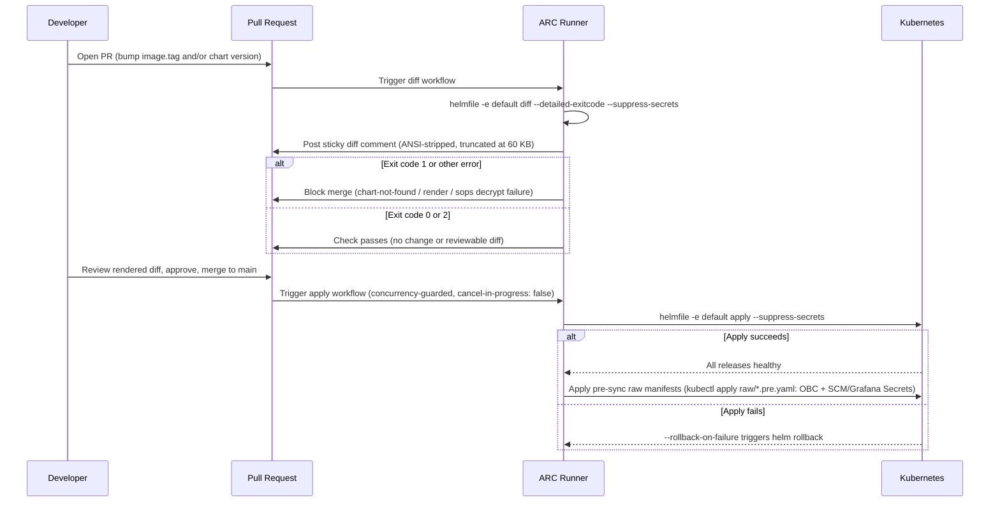

# Installing the Operator

The tatara operator deploys exclusively through the `tatara-helmfile` GitOps repository. There is no supported path using `helm install` directly or `kubectl apply` from local files. Every deploy is a PR, reviewed via a rendered diff, and applied by an in-cluster Actions Runner Controller (ARC) pipeline.

!!! danger "GitOps only - no manual deploys"
    `helm upgrade`, `kubectl set image`, `kubectl patch`, and `kubectl edit` are never used to ship the operator or any tatara component. Any live patch applied during incident response must be re-asserted through the helmfile immediately afterward so the live state matches the repo.

## Prerequisites

Before the first deploy, verify:

- An in-cluster ARC runner set labeled `arc-runner-tatara-helmfile` exists (the runner set, ServiceAccount `tatara-helmfile-deployer`, and its cluster-admin ClusterRoleBinding are provisioned separately in your cluster bootstrap helmfile, not in `tatara-helmfile` itself).
- A Harbor OCI registry (or compatible substitute) is accessible from the cluster and from the ARC runner for chart pulls.
- A SOPS PGP key is available; encrypted files in `values/tatara-operator/` are decrypted at deploy time.
- An OIDC provider (Keycloak or compatible) is running with the required client registrations (see [OIDC clients](#2-oidc-clients-and-scm-secret) below).

---

## 1. Repo layout

Fork the `tatara-helmfile` repository into your organization and treat it as a private, team-restricted repo. The runner ServiceAccount is cluster-admin scoped - any code merged here can modify any cluster resource.

```
tatara-helmfile/
  helmfile.yaml.gotmpl          # single 'default' env; 3 releases
  .hook.sh                      # presync hook: applies raw/*.pre.yaml,
                                #   sops-decrypts *.pre.secrets.yaml
  values/
    common.yaml                 # bucket-wide: imagePullSecrets: regcred
    tatara-operator/
      common.yaml               # image.tag pin (the only env-specific override)
      default.yaml              # ingress, webhook, OIDC, memory images, S3, scheduling
      default.secrets.yaml      # sops-encrypted: operator OIDC secret + SCM PAT
      raw/
        *.pre.yaml              # plain manifests applied pre-sync (e.g. OBC)
        *.pre.secrets.yaml      # sops-encrypted Secrets applied pre-sync
    project-tatara/
      common.yaml               # Project + Repository CR values (tatara-project chart)
    project-infrastructure/
      common.yaml               # second Project's CR values
  .github/workflows/
    diff.yaml                   # PR trigger: helmfile diff -> sticky comment
    apply.yaml                  # push to main trigger: helmfile apply
```

The three Helm releases are:

| Release | Chart | Namespace |
|---|---|---|
| `tatara-operator` | `oci://<registry>/charts/tatara-operator` | `tatara` |
| `project-tatara` | `oci://<registry>/charts/tatara-project` | `tatara` |
| `project-infrastructure` | `oci://<registry>/charts/tatara-project` | `tatara` |

!!! note "No chat release"
    The bucket previously carried a fourth release, the chat UI. That component is retired as part of the cutover to the task-centric platform; `Task.status.notes` carries what its rooms used to.

The `project-*` releases declare `needs: tatara/tatara-operator` in `helmfile.yaml.gotmpl`, which forces the operator - and therefore its CRDs - to apply before any Project or Repository CR is rendered.

---

## 2. OIDC clients and SCM secret

The operator requires several credential groups before it can start reconciling. These are provisioned as Kubernetes Secrets and referenced by name in the chart values.

### OIDC clients

Four Keycloak clients are needed for the full platform. See [Identity & OIDC](../architecture/identity-and-oidc.md#clients-and-audiences) for the authoritative client inventory. This section covers the two credential groups the **operator chart** renders directly:

| Client | Flow | Purpose |
|---|---|---|
| `tatara-operator` | Client credentials | Operator authenticates outbound API calls to the SCM and to the wrapper REST API |
| `tatara-cli` | Device authorization (public) | CLI OIDC token forwarded by wrapper pods to the operator's MCP server |

The chart renders the CLI OIDC credentials into a Secret named by `cliOidcSecretName` (keys `client-id`, `client-secret`) and the operator OIDC client secret into a separate Secret (key `OPERATOR_OIDC_CLIENT_SECRET`). Supply these values through `default.secrets.yaml` (SOPS-encrypted). The remaining two clients (`tatara-memory`, `tatara-claude-code-wrapper`) are used by their respective component charts.

### SCM secret

The SCM secret holds the bot identity token and the webhook HMAC secret. The chart renders it when `scmToken`, `scmWebhookSecret`, and `scmSecretName` are all set in the SOPS values file.

=== "GitHub"

    Create a fine-grained PAT for the bot account (`szymonrychu-bot` or your equivalent) with:

    - **Repository permissions:** `Contents: Read and write`, `Issues: Read and write`, `Pull requests: Read and write`, `Metadata: Read`
    - **Organization permissions:** `Members: Read` (for org membership checks)

    ```yaml
    # values/tatara-operator/default.secrets.yaml (sops-encrypt before commit)
    scmSecretName: "tatara-scm"
    scmToken: "<github-fine-grained-pat>"
    scmWebhookSecret: "<random-32-byte-hex>"
    ```

    Configure matching webhook settings in each enrolled repository:

    - Payload URL: `https://<your-domain>/operator/webhooks`
    - Content type: `application/json`
    - Secret: the same value as `scmWebhookSecret`
    - Events: `Issues`, `Issue comments`, `Pull requests`, `Pull request reviews`

=== "GitLab"

    Create a PAT for the bot account with scopes: `api`, `read_repository`, `write_repository`.

    ```yaml
    # values/tatara-operator/default.secrets.yaml (sops-encrypt before commit)
    scmSecretName: "tatara-scm"
    scmToken: "<gitlab-personal-access-token>"
    scmWebhookSecret: "<random-32-byte-hex>"
    ```

    Configure matching webhook settings in each enrolled project:

    - URL: `https://<your-domain>/operator/webhooks`
    - Secret token: the same value as `scmWebhookSecret`
    - Triggers: `Issues events`, `Comments`, `Merge request events`

The rendered Secret contains keys `token` and `webhookSecret`. The operator references it via the `SCM_SECRET_NAME` ConfigMap key.

### Anthropic and OpenAI secrets

Two additional Secrets must exist before the operator starts agent pods:

```yaml
# tatara-anthropic: oauth-token key
# Rendered by the chart when anthropicOauthToken + anthropicSecretName are set.
anthropicSecretName: "tatara-anthropic"
anthropicOauthToken: "<anthropic-oauth-token>"

# lightrag-openai: LLM_BINDING_API_KEY key
# Used by the per-Project lightrag (memory) instance.
openaiSecretName: "lightrag-openai"
openaiApiKey: "<openai-api-key>"
```

### Optional: callback HMAC secret

If you want the operator to verify HMAC-SHA256 signatures on internal turn-complete callbacks from wrapper pods (recommended for defense-in-depth alongside NetworkPolicy):

```yaml
callbackHmacSecretName: "tatara-callback-hmac"
callbackHmacSecret: "<random-32-byte-hex>"
```

The rendered Secret contains key `callback-hmac-secret`.

---

## 3. Operator release values

Edit `values/tatara-operator/default.yaml`. Every scalar maps 1:1 to a `SCREAMING_SNAKE` ConfigMap key consumed by the manager via `envFrom`. No inline Pod-spec env values are used.

### Ingress and URLs

```yaml
# Operator's own Ingress (public webhook + API endpoint).
ingress:
  enabled: true
  host: tatara.example.com
  path: /
  className: nginx

# externalWebhookBase is stamped into Project.status.webhookURL.
# Must match the public hostname and the operator's internal webhook route prefix.
externalWebhookBase: "https://tatara.example.com/operator/webhooks"

# callbackUrl is the in-cluster Service the wrapper pods POST turn results to.
# Use the internal Service DNS (tatara-operator-internal Service, port 8082).
callbackUrl: "http://tatara-operator-internal.tatara.svc:8082"
```

!!! warning "callbackUrl must be reachable by agent pods"
    Wrapper pods validate the callback URL scheme on startup and reject `https`-only configurations when the internal service uses plain HTTP. Set `callbackUrl` to the internal Service DNS, not the public ingress hostname.

### OIDC

```yaml
# Use a dedicated realm for tatara's service clients. Do not use Keycloak's
# built-in "master" realm for application clients.
oidcIssuer: "https://auth.example.com/realms/tatara"
oidcAudience: "tatara-operator"
operatorOidcClientId: "tatara-operator"

# Secret references (match the values in default.secrets.yaml)
scmSecretName: "tatara-scm"
anthropicSecretName: "tatara-anthropic"
cliOidcSecretName: "tatara-cli-oidc"
openaiSecretName: "lightrag-openai"
```

### Image pins

Tatara-built images are pinned by semver (`vX.Y.Z`); third-party images pin their own upstream tags or digests. The operator stamps these into the native objects it provisions per Project. Under semver push-CD (section 6) these pins are normally advanced by a pipeline-opened PR against `tatara-helmfile`, not hand-edited.

```yaml
# Operator manager image tag (in values/tatara-operator/common.yaml)
image:
  tag: "v0.4.11"          # semver; the pipeline propagates this on release

# Per-Project memory stack images (in values/tatara-operator/default.yaml)
memoryImage:    "harbor.example.com/containers/tatara-memory:v0.4.2"
lightragImage:  "harbor.example.com/proxy-ghcr/hkuds/lightrag@sha256:<digest>"
neo4jImage:     "neo4j:2026.04.0"
grafanaMcpImage: "grafana/mcp-grafana:0.17.0"
ingesterImage:  "harbor.example.com/containers/tatara-memory-repo-ingester:v0.2.10"

# Pull secret for all operator-spawned workloads (neo4j, lightrag, memory, cnpg).
imagePullSecret: "regcred"
```

### Agent scheduling and security

=== "Non-root agents (recommended)"

    The wrapper image declares `USER agent` (numeric uid 10001). The kubelet cannot verify a non-numeric USER is non-root; without an explicit `agentRunAsUser`, `runAsNonRoot: true` hard-fails with `CreateContainerConfigError`. Set both:

    ```yaml
    agentRunAsNonRoot: true
    agentRunAsUser: 10001    # must be numeric; the chart fail-renders if missing

    agentScheduling:
      nodeSelector:
        kubernetes.io/os: linux
        # Pin to specific nodes with the resources and network access agents need.
        nas: "true"
    ```

=== "Root agents (development only)"

    ```yaml
    agentRunAsNonRoot: false
    # agentRunAsUser: omit or leave empty

    agentScheduling:
      nodeSelector:
        kubernetes.io/os: linux
    ```

Agent pod resource bounds:

```yaml
agentCpuRequest: "250m"
agentCpuLimit: "2"
agentMemoryRequest: "512Mi"
agentMemoryLimit: "4Gi"
```

### Per-Project memory ingress

The operator creates an Ingress for each Project's memory stack at reconcile time. Supply the cluster-specific IngressClass and rewrite annotation:

```yaml
ingressClassName: "nginx"
ingressRewriteTarget: "/$2"
```

### S3 conversation persistence (optional)

When `s3Bucket` is non-empty, the operator and wrapper store each issue's Claude conversation transcript in an S3-compatible bucket, allowing a fresh pod to resume a prior conversation. Leave `s3Bucket` empty to disable.

```yaml
s3Endpoint: "http://rook-ceph-rgw-ceph-objectstore.rook-ceph.svc"
s3Bucket: "tatara-conversations"
s3Region: "us-east-1"       # Ceph RGW ignores region but the AWS SDK requires it
s3KeyPrefix: "conversations"
s3ForcePathStyle: true       # required for Ceph RGW and MinIO; false for AWS S3
s3SecretName: "tatara-conversations"  # Secret with AWS_ACCESS_KEY_ID + AWS_SECRET_ACCESS_KEY
s3ConversationRetentionHours: 72
```

!!! note "OBC auto-provisioning"
    In the reference deployment a `rook-ceph` ObjectBucketClaim is applied via the presync hook (`raw/conversation-bucket.tatara-operator.pre.yaml`). The OBC generates the credentials Secret automatically. Verify `s3Endpoint` matches `BUCKET_HOST:BUCKET_PORT` in the OBC-generated ConfigMap before applying.

---

## 4. Release ordering

Helmfile applies releases in the order they appear in `helmfile.yaml.gotmpl`, subject to `needs:` declarations:

```
tatara-operator      (installs CRDs via templates/crds.yaml)
project-tatara       (needs: tatara/tatara-operator)
project-infrastructure (needs: tatara/tatara-operator)
```

The `project-*` releases render Project and Repository custom resources via the `tatara-project` chart. Because they declare `needs: tatara/tatara-operator`, Helmfile blocks their apply until the operator release (and therefore all `tatara.dev` CRDs) is confirmed healthy. Never apply `project-*` releases to a cluster where the operator CRDs are absent.

!!! note "CRD management"
    CRDs are bundled in `templates/crds.yaml` and applied on every `helm upgrade` (`installCRDs: true` by default). If you are adopting an existing operator installation into Helm management for the first time, relabel the existing CRDs to transfer ownership:

    ```sh
    for crd in projects.tatara.dev repositories.tatara.dev tasks.tatara.dev \
                queuedevents.tatara.dev issues.tatara.dev mergerequests.tatara.dev; do
      kubectl label crd "$crd" app.kubernetes.io/managed-by=Helm
      kubectl annotate crd "$crd" \
        meta.helm.sh/release-name=tatara-operator \
        meta.helm.sh/release-namespace=tatara
    done
    ```

!!! warning "The CRDs carry `helm.sh/resource-policy: keep`"
    `charts/tatara-operator/templates/crds.yaml` annotates every CRD with `helm.sh/resource-policy: keep`. A `helm uninstall` or a `helmfile apply` that prunes the release will **not** remove them, and a `helm rollback` will **not** revert them. Removing a CRD is an explicit `kubectl delete crd <name>` and it cascades to every CR of that kind.

---

## 5. The deploy flow

Every change to the cluster - image bumps, config changes, enrollment CR updates - follows the same PR-based flow:



### Diff workflow

The `diff.yaml` workflow runs on every PR targeting `main`. It:

1. Installs tooling via `mise install` (helm, helmfile, kubectl, sops plugins).
2. Imports the GPG private key from the `GPG_PRIVATE_RSA_B64` Actions secret to decrypt SOPS files.
3. Logs in to Harbor OCI using the `HARBOR_ROBOT_KUBERNETES_USERNAME`/`PASSWORD` secrets.
4. Runs `helmfile -e default diff --detailed-exitcode --suppress-secrets`.
5. Posts (or updates) a sticky PR comment via `marocchino/sticky-pull-request-comment@v2` - even when the diff errors, so the reviewer sees the failure reason.
6. Blocks the merge if the exit code is anything other than `0` (no change) or `2` (diff present). Exit code `1` or any other value indicates a chart-not-found, render, or sops decrypt failure.

### Apply workflow

The `apply.yaml` workflow runs on every push to `main`. Key properties:

- **Concurrency group:** `tatara-helmfile-apply`, `cancel-in-progress: false`. Overlapping pushes queue; they never cancel a running apply.
- **Timeout:** 900 seconds per release (`helmDefaults.timeout`), generous enough for image pulls and ServiceMonitor/CRD settling.
- **Rollback:** `--rollback-on-failure` is set in `helmDefaults.syncArgs`. A failed apply triggers an automatic Helm rollback to the previous release revision.
- **Server-side apply:** Helm 4 uses server-side apply by default (`--server-side=auto`). `--force-conflicts` lets the GitOps deploy reclaim fields previously touched by emergency `kubectl` operations.
- **Pre-sync raw manifests:** After `helmfile apply`, the workflow re-applies the plain manifests in `values/tatara-operator/raw/` using `kubectl apply`. These are the conversation-bucket `ObjectBucketClaim` and the SCM/Grafana `Secret`s (sops-decrypted), **not** Project or Repository CRs. Applying them explicitly makes them idempotent on every run, even when Helm decides the operator release is unchanged and skips the presync hook. The Project and Repository CRs themselves are rendered by the `tatara-project` chart via the `project-tatara` and `project-infrastructure` releases (sections 1 and 4), not from `raw/`.

---

## 6. Release versioning (semver push-CD)

Deploys are semver, pipeline-driven, and largely hands-off. You almost never hand-edit a pin.

### How a release ships

Every merged PR declares its significance: a human sets a `semver:<level>` label (`major` /
`minor` / `patch`) on the PR, or the implementer sets `change_significance` on the accepted
`submit_outcome` call that closed the Task - the reviewer's own `submit_outcome` may only
escalate that level, never lower it. On merge to the component's `main`, the release pipeline:

1. **Cuts the tag.** Computes the next `vX.Y.Z` from the merged PR's `semver:*` label.
2. **Publishes artifacts.** Builds and pushes the image at `:vX.Y.Z` (the required-checks pipeline
   already pushed a `:<shortSHA>` traceability tag for the same commit; Harbor's containers project
   has tag immutability). It packages **both** charts (`tatara-operator` and `tatara-project`) at
   the bare `X.Y.Z`, with `appVersion` carrying `vX.Y.Z`, and pulls them back to prove neither is
   missing (guards against a partial-publish wedge).
3. **Propagates the pin.** Opens a bot PR against `tatara-helmfile` that rewrites all three pins
   atomically in one commit: the chart-version pins for `tatara-operator` plus both
   `project-tatara` / `project-infrastructure` releases take the bare `X.Y.Z`; the operator
   `image.tag` takes `vX.Y.Z`.
4. **Applies and closes.** The component PR itself was merged by the operator, from the reviewer's
   accepted verdict - no MCP tool exposes merge and no agent posts it directly. The `tatara-helmfile`
   pin PR is a separate, ordinary PR: nothing arms it to merge itself, so it waits for a human
   (or your own branch-protection rule) like any other change to that bucket. Once it lands, the
   apply workflow rolls the pins out (section 5), and on a successful apply the operator closes the
   originating issue.

```yaml
# What the pipeline writes into tatara-helmfile (do not hand-edit in normal flow):

# values/tatara-operator/common.yaml
image:
  tag: "v0.4.11"            # image at :vX.Y.Z

# helmfile.yaml.gotmpl
- name: tatara-operator
  version: 0.4.11           # chart at bare X.Y.Z
- name: project-tatara
  version: 0.4.11
- name: project-infrastructure
  version: 0.4.11
```

!!! danger "Do not hand-edit deploy pins, and never re-run a green release job"
    In the normal flow the pipeline owns the pins. Tag mode is not idempotent: re-running a green
    release job would try to re-cut an existing tag. Roll forward with a new PR instead.

### Break-glass: manual dual-pin bump

Only when the pipeline is unavailable (e.g. recovering from a stuck release), bump the pins by
hand. The invariant is that the chart version and image tag move together:

!!! warning "Bump both pins in the same PR"
    Bumping only the chart version leaves the old image running. Bumping only the image tag against
    a stale chart applies manifests rendered from an older chart that may lack fields or ConfigMap
    keys the new image expects. Change the `tatara-operator` chart version, both `project-*` chart
    versions, and `image.tag` in one PR, to versions actually published in Harbor.

Harbor's retention policy GCs old chart tags, so pinning **backward** to a GC'd `X.Y.Z` fails apply
with `FetchReference ... not found`. Roll forward to a published version rather than back. Find
published versions via `helm search repo` or the Harbor UI.

### Local validation

```sh
mise install                                       # installs helm, helmfile, kubectl, sops
helm registry login <your-registry>               # OCI chart pull
helmfile -e default diff --suppress-secrets        # validate against current kube-context
```
