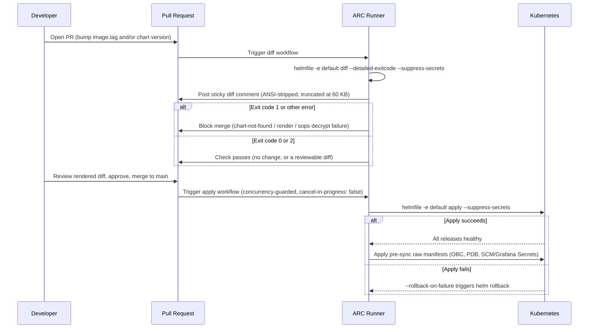

# Installing the Operator

By the end of this page the `tatara-operator` release is running in your cluster,
the six `tatara.dev` CRDs are installed, and every future change to the platform
goes through a pull request with a rendered diff attached to it.

The operator deploys through the `tatara-helmfile` GitOps repository and nowhere
else. There is no supported path using `helm install` directly or `kubectl apply`
from local files. Every deploy is a PR, reviewed as a rendered diff, and applied by
an in-cluster Actions Runner Controller (ARC) pipeline.

!!! danger "GitOps only - no manual deploys"
    `helm upgrade`, `kubectl set image`, `kubectl patch`, and `kubectl edit` are
    never used to ship the operator or any tatara component. Any live patch you
    apply during incident response has to be re-asserted through the helmfile
    immediately afterwards, so the live state matches the repo.

## Before you start

Check that all four of these exist:

- An in-cluster ARC runner set labelled `arc-runner-tatara-helmfile`. The runner
  set, the `tatara-helmfile-deployer` ServiceAccount, and its cluster-admin
  ClusterRoleBinding are provisioned separately in your cluster bootstrap
  helmfile, not in `tatara-helmfile` itself.
- A Harbor OCI registry, or a compatible substitute, reachable from the cluster and
  from the ARC runner for chart pulls.
- A SOPS PGP key. The encrypted files under `values/tatara-operator/` are decrypted
  at deploy time.
- An OIDC provider with the required client registrations. See
  [OIDC clients](#2-oidc-clients-and-scm-secret) below.

---

## 1. Repo layout

Fork `tatara-helmfile` into your organization and treat it as a private,
team-restricted repo. The runner ServiceAccount is cluster-admin scoped, so
anything merged here can modify any cluster resource.

```
tatara-helmfile/
  helmfile.yaml.gotmpl          # single 'default' env
  .hook.sh                      # prepare/presync/postsync hook: applies raw/*.pre.yaml,
                                #   sops-decrypts *.pre.secrets.yaml, runs hooks/*.pre.sh
  values/
    common.yaml                 # bucket-wide: imagePullSecrets: regcred
    memory-stack.yaml           # shared memory sizing for EVERY project release
    tatara-operator/
      common.yaml               # image.tag pin
      default.yaml              # ingress, webhook, OIDC, memory images, S3, scheduling
      default.secrets.yaml      # sops-encrypted: operator OIDC secret + SCM PAT
      hooks/
        *.pre.sh                # presync scripts (CRD helm-ownership adoption)
      raw/
        *.pre.yaml              # plain manifests applied pre-sync (OBC, PDB)
        *.pre.secrets.yaml      # sops-encrypted Secrets applied pre-sync
    project-tatara/
      common.yaml               # Project + Repository CR values (tatara-project chart)
    project-infrastructure/
      common.yaml               # second Project's CR values
    project-mtg/
      common.yaml               # third Project's CR values
  .github/workflows/
    diff.yaml                   # PR trigger: helmfile diff, posted as a sticky comment
    apply.yaml                  # push to main trigger: helmfile apply
    lint.yaml                   # pre-commit / lint checks
```

The reference bucket declares these releases:

| Release | Chart | Namespace |
|---|---|---|
| `tatara-operator` | `oci://<registry>/charts/tatara-operator` | `tatara` |
| `project-tatara` | `oci://<registry>/charts/tatara-project` | `tatara` |
| `project-infrastructure` | `oci://<registry>/charts/tatara-project` | `tatara` |
| `project-mtg` | `oci://<registry>/charts/tatara-project` | `tatara` |

One release per Project, all rendering the same `tatara-project` chart. Adding a
fourth Project means adding a release block and a `values/project-<name>/` directory,
nothing more.

!!! note "The retired chat release"
    The bucket also carries a chat release pinned at `installed: false`. That
    component was retired in the cutover to the task-centric platform, and
    `Task.status.notes` carries what it used to. The block stays in the file so
    helmfile keeps tracking the uninstall rather than forgetting the release exists.

Every `project-*` release declares `needs: tatara/tatara-operator`, which forces
the operator - and therefore its CRDs - to apply before any Project or Repository
CR is rendered.

Each `project-*` release also loads `values/memory-stack.yaml` before its own
values. That file is the one place per-Project Postgres and Neo4j sizing is
declared, so a sizing fix cannot land on one Project and silently miss the others.
A Project can still override a single field afterwards, with a stated reason.

---

## 2. OIDC clients and SCM secret

The operator needs several credential groups before it can reconcile anything.
They are Kubernetes Secrets, referenced by name in the chart values.

### OIDC clients

The full platform uses four Keycloak clients; see
[Identity & OIDC](../architecture/identity-and-oidc.md#clients-and-audiences) for
the authoritative inventory. Two of them are rendered by the **operator chart**:

| Client | Flow | Purpose |
|---|---|---|
| `tatara-operator` | Client credentials | The operator authenticates outbound calls to the SCM and to the wrapper REST API |
| `tatara-cli` | Device authorization (public) | The CLI OIDC token wrapper pods forward to the operator's MCP server |

The chart renders the CLI credentials into a Secret named by `cliOidcSecretName`
(keys `client-id`, `client-secret`), and the operator client secret into a separate
Secret (key `OPERATOR_OIDC_CLIENT_SECRET`). Supply both through
`default.secrets.yaml`. The remaining two clients belong to their own component
charts.

### SCM secret

This Secret holds the bot identity token and the webhook HMAC secret. The chart
renders it when `scmToken`, `scmWebhookSecret`, and `scmSecretName` are all set in
the SOPS values file.

=== "GitHub"

    Create a fine-grained PAT for the bot account with:

    - **Repository permissions:** `Contents: Read and write`, `Issues: Read and write`, `Pull requests: Read and write`, `Metadata: Read`
    - **Organization permissions:** `Members: Read`, for org membership checks

    ```yaml
    # values/tatara-operator/default.secrets.yaml (sops-encrypt before commit)
    scmSecretName: "tatara-scm"
    scmToken: "<github-fine-grained-pat>"
    scmWebhookSecret: "<random-32-byte-hex>"
    ```

    Then configure a matching webhook on each enrolled repository:

    - Payload URL: `https://<your-domain>/operator/webhooks/<project-name>`
    - Content type: `application/json`
    - Secret: the same value as `scmWebhookSecret`
    - Events: `Issues`, `Issue comments`, `Pull requests`, `Pull request reviews`

=== "GitLab"

    Create a PAT for the bot account with scopes `api`, `read_repository`,
    `write_repository`.

    ```yaml
    # values/tatara-operator/default.secrets.yaml (sops-encrypt before commit)
    scmSecretName: "tatara-scm"
    scmToken: "<gitlab-personal-access-token>"
    scmWebhookSecret: "<random-32-byte-hex>"
    ```

    Then configure a matching webhook on each enrolled project:

    - URL: `https://<your-domain>/operator/webhooks/<project-name>`
    - Secret token: the same value as `scmWebhookSecret`
    - Triggers: `Issues events`, `Comments`, `Merge request events`

The rendered Secret carries keys `token` and `webhookSecret`. The operator finds it
through the `SCM_SECRET_NAME` ConfigMap key. Read the exact per-project URL back
from `Project.status.webhookURL` after the Project applies rather than assembling
it by hand.

### Anthropic and OpenAI secrets

Two more Secrets have to exist before the operator starts agent pods:

```yaml
# tatara-anthropic: oauth-token key.
# Rendered by the chart when anthropicOauthToken + anthropicSecretName are set.
anthropicSecretName: "tatara-anthropic"
anthropicOauthToken: "<anthropic-oauth-token>"

# lightrag-openai: LLM_BINDING_API_KEY key.
# Read by each Project's lightrag Deployment. Needed only while memory is enabled.
openaiSecretName: "lightrag-openai"
openaiApiKey: "<openai-api-key>"
```

### Optional: callback HMAC secret

If you want the operator to verify HMAC-SHA256 signatures on internal
turn-complete callbacks from wrapper pods - worth doing alongside a NetworkPolicy,
not instead of one:

```yaml
callbackHmacSecretName: "tatara-callback-hmac"
callbackHmacSecret: "<random-32-byte-hex>"
```

The rendered Secret carries key `callback-hmac-secret`.

---

## 3. Operator release values

Edit `values/tatara-operator/default.yaml`. Every scalar maps 1:1 to a
`SCREAMING_SNAKE` ConfigMap key the manager consumes through `envFrom`. No inline
Pod-spec env values are used anywhere.

### Ingress and URLs

```yaml
# The operator's own Ingress: public webhook + API endpoint.
ingress:
  enabled: true
  host: tatara.example.com
  path: /
  className: nginx

# externalWebhookBase is stamped into Project.status.webhookURL.
# It has to match the public hostname and the operator's webhook route prefix.
externalWebhookBase: "https://tatara.example.com/operator/webhooks"

# callbackUrl is the in-cluster Service wrapper pods POST turn results to.
# Use the internal Service DNS (tatara-operator-internal, port 8082).
callbackUrl: "http://tatara-operator-internal.tatara.svc:8082"
```

!!! warning "callbackUrl has to be reachable by agent pods"
    Wrapper pods validate the callback URL scheme on startup and reject an
    `https`-only configuration when the internal Service serves plain HTTP. Set
    `callbackUrl` to the internal Service DNS, not the public ingress hostname.

### OIDC

```yaml
oidcIssuer: "https://auth.example.com/realms/tatara"
oidcAudience: "tatara-operator"
operatorOidcClientId: "tatara-operator"

# Secret references, matching the values in default.secrets.yaml
scmSecretName: "tatara-scm"
anthropicSecretName: "tatara-anthropic"
cliOidcSecretName: "tatara-cli-oidc"
openaiSecretName: "lightrag-openai"
```

### Image pins

tatara-built images are pinned by semver (`vX.Y.Z`); third-party images pin their
own upstream tags or digests. The operator stamps these into the native objects it
provisions per Project. Under semver push-CD (section 6) a pipeline-opened PR
advances them; you do not hand-edit them in the normal flow.

```yaml
# Operator manager image tag (values/tatara-operator/common.yaml)
image:
  tag: "v2.9.0"           # semver; the pipeline propagates this on release

# Per-Project memory stack images (values/tatara-operator/default.yaml)
memoryImage:     "harbor.example.com/containers/tatara-memory:v0.4.6"
lightragImage:   "harbor.example.com/proxy-ghcr/hkuds/lightrag@sha256:<digest>"
neo4jImage:      "neo4j:2026.04.0"
grafanaMcpImage: "grafana/mcp-grafana:0.17.0"
ingesterImage:   "harbor.example.com/containers/tatara-memory-repo-ingester:v0.2.11"

# Pull secret for every operator-spawned workload (neo4j, lightrag, memory, cnpg).
imagePullSecret: "regcred"
```

### Agent scheduling and security

=== "Non-root agents (recommended)"

    The wrapper image declares `USER agent`, a non-numeric name for uid 10001. The
    kubelet cannot verify a non-numeric USER is non-root, so without an explicit
    `agentRunAsUser` a `runAsNonRoot: true` hard-fails with
    `CreateContainerConfigError`. Set both:

    ```yaml
    agentRunAsNonRoot: true
    agentRunAsUser: 10001    # numeric; the chart fail-renders if this is missing

    agentScheduling:
      nodeSelector:
        kubernetes.io/os: linux
        # Pin to nodes with the resources and network access agents need.
        nas: "true"
    ```

=== "Root agents (development only)"

    ```yaml
    agentRunAsNonRoot: false
    # agentRunAsUser: omit or leave empty

    agentScheduling:
      nodeSelector:
        kubernetes.io/os: linux
    ```

The persistent agent workspace needs two more values, and neither is a preference:

```yaml
# Operator-wide switch for the per-Task workspace PVC and the per-Project build
# cache. Chart default false, so the CRD and controller can land before any PVC
# is created. ANDed with each Project's own spec.workspace.enabled.
agentWorkspacePvcEnabled: true

# The wrapper IMAGE's gid, not a cluster fact. A freshly provisioned CephFS
# subvolume is root:root mode 0755 and the agent runs as uid 10001, so without
# this the volume mounts unwritable and the first clone dies on permission denied.
agentFsGroup: "10001"

# The CephFS CSI driver reports fsGroupPolicy: File. With Kubernetes' default
# ("Always") the kubelet recursively chowns the whole volume on every mount,
# which on a Go build cache costs more than the cache saves.
agentFsGroupChangePolicy: "OnRootMismatch"
```

Agent pod resource bounds:

```yaml
agentCpuRequest: "250m"
agentCpuLimit: "2"
agentMemoryRequest: "512Mi"
agentMemoryLimit: "4Gi"
```

### Per-Project memory ingress

The operator creates an Ingress for each Project's memory stack at reconcile time.
Supply the cluster-specific IngressClass and rewrite annotation:

```yaml
ingressClassName: "nginx"
ingressRewriteTarget: "/$2"
```

### S3 conversation persistence (optional)

With a non-empty `s3Bucket`, the operator and wrapper store each Task's Claude
conversation transcript in an S3-compatible bucket, so a fresh pod resumes the
prior conversation. Leave `s3Bucket` empty to turn it off.

```yaml
s3Endpoint: "http://rook-ceph-rgw-ceph-objectstore.rook-ceph.svc"
s3Bucket: "tatara-conversations"
s3Region: "us-east-1"       # Ceph RGW ignores region; the AWS SDK requires one
s3KeyPrefix: "conversations"
s3ForcePathStyle: true       # required for Ceph RGW and MinIO; false for AWS S3
s3SecretName: "tatara-conversations"  # Secret with AWS_ACCESS_KEY_ID + AWS_SECRET_ACCESS_KEY
s3ConversationRetentionHours: 72
```

!!! note "OBC auto-provisioning"
    In the reference deployment a `rook-ceph` ObjectBucketClaim is applied through
    the presync hook (`raw/conversation-bucket.tatara-operator.pre.yaml`) and
    generates the credentials Secret itself. Check that `s3Endpoint` matches
    `BUCKET_HOST:BUCKET_PORT` in the OBC-generated ConfigMap before you apply.

### Memory backups (optional)

`memoryBackup` turns on continuous WAL archiving plus a daily base backup to an
object store, for every per-Project CNPG cluster. It is off by default and every
field is empty, which keeps the chart cluster-agnostic.

```yaml
memoryBackup:
  enabled: true
  endpointUrl: "http://rook-ceph-rgw-ceph-objectstore.rook-ceph.svc"
  bucket: "tatara-pg-backup"
  credentialsSecretName: "tatara-pg-backup"
  retentionPolicy: "7d"
  scheduleCron: "0 0 2 * * *"   # cnpg schedule: SIX fields, not five
```

!!! warning "A partial backup config fails closed, and that is on purpose"
    `enabled: true` alone does nothing: `bucket` and `credentialsSecretName` are
    both required. A partial config produces no archiving at all, with a warning in
    the operator log, because a *broken* archive command makes PostgreSQL retain
    every WAL segment until the volume fills. Note also that `scheduleCron` is a
    CNPG six-field schedule (seconds first), not the five-field Kubernetes form.

---

## 4. Release ordering

Helmfile applies releases in file order, subject to `needs:`:

```
tatara-operator          (installs CRDs via templates/crds.yaml)
project-tatara           (needs: tatara/tatara-operator)
project-infrastructure   (needs: tatara/tatara-operator)
project-mtg              (needs: tatara/tatara-operator)
```

The `project-*` releases render Project and Repository custom resources through the
`tatara-project` chart. Because they declare `needs:`, helmfile blocks their apply
until the operator release - and therefore every `tatara.dev` CRD - is confirmed
healthy. Never apply a `project-*` release to a cluster where the CRDs are absent.

!!! note "CRD management and helm ownership"
    CRDs are bundled in `templates/crds.yaml` and applied on every `helm upgrade`
    (`installCRDs: true` by default). A CRD that already exists on the cluster
    without helm ownership metadata fails the upgrade with `invalid ownership
    metadata` and blocks the whole release.

    The reference bucket handles this with an idempotent presync hook,
    `values/tatara-operator/hooks/crd-adopt.tatara-operator.pre.sh`, which stamps
    ownership onto any of the six CRDs that exists and is not already owned. On a
    fresh cluster it is a no-op. To do it by hand:

    ```sh
    for crd in projects.tatara.dev repositories.tatara.dev tasks.tatara.dev \
               issues.tatara.dev mergerequests.tatara.dev queuedevents.tatara.dev; do
      kubectl label crd "$crd" app.kubernetes.io/managed-by=Helm --overwrite
      kubectl annotate crd "$crd" \
        meta.helm.sh/release-name=tatara-operator \
        meta.helm.sh/release-namespace=tatara --overwrite
    done
    ```

!!! warning "The CRDs carry `helm.sh/resource-policy: keep`"
    The chart annotates every CRD it renders with `helm.sh/resource-policy: keep`.
    A `helm uninstall`, or a `helmfile apply` that prunes the release, will **not**
    remove them, and a `helm rollback` will **not** revert them. Removing a CRD is
    an explicit `kubectl delete crd <name>`, and it cascades to every CR of that
    kind.

---

## 5. The deploy flow

Every change to the cluster - image bumps, config changes, enrollment CR updates -
takes the same path:


```mermaid
sequenceDiagram
    participant Dev as Developer
    participant PR as Pull Request
    participant ARC as ARC Runner
    participant K8s as Kubernetes

    Dev->>PR: Open PR (bump image.tag and/or chart version)
    PR->>ARC: Trigger diff workflow
    ARC->>ARC: helmfile -e default diff --detailed-exitcode --suppress-secrets
    ARC->>PR: Post sticky diff comment (ANSI-stripped, truncated at 60 KB)
    alt Exit code 1 or other error
        ARC->>PR: Block merge (chart-not-found / render / sops decrypt failure)
    else Exit code 0 or 2
        ARC->>PR: Check passes (no change, or a reviewable diff)
    end
    Dev->>PR: Review rendered diff, approve, merge to main
    PR->>ARC: Trigger apply workflow (concurrency-guarded, cancel-in-progress: false)
    ARC->>K8s: helmfile -e default apply --suppress-secrets
    alt Apply succeeds
        K8s-->>ARC: All releases healthy
        ARC->>K8s: Apply pre-sync raw manifests (OBC, PDB, SCM/Grafana Secrets)
    else Apply fails
        K8s-->>ARC: --rollback-on-failure triggers helm rollback
    end
```

### Diff workflow

`diff.yaml` runs on every PR targeting `main`. It:

1. Installs tooling with `mise install`: helm, helmfile, kubectl, sops, and the
   helm-secrets and helm-diff plugins.
2. Imports the GPG private key from `GPG_PRIVATE_RSA_B64` to decrypt SOPS files.
3. Logs in to Harbor OCI using `HARBOR_ROBOT_KUBERNETES_USERNAME` and
   `HARBOR_ROBOT_KUBERNETES_PASSWORD`.
4. Runs `helmfile -e default diff --detailed-exitcode --suppress-secrets`.
5. Posts or updates a sticky PR comment, **even when the diff errors**, so the
   reviewer sees the failure reason rather than a silent red check.
6. Blocks the merge on any exit code other than `0` (no change) or `2` (diff
   present). Exit code `1` means a chart-not-found, render, or sops decrypt failure.

### Apply workflow

`apply.yaml` runs on every push to `main`:

- **Concurrency group** `tatara-helmfile-apply`, `cancel-in-progress: false`.
  Overlapping pushes queue; they never cancel a running apply.
- **Timeout** 900 seconds per release (`helmDefaults.timeout`), which covers image
  pulls and ServiceMonitor/CRD settling.
- **Rollback** through `--rollback-on-failure` in `helmDefaults.syncArgs`. A failed
  apply rolls the release back to its previous revision.
- **Server-side apply.** Helm 4 applies server-side by default;
  `--force-conflicts` lets the GitOps deploy reclaim fields an emergency `kubectl`
  operation previously took ownership of.
- **Pre-sync raw manifests.** After the apply, the workflow re-applies the plain
  manifests in `values/tatara-operator/raw/` with `kubectl apply`, sops-decrypting
  the `*.secrets.yaml` ones first. These are the conversation-bucket
  ObjectBucketClaim, the operator PodDisruptionBudget, and the SCM and Grafana
  Secrets - **not** Project or Repository CRs. Applying them explicitly keeps them
  idempotent on every run, even when Helm decides the operator release is unchanged
  and skips the presync hook. Project and Repository CRs come from the
  `tatara-project` chart through the `project-*` releases (sections 1 and 4).

---

## 6. Release versioning (semver push-CD)

Deploys are semver and pipeline-driven. You almost never hand-edit a pin.

### How a release ships

Every merged PR declares its significance: a human sets a `semver:<level>` label
(`major`, `minor`, or `patch`) on the PR, or the implementer declares it on the
accepted outcome that closed the Task. A reviewer may escalate that level and never
lower it. On merge to the component's `main`, the release pipeline:

1. **Cuts the tag.** Computes the next `vX.Y.Z` from the merged PR's `semver:*`
   label.
2. **Publishes artifacts.** Builds and pushes the image at `:vX.Y.Z`. The
   required-checks pipeline already pushed a `:<shortSHA>` traceability tag for the
   same commit, and Harbor's containers project has tag immutability, so re-pushing
   it here would fail. It then packages **both** charts (`tatara-operator` and
   `tatara-project`) at the bare `X.Y.Z` with `appVersion` carrying `vX.Y.Z`, and
   pulls each one back to prove neither is missing. That check exists because a
   partial publish wedges every later apply.
3. **Propagates the pins.** Opens a bot PR against `tatara-helmfile` rewriting
   every pin atomically in one commit: the chart-version pins for `tatara-operator`
   and for each `project-*` release take the bare `X.Y.Z`, and the operator
   `image.tag` takes `vX.Y.Z`.
4. **Applies and closes.** The component PR itself was merged by the operator, from
   the reviewer's accepted verdict - no agent tool exposes merge. The
   `tatara-helmfile` pin PR is an ordinary PR: nothing arms it to merge itself, so
   it waits for a human or your own branch-protection rule, like any other change
   to that bucket. Once it lands, the apply workflow rolls the pins out (section 5),
   and on a successful apply the operator closes the originating issue.

```yaml
# What the pipeline writes into tatara-helmfile. Do not hand-edit in normal flow.

# values/tatara-operator/common.yaml
image:
  tag: "v2.9.0"             # image at :vX.Y.Z

# helmfile.yaml.gotmpl
- name: tatara-operator
  version: 2.9.0            # chart at bare X.Y.Z
- name: project-tatara
  version: 2.9.0
- name: project-infrastructure
  version: 2.9.0
- name: project-mtg
  version: 2.9.0
```

!!! danger "Do not hand-edit deploy pins, and never re-run a green release job"
    In the normal flow the pipeline owns the pins. Tag mode is not idempotent:
    re-running a green release job tries to re-cut a tag that already exists. Roll
    forward with a new PR instead.

### Break-glass: manual pin bump

Bump the pins by hand only when the pipeline is unavailable, for instance while
recovering from a stuck release. The invariant is that the chart versions and the
image tag move together.

!!! warning "Bump every pin in the same PR"
    Bumping only the chart versions leaves the old image running. Bumping only the
    image tag against stale charts applies manifests rendered from an older chart,
    which may lack fields or ConfigMap keys the new image expects. Change the
    `tatara-operator` chart version, every `project-*` chart version, and
    `image.tag` in one PR, to versions actually published in your registry.

Harbor's retention policy collects old chart tags, so pinning **backward** to a
collected `X.Y.Z` fails the apply with `FetchReference ... not found`. Roll forward
to a published version rather than back. Find published versions through
`helm search repo` or the Harbor UI.

### Local validation

```sh
mise install                                 # helm, helmfile, kubectl, sops, plugins
helm registry login <your-registry>          # OCI chart pull
helmfile -e default diff --suppress-secrets  # validate against your current kube-context
```

---

## Next steps

The operator is running but has nothing to work on. Go to
[Your First Project](first-project.md) to apply your first `Project` CR.
