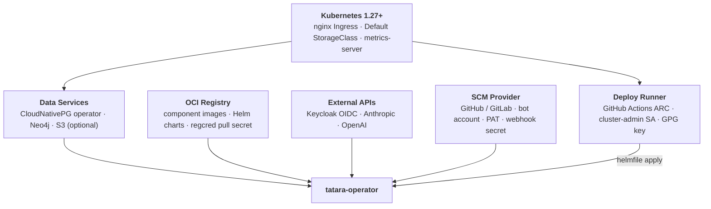

# Prerequisites

Everything that must exist in your infrastructure before you install the tatara operator.
Work through each section from top to bottom; the deploy runner and operator installation
steps assume all items here are satisfied.

---

## Summary

| Prerequisite | Purpose | Minimum |
|---|---|---|
| Kubernetes | Container runtime and control plane | 1.27+ |
| nginx Ingress controller | Operator webhook endpoint + per-Project memory Ingress | Any maintained release |
| Default StorageClass (RWO) | PVCs for CNPG and Neo4j | 20 Gi free per enrolled Project |
| metrics-server | Resource quota reporting and HPA | v0.6+ |
| CloudNativePG (CNPG) operator | Per-Project Postgres clusters with pgvector | v1.22+ |
| Neo4j | LightRAG graph store, per Project | Community 5.x; 10 Gi storage per Project |
| S3-compatible object store | Conversation transcript persistence | Optional; any S3-compatible API |
| OCI registry | Component images and Helm charts | Harbor 2.x recommended |
| `regcred` pull secret | Cluster-wide image pull credential | Secret in the `tatara` namespace |
| Keycloak realm | OIDC authentication for all tatara APIs | Keycloak 22+ |
| GitHub Actions ARC scale set | GitOps deploy runner (tatara-helmfile) | Actions Runner Controller v0.9+ |
| `tatara-helmfile-deployer` ServiceAccount | Helm release management, cluster-admin | SA + ClusterRoleBinding |
| GPG key pair | SOPS decryption of helmfile secrets at deploy time | 4096-bit RSA or ECDSA |
| Dedicated bot SCM account | Issue/PR authorship and webhook delivery | Not a personal account |
| Bot PAT | SCM API access and webhook registration | `repo` + `admin:repo_hook` (GitHub) / `api` (GitLab) |
| Webhook secret | HMAC validation of incoming SCM events | 32+ random bytes |
| Anthropic API key | Claude Code agent sessions | Paid tier, adequate quota for concurrency |
| OpenAI API key | LightRAG vector embeddings (semantic ingest) | Required unless `semanticIngest: false` for all repos |

---

## Prerequisite stack

The diagram below shows how the prerequisites compose. The operator sits at the top;
everything below is a dependency that must be healthy before the first `helmfile apply`.



---

## 1. Cluster

### Kubernetes

tatara requires Kubernetes **1.27 or later**. The operator uses `batch/v1` CronJobs, leader
election via `coordination.k8s.io/v1` leases, and server-side apply for CRD management.

The operator itself is lightweight: `100m` CPU request, `128 Mi` memory request, `256 Mi` memory
limit. Agent pods are spawned on demand; size your node pool to accommodate the expected
concurrency (`Project.spec.maxConcurrentTasks`, default 3) at `250m` CPU / `512 Mi` memory each,
plus LightRAG and Neo4j per enrolled Project.

### nginx Ingress controller

The operator registers one webhook endpoint (for incoming SCM events) and manages one Ingress per
enrolled Project for its memory stack. Both use nginx-specific rewrite annotations; the chart
exposes `ingressClassName` and `ingressRewriteTarget` for customization, but nginx is the tested
and supported controller.

The webhook Ingress must be publicly reachable from your SCM provider. Set
`externalWebhookBase` in your helmfile values to the fully-qualified base URL **including
the `/operator/webhooks` path prefix**, for example
`https://tatara.example.com/operator/webhooks`. The operator appends `/<projectName>`
for per-project webhook registration.

### Default StorageClass (ReadWriteOnce)

Every enrolled Project provisions two PersistentVolumeClaims via the default StorageClass:

- CNPG Postgres: **10 Gi** per replica (default 1 replica; see CNPG section below).
- Neo4j graph store: **10 Gi**.

Plan for at least **20 Gi** free capacity per Project you intend to enroll.
`ReadWriteOnce` access mode is sufficient; `ReadWriteMany` is not required unless you
share a cluster-level BuildKit cache volume across CI runners.

Both values are configurable per Project via `spec.memory.pgStorage` and
`spec.memory.neo4jStorage`.

### metrics-server

The operator does not use HPA directly, but metrics-server is required for `kubectl top`
debugging and for the cluster's own resource admission. Without it, pods running with
`BestEffort` QoS (no requests set) are invisible to the scheduler's resource tracking,
which complicates capacity planning. Install it before running any workloads.

```bash
kubectl apply -f https://github.com/kubernetes-sigs/metrics-server/releases/latest/download/components.yaml
```

---

## 2. Data services

### CloudNativePG (CNPG) operator

The tatara operator spawns a CNPG `Cluster` resource for each enrolled Project. The CNPG
operator must be installed cluster-wide before any Project is created.

Install with Helm:

```bash
helm repo add cnpg https://cloudnative-pg.github.io/charts
helm upgrade --install cnpg cnpg/cloudnative-pg \
  --namespace cnpg-system --create-namespace
```

Each Project gets one Postgres cluster:

| Field | Default | Notes |
|---|---|---|
| `spec.memory.pgInstances` | `1` | Replicas. Set `3` for production HA. |
| `spec.memory.pgStorage` | `10Gi` | Per-replica PVC size. |
| Extension | `pgvector` | Auto-installed via `postInitApplicationSQL`. tatara-memory and LightRAG share one database (`tatara_memory`). |

!!! warning "Single-replica Postgres is fragile on CephFS"
    With `pgInstances: 1`, an unclean pod restart can leave a stale write-cap lock on
    CephFS volumes, wedging the instance in end-of-recovery. Set `pgInstances: 3` for any
    workload that matters. The operator propagates this value to the CNPG `Cluster` spec.

### Neo4j

The operator deploys Neo4j Community Edition as a subchart of tatara-memory (via the
[Neo4j Helm chart](https://neo4j.com/docs/operations-manual/current/kubernetes/)) for each
Project. It serves as the LightRAG graph store.

| Parameter | Value |
|---|---|
| Edition | Community (no enterprise license required) |
| Default storage | `10Gi` (`spec.memory.neo4jStorage`) |
| Bolt endpoint | `bolt://tatara-neo4j-lb-neo4j:7687` (cluster-internal) |
| Service type | `ClusterIP` |

Neo4j is memory-hungry. Allow at least **2 Gi** of node memory headroom per Project
beyond Postgres and LightRAG footprints. Neo4j page-cache poisoning after Ceph OSD
restarts is a known failure mode; a pod restart clears it.

### S3-compatible object store (optional, recommended)

Conversation transcripts are stored in S3 so agent sessions resume across pod restarts.
Without it, every new pod begins a fresh conversation.

Any S3-compatible backend works: AWS S3, Ceph RGW (Rook-Ceph OBC), or MinIO.

Required configuration in your helmfile secrets overlay:

```yaml
s3Endpoint: "http://rook-ceph-rgw-ceph-objectstore.rook-ceph.svc:8080"  # omit for AWS
s3Bucket: "tatara-conversations"
s3Region: "us-east-1"
s3ForcePathStyle: true   # required for Ceph RGW / MinIO
s3SecretName: "tatara-s3-credentials"  # Secret with AWS_ACCESS_KEY_ID + AWS_SECRET_ACCESS_KEY
```

!!! tip "Ceph RGW endpoint"
    When using Rook-Ceph, set `s3Endpoint` to the RGW service DNS name from the OBC's
    `BUCKET_HOST` env var, not a hand-rolled hostname. Endpoint mismatches produce
    NXDOMAIN errors that are silent until the first conversation resume attempt.

Conversation objects are retained for `s3ConversationRetentionHours` (default 72 h) after
the associated task batch goes terminal, then reaped.

---

## 3. Registry

Tatara component images and Helm charts are distributed via an OCI registry. The reference
deployment uses **Harbor** at `harbor.szymonrichert.pl`, but any OCI-compatible registry
works if you mirror or rebuild the images.

| Artifact type | Path pattern |
|---|---|
| Container images | `<registry>/containers/tatara-<component>:<tag>` |
| Helm charts | `oci://<registry>/charts/tatara-<component>:<chart-version>` |

Chart versions follow `0.0.0-g<shortSHA>` (e.g. `0.0.0-g3526ebf`). The helmfile pins
both the chart version and the image tag; they must be kept in sync.

### imagePullSecret

Create a `regcred` Secret in the `tatara` namespace with registry pull credentials:

```bash
kubectl create secret docker-registry regcred \
  --namespace tatara \
  --docker-server=<registry> \
  --docker-username=<username> \
  --docker-password=<password>
```

The `tatara-helmfile` bucket applies this secret cluster-wide via `values/common.yaml`.
The operator also injects it into every spawned workload (Neo4j StatefulSet, LightRAG
Deployment, tatara-memory Deployment, CNPG Cluster) via the `imagePullSecret` values key.

!!! warning "Harbor chart retention"
    Harbor's retention policy GCs old chart tags. Keep the pinned chart versions in your
    helmfile recent (track main HEAD). A stale pin fails `helmfile apply` with a
    chart-not-found error that blocks all platform deploys.

---

## 4. Identity (Keycloak)

All tatara APIs are OIDC-gated. You need a Keycloak realm with five clients. The realm
name is arbitrary; you supply the issuer URL as `oidcIssuer` in the operator values.
The canonical client inventory (IDs, types, audiences) is documented in
[Identity & OIDC](../architecture/identity-and-oidc.md#clients).

### OIDC clients

=== "tatara-operator"

    **Type:** Confidential  
    **Purpose:** The operator authenticates as this client (client-credentials grant) to
    call OIDC introspection endpoints and validates that incoming tokens carry the
    `tatara-operator` audience claim.

    Required settings:
    - Service accounts enabled
    - Client authentication enabled
    - Audience mapper: add `tatara-operator` to the `aud` claim

    The client secret is supplied via `operatorOidcClientSecret` in your helmfile secrets
    overlay and stored in the operator's own Secret.

=== "tatara-memory"

    **Type:** Confidential  
    **Purpose:** Acts as the `aud` target for all tokens that reach the memory service.
    Both tatara-cli-issued tokens (via scope/audience mapper) and service-account tokens
    from agent pods must carry `aud: tatara-memory`.

    Required settings:
    - Service accounts enabled
    - Audience mapper: add `tatara-memory` to the `aud` claim on the `tatara` scope

=== "tatara-cli"

    **Type:** Public  
    **Purpose:** Human device-flow login and agent pod authentication. `tatara-cli login`
    initiates a device-authorization-grant against this client; the resulting token is
    used for all CLI and agent REST calls.

    Required settings:
    - Device authorization grant enabled
    - Default scopes include `tatara` (which carries the audience mapper for `tatara-memory`)

=== "tatara-chat"

    **Type:** Confidential  
    **Purpose:** The tatara-chat service validates tokens against `aud: tatara-chat`.
    Agent pods receive credentials for this client to participate in chat rooms.

    Required settings:
    - Service accounts enabled
    - Audience mapper: add `tatara-chat` to the `aud` claim

=== "tatara-claude-code-wrapper"

    **Type:** Confidential  
    **Purpose:** The wrapper REST API validates inbound requests from the operator
    against `aud: tatara-claude-code-wrapper`. The operator holds these credentials
    and injects them into each agent pod as `OIDC_CLIENT_ID` / `OIDC_CLIENT_SECRET`.

    Required settings:
    - Service accounts enabled
    - Audience mapper: add `tatara-claude-code-wrapper` to the `aud` claim

### OIDC configuration in the operator

Set the following in your helmfile values:

```yaml
oidcIssuer: "https://keycloak.example.com/realms/your-realm"
oidcAudience: "tatara-operator"
operatorOidcClientId: "tatara-operator"
```

And in the SOPS-encrypted secrets overlay:

```yaml
operatorOidcClientSecret: "<client-secret-for-tatara-operator>"
cliOidcClientId: "tatara-cli"
cliOidcClientSecret: ""   # empty for public clients
```

---

## 5. Deploy runner (GitHub Actions ARC)

tatara is deployed exclusively through GitOps: the `tatara-helmfile` repository applies
releases on merge to `main` via a GitHub Actions workflow running on an in-cluster ARC
(Actions Runner Controller) runner. You need this runner infrastructure before you can
run `helmfile apply`.

### ARC scale set

Install the ARC controller and create a scale set named `arc-runner-tatara-helmfile` in
your cluster. The runner pod runs `helmfile apply` using its in-cluster pod identity; no
`KUBECONFIG` is mounted.

```bash
# Install ARC controller (once per cluster)
helm upgrade --install arc \
  oci://ghcr.io/actions/actions-runner-controller-charts/gha-runner-scale-set-controller \
  --namespace arc-systems --create-namespace

# Create the tatara-helmfile scale set
helm upgrade --install arc-runner-tatara-helmfile \
  oci://ghcr.io/actions/actions-runner-controller-charts/gha-runner-scale-set \
  --namespace tatara \
  --set githubConfigUrl="https://github.com/your-org/tatara-helmfile" \
  --set githubConfigSecret.github_token="<PAT or app install token>"
```

!!! note "ARC lives in the infra helmfile"
    The tatara reference deployment provisions the ARC scale set, ServiceAccount, and
    ClusterRoleBinding from a separate infra helmfile bucket (`helmfiles/coding`), not
    from `tatara-helmfile` itself. This avoids a bootstrap cycle where the runner that
    deploys tatara also deploys itself.

### ServiceAccount and RBAC

Create a ServiceAccount with a cluster-admin ClusterRoleBinding. This SA is bound to the
runner pod and is the single highest-privilege element in the platform. Keep the
`tatara-helmfile` repository private and restrict write access to bots and maintainers.

```yaml
apiVersion: v1
kind: ServiceAccount
metadata:
  name: tatara-helmfile-deployer
  namespace: tatara
---
apiVersion: rbac.authorization.k8s.io/v1
kind: ClusterRoleBinding
metadata:
  name: tatara-helmfile-deployer
roleRef:
  apiGroup: rbac.authorization.k8s.io
  kind: ClusterRole
  name: cluster-admin
subjects:
  - kind: ServiceAccount
    name: tatara-helmfile-deployer
    namespace: tatara
```

### GitHub Actions secrets

The `tatara-helmfile` GitHub Actions workflows require three repository secrets:

| Secret | Value |
|---|---|
| `HARBOR_USERNAME` | Registry pull/push credentials (read-only pull is sufficient for deploy) |
| `HARBOR_PASSWORD` | Registry password |
| `GPG_PRIVATE_RSA_B64` | Base64-encoded PGP private key for SOPS decryption |

The GPG key fingerprint must match the `.sops.yaml` in your `tatara-helmfile` repository.
Generate a key pair, export the private key, base64-encode it, and store it in the secret:

```bash
gpg --gen-key
gpg --export-secret-keys --armor <fingerprint> | base64 | pbcopy
```

Add the public key fingerprint to `.sops.yaml`:

```yaml
creation_rules:
  - pgp: "<YOUR_KEY_FINGERPRINT>"
```

---

## 6. SCM

### Bot account

Create a **dedicated SCM account** separate from any human identity. The bot account
is the author of all agent-generated issues, comments, and pull requests. tatara uses the
bot identity as an approval gate: the operator reacts only to issues and comments authored
by the bot, a maintainer, or an account on the `reporterLogins` allowlist
(`Project.spec.scm.reporterLogins`).

Using a personal account as the bot breaks this security boundary and exposes your
infrastructure to prompt-injection attacks via third-party issue content.

### Personal Access Token (PAT)

Generate a PAT for the bot account with the following scopes:

=== "GitHub"

    | Scope | Reason |
    |---|---|
    | `repo` | Read/write issues, PRs, branches, and commit statuses |
    | `admin:repo_hook` | Register and manage webhooks on enrolled repositories |

=== "GitLab"

    | Scope | Reason |
    |---|---|
    | `api` | Full API access (includes issues, MRs, hooks, and pipelines) |

Store the PAT in a SOPS-encrypted Secret and reference it via `scmSecretName` in your
operator values. The Secret must contain key `token` (the PAT) and
key `webhookSecret` (see below).

### Webhook secret

Generate a random webhook secret (32+ bytes). The operator registers this secret with
your SCM provider when enrolling each repository; incoming webhook payloads are
HMAC-SHA256-validated against it.

```bash
openssl rand -hex 32
```

Store the value in the same Secret as the PAT under key `webhookSecret`.

### Anthropic API key

Agent pods authenticate to Claude via `ANTHROPIC_API_KEY`. Provision an API key at
[console.anthropic.com](https://console.anthropic.com). The default model is
`claude-sonnet-4-6` (configurable per Project via `spec.agent.model`).

Plan capacity for `Project.spec.maxConcurrentTasks` simultaneous Claude Code sessions
per enrolled Project. Each active Task holds one session for the duration of the task,
which can span multiple turns over hours.

Store the key in a Secret and reference it via `anthropicSecretName`.

### OpenAI API key

LightRAG uses OpenAI embeddings for the semantic vector store. This is required unless
you set `semanticIngest: false` on every `Repository` CR (which disables LLM-assisted
knowledge extraction and falls back to AST-only ingest).

Store the key in a Secret and reference it via `openaiSecretName`. The same Secret is
also referenced by the per-Project LightRAG Deployment via `lightrag.secrets.openai`.

!!! tip "Disabling semantic ingest"
    If you prefer to avoid OpenAI dependency, set `spec.semanticIngest: false` on each
    `Repository` CR. Ingest becomes AST-only (faster, no LLM cost) but the memory graph
    loses relationship-level semantic edges, reducing query quality.

---

## Next steps

Once all prerequisites are satisfied, proceed to [Installing the Operator](installation.md)
to deploy the `tatara-operator` Helm release and configure your first Project.
