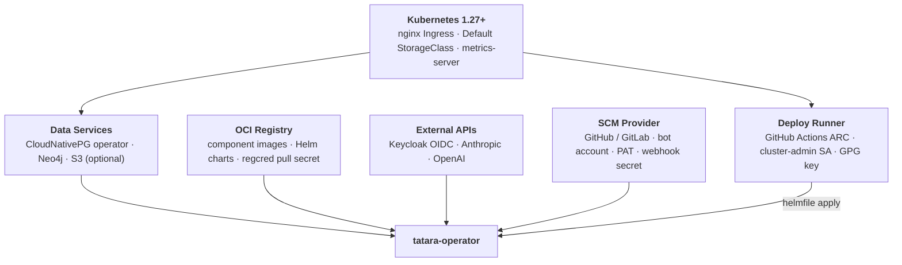

# Prerequisites

Everything that must exist in your infrastructure before you install the tatara operator.
Work through each section from top to bottom; the deploy runner and operator installation
steps assume all items here are satisfied.

---

## Summary

| Prerequisite | Purpose | Minimum |
|---|---|---|
| Kubernetes | Container runtime and control plane | 1.27+ |
| nginx Ingress controller | Operator webhook endpoint + per-Project memory Ingress | Any maintained release |
| Default StorageClass (RWO) | PVCs for CNPG and Neo4j | 20 Gi free per enrolled Project |
| metrics-server | `kubectl top` and any HPA/VPA you add (operator uses none) | Optional; v0.6+ |
| CloudNativePG (CNPG) operator | Per-Project Postgres clusters with pgvector | v1.22+ |
| Neo4j | LightRAG graph store, per Project | Single-node community, operator-built (image `neo4j:2026.04.0`); 10 Gi per Project |
| S3-compatible object store | Conversation transcript persistence | Optional; any S3-compatible API |
| OCI registry | Component images and Helm charts | Harbor 2.x recommended |
| `regcred` pull secret | Cluster-wide image pull credential | Secret in the `tatara` namespace |
| Keycloak realm | OIDC authentication for all tatara APIs | Keycloak 22+ |
| GitHub Actions ARC scale set | GitOps deploy runner (tatara-helmfile) | Actions Runner Controller v0.9+ |
| `tatara-helmfile-deployer` ServiceAccount | Helm release management, cluster-admin | SA + ClusterRoleBinding |
| GPG key pair | SOPS decryption of helmfile secrets at deploy time | 4096-bit RSA or ECDSA |
| Dedicated bot SCM account | Issue/PR authorship and webhook delivery | Not a personal account |
| Bot PAT | SCM API access (issues, PRs, contents, org membership) | Fine-grained least-privilege (GitHub) / `api` (GitLab) |
| Webhook secret | HMAC validation of incoming SCM events | 32+ random bytes; registered manually on each repo |
| Claude Code OAuth token | Claude Code agent sessions | Claude subscription (setup/OAuth token), not a metered API key |
| OpenAI API key | LightRAG embeddings + graph extraction (every Project) | Required by every Project's memory stack, independent of `semanticIngest` |

---

## Prerequisite stack

The diagram below shows how the prerequisites compose. The operator sits at the top;
everything below is a dependency that must be healthy before the first `helmfile apply`.



---

## 1. Cluster

### Kubernetes

tatara requires Kubernetes **1.27 or later**. The operator runs its cron activities
(`issueScan`, `mrScan`, `brainstorm`, per-repo re-ingest) in-process via a `robfig/cron`
scheduler, not as `batch/v1` CronJob objects; the only batch objects it creates are `batch/v1`
Jobs for repository ingest. It uses leader election via `coordination.k8s.io/v1` leases and
server-side apply for CRD management. The 1.27 floor is set by the CRD and apply machinery, not
by any CronJob dependency.

The operator itself is lightweight: `100m` CPU request, `128 Mi` memory request, `256 Mi` memory
limit. Agent pods are spawned on demand; size your node pool to accommodate the expected
concurrency (`Project.spec.maxConcurrentTasks`, default 3) at `250m` CPU / `512 Mi` memory each,
plus LightRAG and Neo4j per enrolled Project.

### nginx Ingress controller

The operator registers one webhook endpoint (for incoming SCM events) and manages one Ingress per
enrolled Project for its memory stack. Both use nginx-specific rewrite annotations; the chart
exposes `ingressClassName` and `ingressRewriteTarget` for customization, but nginx is the tested
and supported controller.

The webhook Ingress must be publicly reachable from your SCM provider. Set
`externalWebhookBase` in your helmfile values to the fully-qualified base URL **including
the `/operator/webhooks` path prefix**, for example
`https://tatara.example.com/operator/webhooks`. The operator appends `/<projectName>`
for per-project webhook registration.

### Default StorageClass (ReadWriteOnce)

Every enrolled Project provisions three PersistentVolumeClaims via the default StorageClass:

- CNPG Postgres data (PGDATA): **10 Gi** per replica (default 1 replica; see CNPG section below).
- CNPG Postgres WAL: **8 Gi** per replica, on its own dedicated volume.
- Neo4j graph store: **10 Gi**.

Plan for at least **28 Gi** free capacity per Project you intend to enroll.
`ReadWriteOnce` access mode is sufficient; `ReadWriteMany` is not required unless you
share a cluster-level BuildKit cache volume across CI runners.

These values are configurable per Project via `spec.memory.pgStorage`,
`spec.memory.pgWalStorage`, and `spec.memory.neo4jStorage`.

### metrics-server (optional)

metrics-server is not a hard dependency. The operator ships no HorizontalPodAutoscaler, and
the kube-scheduler places pods on their declared CPU/memory **requests**, not on live metrics,
so tatara reconciles and schedules correctly without it. Install it if you want `kubectl top`
for capacity debugging or intend to add your own HPA/VPA to the memory stack. It plays no role
in scheduling, resource quotas, or admission.

```bash
kubectl apply -f https://github.com/kubernetes-sigs/metrics-server/releases/latest/download/components.yaml
```

---

## 2. Data services

### CloudNativePG (CNPG) operator

The tatara operator spawns a CNPG `Cluster` resource for each enrolled Project. The CNPG
operator must be installed cluster-wide before any Project is created.

Install with Helm:

```bash
helm repo add cnpg https://cloudnative-pg.github.io/charts
helm upgrade --install cnpg cnpg/cloudnative-pg \
  --namespace cnpg-system --create-namespace
```

Each Project gets one Postgres cluster:

| Field | Default | Notes |
|---|---|---|
| `spec.memory.pgInstances` | `1` | Replicas. Set `3` for production HA. |
| `spec.memory.pgStorage` | `10Gi` | Per-replica PGDATA PVC size. |
| `spec.memory.pgWalStorage` | `8Gi` | Per-replica WAL PVC size, separate from PGDATA. |
| Extension | `pgvector` | Auto-installed via `postInitApplicationSQL`. tatara-memory and LightRAG share one database (`tatara_memory`). |

!!! warning "Single-replica Postgres is fragile on CephFS"
    With `pgInstances: 1`, an unclean pod restart can leave a stale write-cap lock on
    CephFS volumes, wedging the instance in end-of-recovery. Set `pgInstances: 3` for any
    workload that matters. The operator propagates this value to the CNPG `Cluster` spec.

### Neo4j

The operator runs **no Helm** at reconcile time. For each Project it builds Neo4j directly as
native Kubernetes objects: a single-replica community-edition StatefulSet plus a ClusterIP
Service, both named `mem-<project>-neo4j`. There is no Neo4j Helm chart and no subchart. It
serves as the LightRAG graph store.

| Parameter | Value |
|---|---|
| Edition | Community, single-node (one replica; no enterprise license) |
| Image | `neo4j:2026.04.0` (CalVer; set via `neo4jImage`), not the 5.x line |
| Default storage | `10Gi` (`spec.memory.neo4jStorage`) |
| Bolt endpoint | `bolt://mem-<project>-neo4j:7687` (cluster-internal) |
| Service type | `ClusterIP` |

Neo4j is memory-hungry. Allow at least **2 Gi** of node memory headroom per Project
beyond Postgres and LightRAG footprints. Neo4j page-cache poisoning after Ceph OSD
restarts is a known failure mode; a pod restart clears it. The graph is a rebuildable
projection: if the StatefulSet is lost, a full re-ingest of every enrolled repository
reconstructs it from the source repos and the CNPG-backed document store.

### S3-compatible object store (optional, recommended)

Conversation transcripts are stored in S3 so agent sessions resume across pod restarts.
Without it, every new pod begins a fresh conversation.

Any S3-compatible backend works: AWS S3, Ceph RGW (Rook-Ceph OBC), or MinIO.

Required configuration in your helmfile secrets overlay:

```yaml
s3Endpoint: "http://rook-ceph-rgw-ceph-objectstore.rook-ceph.svc:8080"  # omit for AWS
s3Bucket: "tatara-conversations"
s3Region: "us-east-1"
s3ForcePathStyle: true   # required for Ceph RGW / MinIO
s3SecretName: "tatara-s3-credentials"  # Secret with AWS_ACCESS_KEY_ID + AWS_SECRET_ACCESS_KEY
```

!!! tip "Ceph RGW endpoint"
    When using Rook-Ceph, set `s3Endpoint` to the RGW service DNS name from the OBC's
    `BUCKET_HOST` env var, not a hand-rolled hostname. Endpoint mismatches produce
    NXDOMAIN errors that are silent until the first conversation resume attempt.

Conversation objects are retained for `s3ConversationRetentionHours` (default 72 h) after
the associated task batch goes terminal, then reaped.

---

## 3. Registry

Tatara component images and Helm charts are distributed via an OCI registry. The reference
deployment uses **Harbor** at `harbor.szymonrichert.pl`, but any OCI-compatible registry
works if you mirror or rebuild the images.

| Artifact type | Path pattern |
|---|---|
| Container images | `<registry>/containers/tatara-<component>:vX.Y.Z` (plus `:<shortSHA>` for traceability) |
| Helm charts | `oci://<registry>/charts/tatara-<component>:X.Y.Z` |

Under semver push-CD the release pipeline publishes images at `:vX.Y.Z` and charts at the
bare `X.Y.Z` (the legacy `0.0.0-g<shortSHA>` scheme is retired). The pipeline propagates the
new version into the `tatara-helmfile` pins automatically; you rarely hand-edit them. See
[Installing the Operator, section 6](installation.md#6-release-versioning-semver-push-cd) for
the full flow.

### imagePullSecret

Create a `regcred` Secret in the `tatara` namespace with registry pull credentials:

```bash
kubectl create secret docker-registry regcred \
  --namespace tatara \
  --docker-server=<registry> \
  --docker-username=<username> \
  --docker-password=<password>
```

The `tatara-helmfile` bucket applies this secret cluster-wide via `values/common.yaml`.
The operator also injects it into every spawned workload (Neo4j StatefulSet, LightRAG
Deployment, tatara-memory Deployment, CNPG Cluster) via the `imagePullSecret` values key.

!!! warning "Harbor chart retention"
    Harbor's retention policy GCs old chart tags. Because the pipeline moves the helmfile pins
    forward on every release, active pins stay recent on their own. The risk case is pinning
    back to an old `X.Y.Z` Harbor has already GC'd, which fails `helmfile apply` with a
    chart-not-found error that blocks all platform deploys. Roll forward to a published version
    rather than back.

---

## 4. Identity (Keycloak)

All tatara APIs are OIDC-gated. You need a Keycloak realm with five clients. The realm
name is arbitrary; you supply the issuer URL as `oidcIssuer` in the operator values.
The canonical client inventory (IDs, types, audiences) is documented in
[Identity & OIDC](../architecture/identity-and-oidc.md#clients-and-audiences).

### OIDC clients

=== "tatara-operator"

    **Type:** Confidential  
    **Purpose:** The operator authenticates as this client (client-credentials grant) to
    call OIDC introspection endpoints and validates that incoming tokens carry the
    `tatara-operator` audience claim.

    Required settings:
    - Service accounts enabled
    - Client authentication enabled
    - Audience mapper: add `tatara-operator` to the `aud` claim

    The client secret is supplied via `operatorOidcClientSecret` in your helmfile secrets
    overlay and stored in the operator's own Secret.

=== "tatara-memory"

    **Type:** Confidential  
    **Purpose:** Acts as the `aud` target for all tokens that reach the memory service.
    Both tatara-cli-issued tokens (via scope/audience mapper) and service-account tokens
    from agent pods must carry `aud: tatara-memory`.

    Required settings:
    - Service accounts enabled
    - Audience mapper: add `tatara-memory` to the `aud` claim on the `tatara` scope

=== "tatara-cli"

    **Type:** Public  
    **Purpose:** Human device-flow login and agent pod authentication. `tatara-cli login`
    initiates a device-authorization-grant against this client; the resulting token is
    used for all CLI and agent REST calls.

    Required settings:
    - Device authorization grant enabled
    - Default scopes include `tatara` (which carries the audience mapper for `tatara-memory`)

=== "tatara-chat"

    **Type:** Confidential  
    **Purpose:** The tatara-chat service validates tokens against `aud: tatara-chat`.
    Agent pods receive credentials for this client to participate in chat rooms.

    Required settings:
    - Service accounts enabled
    - Audience mapper: add `tatara-chat` to the `aud` claim

=== "tatara-claude-code-wrapper"

    **Type:** Confidential  
    **Purpose:** The wrapper REST API validates inbound requests from the operator
    against `aud: tatara-claude-code-wrapper`. The operator holds these credentials
    and injects them into each agent pod as `OIDC_CLIENT_ID` / `OIDC_CLIENT_SECRET`.

    Required settings:
    - Service accounts enabled
    - Audience mapper: add `tatara-claude-code-wrapper` to the `aud` claim

### OIDC configuration in the operator

Set the following in your helmfile values:

```yaml
oidcIssuer: "https://keycloak.example.com/realms/your-realm"
oidcAudience: "tatara-operator"
operatorOidcClientId: "tatara-operator"
```

And in the SOPS-encrypted secrets overlay:

```yaml
operatorOidcClientSecret: "<client-secret-for-tatara-operator>"
cliOidcClientId: "tatara-cli"
cliOidcClientSecret: ""   # empty for public clients
```

---

## 5. Deploy runner (GitHub Actions ARC)

tatara is deployed exclusively through GitOps: the `tatara-helmfile` repository applies
releases on merge to `main` via a GitHub Actions workflow running on an in-cluster ARC
(Actions Runner Controller) runner. You need this runner infrastructure before you can
run `helmfile apply`.

### ARC scale set

Install the ARC controller and create a scale set named `arc-runner-tatara-helmfile` in
your cluster. The runner pod runs `helmfile apply` using its in-cluster pod identity; no
`KUBECONFIG` is mounted.

```bash
# Install ARC controller (once per cluster)
helm upgrade --install arc \
  oci://ghcr.io/actions/actions-runner-controller-charts/gha-runner-scale-set-controller \
  --namespace arc-systems --create-namespace

# Create the tatara-helmfile scale set
helm upgrade --install arc-runner-tatara-helmfile \
  oci://ghcr.io/actions/actions-runner-controller-charts/gha-runner-scale-set \
  --namespace tatara \
  --set githubConfigUrl="https://github.com/your-org/tatara-helmfile" \
  --set githubConfigSecret.github_token="<PAT or app install token>"
```

!!! note "ARC lives in the infra helmfile"
    The tatara reference deployment provisions the ARC scale set, ServiceAccount, and
    ClusterRoleBinding from a separate infra helmfile bucket (`helmfiles/coding`), not
    from `tatara-helmfile` itself. This avoids a bootstrap cycle where the runner that
    deploys tatara also deploys itself.

### ServiceAccount and RBAC

Create a ServiceAccount with a cluster-admin ClusterRoleBinding. This SA is bound to the
runner pod and is the single highest-privilege element in the platform. Keep the
`tatara-helmfile` repository private and restrict write access to bots and maintainers.

```yaml
apiVersion: v1
kind: ServiceAccount
metadata:
  name: tatara-helmfile-deployer
  namespace: tatara
---
apiVersion: rbac.authorization.k8s.io/v1
kind: ClusterRoleBinding
metadata:
  name: tatara-helmfile-deployer
roleRef:
  apiGroup: rbac.authorization.k8s.io
  kind: ClusterRole
  name: cluster-admin
subjects:
  - kind: ServiceAccount
    name: tatara-helmfile-deployer
    namespace: tatara
```

### GitHub Actions secrets

The `tatara-helmfile` GitHub Actions workflows require three repository secrets:

| Secret | Value |
|---|---|
| `HARBOR_USERNAME` | Registry pull/push credentials (read-only pull is sufficient for deploy) |
| `HARBOR_PASSWORD` | Registry password |
| `GPG_PRIVATE_RSA_B64` | Base64-encoded PGP private key for SOPS decryption |

The GPG key fingerprint must match the `.sops.yaml` in your `tatara-helmfile` repository.
Generate a key pair, export the private key, base64-encode it, and store it in the secret:

```bash
gpg --gen-key
gpg --export-secret-keys --armor <fingerprint> | base64 | pbcopy
```

Add the public key fingerprint to `.sops.yaml`:

```yaml
creation_rules:
  - pgp: "<YOUR_KEY_FINGERPRINT>"
```

---

## 6. SCM

### Bot account

Create a **dedicated SCM account** separate from any human identity. The bot account
is the author of all agent-generated issues, comments, and pull requests. tatara uses the
bot identity as an approval gate: the operator reacts only to issues and comments authored
by the bot, a maintainer, or an account on the `reporterLogins` allowlist
(`Project.spec.scm.reporterLogins`).

Using a personal account as the bot breaks this security boundary and exposes your
infrastructure to prompt-injection attacks via third-party issue content.

### Personal Access Token (PAT)

The operator only reads and writes issues, comments, PRs, branches, commit statuses, and org
membership. It never creates or manages webhooks (the SCM clients only verify inbound payloads),
so no webhook-admin scope is needed. Grant the bot the minimum that covers those API calls. This
is the authoritative, least-privilege scope set; [Installing the Operator](installation.md#scm-secret)
renders the same Secret.

=== "GitHub (fine-grained PAT, recommended)"

    Scope the token to the bot's repositories (or the whole org) with:

    | Permission | Access | Reason |
    |---|---|---|
    | Contents | Read and write | Clone, branch, and push agent commits |
    | Issues | Read and write | Triage, comment, label |
    | Pull requests | Read and write | Open, review, and merge agent PRs |
    | Metadata | Read | Baseline repo access (mandatory for fine-grained PATs) |
    | Members (Organization) | Read | Org-membership checks for the maintainer/reporter allowlists |
    | Commit statuses / Checks | Read | Only if `mergePolicy: autoMergeOnGreenCI` is used |

    A classic `repo` token also works but is broader than necessary. No `admin:repo_hook`.

=== "GitLab"

    | Scope | Reason |
    |---|---|
    | `api` | Issues, MRs, and pipeline reads. Broad; GitLab has no fine-grained equivalent |
    | `read_repository`, `write_repository` | Clone and push agent commits |

Store the PAT in a SOPS-encrypted Secret and reference it via `scmSecretName` in your
operator values. The Secret must contain key `token` (the PAT) and
key `webhookSecret` (see below).

### Webhook secret

Generate a random webhook secret (32+ bytes):

```bash
openssl rand -hex 32
```

The operator does **not** register webhooks. It only HMAC-SHA256-validates inbound payloads
against this secret. You configure the webhook (payload URL, secret, event set) manually,
once per enrolled repository or org, in your SCM provider's UI (see
[Your First Project, section 6](first-project.md#6-apply-and-watch)). Use this same value as
the webhook secret there. Store it in the same Secret as the PAT under key `webhookSecret`.

### Claude Code OAuth token (Claude subscription)

Agent pods run Claude Code, which the operator drives with a **Claude subscription OAuth
token**, not a metered `console.anthropic.com` API key. The operator injects it into every
agent pod as env `CLAUDE_CODE_OAUTH_TOKEN`, sourced from the `oauth-token` key of the Anthropic
Secret. The chart renders that Secret from the `anthropicOauthToken` value. This is deliberate:
the `claudeSubscription` token-budget mode depends on the credential being a subscription
(setup/OAuth) token, which meters against a subscription window rather than per-token API
billing.

Generate the token from an authenticated Claude Code CLI (its setup-token / OAuth login flow),
not from the Anthropic console. The default model is unset: `spec.agent.model` has no built-in
default, so set it explicitly per Project (the live fleet runs `claude-opus-4-8`).

Plan capacity for `Project.spec.maxConcurrentTasks` simultaneous Claude Code sessions
per enrolled Project. Each active Task holds one session for the duration of the task,
which can span multiple turns over hours.

Store the token under key `oauth-token` in a Secret and reference it via `anthropicSecretName`
(chart value `anthropicOauthToken`).

### OpenAI API key

OpenAI is a **hard dependency of every Project's memory stack**, independent of `semanticIngest`.
Each Project's LightRAG is wired to `LLM_BINDING=openai` and `EMBEDDING_BINDING=openai`
(`text-embedding-3-small`); without the key, LightRAG document processing fails with
`KeyError 'OPENAI_API_KEY'` and the memory graph never populates.

`semanticIngest` is a separate, per-repository knob. When `true` (default), the repo ingester
runs an **additional** extraction pass through OpenAI (`gpt-4o-mini` by default, via
`SEMANTIC_MODEL`) to emit richer entities and relationships. Setting it `false` removes only
that extra pass; it does **not** remove the LightRAG OpenAI requirement.

Store the key in a Secret and reference it via `openaiSecretName`. The same Secret is
consumed by the per-Project LightRAG Deployment.

!!! tip "Disabling semantic ingest saves cost, not the OpenAI dependency"
    Setting `spec.semanticIngest: false` on a `Repository` drops the extra per-file `gpt-4o-mini`
    extraction pass (faster, cheaper) and the memory graph loses relationship-level semantic
    edges, reducing query quality. LightRAG still needs OpenAI for embeddings, so the key stays
    mandatory. There is no in-cluster or offline embedding path today.

### Authoritative credential-to-env contract

To avoid re-deriving names, this is the single source of truth for the LLM and CLI credentials.
Both this page and [Installing the Operator](installation.md) render these exact keys.

| Chart value | Rendered Secret / key | Consumed as env | By |
|---|---|---|---|
| `anthropicOauthToken` (+ `anthropicSecretName`) | `<anthropicSecretName>` / `oauth-token` | `CLAUDE_CODE_OAUTH_TOKEN` | agent pods |
| `openaiApiKey` (+ `openaiSecretName`) | `<openaiSecretName>` / `LLM_BINDING_API_KEY` | `LLM_BINDING_API_KEY` + `OPENAI_API_KEY` | per-Project LightRAG |
| `scmToken` (+ `scmSecretName`) | `<scmSecretName>` / `token` | `GIT_TOKEN` | agent pods; operator SCM client |
| `scmWebhookSecret` | `<scmSecretName>` / `webhookSecret` | HMAC verify key | operator webhook route |
| `cliOidcClientId` / `cliOidcClientSecret` (+ `cliOidcSecretName`) | `<cliOidcSecretName>` / `client-id`,`client-secret` | `CLI_OIDC_CLIENT_ID` / `CLI_OIDC_CLIENT_SECRET` | agent pods |
| `operatorOidcClientSecret` | operator Secret / `OPERATOR_OIDC_CLIENT_SECRET` | client-credentials grant | operator |

---

## Next steps

Once all prerequisites are satisfied, proceed to [Installing the Operator](installation.md)
to deploy the `tatara-operator` Helm release and configure your first Project.
