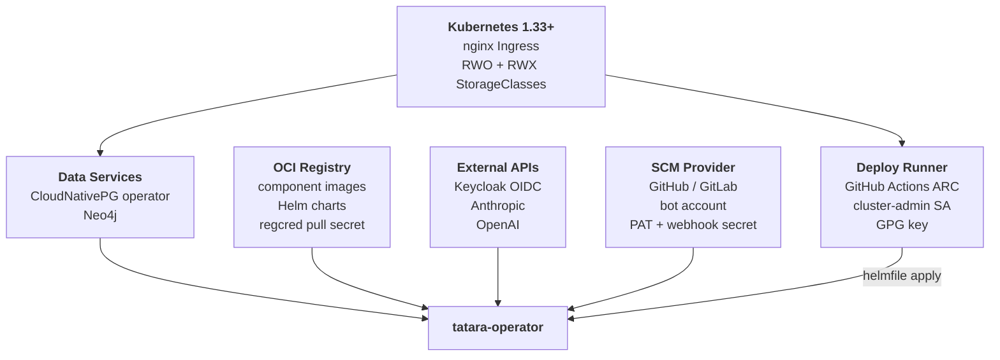

# Prerequisites

Everything your infrastructure needs before the first `helmfile apply`. Work down
the page in order: [Installing the Operator](installation.md) assumes all of it is
in place, and the failures you get from a missing piece here surface much later,
as a Project that reconciles but never does anything.

## What you are signing up for

This is a standing installation, not a weekend trial. There is no single-node
mode and no demo install: the smallest thing that runs a Task is a real
Kubernetes cluster with an ingress your SCM provider can reach, an OCI registry
you can push to, a Keycloak realm carrying four OIDC clients, a dedicated bot
account with a PAT, a Claude subscription token, and an in-cluster GitHub Actions
runner bound to a cluster-admin ServiceAccount. If that is more than you want to
stand up, that is a reasonable conclusion to reach here rather than at the bottom
of the table below.

Three things on this page you can genuinely leave out:

- **metrics-server.** Nothing in tatara reads it, and it plays no part in
  scheduling. Install it if you want `kubectl top`.
- **The memory stack** - the CNPG operator, Neo4j, the 28 Gi of RWO capacity, and
  the OpenAI key - by setting `spec.memory.enabled: false` on a Project. Agents
  keep working; they read the repository instead of recalling it.
- **The ReadWriteMany class**, until you turn the agent workspace on. The
  operator-wide `agentWorkspacePvcEnabled` defaults to `false`, and no workspace
  PVC exists until you set it.

Everything else is load-bearing, and two pieces in particular have no off switch.
Keycloak is not optional: every tatara API validates an OIDC bearer token whose
`aud` names that service. The ARC runner is not optional either: `helmfile apply`
runs on that in-cluster runner and nowhere else, which is also why its
ServiceAccount is cluster-admin.

If you want to understand what tatara does without installing it, read
[Watch One Run](../explainers/watch-one-run.md) instead. It is one complete run in
tatara's own repository, quoted from the thread, and it costs you a read rather
than a cluster.

---

## Summary

| Prerequisite | What needs it | Minimum |
|---|---|---|
| Kubernetes | The operator chart refuses to install below this | 1.33+ |
| nginx Ingress controller | Public webhook endpoint, plus one memory Ingress per Project | Any maintained release |
| Default StorageClass (RWO) | CNPG and Neo4j volumes, when memory is on | 28 Gi free per enrolled Project |
| ReadWriteMany StorageClass | The persistent agent workspace and build cache | 10 Gi per live Task, 50 Gi per Project |
| metrics-server | `kubectl top` and any HPA you add yourself | Optional; tatara ships none |
| CloudNativePG (CNPG) operator | Per-Project Postgres with pgvector, when memory is on | Operator builds against the v1.29 API |
| Neo4j | LightRAG graph store, when memory is on | Operator-built single-node community; image `neo4j:2026.04.0` |
| OCI registry | Component images and Helm charts | Harbor 2.x recommended |
| `regcred` pull secret | Every operator-spawned workload | Secret in the `tatara` namespace |
| Keycloak realm | OIDC for every tatara API | Keycloak 22+ |
| GitHub Actions ARC scale set | The in-cluster GitOps deploy runner | Actions Runner Controller v0.9+ |
| `tatara-helmfile-deployer` ServiceAccount | Helm release management | SA plus cluster-admin ClusterRoleBinding |
| GPG key pair | SOPS decryption of helmfile secrets at deploy time | 4096-bit RSA or ECDSA |
| Dedicated bot SCM account | Authorship of every agent issue, comment, and PR | Not a personal account |
| Bot PAT | Issues, PRs, contents, org membership | Fine-grained least-privilege (GitHub) or `api` (GitLab) |
| Webhook secret | HMAC validation of inbound SCM events | 32+ random bytes; you register the webhook yourself |
| Claude Code OAuth token | Claude Code inside every agent pod | Claude subscription setup token, not a metered API key |
| OpenAI API key | LightRAG embeddings and extraction, when memory is on | Required per Project, independent of `semanticIngest` |

!!! info "Four rows are conditional on the memory stack"
    CNPG, Neo4j, the RWO capacity, and the OpenAI key are needed only while a
    Project's memory stack is on, which is the default. Setting
    `spec.memory.enabled: false` on a Project tears that stack down and drops all
    four for that Project. Agents keep running without it, working from the
    repository instead of from recall. See
    [Data services](#2-data-services-memory-stack) for what disabling costs you.

---

## Prerequisite stack

The operator sits at the top. Everything below it has to be healthy before the
first `helmfile apply`.


```mermaid
graph TD
    K8S["<b>Kubernetes 1.33+</b><br/>nginx Ingress<br/>RWO + RWX StorageClasses"]
    DS["<b>Data Services</b><br/>CloudNativePG operator<br/>Neo4j"]
    REG["<b>OCI Registry</b><br/>component images<br/>Helm charts<br/>regcred pull secret"]
    EXT["<b>External APIs</b><br/>Keycloak OIDC<br/>Anthropic<br/>OpenAI"]
    SCM["<b>SCM Provider</b><br/>GitHub / GitLab<br/>bot account<br/>PAT + webhook secret"]
    ARC["<b>Deploy Runner</b><br/>GitHub Actions ARC<br/>cluster-admin SA<br/>GPG key"]

    K8S --> DS
    K8S --> ARC
    DS --> OP
    REG --> OP
    EXT --> OP
    SCM --> OP
    ARC -->|"helmfile apply"| OP["<b>tatara-operator</b>"]
```

---

## 1. Cluster

### Kubernetes

You need **Kubernetes 1.33 or later**. The operator chart declares
`kubeVersion: ">=1.33.0-0"`, so Helm refuses the install below it rather than
letting the operator fail later in a way that is hard to read. The floor is set by
CRD validation ratcheting, which the operator relies on during an upgrade window
where the narrowed CRD is already applied but the old manager pod is still writing
against it.

The operator runs its cron activities in-process via a `robfig/cron` scheduler,
not as `batch/v1` CronJob objects. The activities are `issueScan`, `brainstorm`,
`documentation`, `refine`, `upgrade`, and the per-repository re-ingest schedule.
The only batch objects the operator creates are `batch/v1` Jobs for repository
ingest. It uses leader election through `coordination.k8s.io/v1` leases and
server-side apply for CRD management.

The manager itself is small: `100m` CPU request, `128Mi` memory request, `256Mi`
memory limit. The chart runs one replica; the reference deployment runs three
behind leader election, one per control-plane node.

Agent pods are what you size the node pool for. Each requests `250m` CPU and
`512Mi` memory and may grow to `2` CPU and `4Gi`. Plan for
`Project.spec.maxConcurrentAgents` of them at once (default 3; `0` pauses the
whole Project), plus LightRAG and Neo4j per enrolled Project if memory is on.

### nginx Ingress controller

The operator serves one webhook endpoint for inbound SCM events and manages one
Ingress per enrolled Project for its memory stack. Both use nginx-specific rewrite
annotations. The chart bakes neither, so you supply `ingressClassName` and
`ingressRewriteTarget` in your helmfile values, but nginx is the tested and
supported controller.

The webhook Ingress has to be publicly reachable from your SCM provider. Set
`externalWebhookBase` to the fully qualified base URL **including the
`/operator/webhooks` path prefix**, for example
`https://tatara.example.com/operator/webhooks`. The operator serves
`/operator/webhooks/<projectName>` and stamps that per-project URL into
`Project.status.webhookURL`.

### Default StorageClass (ReadWriteOnce)

While a Project's memory stack is on, it provisions three PVCs from the default
StorageClass:

- CNPG Postgres data (PGDATA): **10 Gi** per replica (`spec.memory.pgStorage`).
- CNPG Postgres WAL: **8 Gi** per replica, on its own volume
  (`spec.memory.pgWalStorage`).
- Neo4j graph store: **10 Gi** (`spec.memory.neo4jStorage`).

Plan for at least **28 Gi** free per Project you enroll, more if you raise
`pgInstances` above 1. `ReadWriteOnce` is enough for all three.

!!! warning "Postgres storage is a one-way door"
    CNPG rejects a storage *decrease* and rejects disabling the WAL volume, so
    every number you set here can only go up. Raising one is an online PVC
    expansion and needs a StorageClass with `allowVolumeExpansion: true`.

### ReadWriteMany StorageClass

The agent workspace is a separate requirement, and it is **not** RWO. Each live
Task gets a `ReadWriteMany` PVC mounted at `/workspace`, and each Project gets a
second RWX PVC holding the shared build cache. Both exist because `/workspace` used
to be the container's writable layer: volatile, so an OOMKill cost committed agent
work, and unbounded, so nothing guaranteed a node had room for every repository a
Project clones and builds.

| Setting | Default | Notes |
|---|---|---|
| `spec.workspace.enabled` | on | Omitting the block enables it. `false` is a rollout escape hatch, not a tuning knob. |
| `spec.workspace.storageClass` | `rook-ceph-rwx` | Pinned, not inherited from the cluster default. Set it to your own RWX class. |
| `spec.workspace.size` | `10Gi` | Per Task. On CephFS this is a subvolume quota, not a preallocation. |
| `spec.workspace.cacheEnabled` | on | The per-Project build cache. |
| `spec.workspace.cacheSize` | `50Gi` | Per Project, shared across its Tasks; it holds whole toolchain caches. |

Two things gate it. The Project field above, and the operator-wide
`agentWorkspacePvcEnabled` chart value, which defaults to `false` and is ANDed
with it. Both have to be on before a single PVC is created.

!!! warning "Pin the class rather than inheriting it"
    The workspace is mounted `ReadWriteMany`. If the cluster default StorageClass
    were ever a block (RBD) class, every PVC the operator created would come back
    RWO and every pod respawn onto a different node would stall in Multi-Attach.
    Naming the RWX class explicitly makes that impossible by accident.

    Your CSI driver's `fsGroupPolicy` matters too. See
    [agent security context](installation.md#agent-scheduling-and-security) for the
    `agentFsGroup` and `agentFsGroupChangePolicy` values that go with it.

### metrics-server (optional)

metrics-server is not a hard dependency. tatara ships no HorizontalPodAutoscaler,
and kube-scheduler places pods on their declared CPU and memory **requests** rather
than on live metrics, so the platform reconciles and schedules correctly without
it. Install it if you want `kubectl top` for capacity debugging or intend to add
your own HPA or VPA. It plays no part in scheduling, quotas, or admission.

```bash
kubectl apply -f https://github.com/kubernetes-sigs/metrics-server/releases/latest/download/components.yaml
```

---

## 2. Data services (memory stack)

Everything in this section is needed while `Project.spec.memory.enabled` is on,
which is the default and which is also what nil means. Set it `false` and the
operator deletes the memory API, LightRAG, Neo4j, the CNPG `Cluster`, and the
monitoring objects that watch them, and this whole section stops applying to that
Project.

Disabling is not symmetric about data, deliberately:

- The Postgres (PGDATA and WAL) and Neo4j volumes are **retained**. Their
  ownerReferences are stripped and they are labelled
  `tatara.dev/retained-for-project`. Re-enabling reattaches them by name.
- The LightRAG volume is **deleted**. That index is derived data and gets rebuilt
  by re-ingesting.

Agents keep working either way. Turn admission was never gated on memory: an agent
whose Project has memory off is told so in its first prompt and works from the
repository instead of from recall.

### CloudNativePG (CNPG) operator

The operator creates a CNPG `Cluster` (and a `ScheduledBackup`, if you turn
backups on) per enrolled Project, so the CNPG operator has to be installed
cluster-wide before any Project exists. The operator builds against the
CloudNativePG **v1.29** API.

```bash
helm repo add cnpg https://cloudnative-pg.github.io/charts
helm upgrade --install cnpg cnpg/cloudnative-pg \
  --namespace cnpg-system --create-namespace
```

Each Project gets one Postgres cluster:

| Field | Default | Notes |
|---|---|---|
| `spec.memory.pgInstances` | `1` | Replicas. Set `3` for production HA. |
| `spec.memory.pgStorage` | `10Gi` | Per-replica PGDATA PVC. |
| `spec.memory.pgWalStorage` | `8Gi` | Per-replica WAL PVC, separate from PGDATA. |
| Extension | `pgvector` | Installed via `postInitApplicationSQL`. tatara-memory and LightRAG share one database (`tatara_memory`). |

WAL lives on its own volume so a WAL burst, or WAL retained for a lagging standby,
cannot fill the data volume and take writes down. The operator derives Postgres'
`max_slot_wal_keep_size` as **half** the WAL volume, so an 8 Gi volume caps one
stuck replication slot at 4 Gi and leaves the rest for checkpoint WAL.

!!! warning "Single-replica Postgres is fragile on CephFS"
    With `pgInstances: 1`, an unclean pod restart can leave a stale write-cap lock
    on CephFS volumes, wedging the instance in end-of-recovery. Set
    `pgInstances: 3` for any workload that matters. The operator propagates the
    value into the CNPG `Cluster` spec.

!!! danger "A raised CRD default never reaches an existing Project"
    A kubebuilder default is applied once, on the write that omits the field.
    Raising the default later does not propagate to a Project that already exists.
    If you want a size, set it explicitly in your helmfile values rather than
    trusting the default you read in the CRD today.

### Neo4j

The operator runs **no Helm** at reconcile time. For each Project it builds Neo4j
as native Kubernetes objects: a single-replica community-edition StatefulSet plus a
ClusterIP Service, both named `mem-<project>-neo4j`. There is no Neo4j chart and no
subchart. It serves as the LightRAG graph store.

| Parameter | Value |
|---|---|
| Edition | Community, single node. One replica, no enterprise license |
| Image | `neo4j:2026.04.0` (CalVer, set via `neo4jImage`), not the 5.x line |
| Default storage | `10Gi` (`spec.memory.neo4jStorage`) |
| Bolt endpoint | `bolt://mem-<project>-neo4j:7687`, cluster-internal |
| Service type | `ClusterIP` |

Neo4j is memory-hungry. Allow at least **2 Gi** of node memory headroom per
Project on top of the Postgres and LightRAG footprints. Page-cache poisoning after
a Ceph OSD restart is a known failure mode, and a pod restart clears it. The graph
is a rebuildable projection: if the StatefulSet is lost, re-ingesting every
enrolled repository reconstructs it from the source repos and the CNPG-backed
document store.

---

## 3. Registry

Component images and Helm charts are distributed through an OCI registry. The
reference deployment uses **Harbor** at `harbor.szymonrichert.pl`; any
OCI-compatible registry works if you mirror or rebuild the images.

| Artifact type | Path pattern |
|---|---|
| Container images | `<registry>/containers/tatara-<component>:vX.Y.Z`, plus `:<shortSHA>` for traceability |
| Helm charts | `oci://<registry>/charts/tatara-<component>:X.Y.Z` |

Under semver push-CD the release pipeline publishes images at `:vX.Y.Z` and charts
at the bare `X.Y.Z`. It then propagates the new version into the `tatara-helmfile`
pins itself, so you rarely hand-edit them. See
[Installing the Operator, section 6](installation.md#6-release-versioning-semver-push-cd)
for the whole flow.

### imagePullSecret

Create a `regcred` Secret in the `tatara` namespace holding registry pull
credentials:

```bash
kubectl create secret docker-registry regcred \
  --namespace tatara \
  --docker-server=<registry> \
  --docker-username=<username> \
  --docker-password=<password>
```

The `tatara-helmfile` bucket applies it across the bucket via `values/common.yaml`,
and the operator injects it into every workload it spawns (Neo4j StatefulSet,
LightRAG Deployment, tatara-memory Deployment, CNPG Cluster) through the
`imagePullSecret` value.

!!! warning "Harbor chart retention"
    Harbor's retention policy garbage-collects old chart tags. Because the pipeline
    moves the helmfile pins forward on every release, active pins stay recent on
    their own. The risk is pinning *back* to an `X.Y.Z` Harbor has already
    collected, which fails `helmfile apply` with a chart-not-found error and blocks
    every platform deploy behind it. Roll forward to a published version instead.

---

## 4. Identity (Keycloak)

Every tatara API is OIDC-gated. You need a Keycloak realm with four clients. The
realm name is yours to pick; you supply the issuer URL as `oidcIssuer` in the
operator values. The canonical client inventory - IDs, types, audiences - is in
[Identity & OIDC](../architecture/identity-and-oidc.md#clients-and-audiences).

### OIDC clients

=== "tatara-operator"

    **Type:** Confidential  
    **Purpose:** The operator authenticates as this client (client-credentials
    grant) to call OIDC introspection endpoints, and validates that inbound tokens
    carry the `tatara-operator` audience claim.

    Required settings:
    - Service accounts enabled
    - Client authentication enabled
    - Audience mapper: add `tatara-operator` to the `aud` claim

    The client secret goes in your SOPS-encrypted helmfile overlay as
    `operatorOidcClientSecret` and is stored in the operator's own Secret.

=== "tatara-memory"

    **Type:** Confidential  
    **Purpose:** The `aud` target for every token that reaches the memory service.
    Tokens issued to the CLI (through the scope's audience mapper) and
    service-account tokens from agent pods both have to carry `aud: tatara-memory`.

    Required settings:
    - Service accounts enabled
    - Audience mapper: add `tatara-memory` to the `aud` claim on the `tatara` scope

=== "tatara-cli"

    **Type:** Public  
    **Purpose:** Human device-flow login and agent pod authentication. `tatara login`
    starts a device-authorization grant against this client, and the resulting token
    is used for every CLI and agent REST call.

    Required settings:
    - Device authorization grant enabled
    - Default scopes include `tatara`, which carries the audience mapper for
      `tatara-memory`

=== "tatara-claude-code-wrapper"

    **Type:** Confidential  
    **Purpose:** The wrapper REST API validates inbound requests from the operator
    against `aud: tatara-claude-code-wrapper`. The operator holds these credentials
    and injects them into each agent pod as `OIDC_CLIENT_ID` and
    `OIDC_CLIENT_SECRET`.

    Required settings:
    - Service accounts enabled
    - Audience mapper: add `tatara-claude-code-wrapper` to the `aud` claim

### OIDC configuration in the operator

In your helmfile values:

```yaml
oidcIssuer: "https://keycloak.example.com/realms/your-realm"
oidcAudience: "tatara-operator"
operatorOidcClientId: "tatara-operator"
```

And in the SOPS-encrypted secrets overlay:

```yaml
operatorOidcClientSecret: "<client-secret-for-tatara-operator>"
cliOidcClientId: "tatara-cli"
cliOidcClientSecret: ""   # empty for public clients
```

---

## 5. Deploy runner (GitHub Actions ARC)

tatara deploys through GitOps only: the `tatara-helmfile` repository applies
releases on merge to `main`, from a GitHub Actions workflow running on an
in-cluster ARC (Actions Runner Controller) runner. You need that runner before you
can run `helmfile apply` at all.

### ARC scale set

Install the ARC controller and create a scale set named
`arc-runner-tatara-helmfile`. The runner pod runs `helmfile apply` with its
in-cluster pod identity; no `KUBECONFIG` is mounted.

```bash
# Install the ARC controller (once per cluster)
helm upgrade --install arc \
  oci://ghcr.io/actions/actions-runner-controller-charts/gha-runner-scale-set-controller \
  --namespace arc-systems --create-namespace

# Create the tatara-helmfile scale set
helm upgrade --install arc-runner-tatara-helmfile \
  oci://ghcr.io/actions/actions-runner-controller-charts/gha-runner-scale-set \
  --namespace tatara \
  --set githubConfigUrl="https://github.com/your-org/tatara-helmfile" \
  --set githubConfigSecret.github_token="<PAT or app install token>"
```

!!! note "ARC lives in the infra helmfile"
    The reference deployment provisions the ARC scale set, ServiceAccount, and
    ClusterRoleBinding from a separate infra helmfile bucket (`helmfiles/coding`),
    not from `tatara-helmfile` itself. That avoids a bootstrap cycle where the
    runner that deploys tatara also deploys itself.

### ServiceAccount and RBAC

Create a ServiceAccount with a cluster-admin ClusterRoleBinding. It is bound to
the runner pod and it is the highest-privilege element in the platform: anything
merged into `tatara-helmfile` can modify any resource in the cluster. Keep that
repository private and restrict write access to bots and maintainers.

```yaml
apiVersion: v1
kind: ServiceAccount
metadata:
  name: tatara-helmfile-deployer
  namespace: tatara
---
apiVersion: rbac.authorization.k8s.io/v1
kind: ClusterRoleBinding
metadata:
  name: tatara-helmfile-deployer
roleRef:
  apiGroup: rbac.authorization.k8s.io
  kind: ClusterRole
  name: cluster-admin
subjects:
  - kind: ServiceAccount
    name: tatara-helmfile-deployer
    namespace: tatara
```

### GitHub Actions secrets

The `tatara-helmfile` workflows read three repository secrets:

| Secret | Value |
|---|---|
| `HARBOR_ROBOT_KUBERNETES_USERNAME` | Registry credentials. Read-only pull is enough for deploy |
| `HARBOR_ROBOT_KUBERNETES_PASSWORD` | Registry password |
| `GPG_PRIVATE_RSA_B64` | Base64-encoded PGP private key for SOPS decryption |

The GPG key fingerprint has to match the `.sops.yaml` in your `tatara-helmfile`
repository. Generate a key pair, export the private key, base64-encode it, and
store it in the secret:

```bash
gpg --gen-key
gpg --export-secret-keys --armor <fingerprint> | base64 | pbcopy
```

Then add the public key fingerprint to `.sops.yaml`, scoped to the files that
carry secrets:

```yaml
creation_rules:
  - path_regex: default.secrets.yaml
    pgp: "<YOUR_KEY_FINGERPRINT>"
  - path_regex: .*.secret.*.yaml
    pgp: "<YOUR_KEY_FINGERPRINT>"
```

---

## 6. SCM

### Bot account

Create a **dedicated SCM account**, separate from any human identity. The bot
authors every agent-generated issue, comment, and pull request, and tatara uses
that identity as part of its approval gate: the operator acts on issues and
comments from the bot, a maintainer, or an account on the `reporterLogins`
allowlist (`Project.spec.scm.reporterLogins`), and ignores the rest.

Using a personal account as the bot breaks that boundary and exposes your
infrastructure to prompt injection through third-party issue content.

!!! danger "Name your maintainers, or nothing will ever be approved"
    The other half of the same gate is `Project.spec.scm.maintainerLogins`, and it
    is closed by default. An empty list means no account is a maintainer, so no
    comment can approve anything and no Task advances past `refined`. Your Project
    will look healthy and do nothing. The API also rejects a Project whose
    `botLogin` appears in either list, because the bot is structurally excluded
    from the approval path.

### Personal Access Token (PAT)

The operator reads and writes issues, comments, PRs, branches, commit statuses,
and org membership. It never creates or manages webhooks - the SCM clients only
verify inbound payloads - so no webhook-admin scope is needed. Grant the bot the
minimum that covers those calls. This is the authoritative scope set;
[Installing the Operator](installation.md#scm-secret) renders the same Secret.

=== "GitHub (fine-grained PAT, recommended)"

    Scope the token to the bot's repositories, or to the whole org:

    | Permission | Access | Reason |
    |---|---|---|
    | Contents | Read and write | Clone, branch, and push agent commits |
    | Issues | Read and write | Clarifying conversation, comments, labels |
    | Pull requests | Read and write | Open PRs, post the review pod's verdict as a comment (one bot identity can never post `APPROVE` on its own PR), and merge on an accepted verdict (the operator performs the merge) |
    | Metadata | Read | Baseline repo access, mandatory for fine-grained PATs |
    | Members (Organization) | Read | Org-membership checks for the maintainer and reporter allowlists |
    | Commit statuses / Checks | Read | The operator's green-CI merge gate |

    A classic `repo` token also works but is broader than necessary. No
    `admin:repo_hook`.

=== "GitLab"

    | Scope | Reason |
    |---|---|
    | `api` | Issues, MRs, and pipeline reads. Broad; GitLab has no fine-grained equivalent |
    | `read_repository`, `write_repository` | Clone and push agent commits |

Store the PAT in a SOPS-encrypted Secret and reference it by name with
`scmSecretName` in your operator values. The Secret carries key `token` (the PAT)
and key `webhookSecret` (below).

### Webhook secret

Generate a random webhook secret of 32 bytes or more:

```bash
openssl rand -hex 32
```

The operator does **not** register webhooks. It HMAC-SHA256-validates inbound
payloads against this secret and nothing else. You configure the webhook yourself -
payload URL, secret, event set - once per enrolled repository or org, in your SCM
provider's UI. See
[Your First Project, section 6](first-project.md#6-apply-and-watch) for the
settings. Use this same value there, and store it alongside the PAT under key
`webhookSecret`.

### Claude Code OAuth token (Claude subscription)

Agent pods run Claude Code, driven by a **Claude subscription OAuth token** rather
than a metered `console.anthropic.com` API key. The operator injects it into every
agent pod as `CLAUDE_CODE_OAUTH_TOKEN`, sourced from the `oauth-token` key of the
Anthropic Secret, which the chart renders from the `anthropicOauthToken` value.

The credential type is load-bearing, not incidental: the `claudeSubscription`
token-budget mode meters against a subscription window, which only a subscription
setup token exposes. Generate it from an authenticated Claude Code CLI through its
setup-token flow, not from the Anthropic console.

There is no built-in default model. `Project.spec.agent.model` has no CRD default,
so set it explicitly per Project.

Plan capacity for `Project.spec.maxConcurrentAgents` simultaneous Claude Code pods
per Project. Each pod's life is capped by `Project.spec.agentPodTTLSeconds`
(default 3600, minimum 300). A single Task can span many pods in sequence over
hours or days, but holds at most one running pod at a time.

Store the token under key `oauth-token` in a Secret and reference it with
`anthropicSecretName`.

### OpenAI API key

While a Project's memory stack is on, OpenAI is a **hard dependency of that
stack**, independent of `semanticIngest`. Each Project's LightRAG is wired to
`LLM_BINDING=openai` and `EMBEDDING_BINDING=openai` (`text-embedding-3-small`);
without the key, LightRAG document processing fails with
`KeyError 'OPENAI_API_KEY'` and the graph never populates.

`semanticIngest` is a separate, per-repository knob. When `true` (the default), the
ingester runs an **additional** extraction pass through OpenAI (`gpt-4o-mini` by
default, via `SEMANTIC_MODEL`) to emit richer entities and relationships. Setting
it `false` removes that extra pass only. It does not remove LightRAG's OpenAI
requirement.

Store the key in a Secret and reference it with `openaiSecretName`. The same Secret
is read by every per-Project LightRAG Deployment.

!!! tip "Disabling semantic ingest saves cost, not the OpenAI dependency"
    `spec.semanticIngest: false` on a `Repository` drops the per-file
    `gpt-4o-mini` pass, which is faster and cheaper, and the graph loses its
    relationship-level semantic edges, which lowers query quality. LightRAG still
    needs OpenAI for embeddings. There is no in-cluster or offline embedding path
    today. To drop the OpenAI dependency entirely you have to turn the whole memory
    stack off with `spec.memory.enabled: false`.

### Credential-to-env contract

So you don't have to re-derive the names, this is the single source of truth for
the LLM and CLI credentials. This page and
[Installing the Operator](installation.md) render exactly these keys.

| Chart value | Rendered Secret / key | Consumed as env | By |
|---|---|---|---|
| `anthropicOauthToken` (+ `anthropicSecretName`) | `<anthropicSecretName>` / `oauth-token` | `CLAUDE_CODE_OAUTH_TOKEN` | agent pods |
| `openaiApiKey` (+ `openaiSecretName`) | `<openaiSecretName>` / `LLM_BINDING_API_KEY` | `LLM_BINDING_API_KEY` + `OPENAI_API_KEY` | per-Project LightRAG |
| `scmToken` (+ `scmSecretName`) | `<scmSecretName>` / `token` | `GIT_TOKEN` | agent pods; operator SCM client |
| `scmWebhookSecret` | `<scmSecretName>` / `webhookSecret` | HMAC verify key | operator webhook route |
| `cliOidcClientId` / `cliOidcClientSecret` (+ `cliOidcSecretName`) | `<cliOidcSecretName>` / `client-id`, `client-secret` | `CLI_OIDC_CLIENT_ID` / `CLI_OIDC_CLIENT_SECRET` | agent pods |
| `operatorOidcClientSecret` | operator Secret / `OPERATOR_OIDC_CLIENT_SECRET` | client-credentials grant | operator |

---

## Next steps

With all of the above in place, go to
[Installing the Operator](installation.md) to deploy the `tatara-operator` release.
