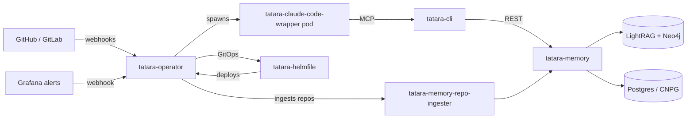

# tatara

**Kubernetes-native agentic development platform.**

Tatara gives your engineering organization a permanent, autonomous software-development loop on top of Kubernetes. A single Kubernetes operator watches your GitHub or GitLab repositories, triages incoming issues with an AI agent, proposes improvements, writes code, opens pull requests, handles incidents, and reviews changes - all unattended, all auditable, all GitOps-driven.

The name comes from the traditional Japanese iron-smelting forge: a collective, iterative process around a permanent substrate. Ephemeral agent sessions work iteratively against a permanent knowledge graph of your codebase.

-   :material-robot-outline: **Autonomous Development Loop**

    ---

    Issues become pull requests without human intervention. Agents triage, plan, implement, and open PRs. Humans approve; the agent merges.

    [:octicons-arrow-right-24: Workflows](workflows/index.md)

-   :material-brain: **Durable Knowledge Graph**

    ---

    Every repository is ingested into a persistent LightRAG + Neo4j graph. Agents query it for context instead of re-reading files cold.

    [:octicons-arrow-right-24: Memory System](architecture/memory-architecture.md)

-   :material-kubernetes: **Native Kubernetes**

    ---

    Four CRDs (`Project`, `Repository`, `Task`, `QueuedEvent`) managed by a controller-runtime operator. Everything is a CR; everything is auditable.

    [:octicons-arrow-right-24: CRD Reference](reference/index.md)

-   :material-shield-lock-outline: **Security First**

    ---

    Allowlist-gated intake, OIDC-authenticated everything, maintainer-only approval gates, headless agents with no interactive prompts.

    [:octicons-arrow-right-24: Security Model](operations/security/index.md)

-   :material-git: **GitOps Deploy Model**

    ---

    Deploys happen only via helmfile PRs merged on an in-cluster ARC runner. No `kubectl set-image`, no surprise state drift.

    [:octicons-arrow-right-24: CI/CD & Deploy](architecture/ci-cd.md)

-   :material-chart-line: **Built-in Observability**

    ---

    Every service exposes `/metrics`. Alert rules live as code in `tatara-observability`. Grafana incidents fire straight into the agent loop.

    [:octicons-arrow-right-24: Observability](operations/observability.md)

---

## Who tatara is for

=== "Platform Engineers / SREs"

    You want autonomous incident response, self-improving infrastructure, and a reproducible agent-execution platform on your existing Kubernetes cluster.

    Tatara gives you: a Kubernetes operator with Helm chart, OIDC-gated APIs, Prometheus metrics on every component, GitOps-only deploys, and Grafana alert rules that fire directly into an incident-investigation agent.

    Start with [Installation](getting-started/installation.md) and [Observability](operations/observability.md).

=== "Engineering Managers"

    You want your team's backlog to move faster without more headcount. You want proposals to appear automatically, implemented code to be reviewable, and a clear audit trail.

    Tatara generates improvement proposals from a periodic brainstorm, routes them through your normal PR review flow, and requires a human maintainer to approve before any merge. Nothing is unilateral.

    Read [The Big Picture](explainers/big-picture.md) and [Workflows](workflows/index.md).

=== "Senior Developers / Architects"

    You want to understand the system deeply before adopting it. You care about the trust model, the prompt-injection surface, the CRD API, and how conversation persistence works.

    Start with [Architecture](architecture/index.md), the [CRD Reference](reference/index.md), and [Security](operations/security/index.md).

---

## What tatara is not

- Not a general-purpose CI system. Tatara orchestrates agent turns, not arbitrary pipelines.
- Not a hosted service. You deploy it to your own Kubernetes cluster and connect it to your GitHub/GitLab organization.
- Not a monolith. Nine independent component repos, each with its own Helm chart, CI, and release lifecycle.

---

## Headline capabilities

| Capability | Detail |
|---|---|
| Issue triage | Triages every labeled issue: implement, close, or discuss |
| Autonomous implementation | Writes code, commits to a branch, opens a PR |
| PR review | Reviews human-authored PRs with inline suggestions |
| Incident response | Grafana alert fires an investigation agent with Grafana MCP access |
| Brainstorm | Periodic health-check generates improvement proposals |
| Conversation persistence | S3-backed transcripts resume across pod restarts |
| Multi-repo tasks | Single task can span and open PRs across multiple repositories |
| Systemic improvements | Groups related issues into one agent run with a combined PR |

---

## Components at a glance

[:octicons-arrow-right-24: Full architecture](architecture/index.md)

---

## License

GNU AGPLv3. See [LICENSE](https://github.com/szymonrychu/tatara/blob/main/LICENSE).
