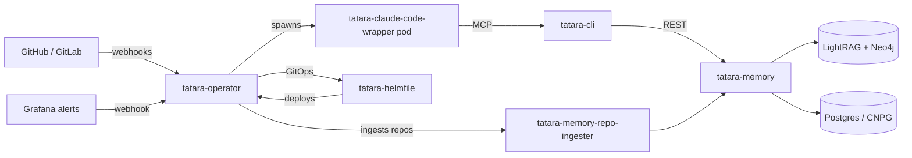

# tatara

**tatara runs an autonomous development loop on your Kubernetes cluster: it triages your issues, writes code, opens pull requests, and reviews them.**

Here is one run, in tatara's own repository, with nothing staged for the demo.

A Grafana alert fired at `2026-08-02T01:26:50Z`. No human filed anything: tatara's incident agent investigated it read-only and opened the issue itself, twelve minutes later, with the diagnosis in the body.

Then nothing happened, because nothing is implemented until a person with commit rights says so. Four days later, one did, in full:

```text title="tatara-operator#529, szymonrychu, 2026-08-06T15:21:36Z"
Fix it!
```

That comment is the whole approval. The first implementation attempt then failed and produced nothing, and tatara did not try again:

```text title="tatara-operator#529, szymonrychu-bot, 2026-08-06T20:00:37Z"
tatara has stopped working this issue: task `incident-qe-c0bdeaf8ab61daab-9mqvr` ended in `failed` (`operator-error`).

The issue stays open and is labelled `tatara-parked`, so the platform will not spend another agent on it until a human replies here. Comment to pick it back up.
```

Once restarted, the fix merged as `e70d0e09`, CI tagged `v2.0.4`, and the cluster ran it. Four comments from one maintainer, two of them under ten words. Six days wall clock, with four hours and fifty minutes of actual delivery inside them.

Every quote above is from [tatara-operator#529](https://github.com/szymonrychu/tatara-operator/issues/529), and you can open the thread yourself. [Read the whole run](explainers/watch-one-run.md), including the review round that sent the fix back.

---

## Why it is called tatara

That run was not one long-lived process. It was a sequence of pods that each started cold: the attempt that failed, the one that wrote the fix, the one that reviewed it and sent it back, the one that rewrote it. The name is the reason that works.

A tatara is the traditional Japanese iron-smelting furnace. The clay stack is built for a single smelt and broken apart to get the bloom out; what carries forward is the iron, not the furnace.

That is the shape of this platform, and it is the part newcomers get wrong. Agent pods are disposable and start knowing nothing. What persists is the code graph they read and the Task journal they write, so the pod that finishes your work is usually not the pod that started it.

---

## What that run did not show

One issue exercises one path through the loop. These are the parts #529 had no occasion to use.

<div class="grid cards" markdown>

-   :material-brain: **A code graph the agents read from**

    ---

    The ingester walks each repository and pushes a code graph into LightRAG and Neo4j. Agents query it for context instead of re-reading files cold, which is what a pod that starts knowing nothing needs.

    [:octicons-arrow-right-24: Memory System](architecture/memory-architecture.md)

-   :material-lightbulb-outline: **Work nobody filed**

    ---

    A periodic scan of the codebase and the knowledge graph proposes its own improvements, from new features to tech-debt and CI health fixes. #529 started from an alert; a Task can also start from something tatara noticed on its own.

    [:octicons-arrow-right-24: Brainstorm](workflows/brainstorm.md)

-   :material-source-repository: **One Task across several repositories**

    ---

    A single Task can span repositories and open a pull request in each, and related issues can be grouped into one agent run behind one combined change. #529 touched one repository, which is the easy case.

    [:octicons-arrow-right-24: From Issue to PR](explainers/issue-to-pr.md)

-   :material-kubernetes: **All of it is a CR**

    ---

    Six CRDs (`Project`, `Repository`, `Task`, `QueuedEvent`, `Issue`, `MergeRequest`) managed by a controller-runtime operator. The state machine that run walked is `kubectl get task`, not a dashboard you have to be given access to.

    [:octicons-arrow-right-24: CRD Reference](reference/index.md)

-   :material-git: **Every deploy is a pull request**

    ---

    "The cluster ran it" above is a helmfile pull request merged on an in-cluster ARC runner, which is the only way anything reaches the cluster. No `kubectl set-image`, no surprise state drift.

    [:octicons-arrow-right-24: CI/CD & Deploy](architecture/ci-cd.md)

</div>

---

## Who tatara is for

=== "Platform Engineers / SREs"

    You want autonomous incident response, self-improving infrastructure, and a reproducible agent-execution platform on your existing Kubernetes cluster.

    Tatara gives you: a Kubernetes operator with Helm chart, OIDC-gated APIs, Prometheus metrics on every component, GitOps-only deploys, and Grafana alert rules that fire directly into an incident-investigation agent.

    Start with [Installation](getting-started/installation.md) and [Observability](operations/observability.md).

=== "Engineering Managers"

    Nothing gets written until a person you named comments on the issue. `maintainerLogins` is empty by default and an empty list approves nothing, so an unconfigured Project reconciles cleanly and produces no code at all.

    What comes back is a pull request. A separate review pod, with no memory of having written the code, reviews it, and the operator merges only on an accepted verdict, at the exact commit that was reviewed, with CI green. When an attempt fails, tatara parks the issue and waits for a reply rather than retrying. Every attempt, review round, and failure is on the issue thread with a timestamp, as in the run above.

    Read [The Big Picture](explainers/big-picture.md) and [Workflows](workflows/index.md).

=== "Senior Developers / Architects"

    You want to understand the system deeply before adopting it. You care about the trust model, the prompt-injection surface, the CRD API, and how conversation persistence works.

    Start with [Architecture](architecture/index.md), the [CRD Reference](reference/index.md), and [Security](operations/security/index.md).

---

## What tatara is not

- Not a general-purpose CI system. Tatara orchestrates agent turns, not arbitrary pipelines.
- Not a hosted service. You deploy it to your own Kubernetes cluster and connect it to your GitHub/GitLab organization.
- Not a monolith. Nine independent component repos, each with its own Helm chart, CI, and release lifecycle.

---

## Components at a glance

Now that you know what a run looks like, here are the pieces that carry it.


```mermaid
graph LR
    A[GitHub / GitLab] -->|webhooks| B[tatara-operator]
    B -->|spawns| C[tatara-claude-code-wrapper pod]
    C -->|MCP| D[tatara-cli]
    D -->|REST| E[tatara-memory]
    E --> F[(LightRAG + Neo4j)]
    E --> G[(Postgres / CNPG)]
    B -->|ingests repos| H[tatara-memory-repo-ingester]
    H --> E
    I[Grafana alerts] -->|webhook| B
    B -->|GitOps| J[tatara-helmfile]
    J -->|deploys| B
```

[:octicons-arrow-right-24: Full architecture](architecture/index.md)

---

## License

GNU AGPLv3. See [LICENSE](https://github.com/szymonrychu/tatara/blob/main/LICENSE).
