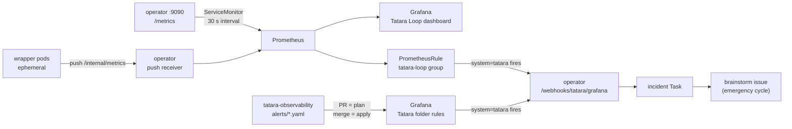

# Observability

The tatara operator ships observability first-class: a `ServiceMonitor` for Prometheus
scraping, a Grafana dashboard as a sidecar-discovered ConfigMap, and a `PrometheusRule`
for loop-failure alerting - all enabled by default, all cluster-agnostic. A companion
repository, [`tatara-observability`](https://github.com/szymonrychu/tatara-observability),
holds the full per-component Grafana alert rule set managed as code and applied by CI.

## Signal flow



---

## 1. Metrics catalog

### Operator metrics

The operator exposes `/metrics` on the `metricsAddr` port (default `:9090`, exposed as the
`metrics` port on the operator `Service`). **This port is not ingress-routed.** It is only
reachable in-cluster via the Service; the optional Ingress covers only the main HTTP port
(`:8080`).

#### Core counters

| Metric | Labels | Description |
|---|---|---|
| `operator_reconcile_total` | `controller`, `result` | Reconcile attempts per resource kind. Result is `ok` or `error`. The primary health denominator for the control loop. |
| `operator_task_terminal_total` | `kind`, `phase`, `reason` | Every Task terminal transition, incremented once at the `terminate()` chokepoint. `phase` is `Succeeded`, `Failed`, `Done`, `Stopped`, or `Parked`; `reason` carries the failure class (e.g. `PodLost`, `TurnTimeout`, `PlanningStalled`, `BootCrashLoop`). This is the uniform loop success / failure denominator - do NOT use `operator_reconcile_total` as a proxy for task outcomes. |
| `operator_task_tokens_total` | `project`, `repo`, `kind`, `issue`, `type` | Cumulative agent token spend. `type` is `input` or `output`. Provides the global / project / repo / issue cost breakdown visible in the dashboard. |
| `tatara_scan_tasks_created_total` | - | Tasks created by the hourly scan. Zero for 3+ hours is the scan-stall deadman signal. |
| `tatara_scan_items_total` | - | Items (issues / MRs) evaluated per scan. Used alongside `tatara_scan_tasks_created_total` for the loop-liveness check. |
| `tatara_lifecycle_giveup_total` | `reason` | Issue-lifecycle Tasks abandoned by the loop. |
| `operator_turn_submit_total` | `result` | Turn-submit attempts from the operator to wrapper pods. |
| `operator_turn_timeout_total` | - | Agent turns that stalled past the inactivity deadline. |
| `operator_agent_boot_crash_total` | `outcome`, `reason` | Wrapper pod boot budget exhaustions. `outcome=failed` means the Task was aborted. |
| `operator_agent_unreachable_termination_total` | - | Tasks killed because the wrapper stayed unreachable past the boot deadline. |
| `operator_ingest_job_total` | `result`, `mode` | Repo ingest job completions. `mode=full` distinguishes scheduled / self-heal full re-ingests from incremental runs. |
| `operator_scm_writes_total` | `kind`, `result` | SCM write-backs (comments, labels, approvals, PRs). `kind=write` / `kind=read`; `result=ok` or `result=error`. |
| `operator_scm_request_errors_by_status_total` | `verb`, `status` | SCM errors broken down by HTTP verb and status code. Use this to distinguish token failures (401/403), rate limits (429), or network errors from a write error alert. |
| `operator_webhook_events_total` | `result` | Inbound SCM webhook events. `result` includes `ok`, `error`, `bad_signature`, `bad_request`. |
| `operator_writeback_outcome_total` | `result` | Writeback disposition per Task: `ok`, `skip_4xx`, `skip_4xx_capped` (permanent give-up). |
| `operator_writeback_skip_4xx_total` | `status`, `reason` | Per-skip detail when a writeback is skipped on a 4xx. |
| `operator_reap_delete_error_total` | - | Failures in the orphan-pod reaper. |

#### Gauges

| Metric | Labels | Description |
|---|---|---|
| `operator_tasks_inflight` | - | Tasks currently running (Running + WritebackPending). The concurrency-cap deadman threshold is configurable (`prometheusRule.tasksInflightThreshold`, default `8`). |
| `operator_queue_depth` | `project`, `class` | QueuedEvents waiting to be admitted per project and priority class. |
| `operator_memory_stacks` | `phase` | Per-project memory stack count by phase (`Ready`, `Provisioning`, `Failed`, etc.). A `Failed` value above zero is a critical alert. |
| `operator_lightrag_documents` | `project`, `status` | Per-project LightRAG corpus size, polled during gauge recompute from `/documents/status_counts`. |

#### Histograms

| Metric | Labels | Description |
|---|---|---|
| `operator_reconcile_duration_seconds` | `controller` | Reconcile wall-clock time per kind. |
| `operator_turn_submit_duration_seconds` | - | SubmitTurn latency from the operator to the wrapper pod HTTP API. p95 > 30 s fires an alert. |
| `operator_agent_http_total` | `outcome` | Wrapper HTTP call results. `outcome` includes `ok`, `unreachable`, `timeout`, `transport_error`. |

### Push-receiver / wrapper series

Ephemeral agent pods (wrapper, ingest) cannot be scraped directly - they have no stable
`/metrics` endpoint and a per-run lifetime measured in minutes. Instead they push their
metrics to the operator's push receiver at the end of each run. The operator re-exposes
them through its own `/metrics`.

The allowlist is controlled by the `pushMetricsAllowedPrefixes` Helm value (default:
`wrapper_,agent_,memory_,ingest_`). Series whose name does not match any prefix are
dropped and counted in `operator_push_series_dropped_total{reason="reserved_name"}`.

| Metric | Labels | Description |
|---|---|---|
| `operator_push_receive_total` | `result` | Push receive outcomes (`ok`, `rejected`). Rejected pushes mean wrapper metrics are being lost. |
| `operator_push_series_dropped_total` | `reason` | Metric name families dropped by the allowlist. |
| `ccw_turns_total` | `result` | Claude turns per wrapper run. Requires `ccw_` in the allowlist. |
| `ccw_turn_tokens_total` | - | Tokens consumed per wrapper run. Requires `ccw_` in the allowlist. |
| `ccw_commit_push_total` | `result` | Git commit + push attempts from the wrapper. Requires `ccw_` in the allowlist. |
| `ccw_http_requests_total` | `status_code` | Operator callback HTTP responses as seen by the wrapper. Requires `ccw_` in the allowlist. |
| `ccw_http_panics_total` | - | Recovered panics in the wrapper HTTP handler. Requires `ccw_` in the allowlist. |
| `ccw_lifecycle_hook_total` | `hook`, `result` | Lifecycle hook executions (`preClone`, `postClone`, etc.). Requires `ccw_` in the allowlist. |

!!! warning "Push series are unreliable for rate-based alerts"
    Because pushed series TTL-evict and reset their run ID per pod lifecycle, `rate()`,
    `increase()`, and `absent()` over pushed series behave unpredictably across pod
    boundaries. The shipped alert rules deliberately key only on the operator's own
    continuously-present series, never on `ccw_*` or `tatara_wrapper_*` for threshold
    alerting.

---

## 2. Dashboard: Tatara Loop

The chart ships the **"Tatara Loop"** dashboard as a ConfigMap labelled
`grafana_dashboard: "1"` for automatic sidecar discovery. When the Grafana sidecar
(kiwigrid/k8s-sidecar) is deployed with the matching label selector it loads the
dashboard without manual import.

```yaml
# values.yaml knobs
dashboard:
  enabled: true          # default: true
  folder: "tatara"       # Grafana folder for placement
  additionalLabels: {}   # match non-default sidecar label selectors
```

The dashboard hardcodes no datasource UID. A `$datasource` template variable lets you
select any Prometheus instance in the cluster. Two additional template variables,
`$project` and `$repo`, filter every panel to a specific project or repository.

### Panel layout

| Row | Panels |
|---|---|
| **Loop golden signals** | Lifecycle state by state (timeseries), Reconcile rate by result (timeseries), Tasks in-flight by kind (timeseries), Turn duration heatmap |
| **Failures and scan cadence** | Failure rates (timeseries), Ingest success ratio (timeseries), Scan cadence per hour (timeseries) |
| **Task outcomes** | Terminal transitions by phase/reason per hour (timeseries), Task success-rate SLO 6h window (stat) |
| **Token usage** | Total tokens by type (stat), Token rate by project 1h (timeseries), Token rate by repo 1h (timeseries), Top issues by tokens (table), Input vs output tokens (pie chart) |
| **Memory corpus** | LightRAG documents by project/status (timeseries), Memory stacks by phase (pie chart) |

---

## 3. Alerts shipped

Tatara ships alert rules from two sources with different scopes and update paths.

### Chart PrometheusRule (tatara-loop group)

A `PrometheusRule` CR in the `tatara-loop` group is rendered by the chart and enabled
by default (`prometheusRule.enabled: true`). These rules cover only the operator's own
continuously-present series and are intended as a minimal, always-correct baseline that
installs automatically with the operator.

```yaml
# values.yaml knobs
prometheusRule:
  enabled: true
  severityLabel: "warning"       # stamped on every alert
  tasksInflightThreshold: 8      # cap for the TataraTasksInflightPinned deadman
  additionalLabels: {}           # cluster-specific: match Prometheus ruleSelector
```

!!! note "ruleSelector"
    The chart bakes no selector labels. Add the label your cluster's Prometheus
    `ruleSelector` matches via `prometheusRule.additionalLabels` in your helmfile
    values.

#### Class A: deadman / liveness

These alerts catch silent stalls - conditions that emit no error event but indicate
the loop has stopped producing work.

| Alert | Expression summary | Fires after | Description |
|---|---|---|---|
| `TataraOperatorDown` | `up{job=~".*tatara-operator.*"} == 0` | 5 m | Scrape target absent; no counter-based alerts below can fire while this is true. |
| `TataraLoopWedged` | `increase(operator_reconcile_total[15m]) == 0` | 15 m | Workqueue wedged with pod alive - zero reconciles. |
| `TataraLoopStalled` | `increase(tatara_scan_tasks_created_total[3h]) + increase(tatara_scan_items_total[3h]) == 0` | 30 m | Hourly scan producing no work at all. The worst failure class - zero errors but zero output. |
| `TataraMemoryStackFailed` | `operator_memory_stacks{phase="Failed"} > 0` | 15 m | At least one project memory stack failed; agents for that project cannot read or write recall. |
| `TataraTasksInflightPinned` | `operator_tasks_inflight >= tasksInflightThreshold` | 2 h | Concurrency cap saturated with nothing draining; deadlock signature. |

#### Class B: active failures

| Alert | Signal | Description |
|---|---|---|
| `TataraReconcileErrors` | `rate(operator_reconcile_total{result="error"}[15m]) > 0` for 15 m | Reconciliation failing for at least one kind. |
| `TataraTaskFailures` | `increase(operator_task_terminal_total{phase="Failed"}[30m]) > 0` | Tasks reaching terminal `Failed`. The `reason` label carries the failure class. |
| `TataraTurnTimeouts` | `increase(operator_turn_timeout_total[1h]) > 0` | Agent turns stalled past the inactivity deadline. |
| `TataraAgentBootCrashLoop` | `increase(operator_agent_boot_crash_total{outcome="failed"}[30m]) > 0` | Wrapper pods exhausted the boot-respawn budget without `/readyz` coming up. |
| `TataraAgentUnreachable` | `increase(operator_agent_unreachable_termination_total[15m]) > 0` | Tasks killed because wrapper stayed unreachable past the boot deadline. |
| `TataraIngestJobFailing` | `increase(operator_ingest_job_total{result="failure",mode="full"}[1h]) > 0` | A full re-ingest failed; the recall corpus is going stale. Incremental failures that self-heal via the full-ingest fallback are excluded (`mode="full"` selector). |
| `TataraLifecycleGiveups` | `increase(tatara_lifecycle_giveup_total[1h]) > 0` | `issueLifecycle` Tasks gave up; the `reason` label identifies why. |
| `TataraSCMWriteErrors` | `increase(operator_scm_writes_total{kind="write",result="error"}[15m]) > 0` | SCM write-backs (comments, labels, approvals, PRs) failing. Break down `operator_scm_request_errors_by_status_total` by `(verb, status)` to distinguish token, rate-limit, and network failures. |
| `TataraSCMWriteFailureRatioHigh` | ratio > 30%, >= 3 writes attempted, for 15 m | Elevated fraction of SCM writes failing. Guards against alert spam during low-volume bursts. |
| `TataraWritebackGaveUp4xx` | `increase(operator_writeback_outcome_total{result="skip_4xx_capped"}[1h]) > 0` | A Task permanently abandoned writeback on repeated 4xx; no PR was opened. Investigate via `operator_writeback_skip_4xx_total` by `(status, reason)`. |
| `TataraPushMetricsRejected` | `increase(operator_push_receive_total{result="rejected"}[15m]) > 0` | Ephemeral pod metric pushes rejected at the allowlist; wrapper/ingest metrics are being lost. |
| `TataraReaperDeleteErrors` | `increase(operator_reap_delete_error_total[1h]) > 0` | Orphan-pod reaper cannot delete pods; zombie pod leak. |

### tatara-observability alert rules

The [`tatara-observability`](https://github.com/szymonrychu/tatara-observability) repository
holds a richer, per-component rule set managed as code and applied via Terraform CI. These
rules live in the Grafana **Tatara** folder and complement the chart PrometheusRule with
additional coverage per component, workload-generic pod-health rules, Loki-based log alerts,
and finer-grained thresholds.

Each `alerts/tatara-<component>.yaml` file defines one Grafana rule group:

```yaml
interval_seconds: 60
default_no_data_state: "OK"    # absent series do not fire
rules:
  - name: "Operator reconcile loop wedged"
    queries:
      - expression: |
          sum(increase(operator_reconcile_total{namespace="tatara",job="tatara-operator"}[15m]))
    math_operator: "<"
    threshold: 1
    for: 15m
    annotations:
      summary: "No reconciles in 15m (increase={{ index $values \"C\" }})."
    labels:
      homelab: "true"
      system: "tatara"          # routes to the incident webhook (omit on info rules)
      component: "operator"
      severity: "critical"      # warning|critical trigger an incident; info -> email only
```

The expression produces the VALUE; the comparison is `math_operator` + `threshold`. The
Terraform module builds the reduce/round/threshold chain automatically. For LogQL rules
(Loki), add `datasource_uid` and `query_type: "loki"` under the query.

**Coverage by component file:**

| File | Coverage highlights |
|---|---|
| `tatara-operator.yaml` | Workload pod health (crash-loop, OOMKill, stuck-waiting), control-loop liveness (reconcile wedged, scan stalled, reconcile error ratio), turn-pipeline failures (submit error ratio, p95 latency, agent HTTP spike, boot crash budget), SCM write ratio, webhook error ratio, writeback 404 loop, memory stack failed, memory retrieval surface absent, tasks inflight, queue backlog |
| `tatara-wrapper.yaml` | Wrapper pod health (crash-loop, OOMKill, stuck-waiting, not-ready); push-based series (commit/push ratio, turns erroring, HTTP 5xx, panics, token spend runaway) - active once `ccw_` is in the push allowlist |
| `tatara-memory.yaml` | Memory API pod health; component series (HTTP 5xx ratio, LightRAG error/latency, ingest job failure, code-graph query errors, analytics stalled with dirty repos) - component-specific rules dark until a ServiceMonitor is wired for `mem-*` pods |
| `tatara-ingester.yaml` | Full re-ingest failure (operator-side), ingest Job stuck active > 30 m, ingest pod OOMKill/stuck-waiting, ingester-side run failure ratio |
| `tatara-chat.yaml` | Chat pod health, HTTP 5xx ratio, store operation errors/latency, sweeper stall/error, handler panics, auth rejection rate (info only) |
| `tatara-logs.yaml` | Loki-based: agent `internal_issue_report` action detected, operator/memory/chat ERROR log bursts > 20 lines / 5 m |

---

## 4. Alert routing

Tatara alerts route to an operator webhook that creates an `incident` Task, kicking off
an emergency brainstorm cycle. The routing is label-driven.

**Required labels on any alert that should open an incident:**

```yaml
labels:
  homelab: "true"      # matches the global homelab notification policy
  system: "tatara"     # routes to the tatara-specific contact point
  severity: "warning"  # or "critical" - both trigger an incident
                        # omit system= on info-only rules (email only)
```

**Boundary:** Contact points and the `system=tatara` notification policy live in the
global infra Terraform (`infra/terraform/grafana`), not in `tatara-observability`. The
`tatara-observability` repo owns only the Grafana **Tatara** folder and the `tatara-*`
rule groups. Routing works regardless of folder or rule ownership.

**CI pipeline (tatara-observability):**

```
PR opened     ->  terraform plan  ->  sticky comment on PR showing planned rule changes
Merge to main ->  terraform apply ->  rules live in Grafana within ~60 s
```

Required GitHub Actions secrets: `AWS_ACCESS_KEY_ID` / `AWS_SECRET_ACCESS_KEY` (S3 Terraform
state), `TF_VAR_GRAFANA_API_KEY` (Grafana Editor SA token), `TF_VAR_GRAFANA_URL`.

To add or modify a rule, edit the relevant `alerts/tatara-<component>.yaml` and open a PR.
The terraform module handles the Grafana API interaction; no terraform edits required for
rule changes.

---

## 5. Scrape gotchas

### Leader-only metrics

The operator runs with `leaderElection: true` (default). Business metrics - task tokens,
terminal transitions, scan counts, memory stack gauges, lightrag documents - are emitted
only by the leader replica. If you run `replicaCount > 1` for high availability, always
aggregate with `sum()` or `max()` rather than querying a single instance:

```promql
# Correct: aggregates across all replicas
sum(rate(operator_reconcile_total{result="error"}[5m]))

# Wrong with HA: single-replica query may hit a non-leader
rate(operator_reconcile_total{instance="tatara-operator-abc:9090",result="error"}[5m])
```

Workload infrastructure metrics from kube-state-metrics (pod restart counts, readiness,
container waiting reasons) are always available regardless of leader election.

### Push receiver allowlist

The push receiver enforces a prefix allowlist on metric names. The chart default:

```yaml
pushMetricsAllowedPrefixes: "wrapper_,agent_,memory_,ingest_"
```

Series whose names do not match any prefix are dropped and counted in
`operator_push_series_dropped_total{reason="reserved_name"}`. To enable the
`ccw_*` wrapper push-series rules in `tatara-observability`, add `ccw_` to the
allowlist in your helmfile values:

```yaml
pushMetricsAllowedPrefixes: "wrapper_,agent_,memory_,ingest_,ccw_"
```

!!! note "Go runtime metrics from wrappers"
    Wrappers currently forward `go_*` and `process_*` runtime metrics to the push
    receiver, which drops them as reserved names. This is a known wrapper-side issue
    and does not indicate a misconfigured allowlist.

### Memory API pods are not scraped

The `tatara-memory` API pods (`mem-*`) do not have an active `ServiceMonitor`. The
component-specific rules in `alerts/tatara-memory.yaml` that reference memory service
metrics (`http_requests_total`, `lightrag_calls_total`, `lightrag_call_duration_seconds`,
`ingest_jobs_total`, `ingest_items_total`, `code_graph_query_total`, etc.) are dark until
scraping is wired. The `default_no_data_state: "OK"` setting prevents these from
false-firing. The workload-generic pod-health rules (kube-state-metrics) fire correctly
without scraping.

### Viewing raw metrics in-cluster

```bash
# Port-forward the metrics port (not exposed via Ingress)
kubectl -n tatara port-forward svc/tatara-operator 9090:metrics

# Sample operator series
curl -s http://localhost:9090/metrics | grep -E '^operator_task_tokens_total'

# Check push receiver drops
curl -s http://localhost:9090/metrics | grep operator_push_series_dropped_total
```
