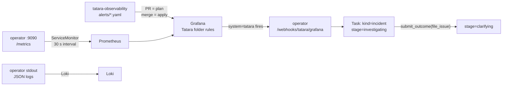

# Observability

The tatara operator ships observability first-class: a `ServiceMonitor` for Prometheus
scraping and structured `log/slog` output that doubles as the platform's audit trail (K.3
below) - both cluster-agnostic, both enabled by default. A companion repository,
[`tatara-observability`](https://github.com/szymonrychu/tatara-observability),
holds the full Grafana alert rule set for the stage machine, managed as code and applied by
Terraform CI.

!!! danger "The `noDataState` trap - read this before touching any alert file"
    Every `alerts/tatara-*.yaml` rule group sets `default_no_data_state: "OK"`. That default
    is correct for a gauge that legitimately disappears when the system is idle - an empty
    queue, a Project with no active Tasks. It is **catastrophic** for a heartbeat metric: when
    the metric stops existing entirely, the alert reports OK forever. It does not fire. It
    does not go stale. It silently reads healthy, permanently, with nothing in Grafana to
    suggest otherwise.

    This is not hypothetical - it already happened once, and this redesign deletes `phase`,
    `lifecycleState`, `cascadeStage`, `implementGiveUps`, and `linksSyncFailures`, the fields <!-- stale-ok: lifecycleState, cascadeStage, implementGiveUps, linksSyncFailures -->
    eight existing alerts keyed on. Left alone, all eight would have gone permanently, silently
    green, **including both CD-cascade alerts** - meaning the merge/deploy path that ships to
    the **cluster-admin-scoped** `arc-runner-tatara-helmfile` runner would have zero alert
    coverage while every dashboard kept reading green.

    The fix is not "check `absent()` sometimes." It is: **set `noDataState: Alerting`
    explicitly on every heartbeat/liveness alert.** Keep `OK` as the file default only for
    gauges that legitimately vanish when idle - never for a metric that should always exist
    while the operator is up.

## Signal flow



The operator is the only Loki-scraped component; agent pods are not (K.3). Alert
verdicts route back in as `incident`-kind Tasks, which run the `investigating`
stage and, if the alert corresponds to real work, file a tracker Issue and move to
`clarifying` - see the [stage reference](../reference/task-stages.md) for the full
transition table.

---

## 1. Metrics catalog

The operator exposes `/metrics` on the `metricsAddr` port (default `:9090`, exposed as the
`metrics` port on the operator `Service`). **This port is not ingress-routed.** It is only
reachable in-cluster via the Service.

### Task stage metrics

These replace every `phase` / `lifecycleState` / `cascadeStage` series the previous design <!-- stale-ok: lifecycleState, cascadeStage -->
used. `operator_task_stage` is the single source of truth for "what is a Task doing right
now" - see the [stage machine reference](../reference/task-stages.md) for the full 15-member
enum and transition table.

| Metric | Type | Labels | Why it exists |
|---|---|---|---|
| `operator_task_stage` | gauge | `stage`, `kind` | Replaces every `phase`/`lifecycleState` series. One gauge, sliced by the current stage and the Task's origin kind. | <!-- stale-ok: lifecycleState -->
| `operator_task_stage_age_seconds` | gauge | `task`, `stage`, `kind` | Makes the per-stage deadline invariant observable: every stage has a budget it must exit within (never-forever, no infinite cycle). Compare against the per-stage budget table on the [stage reference](../reference/task-stages.md) to see how close a Task is to its deadline. |
| `operator_illegal_stage_transition_total` | counter | `from`, `to` | Every stage transition is written by the operator only, checked against a fixed table; a transition outside that table is rejected. A nonzero value here is a code bug, not an operational condition. |
| `operator_task_parked_total` | counter | `stage`, `stageReason` | Which parks actually happen, broken down by the closed `stageReason` set. |

!!! danger "Cardinality: three metrics carry a `task` label"
    `operator_task_stage_age_seconds`, `operator_merge_cursor_stalled_seconds`, and
    `operator_object_too_large_total` all carry a per-Task label. The operator must **delete**
    the per-task series from its own Prometheus registry (`DeleteLabelValues` /
    `DeletePartialMatch`) when the Task is deleted - not just let Prometheus's retention age the
    series out. A registry that only grows leaks unbounded memory in the operator process
    itself, independent of Prometheus: at roughly 2000 Tasks/month in the reference deployment,
    an un-deleted registry entry per Task is a slow, permanent leak in `/metrics` output size
    and operator RSS. Already-scraped samples remaining in Prometheus for its own retention
    window is fine and expected; a gauge that is never removed from the operator's in-process
    registry is not.

### Agent pod and contract metrics

| Metric | Type | Labels | Why it exists |
|---|---|---|---|
| `operator_agent_pod_ttl_expired_total` | counter | `agent_kind`, `outcome` | A pod hit its `agentPodTTLSeconds` bound. `outcome` is `agent_handoff` (the agent handed off cleanly), `synthetic_handoff` (the operator synthesized one), or `force_deleted`. |
| `operator_agent_contract_mismatch_total` | counter | `expected`, `got`, `image` | The operator-wrapper contract-version handshake: the operator injects `TATARA_CONTRACT_VERSION`, and asserts the wrapper's reported version before turn-0. **Any nonzero value is critical** - it means a version-skewed pod almost burned a turn budget against a 404ing tool surface, or would have without this guard. See [Deployment](deployment.md#upgrades) for why this is reachable even on green pipelines, and the [runbook](runbooks.md#failedagent-contract-mismatch). |

### Merge, deploy, and sweep metrics

| Metric | Type | Labels | Why it exists |
|---|---|---|---|
| `operator_merge_cursor_stalled_seconds` | gauge | `task`, `repo` | A sequential merge (a Task with `mergeOrder` spanning multiple repos) that has stopped advancing. |
| `operator_unexpected_merge_total` | counter | `repo` | **The C.9 accepted-risk detector.** The platform runs one bot identity, so branch protection cannot require an approving review from that identity - the merge gate is operator logic, not a forge-enforced control, and a pod holding the SCM token could in principle bypass it. This metric increments when the sweep finds an MR merged with no corresponding `mergeCursor` advance - i.e. something merged outside the operator's own path. Treat any nonzero value as critical and investigate immediately; it is the sole detection mechanism for that accepted risk. |
| `operator_sweep_last_success_timestamp_seconds` | gauge | `activity` | A heartbeat. This is a "must always exist and always advance" gauge, not one that legitimately goes idle - see the `noDataState` warning above. |
| `operator_sweep_errors_total` | counter | `activity`, `reason` | Sweep-pass failures by activity and reason. |
| `operator_queue_age_seconds` | gauge | `class`, `priority`, `state` | Age of the **oldest** `QueuedEvent` in each `(class, priority, state)` bucket. This is what the incident-starvation alert keys on - see K.2 below. |
| `operator_doc_task_abandoned_total` | counter | `reason` | The nightly documentation batch starved (`reason=never_ran`) or ran past its `documenting` stage budget (`reason=timeout`). |

### Bundle and object-size guard metrics

| Metric | Type | Labels | Why it exists |
|---|---|---|---|
| `operator_bundle_bytes` | histogram | `agent_kind` | Size of the rendered context bundle handed to an agent pod, against the Project's `maxBundleBytes` budget. |
| `operator_bundle_elided_total` | counter | `agent_kind` | Comments elided from a bundle by the byte guard (oldest first) to stay under budget. |
| `operator_object_too_large_total` | counter | `kind`, `name` | The pre-write byte guard could not evict enough to fit a CR under its size limit. **Critical** - this means a write was refused or truncated, not just trimmed. |

### SCM metrics { #core-counters }

| Metric | Type | Labels | Why it exists |
|---|---|---|---|
| `operator_scm_ratelimited_total` | counter | `provider`, `path`, `limit_type` | SCM API calls that hit a rate limit, by provider and endpoint. |
| `operator_scm_writes_total` | counter | `result` | Every attempted SCM write (comment, review, merge), by outcome. `result="suppressed_bot_mr"` and `result="suppressed_last_word"` count comments the operator deliberately withheld under the comment turn-taking gate rather than posted - see [Bot Identity](security/bot-identity.md#comment-turn-taking-gate). |

!!! note "This is the load-bearing subset, not the exhaustive list"
    The tables above cover the metrics you need for day-to-day operation and every shipped
    alert. The operator emits additional lower-traffic counters and histograms (orphan
    adoption, GC blocks, per-object size distribution, sweep mint-cap hits) that exist for
    deeper debugging; `curl localhost:9090/metrics` in-cluster is the source of truth for the
    full set.

---

## 2. Dashboard: Tatara Loop

The chart ships the **"Tatara Loop"** dashboard as a ConfigMap labelled
`grafana_dashboard: "1"` for automatic sidecar discovery. When the Grafana sidecar
(kiwigrid/k8s-sidecar) is deployed with the matching label selector it loads the
dashboard without manual import.

```yaml
# values.yaml knobs
dashboard:
  enabled: true          # default: true
  folder: "tatara"       # Grafana folder for placement
  additionalLabels: {}   # match non-default sidecar label selectors
```

The dashboard hardcodes no datasource UID. A `$datasource` template variable lets you
select any Prometheus instance in the cluster. Two additional template variables,
`$project` and `$repo`, filter every panel to a specific project or repository.

Panels that read `Task.status.phase` / `lifecycleState` are re-keyed onto <!-- stale-ok: Task.status.phase, lifecycleState -->
`operator_task_stage{stage,kind}` - a per-stage breakdown (one series per stage, faceted by
`kind`) replaces the old two-value phase timeseries with something that actually shows where
Tasks are queued up. `dashboards/chat.json` is deleted along with the rest of the `tatara-chat` <!-- stale-ok: tatara-chat -->
footprint.

---

## 3. Alerts

Tatara ships alert rules from two sources with different scopes and update paths: a chart
`PrometheusRule` baked into `tatara-operator` for an always-correct baseline, and the richer,
per-component rule set in `tatara-observability` applied via Terraform CI. The stage-machine
rewrite below concerns both: any rule keyed on `phase`, `lifecycleState`, `cascadeStage`, <!-- stale-ok: lifecycleState, cascadeStage -->
`implementGiveUps`, or `linksSyncFailures` no longer has a metric to read. <!-- stale-ok: implementGiveUps, linksSyncFailures -->

### Rewritten (8 rules keyed on deleted fields)

| Rule (old) | New expression basis |
|---|---|
| Both CD-cascade alerts (merge/deploy path health) | `operator_task_stage{stage=~"merging\|deploying"}` combined with `operator_task_parked_total{stageReason=~"merge-blocked\|deploy-blocked\|merge-timeout\|deploy-timeout"}` |
| "Operator tasks inflight pinned at cap" | Re-expressed against **agent pod count**, not Task count. Tasks are now long-lived (they persist across many pods over a stage's life), so a Task-count-based cap alert false-fires chronically once concurrency gates pods specifically. Key on live agent pod count vs. `Project.spec.maxConcurrentAgents`, or on `operator_task_stage` for pod-eligible stages sitting flat. |
| "Wrapper metrics blind while agents running" | Same fix: gate on agent-pod presence, not Task count. |
| Four rules keyed on `phase` / `lifecycleState` / `implementGiveUps` / `linksSyncFailures` | Re-expressed against `operator_task_stage`, `operator_task_parked_total{stageReason=...}`, and `operator_agent_pod_ttl_expired_total` as appropriate per rule intent. | <!-- stale-ok: lifecycleState, implementGiveUps, linksSyncFailures -->

### Deleted

`tatara-chat` is archived and fully decommissioned (its helm release is removed from the <!-- stale-ok: tatara-chat -->
cluster - see [Deployment](deployment.md)). Delete `alerts/tatara-chat.yaml` (10 rules), the <!-- stale-ok: tatara-chat -->
chat log-burst rule in the Loki-based log-alert file, and `dashboards/chat.json`.

### New (minimum set)

| Alert | Severity | Expression | `noDataState` |
|---|---|---|---|
| Incident starvation | CRITICAL | `operator_queue_age_seconds{class="alert",state="Queued"} > 300` | `OK` (gauge legitimately absent when no incidents are queued) |
| Agent contract mismatch | CRITICAL | `increase(operator_agent_contract_mismatch_total[5m]) > 0` | `OK` |
| Unexpected merge | CRITICAL | `increase(operator_unexpected_merge_total[15m]) > 0` | `OK` |
| Object too large | CRITICAL | `increase(operator_object_too_large_total[15m]) > 0` | `OK` |
| Illegal stage transition | WARNING | `increase(operator_illegal_stage_transition_total[15m]) > 0` | `OK` |
| Sweep heartbeat | CRITICAL | `time() - operator_sweep_last_success_timestamp_seconds > 7200` | **`Alerting`** - this is the canonical heartbeat case the danger note above exists for |
| SCM rate limited | WARNING | `increase(operator_scm_ratelimited_total[10m]) > 0` | `OK` |
| Merge/deploy blocked | WARNING | `increase(operator_task_parked_total{stageReason=~"merge-blocked\|deploy-blocked"}[1h]) > 0` | `OK` |
| Docs never written | WARNING | `increase(operator_doc_task_abandoned_total{reason="never_ran"}[25h]) > 0` | `OK` |

Do not key the incident-starvation alert on `operator_task_stage_age_seconds{kind="incident",stage="investigating"}` even though it looks intuitive - `investigating` carries only a 2h stage-work budget and, more importantly, an unadmitted incident Task sits in `triaging` (a 5-minute, no-pod stage) or in the admission queue, never reaching `investigating` at all while starved. The queue-age metric is the correct signal because it measures time waiting for admission, not time spent working.

### CI pipeline (tatara-observability)

```
PR opened     ->  terraform plan  ->  sticky comment on PR showing planned rule changes
Merge to main ->  terraform apply ->  rules live in Grafana within ~60 s
```

Required GitHub Actions secrets: `AWS_ACCESS_KEY_ID` / `AWS_SECRET_ACCESS_KEY` (S3 Terraform
state), `TF_VAR_GRAFANA_API_KEY` (Grafana Editor SA token), `TF_VAR_GRAFANA_URL`.

To add or modify a rule, edit the relevant `alerts/tatara-<component>.yaml` and open a PR. The
Terraform module handles the Grafana API interaction; no Terraform edits are required for rule
changes.

---

## 4. Alert routing

Alerts route to an operator webhook that mints an `incident`-kind Task, entering the
`investigating` stage (an `incident`-kind agent pod, budgeted 2h before parking). The routing
is label-driven.

**Required labels on any alert that should open an incident:**

```yaml
labels:
  homelab: "true"      # matches the global homelab notification policy
  system: "tatara"     # routes to the tatara-specific contact point
  severity: "warning"  # or "critical" - both trigger an incident
                        # omit system= on info-only rules (email only)
```

**Boundary:** Contact points and the `system=tatara` notification policy live in the
global infra Terraform (`infra/terraform/grafana`), not in `tatara-observability`. The
`tatara-observability` repo owns only the Grafana **Tatara** folder and the `tatara-*`
rule groups. Routing works regardless of folder or rule ownership.

---

## 5. Structured logging: the operator is the audit trail

Agent pods are not Loki-scraped - they are ephemeral, per-turn processes with no stable
identity to attach a log stream to. The operator is, so it carries audit-trail responsibility
for anything that needs to outlive a Task's TTL (up to 48h for `delivered`, 7d for
`parked`/`failed`). The operator logs the following actions at INFO on its own stdout:

| `action` | Fields |
|---|---|
| `task_note` | `task`, `agent_kind`, `note_kind`, `bytes` |
| `approval_verified` | `task`, `issue`, `maintainer_login`, `comment_external_id`, `matched_phrase`, `auto` |
| `approval_refused` | `task`, `issue`, `reason` |
| `task_delivered` | `task`, `stats` (tokens, turns, pod_runs, wall_seconds, agents_run, issue_count, mr_count) |
| `stage_transition` | `task`, `from`, `to`, `stage_reason` |

`stage_transition` in particular gives you a full, Loki-queryable history of every Task's path
through the stage machine at the cost of one `slog.Info` call per transition - useful when a
Task has already been reaped and `operator_task_stage_age_seconds` no longer has a series for
it. Approval-gate audit fields (`approval_verified` / `approval_refused`) are the log-side
complement to the grammar itself - see
[Security: approval gates](../operations/security/approval-gates.md#the-approval-grammar) for
the grammar the maintainer's comment is checked against.

---

## 6. Scrape gotchas

### Leader-only metrics

The operator runs with `leaderElection: true` (default). Business metrics - task stage,
tokens, sweep heartbeats, queue ages - are emitted only by the leader replica. If you run
`replicaCount > 1` for high availability, always aggregate with `sum()` or `max()` rather than
querying a single instance:

```promql
# Correct: aggregates across all replicas
sum(operator_task_stage{stage="implementing"})

# Wrong with HA: single-replica query may hit a non-leader
operator_task_stage{instance="tatara-operator-abc:9090",stage="implementing"}
```

Workload infrastructure metrics from kube-state-metrics (pod restart counts, readiness,
container waiting reasons) are always available regardless of leader election.

### Memory API pods are not scraped

The `tatara-memory` API pods (`mem-*`) do not have an active `ServiceMonitor`. Component-
specific rules in `alerts/tatara-memory.yaml` that reference memory service metrics are dark
until scraping is wired. The `default_no_data_state: "OK"` setting is correct here - the
absence of these series is an intentional gap, not a heartbeat that should alert. The
workload-generic pod-health rules (kube-state-metrics) fire correctly without scraping.

### Viewing raw metrics in-cluster

```bash
# Port-forward the metrics port (not exposed via Ingress)
kubectl -n tatara port-forward svc/tatara-operator 9090:metrics

# Sample Task stage state
curl -s http://localhost:9090/metrics | grep -E '^operator_task_stage'

# Check for the C.9 accepted-risk detector firing
curl -s http://localhost:9090/metrics | grep operator_unexpected_merge_total
```
