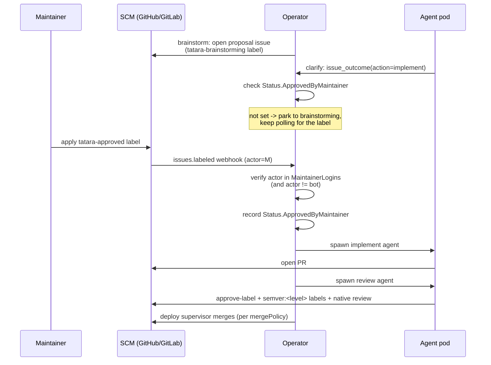
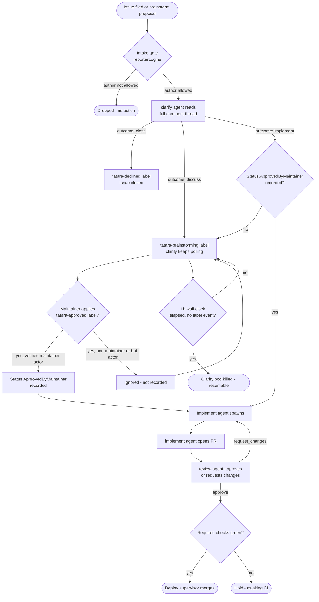

# Approval Gates

Tatara is designed to be useful without being autonomous. Two independent gates
prevent an agent from writing or merging code without explicit human intent: an
intake gate that controls which issues the operator acts on, and a maintainer-approval
gate that controls whether a front-half issue (still in `clarify`/brainstorming) advances
into the autonomous implement->review->merge->deploy chain. A third gate -
review approval plus the deploy supervisor - governs whether the resulting PR is
merged automatically once a `review` pod approves it and required checks are
green.



## Gate 1: Intake - who can drive the lifecycle

The intake gate controls which issues and issue comments the operator acts on.
By default the gate is **open**: the operator processes issues from any author.
When `spec.scm.reporterLogins` is non-empty the gate becomes **restricted**:
only these authors (plus the bot and any maintainer) may drive the lifecycle.
Everything else is dropped at intake - cron scan and webhook alike - so
unenrolled third parties cannot submit arbitrary work to agents.

The effective reporter set for a given repository is:

1. The configured `botLogin` - always trusted, unconditionally.
2. Every login in `spec.scm.maintainerLogins` - always trusted, unconditionally.
3. Every login explicitly listed in `spec.scm.reporterLogins` - trusted when the
   list is non-empty.

An empty `reporterLogins` disables the gate entirely (historical open behavior).

!!! warning "Default: open intake"
    With an empty `reporterLogins`, any SCM user who can file an issue on an
    enrolled repository can drive tatara. Enable the gate for any project where
    the repositories are publicly visible or where you do not want unsolicited
    automation.

```yaml
apiVersion: tatara.dev/v1alpha1
kind: Project
metadata:
  name: my-project
spec:
  scm:
    provider: github
    owner: my-org
    botLogin: my-bot
    reporterLogins:       # restrict intake to these accounts
      - alice
      - ci-system
    maintainerLogins:     # see Gate 2 - the ONLY approval-granting set
      - alice
      - bob
```

## Gate 2: Maintainer-approval label - who can approve implementation

Before an agent writes any code, the operator requires a verified, identity-checked
approval fact recorded on the Task: `Status.ApprovedByMaintainer`. There is exactly
**one** action that sets this field, and it is not a conversational one:

!!! danger "The only approval action"
    **A maintainer applies the `tatara-approved` label (`spec.scm.approvedLabel`) directly
    to the issue.** That is the entire mechanism. Nothing else approves an issue for
    implementation:

    - **A comment never approves**, regardless of its content or who wrote it. "Looks good,
      ship it" in a comment thread does **not** release the gate - the old comment-based
      approval model has been removed entirely.
    - **A non-maintainer applying the label does not approve.** If the issue reporter, a
      trusted `reporterLogins` account, or any other non-maintainer applies
      `tatara-approved`, the operator observes the label-add event, verifies the actor
      is not a maintainer, and **ignores it** - no approval is recorded.
    - **An agent or bot applying the label does not approve.** Label-add events whose
      actor is the configured `botLogin` are dropped before the maintainer check even
      runs. An agent/pod acting as the bot structurally cannot self-approve its own (or
      anyone else's) proposal by writing the label itself.

`clarify` still runs its conversation - asking questions, proposing a plan, reading the
full comment thread - but that conversation is informational and scoping only. When
`clarify` calls `issue_outcome(action=implement)`, the operator does **not** treat the
verdict itself as approval:

| `clarify` verdict | Operator behavior |
|---------|---------|
| `implement` | Checks `Status.ApprovedByMaintainer`. **Set** -> proceeds to spawn `implement`. **Empty** -> fails closed: parks the issue back to `tatara-brainstorming` and keeps waiting for a maintainer to apply the label. |
| `discuss` | More information or human input is needed; issue stays in `tatara-brainstorming`, `clarify` keeps polling |
| `close` | Issue should be rejected and closed |

### Who verifies the approval, and how

The webhook server is the sole writer of `Status.ApprovedByMaintainer`. On every
`issues.labeled` event it applies this check, in order:

1. **Drop bot-actor label events.** If the event's actor is the project's `botLogin`,
   the event is an echo of the operator's own SCM write (e.g. a phase-label swap) and is
   ignored outright - it never reaches the approval check.
2. **Match the changed label.** Only an add of exactly `spec.scm.approvedLabel` (default
   `tatara-approved`) is considered; every other label change is irrelevant to this gate.
3. **Verify the actor is a maintainer.** The actor login is checked against
   `EffectiveMaintainerLogins` for the issue's repository (the Repository-level override,
   falling back to the Project-level `spec.scm.maintainerLogins`) - and the bot login is
   structurally excluded from that set even if it were mistakenly listed. Only a match
   here counts as verified.
4. **Record the fact.** On a match, the operator writes `Status.ApprovedByMaintainer` on
   the owning Task to the maintainer's login (kept for audit) - not the raw label
   presence. Every subsequent gate check reads this recorded fact, not the SCM label
   state, so the approval cannot be spoofed by an agent re-adding a label the operator
   itself might otherwise sweep or re-apply.

!!! warning "Fail closed: empty `MaintainerLogins` approves nothing, ever"
    `spec.scm.maintainerLogins` is **closed by default**. An empty (or unset) list means
    the project has **no** maintainers - nobody's label-apply can ever satisfy the actor
    check, so `Status.ApprovedByMaintainer` can never be set and no issue ever advances
    past `clarify` into implementation. This is deliberate: a project must explicitly name
    its maintainers before tatara will write any code against it. There is no "any human"
    fallback for an unpopulated allowlist, unlike the intake gate (Gate 1).

### Applying the label at any point in the conversation

A maintainer does not need to wait for `clarify` to ask; the label can be applied at any
time while the issue sits in `tatara-brainstorming` (including immediately on filing, to
skip straight past discussion once `clarify` next reconciles). The webhook records the
approval as soon as it sees the event, independent of whatever `clarify` verdict comes
next - so a maintainer who applies the label while `clarify` is mid-conversation does not
need to wait for the pod to finish; the next reconcile sees the recorded approval and
proceeds.

### Systemic/grouped issue sets: approval is per-issue, not per-group

A systemic-improvement group (see [Brainstorm](../../workflows/brainstorm.md#systemic-improvements))
files one lead issue plus same-repo sibling issues that share a `tatara/systemic-<id>`
label. Maintainer approval is **never group-wide**: each sibling issue requires its own,
independently recorded `Status.ApprovedByMaintainer` before it is treated as approved.

- An unapproved or explicitly declined sibling is **not force-closed** by the lead's PR.
  The lead's implementation prompt only includes siblings that already carry a recorded
  approval; siblings with no recorded approval are excluded from the combined-PR prompt
  entirely.
- If the lead PR body would otherwise auto-close an unapproved sibling (a `Closes #N`
  directive for that sibling's issue number), the writeback step **downgrades it to
  `refs #N`** before posting - the reference survives for traceability, but merging the
  lead PR no longer closes that sibling's issue.
- A sibling that is later approved co-resolves on a subsequent reconcile: the systemic
  group carried on the lead Task is filtered fresh against currently-recorded approvals
  every time, so a late maintainer approval is picked up without re-filing anything.

## Gate 3: Review approval + deploy-supervisor merge

Merge is no longer gated by an agent-declared `pr_outcome=merge` signal read against
`mergePolicy`. It is gated by the [deploy supervisor](../../workflows/deploy-supervisor.md) -
an operator-only loop, not an agent kind - which merges once **both** hold: required checks are
green, and `tatara-approved` is present on the PR (set only by `review`'s approve action, never
by `implement`). `review` never calls a merge API itself; it only sets the label and posts a
native SCM approval.

!!! note "Same label name, different object, different check"
    The PR-level `tatara-approved` label here is unrelated to the issue-level Gate 2 check:
    `review` (a bot pod) sets this one itself as part of its approve action, and the deploy
    supervisor trusts raw label presence on the **PR**. Gate 2's issue-level approval is never
    self-set by a bot and is trusted only via the recorded `Status.ApprovedByMaintainer` fact,
    never raw label presence on the **issue**. Do not conflate the two - Gate 2 exists precisely
    because a bot-settable label cannot be trusted as a human-approval signal.

If `review` finds any MR under the Task unmergeable (a conflict, a failed pipeline), it withholds
approval and re-adds `tatara-implementation`, invoking `implement` again rather than leaving the
PR in a stuck state for a human to unblock.

On the same `approve` action, `review` also assigns a per-MR `semver:<level>` label to every MR
in the stream - human/maintainer-authored MRs included, not just tatara-created ones. This closes
a real deploy gap: `change_significance` (declared via `change_summary`) is an `implement`-only
signal, so a human-authored MR previously carried no semver label from anyone, and the push-CD
pipeline refused to cut a release tag for it even after a clean merge. Review respects any
`semver:*` label a human already set (never overwriting it) and otherwise falls back to that
MR's own `change_significance`, then `patch`. See
[Deploy Supervisor Component 1b](../../workflows/deploy-supervisor.md#component-1b-review-semver-stamping-human-mrs)
for the full rubric.

!!! note "review structurally cannot approve its own diff"
    Because `implement` and `review` are separate pods spawned on separate turns, the merge gate
    is enforced by pod-boundary separation, not by a policy flag a misconfigured project could
    silently disable. There is no `mergePolicy: afterApproval` equivalent that skips review.

### Recommended branch protection (GitHub)

For production repositories enrolled in tatara:

- Require at least 1 approving review (satisfied by `review`'s native PR approval).
- Dismiss stale reviews on push.
- Require status checks to pass before merging.
- Restrict who can push to the protected branch to the bot account and maintainers.

## Per-repository overrides

Both allowlists can be overridden at the Repository CR level, independently of the
Project. This lets you tighten gates on sensitive repositories without changing the
project-wide defaults.

```yaml
apiVersion: tatara.dev/v1alpha1
kind: Repository
metadata:
  name: payments-service
spec:
  projectRef: my-project
  url: https://github.com/my-org/payments-service
  maintainerLogins:    # overrides project-level for this repo only
    - alice
    - security-lead
  reporterLogins:      # overrides project-level for this repo only
    - alice
    - security-lead
```

Override semantics:

| Field on Repository | Effect |
|--------------------|--------|
| Not set (`null`) | Inherits the Project's list |
| Set to an explicit list (including empty `[]`) | Replaces the Project's list for this repository only |

An explicit empty list `[]` **opens** intake for that repository to any SCM
author (clears the project-level allowlist entirely), regardless of the
project-level `reporterLogins`. To close intake to only the bot and
maintainers, set `reporterLogins` to a non-empty list containing only the
trusted accounts.

Setting `maintainerLogins` to an explicit empty list `[]` for a repository has the
opposite effect from `reporterLogins`: it **closes** the approval gate for that
repository (no maintainer, so nothing is ever approved there), even if the
project-level list is non-empty.

## Label set reference

The operator manages the following labels. Names are configurable via the
`spec.scm.*Label` fields on the Project; defaults are shown.

| Label | Default name | Color | Meaning |
|-------|-------------|-------|-------|
| Brainstorming | `tatara-brainstorming` | `#1d76db` (blue) | `clarify` conversing - proposal under discussion, awaiting maintainer approval |
| Approved | `tatara-approved` | `#0e8a16` (green) | A maintainer applied this label and the operator verified it - ready for implementation |
| Implementation | `tatara-implementation` | `#fbca04` (yellow) | `implement` agent active |
| Declined | `tatara-declined` | `#9e9e9e` (gray) | Rejected - no implementation |
| Incident | `tatara-incident` | `#d73a4a` (red) | Additive; incident-originated proposal |

The operator enforces exactly one of the four managed labels per issue at any time.
It adds the desired label and removes all other managed labels atomically.
The `tatara-incident` label is additive and never swept by the phase reconciler -
an incident proposal can carry both `tatara-incident` and `tatara-brainstorming`
simultaneously.

!!! warning "Label presence on the issue is not proof of approval"
    The `tatara-approved` label being visibly present on an issue does not by itself mean
    the operator has recorded an approval - a non-maintainer or a bot could have applied it
    (the operator leaves a non-maintainer's label in place; it just never treats it as
    approval) or the operator itself may not have finished reconciling the event yet. To
    confirm approval was recorded, check the owning Task's
    `status.approvedByMaintainer` field (non-empty = recorded; holds the approving login).

!!! note "Legacy labels"
    `tatara-idea` and `tatara-rejected` are deprecated aliases kept for migration
    compatibility. The operator still recognizes them for dedup and backstop
    purposes but no longer applies them to new issues. Migrate existing issues to
    the current label names at your convenience.

## Complete approval flow


