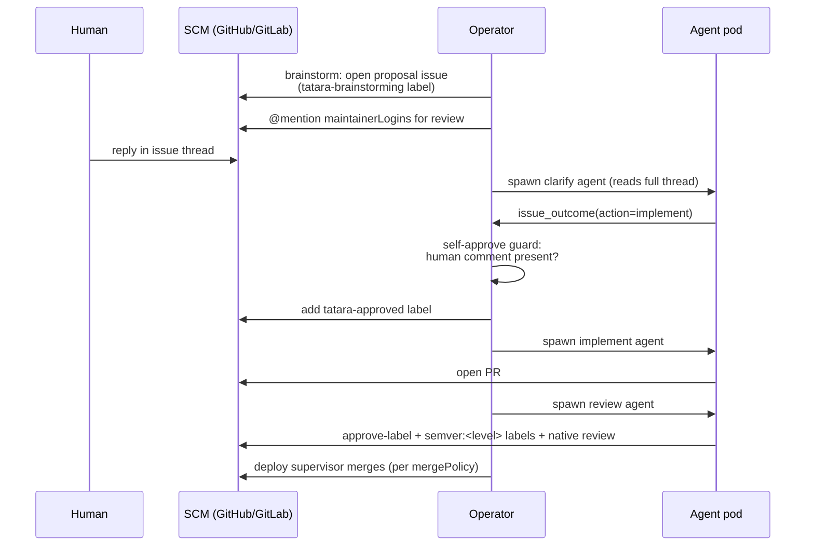
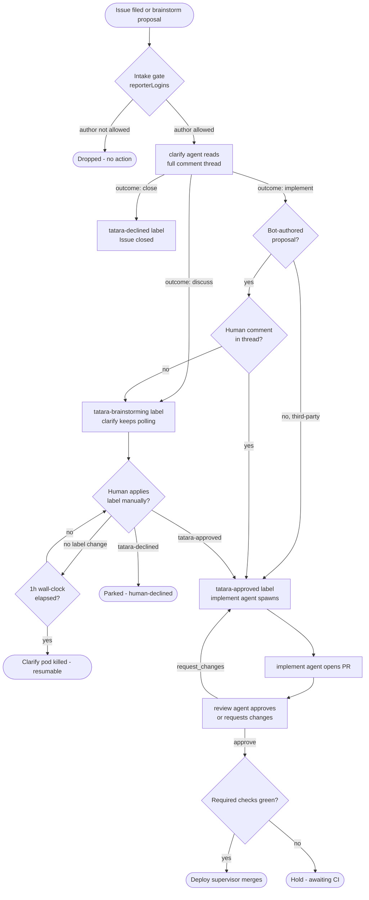

# Approval Gates

Tatara is designed to be useful without being autonomous. Two independent gates
prevent an agent from writing or merging code without explicit human intent: an
intake gate that controls which issues the operator acts on, and an approval gate
that controls whether a clarify verdict leads to implementation. A third gate -
review approval plus the deploy supervisor - governs whether the resulting PR is
merged automatically once a `review` pod approves it and required checks are
green.



## Gate 1: Intake - who can drive the lifecycle

The intake gate controls which issues and issue comments the operator acts on.
By default the gate is **open**: the operator processes issues from any author.
When `spec.scm.reporterLogins` is non-empty the gate becomes **restricted**:
only these authors (plus the bot and any maintainer) may drive the lifecycle.
Everything else is dropped at intake - cron scan and webhook alike - so
unenrolled third parties cannot submit arbitrary work to agents.

The effective reporter set for a given repository is:

1. The configured `botLogin` - always trusted, unconditionally.
2. Every login in `spec.scm.maintainerLogins` - always trusted, unconditionally.
3. Every login explicitly listed in `spec.scm.reporterLogins` - trusted when the
   list is non-empty.

An empty `reporterLogins` disables the gate entirely (historical open behavior).

!!! warning "Default: open intake"
    With an empty `reporterLogins`, any SCM user who can file an issue on an
    enrolled repository can drive tatara. Enable the gate for any project where
    the repositories are publicly visible or where you do not want unsolicited
    automation.

```yaml
apiVersion: tatara.dev/v1alpha1
kind: Project
metadata:
  name: my-project
spec:
  scm:
    provider: github
    owner: my-org
    botLogin: my-bot
    reporterLogins:       # restrict intake to these accounts
      - alice
      - ci-system
    maintainerLogins:     # see Gate 2
      - alice
      - bob
```

## Gate 2: Clarify approval - who can approve implementation

Before an agent writes any code the operator must see evidence of human approval.
Approval happens through the normal SCM comment thread on the issue, not through
a separate UI or label click. The `clarify` agent reads the full thread (title,
body, all comments) and calls an `issue_outcome` MCP tool with one of three
verdicts:

| Verdict | Meaning |
|---------|---------|
| `implement` | `clarify` judges the issue ready for implementation |
| `discuss` | More information or human input is needed |
| `close` | Issue should be rejected and closed |

### Self-approve guard

Tatara never approves its own brainstorm proposals without human engagement. When
`clarify` returns `implement` for a bot-authored issue:

1. The operator checks the comment thread for at least one comment whose author
   is **not** the bot.
2. If no such comment exists, the verdict is downgraded to `discuss` - the issue
   stays in brainstorming (`tatara-brainstorming` label) and `clarify` keeps
   polling (1-hour wall-clock, `PendingInterjections`), waiting for human input.
   No `implement` pod is spawned.
3. If a human comment is present, the verdict is honored: the `tatara-approved`
   label is applied and an `implement` pod is dispatched.

This guard is fail-closed: if the authorship check fails for any reason (SCM
error, token issue), the operator treats the issue as bot-authored and withholds
approval.

!!! note "Guard enforcement moved to the permission layer"
    This guard used to live in triage-agent skill prose. It is now enforced structurally: the
    MCP comment action itself refuses to post when the last comment on the thread is
    bot-authored, and the webhook actor-check refuses to (re)spawn `clarify` off a bot's own
    comment - not something the clarify agent has to remember to check.

### Third-party fast path

Issues filed by a known third-party contributor (an author who is neither the bot
nor a maintainer, but is in the `reporterLogins` allowlist) bypass the self-approve
guard and proceed directly to implementation when the `clarify` verdict is
`implement`. The reasoning: a human already filed the work request; no additional
approval signal is needed.

### Who counts as a "human" for the approval check

When `spec.scm.maintainerLogins` is **non-empty**: only comments from accounts in
that list satisfy the human-engagement requirement for bot-authored proposals, and
only those accounts' comment intent is read by `clarify` as authoritative.

When `spec.scm.maintainerLogins` is **empty**: any comment from any non-bot account
satisfies the guard (historical behavior, preserved for migration compatibility).

!!! note "Approval is conversational, not keyword-driven"
    `clarify` reads natural language. "Looks good, ship it" and "approved -
    implement this week" are both sufficient. There is no magic keyword or command
    syntax required.

### Human label override (while clarify is polling)

While `clarify` is live and polling for input, the operator also watches the SCM
issue for label changes on every reconcile. A human may bypass the conversational
path entirely by directly applying a label:

- Add `tatara-approved` - the operator immediately transitions the task toward
  implementation, skipping a fresh `clarify` verdict.
- Add `tatara-declined` - the operator parks the task with reason `human-declined`.

This path is also the recovery mechanism for proposals whose clarify discussion
has stalled: apply the label directly to unblock the queue.

## Gate 3: Review approval + deploy-supervisor merge

Merge is no longer gated by an agent-declared `pr_outcome=merge` signal read against
`mergePolicy`. It is gated by the [deploy supervisor](../../workflows/deploy-supervisor.md) -
an operator-only loop, not an agent kind - which merges once **both** hold: required checks are
green, and `tatara-approved` is present on the PR (set only by `review`'s approve action, never
by `implement`). `review` never calls a merge API itself; it only sets the label and posts a
native SCM approval.

If `review` finds any MR under the Task unmergeable (a conflict, a failed pipeline), it withholds
approval and re-adds `tatara-implementation`, invoking `implement` again rather than leaving the
PR in a stuck state for a human to unblock.

On the same `approve` action, `review` also assigns a per-MR `semver:<level>` label to every MR
in the stream - human/maintainer-authored MRs included, not just tatara-created ones. This closes
a real deploy gap: `change_significance` (declared via `change_summary`) is an `implement`-only
signal, so a human-authored MR previously carried no semver label from anyone, and the push-CD
pipeline refused to cut a release tag for it even after a clean merge. Review respects any
`semver:*` label a human already set (never overwriting it) and otherwise falls back to that
MR's own `change_significance`, then `patch`. See
[Deploy Supervisor Component 1b](../../workflows/deploy-supervisor.md#component-1b-review-semver-stamping-human-mrs)
for the full rubric.

!!! note "review structurally cannot approve its own diff"
    Because `implement` and `review` are separate pods spawned on separate turns, the merge gate
    is enforced by pod-boundary separation, not by a policy flag a misconfigured project could
    silently disable. There is no `mergePolicy: afterApproval` equivalent that skips review.

### Recommended branch protection (GitHub)

For production repositories enrolled in tatara:

- Require at least 1 approving review (satisfied by `review`'s native PR approval).
- Dismiss stale reviews on push.
- Require status checks to pass before merging.
- Restrict who can push to the protected branch to the bot account and maintainers.

## Per-repository overrides

Both allowlists can be overridden at the Repository CR level, independently of the
Project. This lets you tighten gates on sensitive repositories without changing the
project-wide defaults.

```yaml
apiVersion: tatara.dev/v1alpha1
kind: Repository
metadata:
  name: payments-service
spec:
  projectRef: my-project
  url: https://github.com/my-org/payments-service
  maintainerLogins:    # overrides project-level for this repo only
    - alice
    - security-lead
  reporterLogins:      # overrides project-level for this repo only
    - alice
    - security-lead
```

Override semantics:

| Field on Repository | Effect |
|--------------------|--------|
| Not set (`null`) | Inherits the Project's list |
| Set to an explicit list (including empty `[]`) | Replaces the Project's list for this repository only |

An explicit empty list `[]` **opens** intake for that repository to any SCM
author (clears the project-level allowlist entirely), regardless of the
project-level `reporterLogins`. To close intake to only the bot and
maintainers, set `reporterLogins` to a non-empty list containing only the
trusted accounts.

## Label set reference

The operator manages the following labels. Names are configurable via the
`spec.scm.*Label` fields on the Project; defaults are shown.

| Label | Default name | Color | Meaning |
|-------|-------------|-------|-------|
| Brainstorming | `tatara-brainstorming` | `#1d76db` (blue) | `clarify` conversing - proposal under discussion |
| Approved | `tatara-approved` | `#0e8a16` (green) | Ready for implementation |
| Implementation | `tatara-implementation` | `#fbca04` (yellow) | `implement` agent active |
| Declined | `tatara-declined` | `#9e9e9e` (gray) | Rejected - no implementation |
| Incident | `tatara-incident` | `#d73a4a` (red) | Additive; incident-originated proposal |

The operator enforces exactly one of the four managed labels per issue at any time.
It adds the desired label and removes all other managed labels atomically.
The `tatara-incident` label is additive and never swept by the phase reconciler -
an incident proposal can carry both `tatara-incident` and `tatara-brainstorming`
simultaneously.

!!! note "Legacy labels"
    `tatara-idea` and `tatara-rejected` are deprecated aliases kept for migration
    compatibility. The operator still recognizes them for dedup and backstop
    purposes but no longer applies them to new issues. Migrate existing issues to
    the current label names at your convenience.

## Complete approval flow


